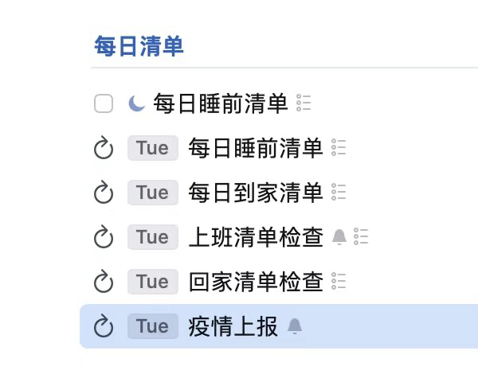

- [[2022下半年个人规划]]
	- 9
	  collapsed:: true
		- 读书
			- [[《被讨厌的勇气》]]
			- [[《天才在左，疯子在右》]]
			- [[《当下的力量》]]
			- [[《怪诞心理学》]]
			- [[《牧羊少年奇幻之旅》]]
		- 早睡早起
		- 前端底层技术提高
			- 复习[[前端知识库]]
		- 熟练开车
		- 算法学习
			- 数组
				- 数量：15题
				- 时间：10号之前
			- 字符串
				- 数量：20题
				- 时间：17号前
			- 链表
				- 数量：20题
				- 时间：24号前
			- 递归
				- 数量：20题
				- 时间：1号前
	- 10
	  collapsed:: true
		- 读书
			- [[《阿甘正传》]]
			- [[《刻意练习》]]
			- [[《穷爸爸和富爸爸》]]
		- 早睡早起
		- 前端底层技术提高
		- 计算机知识
			- 计算机网络
		- 熟练开车
		- 算法学习
			- 树
			- 动态规划
			- 回溯
	- 11
	  collapsed:: true
		- 读书
			- [[《人类简史》]]
		- 早睡早起
		- 熟练开车
		- 算法学习
			- 贪心
			- 双指针
			- 滑动窗口
	- 12
	  collapsed:: true
		- 读书
		- 算法学习
			-
	- 总目标
		- 提高认知
		  collapsed:: true
			- 项目
				- 读书
					- 自我认知
						- [[《被讨厌的勇气》]]
						- [[《当下的力量》]]
						- [[《认知天性》]]
					- 性灵
						- [[《天才在左，疯子在右》]]
					- 破局
						- [[《自下而上》]]
					- 心理
						- [[《乌合之众》]]
						- [[《社会心理学》]]
						- [[《怪诞心理学》]]
					- 个人成长
						- [[《跃迁：成为高手的技术》]]
						- [[《10倍速成长》]]
						- [[《刻意练习》]]
					- 人生
						- [[《城南旧事》]]
						- [[《无声告白》]]
						- [[《阿甘正传》]]
						- [[《牧羊少年奇幻之旅》]]
					- 认识宇宙
						- 项目
							- [[《时间简史》]]
							- [[《人类简史》]]
					- 理财
						- [[《穷爸爸和富爸爸》]]
						- [[《经济学百科》]]
						- [[《聪明的投资者》]]
						- [[《资本论》]]
		- 早睡早起
		  collapsed:: true
			- 项目
		- 前端底层技术提高
		  collapsed:: true
			- 项目
		- 熟练开车
		  collapsed:: true
			- 项目
		- 熟悉算法
			- 数组
			  collapsed:: true
				- 堆
				- 栈
			- 字符串
			- 链表
			- 树
			  collapsed:: true
				- 平衡二叉树
				- 红黑树
			- 动态规划
			- 递归
			  collapsed:: true
				- 回溯
			- 分治
			- 贪心
			- 双指针
			- 滑动窗口
		- 计算机知识
	- 方法论
		- 目标
			- 项目支撑
			-
- [[读书]]
	- [[方法论]]
		- 抓重点
			- 感兴趣
			- 不了解
		- 复习
			- 遗忘曲线
			- 划重点
	- 完成 [[《被讨厌的勇气》]]笔记
- [[学习]]
	- 引入滴答清单，先画大目标，再拆分小任务
	- 费曼学习法
		- Concept （概念）
		- Teach （教给别人）
		- Review （回顾）
		- Simplify （简化）
	- 减压
		- 寻找学习方法
		- 提高效率
		- 效率换时间
- [[目标]]
	- 目标划分
		- 大：五年、百年
			- 维度
				- 国家
				- 人生目标
		- 中：五年、一年、半年
			- 维度
				- 公司
				- 人生阶段目标
		- 小：日、周、月、年
			- 维度
				- 个人
				- 人生短期目标
- [[方法论]]
	- 