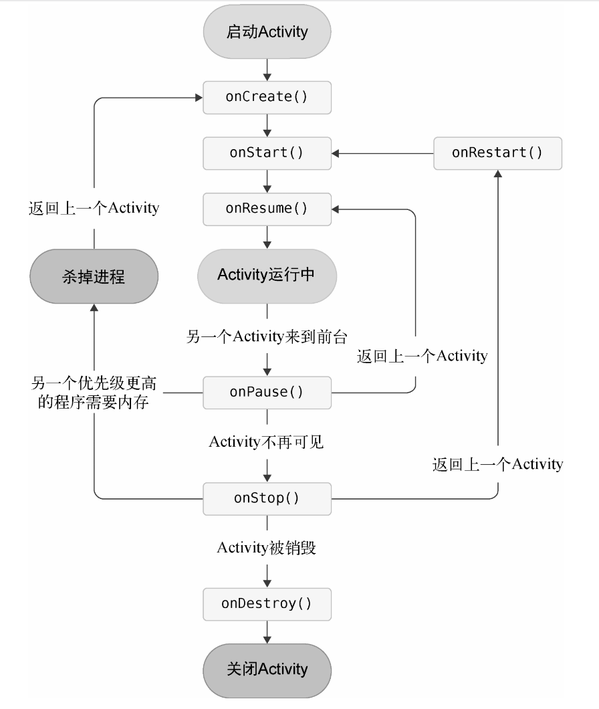

- Activity生命周期
	- Activity状态
		- 运行状态
		- 暂停状态
		- 停止状态
		- 销毁状态
	- Activity的生存期
		- onCreate
		- onStart
		- onResume
		- onPause
		- onStop
		- onDestroy
		- onRestart
		- 完整生存期：onCreated/onDestroy
		- 可见生存期：onStart/onStop
		- 前台生存期：onResume/onPause
		- 
- Intent
	- 页面跳转
		- ```java
		  btn.setOnClickListener(view -> {
		    Intent intent = new Intent(MainActivity.this, TestActivity.class);
		    startActivity(intent);
		  });
		  ```
	- 隐式Intent
		- ```xml
		  <activity android=".SecondActivity">
		    <intent-filter>
		      <action android:name="com.example.activitytest.ACTION_START" />
		      <cetegory android:name="android.intent.cetegory.DEFAULT" />
		    </intent-filter>
		  </activity>	
		  ```
		- ```java
		  button.setOnClickListener(view -> {
		    Intent intent = new Intent("com.example.activitytest.ACTION_START");
		    startActivity(intent);
		  })
		  ```
	- 其他Intent
		- ```java
		  button.setOnClickListener(view -> {
		    // 跳转webview
		    Intent intent = new Intent(Intent.ACTION_VIEW);
		    intent.data = Uri.parse("http://www.baidu.com");
		    startActivity(intent);
		  })
		  ```
		- ```java
		  Intent intent = new Intent(MainActivity.this, TestActivity.class);
		  intent.addFlags(Intent.FLAG_ACTIVITY_NEW_TASK);
		  startActivity(intent);
		  ```
	- 传递数据
		- ```java
		  // A.java
		  button.setOnClickListener(view -> {
		    // 跳转webview
		    Intent intent = new Intent(this, B::class.java);
		    intent.putExtra("extra_data", "hello");
		    startActivity(intent);
		  })
		  ```
		- ```java
		  // B.java
		  onCreate(...){
		    ...
		      String extraData = getIntent.getStringExtra("extra_data");
		    	Log.e("TAG", extraData)
		  }
		  ```
	- 返回数据给上一个Activity
		- ```java
		  // A.java
		  onCreate(...){
		    button.setOnClickListener(view -> {
		      // 跳转webview
		      Intent intent = new Intent(this, B::class.java);
		      startActivityForResult(intent, 1);
		    })
		  }
		  // 接受上一个Activity返回的数据
		  public void onActivityResult(int requestCode, int resultCode, Intent data) {
		    switch(requestCode) {
		        1 : 
		        	if(resultCode == RESULT_OK) {
		            String returnedData = data.getStringExtra("data_return");
		            Log.d...
		          }
		    }
		  }
		  
		  ```
		- ```java
		  // B.java
		  onCreate(...){
		    button2.setOnClickListener(view -> {
		      Intent intent = new Intent();
		      intent.putExtra("data_return","hello");
		      setResult(RESULT_OK, intent);
		      finish();
		    })
		  }
		  // 物理按键返回
		  public void onBackPressed() {
		      Intent intent = new Intent();
		    	intent.putExtra("data_return","hello");
		      setResult(RESULT_OK, intent);
		      finish(); 
		  }
		  ```
- 启动模式
	- standard：后进先出
	- singleTop：顶部复用 / 如果不是顶部，再把activity入栈至栈顶
	- singleTask：如果已经存在栈中，会把前面的清除
	- singleInstance：独自占用任务栈
	- ```xml
	  <activity ...
	            android:launchMode="singleInstance">
	  ```
	-
	-