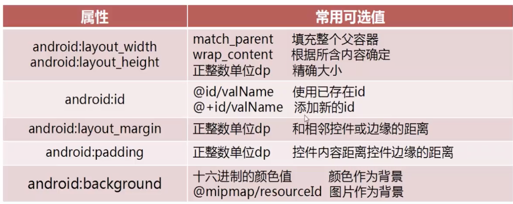
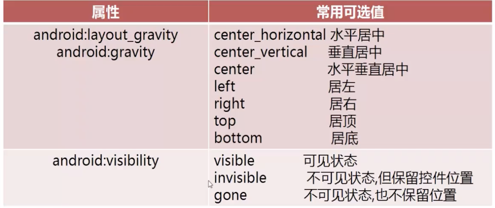

- 通用属性
	- 
	- 
- TextView
	- 能完成的效果
		- 对长文本进行显示处理
		- 支持HTML代码
		- 内容有样式、连接效果
	- 属性
		- 设置文本：`android:text`
		- 设置大小：`android:textSize`
		- 设置颜色：`android:textColor`
		- 设置行距：`android:lineSpacingMultiplier`/`lineSpacingExtra`
		- 设置文字行数：`android:singleLine=true`/`android:lines=1`
		- 设置省略号位置：`android:ellipsize=start`
		- 设置跑马灯：
			- ```xml
			  android:ellipsize="start"
			  android:focusable="true"
			  android:focusableInTouchMode="true"
			  android:marqueeRepeatLimit="marquee_forever"
			  ```
- EditText
  collapsed:: true
	- 属性
		- 输入类型：`android:inputType`
		- 文字提示：`android:hint`
		- 长度：`android:maxLength`
- Button
  collapsed:: true
	- 事件绑定
		- 方式1：传统方式
			- ```java
			  // Main.java
			  Button btn1 = findViewById(R.id.btn1);
			  MyClickListener mc1 = new MyClickListener();
			  btn1.setOnClickListener(mc1);
			  
			  
			  
			  // 事件类
			  class MyClickListener implements View.OnClickListener {
			    @Override
			    public void onClick(View view) {
			      Log.e("TAG", "点击了")
			      }
			  }
			  ```
		- 方式2：匿名内部类
			- ```java
			  Button btn1 = findViewById(R.id.btn1);
			  btn1.setOnClickListener(new View.OnClickListener() {
			    @Override
			    public void onClick(View view) {
			      Log.e("TAG", "点击了")
			      }
			  });
			  ```
		- 方式3:Activity去实现事件接口方式
			- ```java
			  class MainActivity extends AppCompatActivity implements View.OnClickListener {
			    @Override
			    protected void onCreate(...) {
			      Button btn1 = findViewById(R.id.btn1);
			  	btn1.setOnClickListener(this);
			    }
			      
			    @Override 
			    public void onClick(View view) {
			      Log.e("TAG", "点击");
			    }
			  }
			  ```
		- 方式4：通过xml绑定点击事件
			- ```java
			  // xml
			  <Button
			          android:id="@+id/doWorkBtn"
			          android:layout_width="match_parent"
			          android:layout_height="wrap_content"
			          android:text="do work" />
			  
			  // MainActivity.java
			  public class FirstActivity extends AppCompatActivity {
			  	...
			  	public void myClick(View v) {
			    		switch(v.getId()) {
			  			case "doWorkBtn":
			  			...
			  		}
			  		Log.e("TAG", "xml click");
			    	}
			  }
			  ```
- ImageView
	- 属性
		- 设置路径：`android:src`
		- 背景：`android:background`
			- ```xml
			  android:background="@mipmap/bg"
			  ```
		-
- ProgressBar
	- 属性
		- 设置风格：`style`
		- 设置进度：`android:progress`
		- 设置最大值：`android:max`
		- 是否永恒滚动：`android:indeterminate=true`
		-
	- 案例
		- ```xml
		   <ProgressBar
		                android:id="@+id/progress"
		          android:layout_width="match_parent"
		          android:layout_height="30sp"
		          style="?android:attr/progressBarStyleHorizontal"
		          />
		  ```
		- 动态修改属性
			- ```java
			  ```