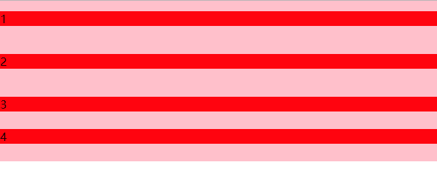

- 概述
	- 块格式化上下文（Block Formatting Context, BFC）是Web页面的可视化CSS渲染的一部分，是块盒子的布局过程发生的区域，也是浮动元素与其他元素交互的区域。
-
- 总结
	- BFC 可以清除浮动，可以解决外边距折叠两问题。
	- BFC 可通俗理解成是构建一个独立的区域，可包含区域内的所有元素，包括浮动元素，与外界互不打扰的一个空间。
- 特性 #.ol
	- 块级元素会在垂直方向一个接一个的排列，和文档流的排列方式一致。
	- 在 BFC 中上下相邻的两个容器的  `margin`   会重叠，创建新的 BFC 可以避免外边距重叠。
	- 计算 BFC 的高度时，需要计算浮动元素的高度。
	- BFC 区域不会与浮动的容器发生重叠。
	- BFC 是独立的容器，容器内部元素不会影响外部元素。
	- 每个元素的左  `margin`   值和容器的左  `border`   相接触。
-
-
- 其他参考：BFC
	- **BFC(Block Formatting Context)**：块级格式化上下文。BFC决定了元素如何对其内容进行定位，以及与其他元素的关系和相互作用。当设计到可视化布局的时候，BFC提供了一个环境，HTML元素在这个环境中按照一定的规则进行布局。一个环境中的元素不会影响到其他环境中的布局。
	  
	  **BFC的原理（渲染规则）**
	- BFC元素垂直方向的边距会发生重叠。属于不同BFC外边距不会发生重叠
	- BFC的区域不会与浮动元素的布局重叠。
	- BFC元素是一个独立的容器，外面的元素不会影响里面的元素。里面的元素也不会影响外面的元素。
	- 计算BFC高度的时候，浮动元素也会参与计算(清除浮动)
	  
	  **如何创建BFC**
	- overflow不为visible;
	- float的值不为none；
	- position的值不为static或relative；
	- display属性为inline-blocks,table,table-cell,table-caption,flex,inline-flex;
	  
	  说了这么多规则，放几个实类出来看看。
	- ```html
	  <section id="margin">
	    <style>
	      * {
	        padding: 0;
	        margin: 0;
	      }
	      #margin {
	        background: pink;
	        overflow: hidden;
	      }
	      p {
	        margin: 15px auto 25px;
	        background: red;
	      }
	    </style>
	    <p>1</p>
	    <div style="overflow: hidden">
	      <p>2</p>
	    </div>
	    <p>3</p>
	    <p>4</p>
	  </section>
	  ```
	- 请看这里的第二个p元素<p>2</p>他被一个父元素包裹，并且父元素有 `overflow:hidden` 样式，前面的如何创建BFC的第一条就说了 `overflow:hidden` 可以创建一个BFC。结果如下图所示。
	- 
	- 我们看这里的2，它的上下外边距都没有与1和3发生重叠，但3与4外边距发生了重叠。这就解释了BFC创建了一个独立的环境，这个环境中的元素不会影响到其他环境中的布局，所以BFC内的外边距不与外部的外边距发生重叠。
-
	- 再看看下面的列子：
	- ```html
	  <section id="layout">
	    <style media="screen">
	      #layout {
	        background: red;
	      }
	      #layout .left {
	        float: left;
	        width: 100px;
	        height: 100px;
	        background: pink;
	      }
	      #layout .right {
	        height: 110px;
	        background: #ccc;
	      }
	    </style>
	    <div class="left"></div>
	    <div class="right"></div>
	  </section>
	  ```
	- 效果如下：
	- 
	- 写过前端页面的我们肯定遇到过这种情况，这里其实是浮动元素叠在 `.right` 元素的上面，如果我们想让.right元素不会延伸到 float元素怎么办,其实我们在.right元素上加 `overflow:hidden` （用其他的方式创建BFC也可以）创建BFC就可以解决。因为BFC不会与浮动元素发生重叠。
	- 
	- 还有一种情况很常见，就是由于子元素浮动，导致父元素的高度不会把浮动元素算在内，那么我们在父元素创建BFC就可以让可以让浮动元素也参与高度计算。
-
- 传送门：[10 分钟理解 BFC 原理](https://zhuanlan.zhihu.com/p/25321647)
-
-