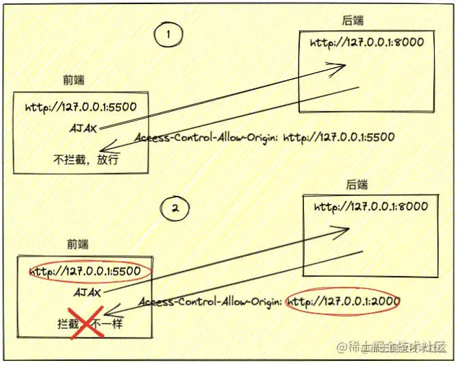

- 概述
	- Cors，全称 `Cross-Origin Resource Sharing` ,意思是 `跨域资源共享` ，Cors一般是由后端来开启的，一旦开启，前端就可以跨域访问后端。
	  为什么后端开启Cors，前端就能跨域请求后端呢？我的理解是：前端跨域访问到后端，后端开启Cors，发送 `Access-Control-Allow-Origin:域名` 字段到前端(其实不止一个)，前端浏览器判断 `Access-Control-Allow-Origin` 的域名如果跟前端域名一样，浏览器就不会实行跨域拦截，从而解决跨域问题。
	- 
	-