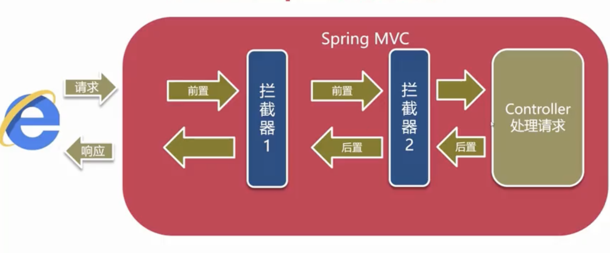

- 概述
	- 用于对URL请求进行前置/后置过滤
	- Interceptor与Filter用途相似，但实现方式不同
	- 底层就是基于Spring AOP面相切面编程实现
- 开发流程
	- Maven依赖servlet-api
	- 实现HandlerInterceptor接口
- HandlerInterceptor接口
	- preHandle - 前置执行处理
	- postHandle - 目标资源已被Spring MVC框架处理
	- afterCompletion - 相应文本已经产生
- 案例
	- pom.xml
	- ```xml
	      <dependency>
	              <groupId>javax.servlet</groupId>
	              <artifactId>javax.servlet-api</artifactId>
	              <version>3.1.0</version>
	              <scope>provided</scope><!--打包不包含进去-->
	          </dependency>
	  ```
	- 定义Interceptor类
	- ```java
	  public class MyInterceptor implements HandlerInterceptor {
	      @Override
	      public boolean preHandle(HttpServletRequest request, HttpServletResponse response, Object handler) throws Exception {
	          System.out.println(request.getRequestURI() + "准备执行");
	        /*
	        	为false可以设置相应内容
	        	response.getWriter().print("[]");
	        */
	          return true; // 为false阻止后续执行，并立即相应
	      }
	  
	      @Override
	      public void postHandle(HttpServletRequest request, HttpServletResponse response, Object handler, ModelAndView modelAndView) throws Exception {
	          System.out.println(request.getRequestURI() + "-目标处理成功");
	      }
	  
	      @Override
	      public void afterCompletion(HttpServletRequest request, HttpServletResponse response, Object handler, Exception ex) throws Exception {
	          System.out.println(request.getRequestURI() + "-相应内容已产生");
	      }
	  }
	  ```
	- applicationContext.xml
	- ```xml
	  <mvc:interceptors>
	    <mvc:interceptor>
	      <mvc:mapping path="/**"/>
	      <mvc:exclude-mapping path="/**.ico"/>
	      <mvc:exclude-mapping path="/**.js"/>
	      <bean class="com.example.springmvc.interceptor.MyInterceptor" />
	    </mvc:interceptor>
	  </mvc:interceptors>
	  ```
- 多Interceptor执行顺序
	- 
	-