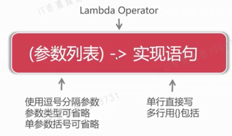

- 语法
	- 
- 示例
	- 原接口
		- ```java
		  interface MathOperation {
		      public Float operate(Integer a, Integer b);
		  }
		  ```
	- 标准方法
		- ```java
		  MathOperation addition = (Integer a, Integer b) -> {
		    System.out.println("加法运算");
		    return a + b + 0F;
		  };
		  System.out.println(addition.operate(1,3));
		  ```
	- 忽略参数类型
		- ```java
		  MathOperation addition = (a, b) -> {
		    System.out.println("加法运算");
		    return a + b + 0F;
		  };
		  System.out.println(addition.operate(1, 3));
		  ```
	- 单行
		- ```java
		  MathOperation addition = (a, b) -> a + b + 0F;
		  System.out.println(addition.operate(1, 3));
		  ```
- 函数式编程
	- 概述
		- 函数式编程是基于函数式接口并使用lambda表达式的编程方式
		- 函数式编程理念是将代码作为可重用数据代入到程序运行中
		- 函数式编程强调“你要做什么”，而不是“你想怎么做”
	- 什么是函数式接口
		- 函数式接口是有且只有一个抽象方法的接口
		- Java中拥有大量函数式接口，入java.lang.Runnable
		- JDK8后提供了一系列新的函数式接口，位于java.util.function
	- 函数式接口Predicate
		- 概述
			- Predicate是新增的函数式接口，位于java.util.function
			- Predicate用于测试传入的数据是否满足判断条件
			- Predicate接口需要实现test()方法进行逻辑判断
		- 示例
			- ```java
			  Predicate<Integer> predicate = n -> n > 4;
			  boolean result = predicate.test(10);
			  System.out.println(result); // true
			  ```
	-