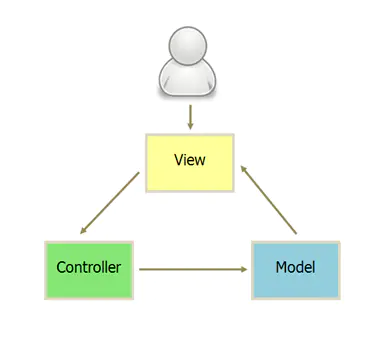

- 概述
	- 模型层（Model）
		- 负责存储、检索、操纵来自数据库或者网站的数据
	- 视图层（View）
		- 用户界面，一般采用XML文件进行界面的描述
	- 控制层（Controller）
		- 业务逻辑处理
	- 
- 工作原理 #.ol
	- 当用户发出事件的时候，view层会发送指令到`Controller`层，自己不执行业务逻辑
	- `Controller`执行业务逻辑并且操作`Model`，但不会直接操作`View`，可以说它是对`View`无知的
	- `Model`层更新完数据然后对视图进行更新，用户得到反馈
- 优缺点
	- 优点
		- 把业务逻辑全部分离到`Controller`中，模块化程度高。当业务逻辑变更的时候，不需要变更`View`和`Model`，只需要`Controller`换成另外一个`Controller`就行了
	- 缺点 #.ol
		- `Controller`测试困难。因为视图同步操作是由`View`自己执行，而`View`只能在有`UI`的环境下运行。在没有UI环境下对`Controller`进行单元测试的时候，`Controller`业务逻辑的正确性是无法验证的：`Controller`更新`Model`的时候，无法对`View`的更新操作进行断言。
		- `XML`作为`View`层，控制能力实在太弱，`Activity`基本上都是`View`和`Controller`的合体，既要负责视图的现实又要加入控制逻辑，承担的功能很多，导致代码量很大。如果去动态的改变一个页面的背景，或者动态的隐藏/显示一个按钮，这些都没办法在`XML`中做，只能把代码写在`Activity`中，造成了`Activity`即使`Controller`层。
		- `View`层和`Model`之间存在耦合。
-