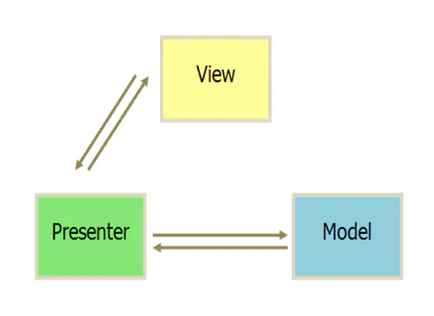

- 概述
	- 模型层（Model）
		- 负责存储、检索、操纵来自数据库或者网络的数据
	- 视图层（View）
		- 用户界面，一般采用XML文件进行界面的描述
	- 逻辑处理层（Presenter）
		- 作为View与Model交互的中间纽带，处理与用户交互的负责逻辑
	- 
- 工作原理 #.ol
	- View接受用户请求
	- View传递请求给Presenter
	- Presenter做逻辑处理，修改Model
	- Model通知Presenter数据变化
	- Presenter更新View
- 优缺点
	- 优点 #.ol
		- 便于测试。Presenter对View是通过接口进行，在对Presenter进行不依赖UI环境的单元测试的时候。可以通过Mock一个View对象，这个对象只需要实现View的接口即可。然后依赖注入到Presenter中，单元测试的时候就可以完整的测试Presenter业务逻辑的正确性。
		- 避免了传统开发模式中View和Model耦合的情况，提高了代码可扩展性、组件复用能力、团队协作的效率
	- 缺点 #.ol
		- View需要持有Presenter的引用，同时，Presenter也需要持有View的引用，增加了控制的复杂度
		- MVC中Activity的代码很臃肿，转移到MVP的Presenter中，同样造成PresenterPresenter在业务逻辑复杂时的代码臃肿
-