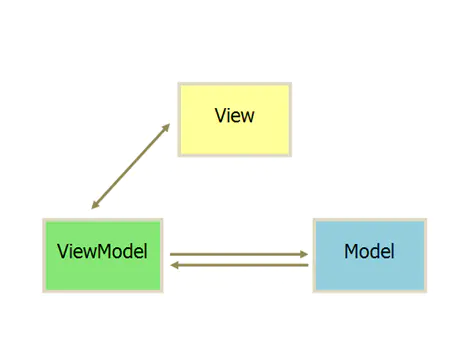

- 概述
	- 模型层（Model）
		- 负责存储、检索、操纵来自数据库或网络的数据
	- 视图层（View）
		- 用户界面，一般采用XML文件进行界面的描述
	- 视图-模型层（ViewModel）
		- 负责View和Model之间的通信，以此分离视图和数据
	- 
- 工作原理 #.ol
	- View接收用户交互请求
	- View将请求转交给ViewModel
	- ViewModel操作Model数据更新
	- Model更新完数据，通知ViewModel数据发生变化
	- ViewModel更新View数据
- 优缺点
	- 优点 #.ol
		- 低耦合。View可以独立于Model变化和修改，一个ViewModel可以绑定到不同的“View”上，当View变化的时候Model可以不变，当Model变化的时候View也可以不变
		- 可重用性。可以把一些视图逻辑放在一个ViewModel里面，让很多View重用这段视图逻辑
		- 独立开发。开发人员可以专注于业务逻辑和数据的开发（ViewModel），设计人员可以专注于页面设计，生成XML代码
		- ViewModel解决MVP中View和Presenter相互持有对方应用的问题，界面由数据进行驱动，响应界面操作无需由View传递，数据的变化也无需Presenter调用View实现，使得数据传递的过程更加简洁，高效
	- 缺点 #.ol
		- ViewModel中存在对Model的依赖
		- 数据绑定使得Bug很难被调试。你看到界面异常了，有可能是你View的代码有Bug，也可能是Model的代码有问题
		- IDE不够完善修改ViewModel的名称对应的xml文件中不会自动修改等）。