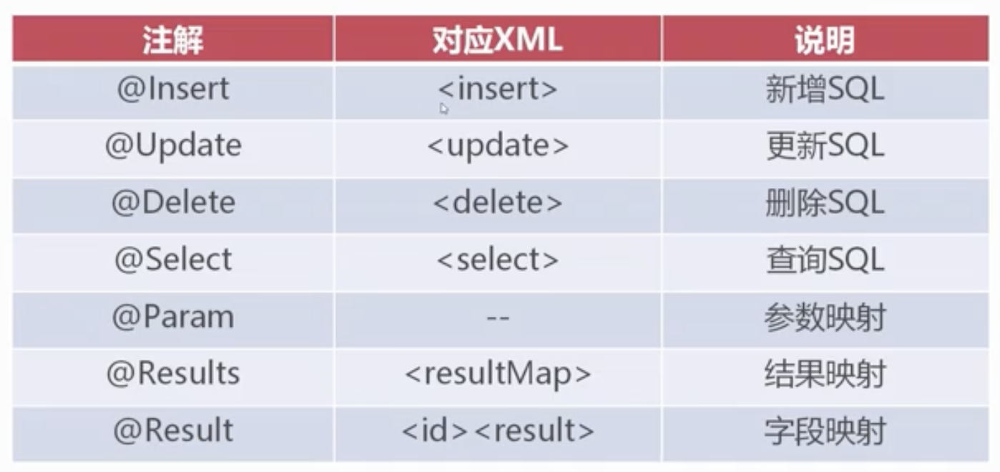

- 概述
	- 优秀的持久层框架
	- 使用XML将SQL与程序解耦，便于维护
	- 学习简单，执行高效，是JDBC的延伸
- 开发流程
	- 引入MyBatis依赖
	- 创建核心配置文件
	- 创建实体(Entity)类
	- 创建Mapper映射文件
	- 初始化SessionFactory
	- 利用SqlSession对象操作数据
- 环境配置
	- MyBatis采用XML格式配置数据库环境信息
	- MyBatis环境配置标签`<environment>`
	- `environment`包含数据库驱动、URL、用户名和密码
	- ```xml
	  <!-- mybatis-config.xml -->
	  <environment id="dev">
	    <!-- 采用JDBC方式对数据库事务进行commit/rollback -->
	    <transactionManager type="JDBC" />
	    <!-- 采用连接池方式管理数据库连接 -->
	    <dataSource type="POLLED">
	      <property name="driver" value="com.mysql.jdbc.Driver" />
	      <property name="url" value="jdbc:mysql://localhost:3306/user" />
	      <property name="username" value="root" />
	      <property name="password" value="123456" />
	    </dataSource>
	  </environment>
	  ```
- SqlSessionFactory
  collapsed:: true
	- 概述
	  collapsed:: true
		- 是MyBatis的核心对象
		- 用于初始化MyBatis，创建SqlSession对象
		- 保证SqlSessionFactory在应用中全局唯一
	- SqlSession
	  collapsed:: true
		- 使用JDBC方式与数据库交互
		- 提供了数据表CURD对应方法
	- 案例
	  collapsed:: true
		- mybatis-config.xml
		- ```xml
		  <?xml version="1.0" encoding="UTF-8" ?>
		  <!DOCTYPE configuration
		          PUBLIC "-//mybatis.org//DTD Config 3.0//EN"
		          "http://mybatis.org/dtd/mybatis-3-config.dtd">
		  <configuration>
		      <!-- 设置默认指向的数据库 -->
		      <environments default="dev">
		          <environment id="dev">
		              <!-- 采用JDBC方法对数据库事务进行commit/rollback -->
		              <transactionManager type="JDBC"/>
		              <!-- 采用连接池方式管理数据库连接 -->
		              <dataSource type="POOLED">
		                  <property name="driver" value="com.mysql.jdbc.Driver"/>
		                  <property name="url"
		                            value="jdbc:mysql://localhost:3306/test?useUnicode=true&amp;characterEncoding=UTF-8"/>
		                  <property name="username" value="root"/>
		                  <property name="password" value="123456"/>
		              </dataSource>
		          </environment>
		      </environments>
		  </configuration>
		  ```
		- testSqlSessionFactory.java
		- ```java
		  @Test
		  public void testSqlSessionFactory() throws IOException {
		    // 利用Reader加载classpath下的mybatis-config.xml核心配置文件
		    Reader reader = Resources.getResourceAsReader("myBatis-config.xml");
		    // 初始化SqlSessionFactory对象，同时解析mybatis-config.xml文件
		    SqlSessionFactory sqlSessionFactory = new SqlSessionFactoryBuilder().build(reader);
		    System.out.println("SesstionFactory加载成功");
		    // 创建SqlSession对象，SqlSession是JDBC的扩展类，用于与数据库交互
		    SqlSession sqlSession = sqlSessionFactory.openSession();
		    // 创建数据库连接（测试用）
		    Connection connection = sqlSession.getConnection();
		    System.out.println(connection);
		    if(sqlSession != null) {
		      // 如果type="POOLED"，代表使用连接池，close则是将连接回收到连接池中
		      // 如果type="UNPOOLED"，代表直连，close则会调用Connection.close()方法关闭连接
		      sqlSession.close();
		    }
		  }
		  ```
		- MyBatisUtils.java
		- ```java
		  public class MyBatisUtils {
		    private static SqlSessionFactory sqlSessionFactory = null;
		    static {
		      try {
		        Reader reader = Resources.getResourceAsReader("mybatis-config.xml");
		        sqlSessionFactory = new SqlSessionFactoryBuilder().build(reader);
		      } catch (IOException e) {
		        e.printStackTrace();
		        throw new ExceptionInInitializerError(e);
		      }
		    }
		    public static SqlSession openSession() {
		      return sqlSessionFactory.openSession();
		    }
		    public static void closeSession(SqlSession sqlSession) {
		      if (sqlSession != null) {
		        sqlSession.close();
		      }
		    }
		  }
		  
		  ```
- MyBatis数据查询
	- 步骤
	  collapsed:: true
		- 创建实体类(Entity)
		- 创建Mapper XML
		- 编写<select>SQL标签
		- 开启驼峰命名映射
		- 新建<mapper>
		- SqlSession执行select语句
	- 案例
	  collapsed:: true
		- User.java
		  collapsed:: true
			- ```java
			  public class User {
			      private Integer empno;
			      private String ename;
			      private String job;
			      private Integer mgr;
			      private Date hiredate;
			      private Integer sal;
			      private Integer comm;
			      private Integer deptno;
			    ...
			    }
			  ```
		- resources/mappers/user.xml
		  collapsed:: true
			- ```xml
			  <?xml version="1.0" encoding="UTF-8" ?>
			  <!DOCTYPE mapper
			          PUBLIC "-//mybatis.org//DTD Config 3.0//EN"
			          "http://mybatis.org/dtd/mybatis-3-mapper.dtd">
			  <mapper namespace="user">
			      <select id="selectAll" resultType="com.example.spring.ioc.entity.User">
			          select * from t_emp
			      </select>
			  </mapper>
			  ```
		- mybatis-config.xml
		  collapsed:: true
			- ```xml
			  <!--  开启驼峰命名转换  -->
			  <!-- goods_id -> goodsId   -->
			  <settings>
			    <setting name="mapUnderscoreToCamelCase" value="true"/>
			  </settings>
			  <mappers>
			    <mapper resource="mappers/user.xml" />
			  </mappers>
			  ```
		- test
		  collapsed:: true
			- ```java
			  @Test
			  public void testSelectAll() {
			    SqlSession session = null;
			    try {
			      session = MyBatisUtils.openSession();
			      List<User> list = session.selectList("user.selectAll");
			      for(User u : list) {
			        System.out.println(u.getEname());
			      }
			    }catch (Exception e) {
			      throw e;
			    } finally {
			      MyBatisUtils.closeSession(session);
			    }
			  }
			  ```
	- SQL传参
	  collapsed:: true
		- 查询 - <select>
		  collapsed:: true
			- ```xml
			  <select id="selectById" parameterType="Integer"
			          resultType="com.example.entity.User">
			    select * from t_emp where empno=#{value};
			  </select>
			  ```
			- ```java
			  @Test
			  public void testSelectById() {
			    SqlSession session = null;
			    try {
			      session = MyBatisUtils.openSession();
			      User u = session.selectOne("user.selectById", 8001);
			      System.out.println(u.getEname());
			    } catch (Exception e) {
			      throw e;
			    } finally {
			      MyBatisUtils.closeSession(session);
			    }
			  }
			  ```
	- 多参数
	  collapsed:: true
		- ```xml
		  <select id="selectBySalRange" parameterType="java.util.Map" resultType="com.example.spring.ioc.entity.User">
		    select * from t_emp where sal between #{min} AND #{max}
		  </select>
		  ```
		- ```java
		  @Test
		  public void testSelectBySalRange() {
		    SqlSession session = null;
		    try {
		      session = MyBatisUtils.openSession();
		      Map param = new HashMap();
		      param.put("max", 2000);
		      param.put("min", 1000);
		      List<User> list = session.selectList("user.selectBySalRange", param);
		      for (User u : list) {
		        System.out.println(u.getEname() + "--" + u.getSal());
		      }
		    } catch (Exception e) {
		      throw e;
		    } finally {
		      MyBatisUtils.closeSession(session);
		    }
		  }
		  ```
	- 多表查询-返回Map
	  collapsed:: true
		- ```xml
		      <select id="selectUserMap" resultType="java.util.Map">
		          SELECT * FROM t_emp e JOIN t_dept d ON e.deptno=d.deptno
		      </select>
		  ```
		- ```java
		  @Test
		  public void testSelectUserMap() {
		    SqlSession session = null;
		    try {
		      session = MyBatisUtils.openSession();
		      List<Map> list = session.selectList("user.selectUserMap");
		      for (Map map : list) {
		        // System.out.println(u.getEname() + "--" + u.getDeptno() + "--" + u.getDname());
		        System.out.println(map);
		      }
		    } catch (Exception e) {
		      throw e;
		    } finally {
		      MyBatisUtils.closeSession(session);
		    }
		  }
		  ```
	- ResultMap结果映射
		- 概述
		  collapsed:: true
			- ResultMap可以将查询结果映射为复杂类型的Java对象
			- ResultMap适用于Java对象保存多表关联结果
			- ResultMap支持对象关联查询等高级特性
		- 案例
			- user.xml
			- ```xml
			  
			      <resultMap id="rmUser" type="com.example.spring.ioc.dto.UserDTO">
			          <id property="user.empno" column="empno"></id>
			          <result property="user.ename" column="ename"></result>
			          <result property="user.job" column="job"></result>
			          <result property="dname" column="dname"></result>
			          <result property="loc" column="loc"></result>
			      </resultMap>
			      <select id="selectUserDTO" resultMap="rmUser">
			          SELECT e.*, d.dname, d.loc FROM t_emp e JOIN t_dept d ON e.deptno=d.deptno
			      </select>
			  ```
			- dto/UserDTO.java
			- ```java
			  public class UserDTO {
			      private User user = new User();
			      private String dname;
			      private String loc;
			    ...
			    }
			  ```
			- test
			- ```java
			  @Test
			  public void testSelectUserDTO() {
			    SqlSession session = null;
			    try {
			      session = MyBatisUtils.openSession();
			      List<UserDTO> list = session.selectList("user.selectUserDTO");
			      for (UserDTO u : list) {
			        System.out.println(u.getUser().getEname() + "--" + u.getUser().getDeptno() + "--" + u.getDname());
			        //System.out.println(map);
			      }
			    } catch (Exception e) {
			      throw e;
			    } finally {
			      MyBatisUtils.closeSession(session);
			    }
			  }
			  ```
- 数据插入
  collapsed:: true
	- 新增 - <insert>
		- ```xml
		  <insert id="insert" parameterType="com.example.entity.Goods">
		    INSERT INTO `babytu`.`t_goods`(`title`,`sub_title`,`original_cost`,`current_price`)
		    VALUES(#{title},#{subTitle},#{orignalCost},#{currentPrice})
		    <selectKey resultType="int" keyProperty="goodsId" order="AFTER">
		      <!-- 当前连接中最后产生的ID号 -->
		      select last_insert_id()
		    </selectKey>
		  </insert>
		  ```
	- 案例
		- ```xml
		     <insert id="insert" parameterType="com.example.spring.ioc.entity.User">
		          INSERT INTO t_emp(ename, job, mgr, hiredate, sal, comm, deptno)
		          VALUES(#{ename}, #{job}, #{mgr}, #{hiredate}, #{sal}, #{comm}, #{deptno})
		  	
		          <selectKey resultType="int" keyProperty="empno" order="AFTER">
		              <!-- 当前连接中最后产生的ID号 -->
		              select last_insert_id()
		          </selectKey>    
		  </insert>
		  ```
		- ```java
		  @Test
		  public void testInsertUser() {
		    SqlSession session = null;
		    try {
		      session = MyBatisUtils.openSession();
		      User user = new User();
		      user.setEname("llllll");
		      user.setSal(3000);
		      user.setDeptno(10);
		  
		      // insert()方法返回值代表本次成功插入的记录总数
		      int num = session.insert("user.insert", user);
		      System.out.println("插入成功：" + num + "条数据");
		      // 提交事务数据
		      session.commit();
		      // 返回插入数据自动生成的id
		      System.out.println(user.getEmpno());
		    } catch (Exception e) {
		      if(session != null) {
		        session.rollback();
		      }
		      throw e;
		    } finally {
		      MyBatisUtils.closeSession(session);
		    }
		  }
		  ```
	- selectKey与useGeneratedKeys的区别
		- ```xml
		  <insert id="insert"
		          parameterType="com.example.entity.User"
		          useGeneratedKeys="true"
		          keyProperty="empno"
		          keyColumn="empno"
		  ```
		- 区别
			- selectKey标签需要明确编写获取最新主键的SQL语句
			- useGeneratedKeys数据会自动根据驱动生成对应SQL语句
		- 场景
			- selectKey适用于所有的关系型数据库
			- useGeneratedKeys只支持“自增主键”类型的数据库
- 数据更新
  collapsed:: true
	- ```xml
	     <update id="update" parameterType="com.example.spring.ioc.entity.User">
	          UPDATE t_emp
	          SET
	              ename = #{ename},
	              job = #{job},
	              sal = #{sal},
	              comm = #{comm}
	          WHERE empno=#{empno}
	      </update>
	  ```
	- ```java
	  @Test
	  public void testUpdateUser() {
	    SqlSession session = null;
	    try {
	      session = MyBatisUtils.openSession();
	      User user = session.selectOne("user.selectById", 8011);
	      user.setJob("CLERK");
	      user.setMgr(8000);
	      user.setComm(7000);
	  
	      int num = session.update("user.update", user);
	      System.out.println("更新成功：" + num + "条数据");
	      System.out.println(user.getEmpno());
	      // 提交事务数据
	      session.commit();
	    } catch (Exception e) {
	      if(session != null) {
	        session.rollback();
	      }
	      throw e;
	    } finally {
	      MyBatisUtils.closeSession(session);
	    }
	  }
	  ```
- 数据删除
  collapsed:: true
	- ```xml
	     <delete id="delete" parameterType="Integer">
	          DELETE FROM t_emp WHERE empno=#{value}
	      </delete>
	  ```
	- ```java
	  @Test
	  public void testDeleteUser() {
	    SqlSession session = null;
	    try {
	      session = MyBatisUtils.openSession();
	      int num = session.delete("user.delete", 8011);
	      System.out.println("删除成功：" + num + "条数据");
	      // 提交事务数据
	      session.commit();
	    } catch (Exception e) {
	      if(session != null) {
	        session.rollback();
	      }
	      throw e;
	    } finally {
	      MyBatisUtils.closeSession(session);
	    }
	  }
	  ```
- SQL注入攻击
  collapsed:: true
	- MyBatis两种传值方式
		- `${}`文本替换，未经任何处理对SQL文本替换
		- `#{}`预编译传值，使用预编译传值可以预防SQL注入
- 动态SQL
  collapsed:: true
	- 动态SQL是指根据参数数据动态组织SQL的技术
		- ```xml
		  <select id="dynamicSQL"
		          parameterType="java.util.Map" resultType="com...Goods">
		    select * from t_goods
		    
		    <where>
		      <if test="categoryId != null">
		        AND category_id = #{categoryId}
		      </if>
		      <if test="currentPrice != null">
		        AND current_price &lt; #{currentPrice}
		      </if>
		    </where>
		  </select>
		  ```
	- 案例
	  collapsed:: true
		- ```xml
		      <select id="dynamicSQL" parameterType="java.util.Map" resultType="com.example.spring.ioc.entity.User">
		          SELECT * FROM t_emp
		          <where>
		              <if test="deptno != null">
		                  AND deptno=#{deptno}
		              </if>
		          </where>
		      </select>
		  ```
		- ```java
		  @Test
		  public void testDynamicSql() {
		    SqlSession session = null;
		    try {
		      session = MyBatisUtils.openSession();
		      Map map = new HashMap();
		      map.put("deptno", 10);
		      List<User> list = session.selectList("user.dynamicSQL", map);
		      for (User u : list) {
		        System.out.println(u.getEname() + "--" + u.getDeptno());
		      }
		    } catch (Exception e) {
		      if(session != null) {
		        session.rollback();
		      }
		      throw e;
		    } finally {
		      MyBatisUtils.closeSession(session);
		    }
		  }
		  ```
- MyBatis二级缓存
  collapsed:: true
	- 概述
		- 一级缓存默认开启，缓存范围SqlSession回话
		- 二级缓存手动开启，属于范围Mapper Namespace
	- 二级缓存运行规则
		- 耳机开启后默认所有查询操作均使用缓存
		- 写操作commit提交时对该namespace缓存强制清空
		- 配置useCache=false可以不用缓存
		- 配置flushCache=true代表强制清空缓存
	- 案例
	  collapsed:: true
		- 开启二级缓存
			- ```
			  eviction是缓存的清除策略，当缓存对象数量达到上限后，自动触发对应算法对缓存对象清除
			  1. LRU - 最近最久未使用：移除最长时间不被使用的对象
			  O1  O2  O3  O4 ... O512
			  14  99  83  1      893
			  2. FIFO - 先进先出：按对象进入缓存的顺序来移除他们
			  3. SOFT - 软引用：移除基于垃圾收集器状态和引用规则的对象
			  4. WEAK - 弱引用：更积极的移除基于垃圾收集器状态和弱引用规则的对象
			  
			  flushInterval：代表间隔多长时间自动清空缓存，单位毫秒，600000毫秒=10分钟
			  size：缓存存储上限，用于保存对象或集合（1个集合算1个对象）的数量上限
			  readOnly：设置为true，代表返回只读缓存，每次从缓存取出的是缓存对象本身，这种执行效率较高
			  		  设置为false，代表每次取出的是缓存对象的“副本”，每一次取出的对象都是不同的，这种安全性较高
			  ```
			- ```xml
			  <mapper namespace="user">
			      <cache eviction="LRU" flushInterval="600000" size="512" readOnly="true" />
			    	
			     <!-- flushCache="true"在SQL执行后强制清空缓存 -->
			    	<insert id="insert" parameterType="...User" flushCache="true">
			        	INSERT ...
			        	VALUES ...
			    </insert>
			    ...
			  ```
- OntToMany对象关联查询
  collapsed:: true
	- user.xml
	  collapsed:: true
		- ```xml
		  <select id="selectByDept" parameterType="Integer" resultType="com.example.spring.ioc.entity.User">
		    SELECT *
		    FROM t_emp
		    WHERE deptno = #{value}
		  </select>
		  
		  <!--
		        resultMap可用于说明一对多或多对一的映射逻辑
		        id 是resultMap属性引用的标志
		        type 指向One的实体
		        -->
		  <resultMap id="rmDept" type="com.example.spring.ioc.entity.Dept">
		    <id column="deptno" property="deptno"></id>
		    <!--
		              collection的含义是，在select * from t_dept limit 0, 10得到结果后，对所有Goods对象遍历得到deptno字段值，
		              并代入到user命名空间selectByDept的Sql中执行查询，
		              并将得到的"用户"集合复制给users List对象
		              -->
		    <collection property="users" select="user.selectByDept" column="deptno"/>
		  </resultMap>
		  <select id="selectOntToMany" resultMap="rmDept">
		    SELECT *
		    FROM t_dept LIMIT 0, 10;
		  </select>
		  ```
	- Dept.java
		- ```java
		  public class Dept {
		      private Integer deptno;
		      private String dname;
		      private String loc;
		  
		      private List<User> users;
		    ...
		  }
		  ```
	- test
	  collapsed:: true
		- ```java
		  @Test
		  public void testOntToMany() {
		    SqlSession session = null;
		    try {
		      session = MyBatisUtils.openSession();
		      List<Dept> depts = session.selectList("user.selectOntToMany");
		      for(Dept dept : depts) {
		        System.out.println(dept);
		        for(User user : dept.getUsers()) {
		          System.out.println(user.getEname() + "--" + user.getDeptno());
		        }
		      }
		    } catch (Exception e) {
		      if(session != null) {
		        session.rollback();
		      }
		      throw e;
		    } finally {
		      MyBatisUtils.closeSession(session);
		    }
		  }
		  ```
- ManyToOne对象关联查询
	- user.xml
		- ```xml
		  <select id="selectByDeptno" parameterType="Integer" resultType="com.example.spring.ioc.entity.Dept">
		    SELECT * FROM t_dept WHERE deptno=#{value}
		  </select>
		  <resultMap id="rmDeptDetails" type="com.example.spring.ioc.entity.User">
		    <id column="deptno" property="deptno"></id>
		    <association property="dept" select="selectByDeptno" column="deptno" />
		  </resultMap>
		  <select id="selectManyToOne" resultMap="rmDeptDetails">
		    SELECT * FROM t_emp
		  </select>
		  ```
	- User.java
		- ```java
		  public class User {
		      private Integer empno;
		      private String ename;
		      private String job;
		      private Integer mgr;
		      private Date hiredate;
		      private Integer sal;
		      private Integer comm;
		      private Integer deptno;
		      private Dept dept;
		  ...
		    }
		  ```
	- test
		- ```java
		  @Test
		  public void testManyToOne() {
		    SqlSession session = null;
		    try {
		      session = MyBatisUtils.openSession();
		      List<User> users = session.selectList("user.selectManyToOne");
		      for (User user : users) {
		        System.out.println(user.getEname() + "--" + user.getDeptno() + "--" + user.getDept().getDname());
		      }
		    } catch (Exception e) {
		      throw e;
		    } finally {
		      MyBatisUtils.closeSession(session);
		    }
		  }
		  ```
- 注解开发
	- 常用注解
		- 
	- 案例
		- 开启注解开发MyBatis
			- ```xml
			  <mappers>
			  	<package name="com.example.spring.ioc.dao"/>
			  </mappers>
			  ```
		- dao/UserDao.java
			- ```java
			  public interface UserDao {
			      @Select("SELECT * FROM t_emp WHERE sal BETWEEN #{min} AND #{max}")
			      public List<User> selectUserBySalRange(@Param("min") Integer min, @Param("max") Integer max);
			  }
			  ```
		- test
			- ```java
			  @Test
			  public void testSelectUserSalRange() throws IOException {
			    SqlSession session = MyBatisUtils.openSession();
			    try {
			      UserDao userDao = session.getMapper(UserDao.class);
			      List<User> list = userDao.selectUserBySalRange(1000,2000);
			      for(User user : list) {
			        System.out.println(user.getEname() + "---" + user.getDeptno());
			      }
			    } catch (Exception e) {
			      e.printStackTrace();
			    }
			  }
			  ```
	- 新增
	  collapsed:: true
		- UserDAO.java
			- ```java
			  @Insert("INSERT INTO t_emp(ename, sal, comm, deptno) VALUES(#{ename}, #{sal}, #{comm}, #{deptno})")
			  @SelectKey(statement = "SELECT last_insert_id()", before = false, keyProperty = "empno", resultType = Integer.class)
			  public int insert(User user);
			  ```
		- test
			- ```java
			  @Test
			  public void testInsert() throws IOException {
			    SqlSession session = null;
			    try {
			      session = MyBatisUtils.openSession();
			      User user = new User();
			      user.setEname("lisi");
			      user.setDeptno(10);
			  
			      UserDao userDao = session.getMapper(UserDao.class);
			      int num = userDao.insert(user);
			      session.commit();
			      System.out.println("插入成功：" + num + "条数据");
			    } catch (Exception e) {
			      e.printStackTrace();
			      if(session != null) {
			        session.rollback();
			      }
			    }
			  }
			  ```
	- 注解映射
	  collapsed:: true
		- ```java
		  @Select("SELECT * FROM t_emp e, t_dept d WHERE e.deptno=d.deptno")
		  @Results({
		    /* <id> */
		    @Result(column = "empno", property = "empno", id = true),
		    @Result(column = "dname", property = "dname")
		  })
		  public List<UserDTO> selectAll();
		  ```
	- 多对一
		- ```java
		  /**
		       * 查询所有账户，并且获取每个账户下的用户信息,一对一
		       * @return
		       */
		  @Select("select * from account")
		  @Results(id="accountMap",value = {
		    @Result(id = true,column = "id",property = "id"),
		    @Result(column = "uid",property = "uid"),
		    @Result(column = "money",property = "money"),
		    @Result(property = "user",column = "uid",one=@One(select="com.keafmd.dao.IUserDao.findById",fetchType= FetchType.EAGER))
		  })
		  List<Account> findAll();
		  ```
	- 一对多
		- ```java
		  /**
		       * 查询所有账户，并且获取每个账户下的用户信息,一对一 ，* 这里用不到这个findAll()
		       * @return
		       */
		  @Select("select * from account")
		  @Results(id="accountMap",value = {
		    @Result(id = true,column = "id",property = "id"),
		    @Result(column = "uid",property = "uid"),
		    @Result(column = "money",property = "money"),
		    @Result(property = "user",column = "uid",one=@One(select="com.keafmd.dao.IUserDao.findById",fetchType= FetchType.EAGER))
		  })
		  List<Account> findAll();
		  ```