- 概述
	- 最基本的查询是由SELECT和FROM关键字组成的
		- ```sql
		  SELECT * FROM t_tmp;
		  SELECT empno, ename, sal, FROM t_emp;
		  ```
	- SELECT语句屏蔽了物理层的操作，用户不必关心数据的真实存储，交由数据库高效的查询数据
- 查询
	- 使用列别名
		- 通常情况下，SELECT子句中使用了表达式，那么这列的名字就默认为表达式，因此需要一种对列名重命名的机制
		- ```sql
		  SELECT empno, sal*12 AS "income" FROM t_emp;
		  ```
	- 数据分页
	  collapsed:: true
		- 如果结果集的记录很多，则可以使用`LIMIT`关键字限定结果集数量
		- ```sql
		  SELECT ... FROM ... LIMIT 起始位置，偏移量;
		  ```
		- ```sql
		  SELECT empno,ename FROM t_emp LIMIT 0,20;
		  // 简写
		  SELECT empno, ename FROM t_emp LIMIT 10; // 0,10
		  ```
	- 结果集排序
	  collapsed:: true
		- ```sql
		  SELECT ... FROM ... ORDER BY 列名 [ASC|DESC];
		  ```
		- ```sql
		  SELECT ename,sal FROM t_emp ORDER BY sal;
		  ```
	- 多个排序字段
	  collapsed:: true
		- ```sql
		  SELECT empno, ename,sal FROM t_emp ORDER BY sal DESC, hiredate DESC;
		  ```
	- 去重
	  collapsed:: true
		- ```sql
		  SELECT DISTINCT 字段 FROM ...;
		  ```
		- ```sql
		  SELECT DISTINCT job FROM t_emp;
		  ```
	- 条件查询
	  collapsed:: true
		- ```sql
		  SELECT ... FROM ... WHERE 条件 [and|or] 条件 ...;
		  ```
		- ```sql
		  SELECT empno, ename, sal FROM t_emp WHERE deptno=10 AND sal >= 2000;
		  
		  SELECT * 
		  FROM t_emp 
		  WHERE deptno=10 
		  AND (sal+IFNULL(comm,0))*12>=15000
		  AND DATEDIFF(NOW(),hiredate)/365>=20;
		  ```
		- 算数运算符
			- 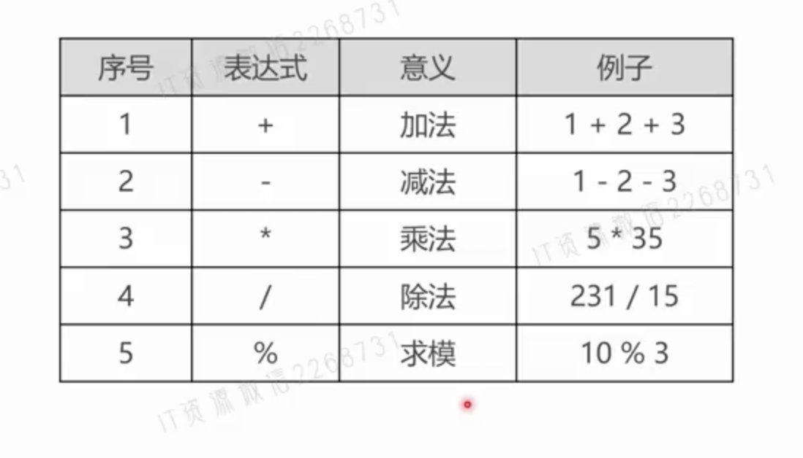
		- 比较运算符
			- 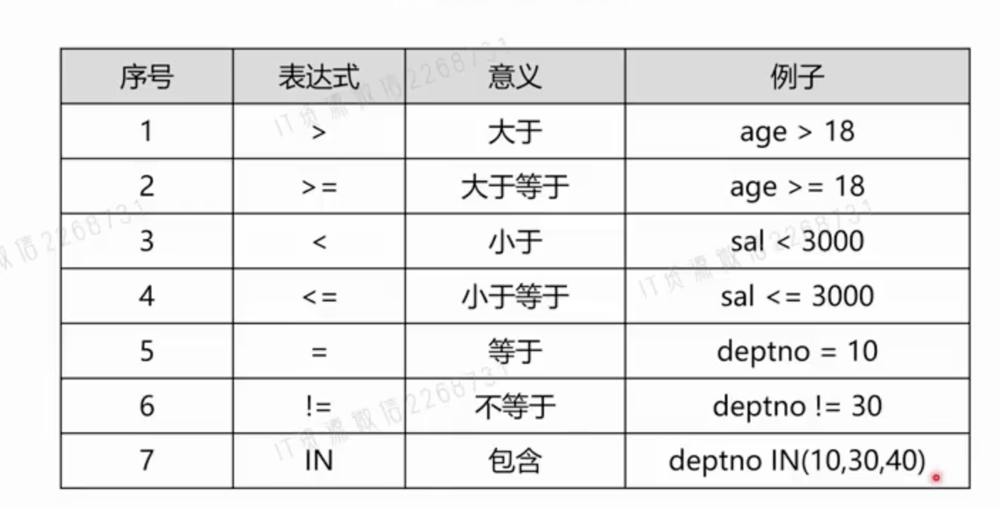
			  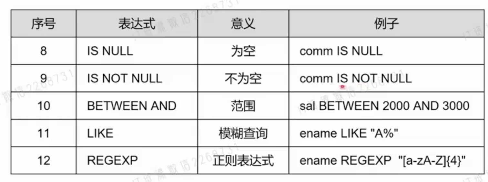
			- ```sql
			  SELECT * FROM t_emp WHERE comm IS NULL AND sal BETWEEN 2000 AND 3000;
			  ```
			- 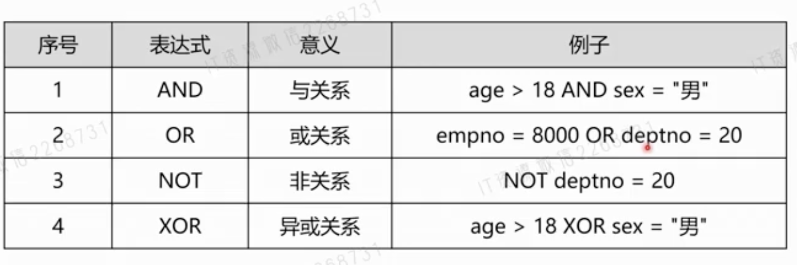
			- 按位运算符
			- 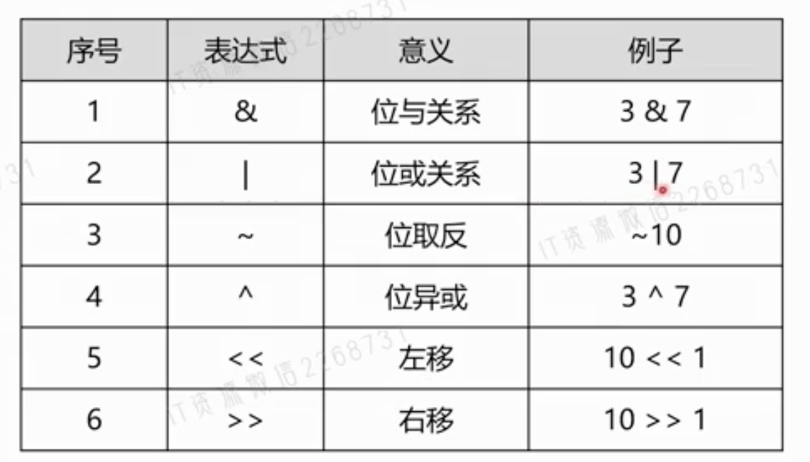
			-
	- 聚合函数
	  collapsed:: true
		- 对数据求和、求最大值和最小值、求平均值等等
		- ```sql
		  SELECT AVG(sal+IFNULL(comm,0)) FROM t_emp; // 平均值
		  SELECT SUM(sal) FROM t_emp WHERE deptno IN (10,20); // 求和
		  SELECT MAX(sal+IFNULL(comm,0)) FROM t_emp WHERE deptno IN(10,20); // 求最大值
		  SELECT MIN(empno) FROM t_emp; // 求最小值
		  SELECT COUNT(*),COUNT(comm) FROM t_emp; // 计数
		  ```
	- 分组查询
	  collapsed:: true
		- ```sql
		  SELECT deptno,ROUND(AVG(sal)) FROM t_emp GROUP BY deptno;
		  ```
		- 逐级分组
			- ```sql
			  SELECT deptno, job,COUNT(*), AVG(sal) 
			  FROM t_emp GROUP BY deptno,job 
			  ORDER BY deptno;
			  ```
		- GROUP_CONCAT函数
			- 可以把分组查询中的某个字段拼接成一个字符串
			- ```sql
			  SELECT deptno, GROUP_CONCAT(ename),COUNT(*)
			  FROM t_emp WHERE sal >= 2000
			  GROUP BY deptno;
			  ```
			- 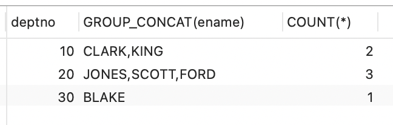
			-
	- Having子句
	  collapsed:: true
		- 计算平均值大于2000的
		- ```sql
		  SELECT deptno
		  FROM t_emp
		  GROUP BY deptno HAVING AVG(sal) >= 2000;
		  
		  SELECT deptno
		  FROM t_emp
		  GROUP BY deptno HAVING AVG(sal) >= 2000 AND sal>=2000;
		  ```
		- 查询每个部门中，1982年以后入职的员工超过2个人的部门编号
	- 表连接查询
	  collapsed:: true
		- ```sql
		  SELECT e.empno,e.ename,d.dname
		  FROM t_emp e JOIN t_dept d 
		  ON e.deptno=d.deptno;
		  ```
		- 分类
			- 表连接分两种：内连接和外连接
			- 内连接是结果集中只保留符合连接条件的记录
			- 外连接是不管符不符合连接条件，记录都要保留在结果集中
		- 内连接
		  collapsed:: true
			- ```sql
			  SELECT ... FROM 表1
			  [INNER] JOIN 表2 ON 条件
			  [INNER] JOIN 表3 ON 条件
			  ...
			  
			  // or 
			  SELECT ... FROM 表1 JOIN 表2 WHERE 条件连接;
			  
			  // or 
			  SELECT ... FROM 表1,表2 WHERE 连接条件;	
			  ```
			- 案例
				- 查询工资等级
				- ```sql
				  SELECT e.ename,e.deptno,d.dname,e.sal,e.job,s.grade
				  FROM t_emp e JOIN t_dept d ON e.deptno=d.deptno
				  JOIN t_salgrade s ON e.sal BETWEEN s.losal AND s.hisal;
				  ```
				- 查询SCOTT同部门的人
				- ```sql
				  SELECT ename,deptno
				  FROM t_emp
				  WHERE deptno=(SELECT deptno FROM t_emp WHERE ename="SCOTT")
				  AND ename!="SCOTT"
				  
				  // 改造
				  SELECT e2.ename,e2.deptno
				  FROM t_emp e1 JOIN t_emp e2 ON e1.deptno=e2.deptno
				  WHERE e1.ename="SCOTT" AND e2.ename!="SCOTT";
				  ```
				- 查询底薪超过公司平均底薪的员工信息
				- ```sql
				  SELECT e.empno,e.ename,e.sal
				  FROM t_emp e JOIN (SELECT AVG(sal) avg FROM t_emp) t
				  ON e.sal>=t.avg;
				  ```
		- 外连接
			- 外连接与内连接的区别在于，除了符合条件的记录之外，结果集中还会保留不符合条件的记录
			- ```sql
			  SELECT e.empno,e.ename,d.dname
			  FROM t_emp e
			  LEFT JOIN t_dept d ON e.deptno=d.deptno;
			  ```
	- 子查询
	  collapsed:: true
		- 简介
			- 子查询是一种查询中潜逃查询的语句
			- 查询底薪超过公司平均底薪的员工的信息
			- ```sql
			  SELECT empno,ename,sal
			  FROM t_emp
			  WHERE sal >= (SELECT AVG(sal) FROM t_emp);
			  ```
		- 分类
		  collapsed:: true
			- 子查询可以写在三个地方：WHERE子句、FORM子句、SELECT子句，但是只有FROM子句子查询是最可取的
			- FROM子查询-只会执行一次，所以查询效率很高
				- ```sql
				  SELECT e.empno,e.ename,e.sal,t.avg
				  FROM t_emp e JOIN (SELECT deptno,AVG(sal) as avg FROM t_emp GROUP BY deptno) t 
				  ON e.deptno=t.deptno AND e.sal >= t.avg;
				  ```
			- SELECT子查询，每一条记录都要执行一次，查询效率很低
				- ```sql
				  SELECT e.empno,e.ename,
				  	(SELECT dname FROM t_dept WHERE deptno=e.deptno) 
				  FROM t_emp e;
				  ```
		- 单行子查询和多行子查询
			- 简介
				- 单行子查询的结果集只有一条记录，多行子查询结果有多行记录
				- 多行子查询只能出现在WHERE子句和FROM子句中
			- 查找FORD和MARTIN两个人的同事
				- ```sql
				  SELECT ename,deptno
				  FROM t_emp
				  WHERE deptno IN(SELECT deptno FROM t_emp WHERE ename IN("FORD","MARTIN"))
				  AND ename NOT IN("FORD","MARTIN");
				  ```
		- WHERE子句中的多行子查询
			- WHERE子句中，可以使用IN、ALL、ANY、EXISTS关键字来处理多行表达式结果集的条件判断
			- 查询比FORD和MARTIN底薪都高的员工信息
				- ```sql
				  SELECT ename,sal FROM t_emp
				  WHERE sal >= ALL 
				  	(SELECT sal FROM t_emp WHERE ename IN("FORD","MARTIN"));
				  ```
			- `EXISTS`关键字
				- 把原来在子查询之外的条件判断，写到了子查询里面
				- ```sql
				  SELECT ... FROM 表名 WHERE [NOT] EXISTS(子查询)
				  ```
- 插入
  collapsed:: true
	- INSERT语句可以向数据表写入数据，可以是一条记录，也可以是多条记录
		- ```sql
		  // 单条
		  INSERT INTO 表名(字段1,字段2,...) VALUES(值1,值2,...);
		  // 多条
		  INSERT INTO 表名(字段1,字段2,...) VALUES(值1,值2,...),(值1,值2,...);
		  ```
	- INSERT语句方言
		- ```sql
		  INSERT INTO 表名 SET 字段1=值1,字段2=值2,...;
		  ```
	- IGNORE关键字
		- IGNORE关键字会让INSERT只插入数据库不存在的记录
		- ```sql
		  INSERT [IGNORE] INTO 表名 ...;
		  ```
- 修改
  collapsed:: true
	- UPDATE语句用于修改表的记录
	- ```sql
	  UPDATE [IGNORE] 表名
	  SET 字段1=值1,字段2=值2,...
	  [WHERE 条件1 ...]
	  [ORDER BY ...]
	  [LIMIT ...];
	  ```
	- 把每个员工的编号和上司的编号+1，用ORDER BY子句完成
	- ```sql
	  UPDATE t_emp SET empno=empno+1,mgr=mgr+1
	  ORDER BY empno DESC;
	  ```
	- UPDATE语句的表连接
	- ```sql
	  UPDATE 表1 JOIN 表2 ON 条件
	  SET 字段1=值1,字段2=值2,...;
	  ```
	- ```sql
	  UPDATE 表1,表2
	  SET 字段1=值1,字段2=值2
	  WHERE 连接条件;
	  ```
	- UPDATE语句的表连接即可以是内连接，又可以是外连接
	- ```sql
	  UPDATE 表1[LEFT|RIGHT] JOIN 表2 ON 条件
	  SET 字段1=值1,字段2=值2,...;
	  ```
- 删除
  collapsed:: true
	- DELETE语句用于删除记录
		- ```sql
		  DELETE [IGNORE] FROM 表名
		  [WHERE 条件1,条件2,...]
		  [ORDER BY ...]
		  [LIMIT ...];
		  ```
	- 表连接
		- ```sql
		  DELETE 表1,... FROM 表1 JOIN 表2 ON 条件
		  [WHERE 条件1,条件2,...]
		  [ORDER BY ...]
		  [LIMIT ...];
		  ```
- 函数
	- 数字函数
	  collapsed:: true
		- 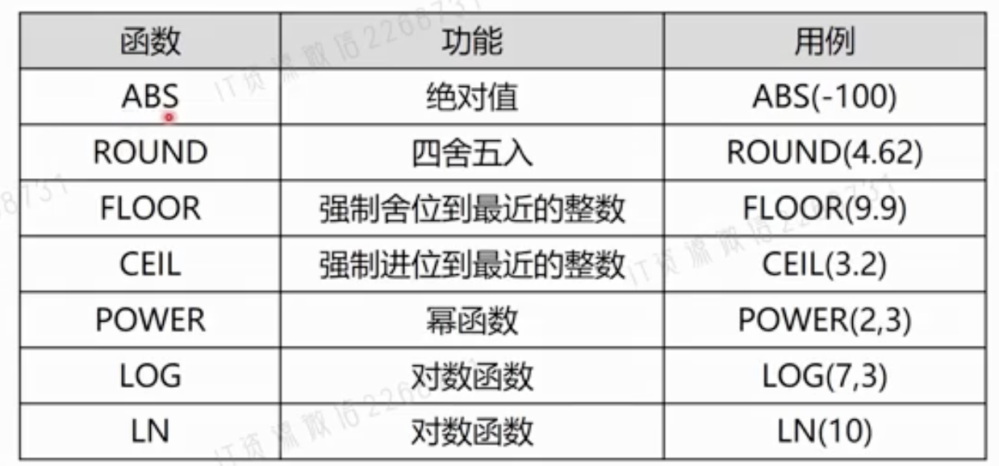
		- 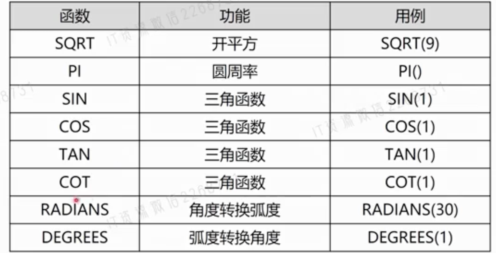
		-
	- 时间
	  collapsed:: true
		- 获取系统时间函数
			- `NOW()`函数能获取系统日期和时间，格式yyyy-MM-dd hh:mm:ss
			- `CURDATE()`函数能获取当前系统日期，格式yyyy-MM-dd
			- `CURTIME()`函数能获取当前系统时间，格式hh:mm:ss
		- 日期格式化函数
			- `DATE_FORMAT()`函数用于格式化日期，返回用户想要的日期格式
			  collapsed:: true
				- ```sql
				  DATE_FORMAT(日期,表达式)
				  SELECT ename, DATE_FORMAT(hiredate,"%Y") FROM t_emp;
				  ```
				- 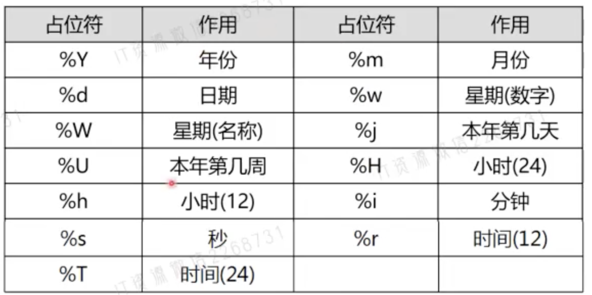
				-
		- 日期偏移计算
			- `DATE_ADD()`函数可以实现日期的偏移计算，而且时间单位很灵活
				- ```sql
				  DATE_ADD(日期,INTERVAL 偏移量 时间单位)
				  SELECT DATE_ADD(NOW(), INTERVAL 15 DAY); // 15天后
				  SELECT DATE_ADD(NOW(), INTERVAL -300 MINUTE); // 300分钟前
				  ```
		- 计算日期之间相隔的天数
			- `DATEDIFF()`函数用来计算两个日期之间相差的天数
				- ```sql
				  DATEDIFF(日期,日期)
				  ```
	- 字符函数
		- 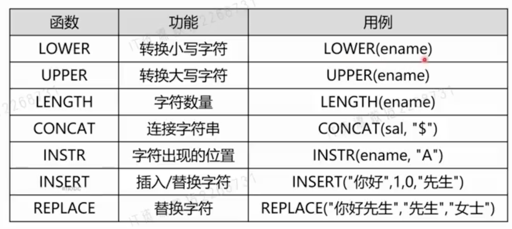
		- 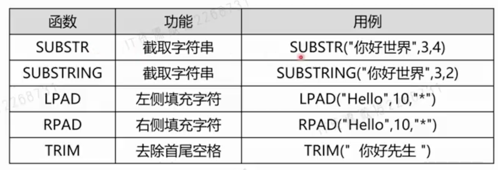
		-
- JDBC
  collapsed:: true
	- 概念
		- Java数据库连接-Java DataBase Connectivity
		- JDBC可以让Java通过程序操作关系型数据库
		- JDBC基于驱动程序实现与数据库的连接与操作
	- 开发流程 #.ol
		- 加载并注册JDBC驱动
		- 创建数据库连接
		- 创建Statement对象
		- 遍历查询结果
		- 关闭连接，释放资源
	- 案例
		- ```java
		  Connection conn = null;
		  try {
		    // 1. 加载并注册JDBC驱动
		    Class.forName("com.mysql.cj.jdbc.Driver");
		    // 2. 创建数据库连接 url可连接参数 参数1=值1&参数2=值2
		    conn = DriverManager.getConnection("jdbc:mysql://localhost:3306/test", "root", "123456");
		    // 3. 创建Statement对象
		    Statement stmt = conn.createStatement();
		    ResultSet rs = stmt.executeQuery("select * from users");
		    // 4. 遍历查询结果
		    while (rs.next()) {
		      Integer eno = rs.getInt(1);
		      String ename = rs.getString("ename");
		      Integer salary = rs.getInt("salary");
		      String dname = rs.getString("dname");
		      System.out.println(dname + '-' + eno + '-' + ename + '-' + salary);
		    }
		  } catch (Exception e) {
		    e.printStackTrace();
		  } finally {
		    try {
		      if (conn != null && conn.isClosed() == false) {
		        // 5. 关闭连接，释放资源
		        conn.close();
		      }
		    } catch (Exception e) {
		      e.printStackTrace();
		    }
		  }
		  ```
	- 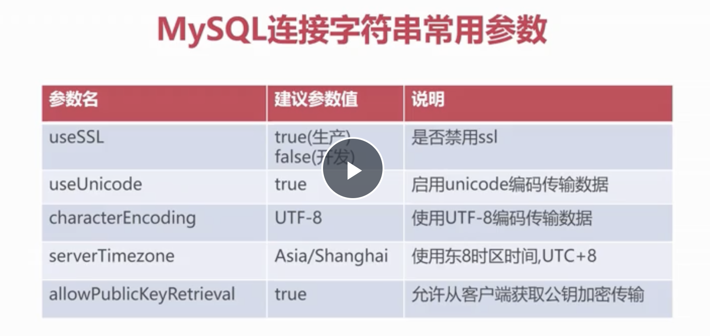
- PreparedStatement
  collapsed:: true
	- 概念
		- 是Statement的子接口
		- 对SQL进行参数化，预防SQL注入攻击
		- 比Statment执行效率更高
	- 使用
		- 新增
			- ```java
			  // 3. 创建Statement对象
			  // Statement stmt = conn.createStatement();
			  // ResultSet rs = stmt.executeQuery("select * from users");
			  String sql = "select * from users where dname=?";
			  PreparedStatement pstmt = conn.prepareStatement(sql);
			  String dnameStr = "san"; // 从前端传来的数据
			  pstmt.setString(1, dnameStr); // 设置SQL参数，参数从1开始
			  ResultSet rs = pstmt.executeQuery(); // 查询
			  ```
		- 插入
			- ```java
			  String sql = "insert into users(eno, ename) values(?,?)";
			  PreparedStatement pstmt = conn.prepareStatement(sql);
			  pstmt.setString(1, 10); 
			  pstmt.setString(2, "张三"); 
			  // excuteUpdate方法返回记录数
			  int cnt = pstmt.excuteUpdate(); // 新增 cnt=1
			  ```
		- 删除
			- ```java
			  String sql = "delete from users where eno = ?";
			  PreparedStatement pstmt = conn.prepareStatement(sql);
			  pstmt.setInt(1, 10);  
			  // excuteUpdate方法返回记录数
			  int cnt = pstmt.excuteUpdate(); 
			  ```
		- 更新
			- ``` java
			  String sql = "update users set salart=salart + 1000 where dname=?";
			  PreparedStatement pstmt = conn.prepareStatement(sql);
			  pstmt.setString(1, "研发部");  
			  // excuteUpdate方法返回记录数
			  int cnt = pstmt.excuteUpdate(); 
			  ```
- 事务模式
  collapsed:: true
	- 自动提交事务模式
		- 每执行一次写操作SQL，自动提交事务
		- 开启方法：conn.setAutoCommit(true)
		- JDBC默认行为，此模式无法保证多数据一致性
	- 手动提交事务模式
		- 显式调用commit()与rollback()方法管理事务
		- 开启方法：conn.setAutoCommit(false)
		- 可保证多数据一致性，但必须手动调用提交/回滚方法
- 分页封装数据
  collapsed:: true
	- ```java
	  List<User> list = new ArrayList();
	  
	  String sql = "select * from users limit ?,10";
	  pstmt = conn.prepareStatement(sql);
	  pstmt.setInt(1, (page-1) * 10);
	  ResultSet rs = pstmt.excuteQuery();
	  while(rs.next()) {
	    Integer eno = rs.getInt("eno");
	    String ename = rs.getString("ename");
	    ...
	    User user = new User();
	    user.setEno(eno);
	    user.setEname(ename);
	    list.add(user)
	  }
	  ```
- 批处理任务(效率)
  collapsed:: true
	- ```java
	  conn.setAutoCommit(false); // 关闭自动提交
	  String sql = "insert into users(eno, ename, salay, dname) values()";
	  PreparedStatement pstmt = conn.prepareStatement(sql);
	  for(int i=0; i< 200000; i++) {
	    pstmt.setInt(1, i);  
	    pstmt.setString(2, "员工" + i);
	    // ...
	    pstmt.addBatch(); // 将参数加入批处理任务
	  }
	  pstmt.excuteBatch(); // 执行批处理任务
	  conn.commit(); // 提交数据
	  // excuteUpdate方法返回记录数
	  int cnt = pstmt.excuteUpdate(); 
	  ```
- 连接池
  collapsed:: true
	- 阿里巴巴Druid连接池
		- ```java
		  public class DruidSample {
		    public static void main(String[] args) {
		      // 1. 加载属性文件
		      Properties properties = new Properties();
		      //  getResource用于获取编译后文件所在路径的位置
		  	DruidSample.class.getResource("/druid-config.propertes").getPath();
		    	// 容错处理，如果不指定：空格->%20 c:\java code\druid-config.propertes
		      // -> c:\java%20code\...
		      propertyFile = new URLDecoder().decode(propertyFile, "UTF-8");
		      properties.load(new FileInputStream(propertyFile));
		      // 2. 获取DataSource数据源对象
		      DataSource dataSource = DruidDataSourceFactor.createDataSource(properties); 
		    	// 3. 创建数据库连接
		      conn = dataSource.getConnection();
		      conn.prepareStatement("select * from users limit 0, 10");
		      ...
		      ResultSet rs = conn.excuteQuery();
		      // 关闭连接
		      // 不使用连接池：关闭连接
		      // 使用连接池：讲连接回收至连接池
		      conn.close();
		    }
		  }
		  ```