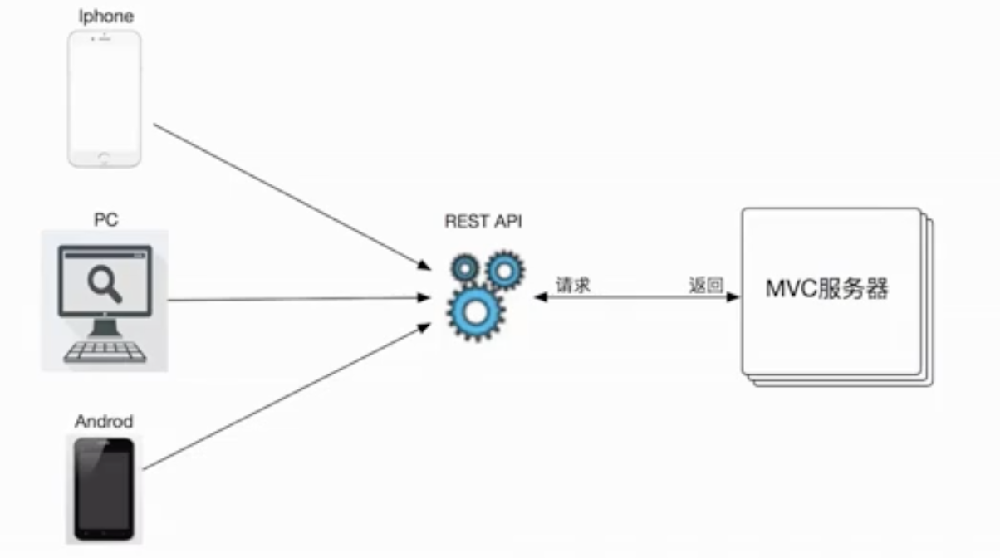
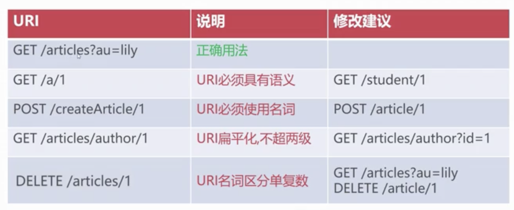

- 概述
  collapsed:: true
	- REST-表现层状态转换，资源在网络中以某种表行形式进行状态转移
	- RESTful是基于REST理念的一套开发风格，是具体开发规则
	- 
- 开发规范
  collapsed:: true
	- 使用URL作为用户交互入口
	- 明确的语意规范（GET｜POST｜PUT｜DELETE）
	- 只返回数据（JSON｜XML），不包含任何展现
- 命名要求
  collapsed:: true
	- 
	-
- 案例
  collapsed:: true
	- 设置json编码
	- ```xml
	      <!-- 启用Spring MVC的注解开发模式 -->
	      <mvc:annotation-driven>
	          <mvc:message-converters>
	              <bean class="org.springframework.http.converter.StringHttpMessageConverter">
	                  <property name="supportedMediaTypes">
	                      <list>
	                          <value>text/html;charset=utf-8</value>
	                          <value>application/json;charset=utf-8</value>
	                      </list>
	                  </property>
	              </bean>
	          </mvc:message-converters>
	      </mvc:annotation-driven>
	  ```
- RestController注解与路径变量
	- ```java
	  @RestController // 可以省略 @ResponseBody
	  @RequestMapping("/user") // 增加前缀y
	  public class TestController {
	    @GetMapping("/t") // localhost/t
	    public String getMapping(@RequestParam("name") String managerName) {
	      return "{\"message\":\"返回的数据\"}";
	    }
	    // /login/34
	    @PostMapping("/login/{rid}") // 动态uri
	    public String postMapping(@PathVariable Integer requestId, User user) {
	      return "POST SUCCESS; name:" + user.getName() + "password1:" + user.getPassword();
	    }
	  }
	  ```
- 支持非简单请求
	- src/main/webapp/WEB-INF/web.xml
	- ```xml
	  <filter>
	    <filter-name>formContentFilter</filter-name>
	    <filter-class>org.springframework.web.filter.FormContentFilter</filter-class>
	  </filter>
	  <filter-mapping>
	    <filter-name>formContentFilter</filter-name>
	    <url-pattern>/*</url-pattern>
	  </filter-mapping>
	  ```
- JSON序列化
	- 依赖
		- ```xml
		  <dependency>
		    <groupId>com.fasterxml.jackson.core</groupId>
		    <artifactId>jackson-core</artifactId>
		    <version>2.13.4</version>
		  </dependency>
		  <dependency>
		    <groupId>com.fasterxml.jackson.core</groupId>
		    <artifactId>jackson-databind</artifactId>
		    <version>2.13.4.2</version>
		  </dependency>
		  <dependency>
		    <groupId>com.fasterxml.jackson.core</groupId>
		    <artifactId>jackson-annotations</artifactId>
		    <version>2.13.4</version>
		  </dependency>
		  ```
		- 例如
			- ```java
			  @GetMapping("/person")
			  public User findByUserId(Integer id) {
			    User user = new User();
			    user.setName("张三");
			    user.setPassword(123456L);
			    return user;
			  }
			  ```
		- 格式化时间
			- ```java
			  public class Person {
			    @JsonFormat("yyyy-MM-dd HH:mm:ss", "GTM+8")
			    private Date birthday;
			  }
			  ```
- 同源策略
	- @CrossOrigin - Controller跨域注解
		- ```java
		  @RestController // 可以省略 @ResponseBody
		  @RequestMapping("/user") // 增加前缀y
		  @CrossOrigin(origin = {"http://localhost:8080"})
		  public class TestController {
		    ...
		  }
		  ```
	- <mvc:cors> - Spring MVC全局跨域配置
		- ```xml
		  <mvc:cors>
		    <mvc:mapping path="/restful/**"
		                 allowed-origins="http://localhost:8080, http://www.example.com"
		                 max-age="3600" />
		  </mvc:cors>
		  ```
- 406解决
	- ```java
	  
	      <dependency>
	              <groupId>com.alibaba</groupId>
	              <artifactId>fastjson</artifactId>
	              <version>2.0.17.graal</version>
	          </dependency>
	  
	  
	  
	      <mvc:annotation-driven >
	          <mvc:message-converters register-defaults="true">
	              <bean id="fastJsonHttpMessageConverter" class="com.alibaba.fastjson.support.spring.FastJsonHttpMessageConverter">
	                  <property name="supportedMediaTypes">
	                      <list>
	                          <value>application/json;charset=UTF-8</value>
	                      </list>
	                  </property>
	              </bean>
	          </mvc:message-converters>
	      </mvc:annotation-driven>
	  ```