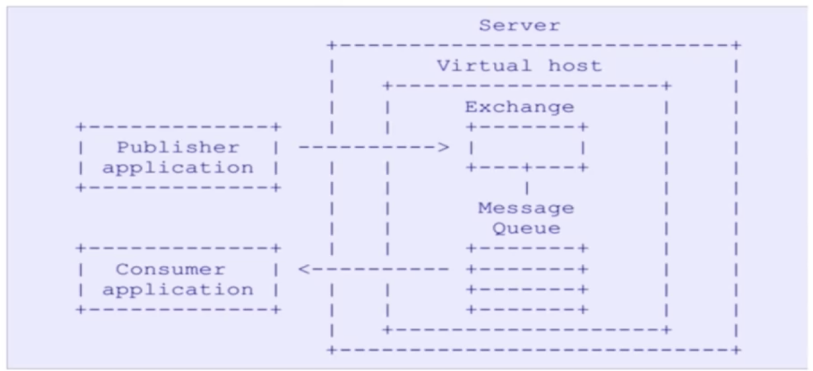
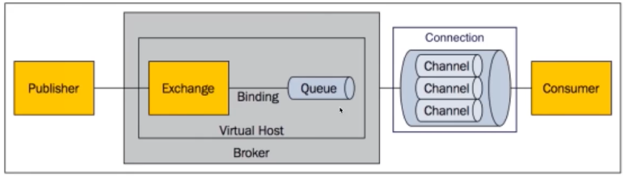

- 核心思想
	- 接受并转发消息
- 特性
	- 业务无关
	- FIFO
	- 容灾
	- 性能
- 为什么要用消息队列
	- 系统解耦
	- 异步调用
	- 流量削峰
- 特点
	- 开源、跨语言
	- Erlang语言编写
- AMQP协议
	- Advamced Message Qieiomg Protocol
	- 
- 核心概念
	- 
	- Server：服务
	- connection：与Server建立连接
	- channel：信道，几乎所有的操作都在信道上进行，客户端可以建立多个信道
	- message：消息，由properties和body组成
	- virtual host：虚拟足迹，顶层隔离。同一个虚拟主机下，不能有重复的交换机和queue
	- Exchange：交换机，接受生产者的消息的，然后根据指定路由器去把消息转发到所绑定的队列上
	- binding：绑定交换机和队列
	- routing key：路由键，路由规则，虚拟机可以用它来确定这个消息如果进行一个路由
	- queue：队列，消费者只需要监听队列来消费消息，不需要关注消息来自于哪个Exchange
	- Exchange和Message Queue存在着绑定的关系，一个Exchange可以绑定多个消息队列