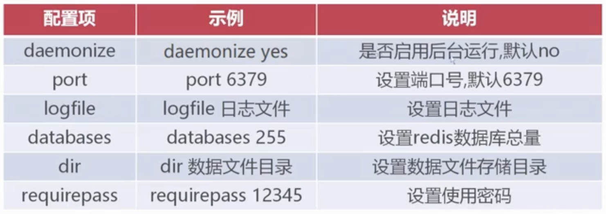
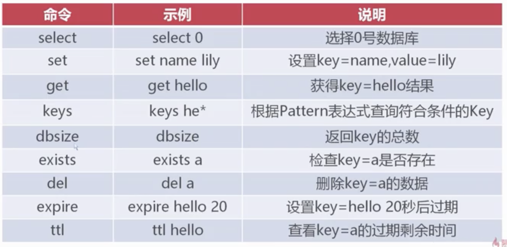
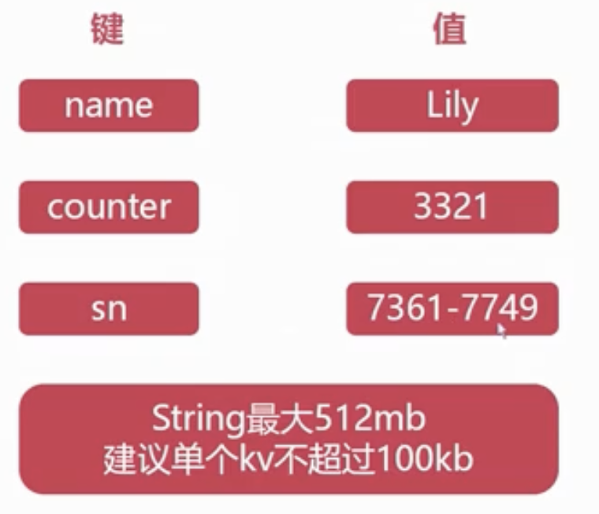
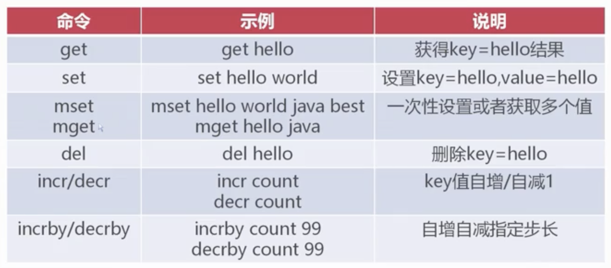
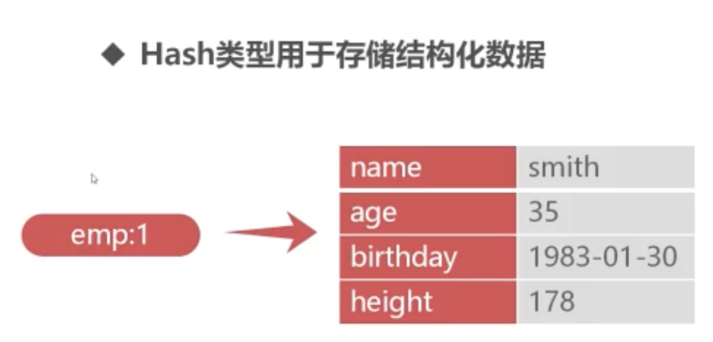
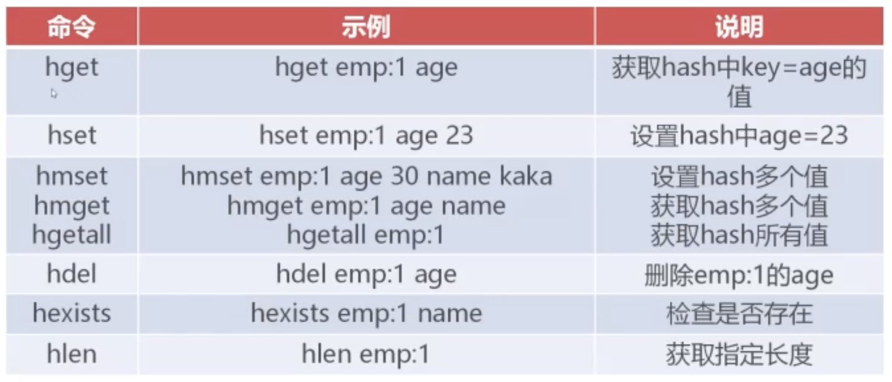

- 概述
	- Redis是Key-Value型NoSQL数据库
	- Redis将数据存储在内存中，同时也能持久化到磁盘
	- Redis常用于缓存，利用内存的高效提高程序的处理速度
- Redis的常用基本配置
	- 
- 进入redis模式
	- ```
	  ./src/redis-cli
	  ```
	- 结束进程
		- ```
		  ./src/redis-cli shutdown
		  ```
	- 认证
		- ```
		  // 进入cli后
		  auth 12345
		  ```
- Redis通用命令
	- 
	- ```
	  set name zhangsan
	  
	  get name // "zhangsan"
	  ```
- 数据类型
	- String - 字符串类型
	  collapsed:: true
		- {:height 242, :width 273}
		- 字符串命令
			- 
	- Hash - Hash类型
		- 
		- Hash命令
			- 
	- List - 列表类型
	  collapsed:: true
		- 概述
			- List列表就是一系列字符串的“数组“，按插入顺序排序
			- List列表最大长度为2的32次方-1，可以包含40亿个元素
		- 命令
			- `rpush listkey c b a` - 右侧插入  -->. c,b,a
			- `lpush listkey f e d` - 左侧插入 -->  d,e,f
			- `rpop listkey` - 右侧弹出
			- `lpop listkey` - 左侧弹出
			- `lrange list 0 -1` - 查看列表元素
	- Set - 集合类型
	  collapsed:: true
		- 概述
			- Set集合是字符串的无需集合，集合成员是唯一的
		- 命令
			- `sadd set1 a` - 添加
			- `smembers set1` - 查看集合
			- `sinter set1 set2` - 查看两个集合的交集
			- `sunion set1 set2` - 查看并集
			- `sdiff set1 set2` - 差集
	- Zset - 有序集合类型
	  collapsed:: true
		- 概述
			- Zset集合是字符串的有序集合，集合成员是唯一的
		- 命令
			- `zadd zset1 100 f` - 添加
			- `zrange zset1 0 -1` - 查看
			- `zrangebyscore zset1 100 103` - 范围查询
- Java客户端-Jedis
	- 概述
		- 是Java语言开发的Redis客户端工具包
		- Jedis只是对Redis命令的封装，掌握Redis命令便可轻易上手
	- redis允许远程连接
		- redis.conf
		- ```
		  bind 0.0.0.0
		  protected-mode no
		  ```
	- 案例
		- pom.xml
			- ```xml
			  <dependency>
			    <groupId>redis.clients</groupId>
			    <artifactId>jedis</artifactId>
			    <version>4.3.0</version>
			  </dependency>
			  ```