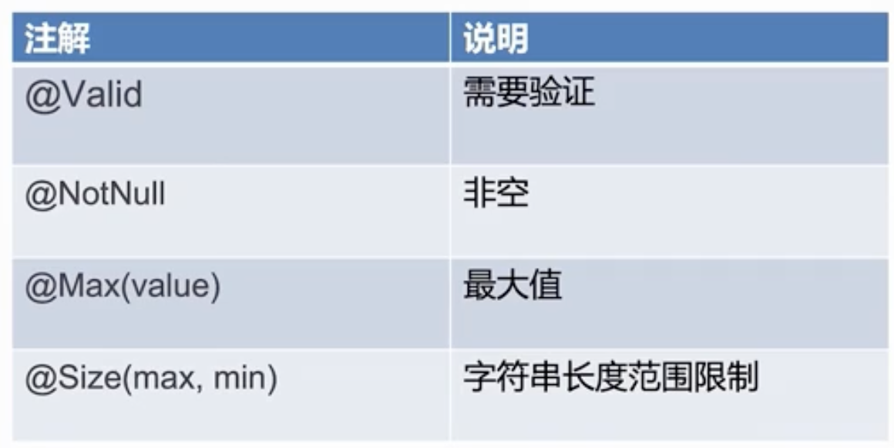

- 配置文件简介
	- properties
		- ```
		  server.servlet.context-path=/first
		  ```
	- yml
		- 分层级，冒号后需要空格
		- ```yml
		  environments:
		  	dev:
		      	url: http://example.com
		  ```
- 自定义配置
  collapsed:: true
	- 方法1
		- ```java
		  @RestController
		  public class ParaController {
		      @Value("${grade}")
		      private String grade;
		      @Value("${clssnum}")
		      private Integer classnum;
		  
		      @GetMapping({"/request"})
		      public String firstRequest() {
		          return "年级:" + grade + " 班级：" + classnum;
		      }
		  }
		  ```
	- 方法2
	  collapsed:: true
		- ```xml
		  // application.properties
		  school.grade=3
		  school.classnum=6
		  ```
		- ```java
		  // school.java
		  @Component
		  @ConfigurationProperties(prefix = "school") // 自动搜索school开头的配置
		  public class SchoolConfig {
		      public String getGrade() {
		          return grade;
		      }
		  
		      public void setGrade(String grade) {
		          this.grade = grade;
		      }
		  
		      public Integer getClassnum() {
		          return classnum;
		      }
		  
		      public void setClassnum(Integer classnum) {
		          this.classnum = classnum;
		      }
		  
		      private String grade;
		      private Integer classnum;
		  }
		  ```
		- ```java
		  // ParaController
		  @RestController
		  public class ParaController {
		      @Autowired
		      SchoolConfig schoolConfig;
		  
		      @GetMapping({"/request"})
		      public String firstRequest() {
		          return "年级:" + schoolConfig.getGrade() + " 班级：" + schoolConfig.getClassnum();
		      }
		  }
		  ```
- 全局错误处理
  collapsed:: true
	- ```java
	  /*
	   * 描述：处理统一异常的handler
	   * */
	  @ControllerAdvice
	  public class GlobalExceptionHandler {
	    private final Logger log = LoggerFactory.getLogger(GlobalExceptionHandler.class);
	  
	    @ExceptionHandler(Exception.class)
	    @ResponseBody
	    public Object handlerException(Exception e) {
	      log.error("Default Exception: ", e);
	      return ApiRestResponse.error(MallExceptionEnum.SYSTEM_ERROR);
	    }
	  
	    @ExceptionHandler(MallException.class)
	    @ResponseBody
	    public Object handlerMallException(MallException e) {
	      log.error("Mall Exception: ", e);
	      return ApiRestResponse.error(e.getCode(), e.getMessage());
	    }
	    /*
	       * 参数校验不过拦截
	       * */
	    @ExceptionHandler(MethodArgumentNotValidException.class)
	    @ResponseBody
	    public ApiRestResponse handlerMethodArgumentNotValidException(MethodArgumentNotValidException e) {
	      log.error("MethodArgumentNotValidException: ", e);
	      return handlerBindingResult(e.getBindingResult());
	    }
	    private ApiRestResponse handlerBindingResult(BindingResult result) {
	      // 把异常处理为对外暴露的提示
	      List<String> list = new ArrayList<>();
	      if (result.hasErrors()) {
	        List<ObjectError> allErrors = result.getAllErrors();
	  
	        for (ObjectError objectError : allErrors) {
	          String message = objectError.getDefaultMessage();
	          list.add(message);
	        }
	      }
	      if (list.size() == 0) {
	        return ApiRestResponse.error(MallExceptionEnum.REQUEST_PARAM_ERROR);
	      }
	      return ApiRestResponse.error(MallExceptionEnum.REQUEST_PARAM_ERROR.getCode(), list.toString());
	    }
	  }
	  
	  ```
- 参数校验
  collapsed:: true
	- 
	- 案例
		- 依赖
			- ```xml
			        <dependency>
			              <groupId>org.springframework.boot</groupId>
			              <artifactId>spring-boot-starter-validation</artifactId>
			              <version>2.7.5</version>
			          </dependency>
			  ```
		- Controller
			- ```java
			    @PostMapping("/admin/cetegory/add")
			      public ApiRestResponse addCetegory(HttpSession session,@Valid @RequestBody AddCetegoryReq addCetegoryReq) {
			  ...
			        }
			  ```
		- Req.java
			- ```java
			  public class AddCetegoryReq {
			    @NotNull(message = "name不能为null")
			    @Size(min = 2, max = 5)
			    private String name;
			    @NotNull(message = "type不能为null")
			    @Max(3)
			    private Integer type;
			    @NotNull(message = "parentId不能为null")
			    private Integer parentId;
			    @NotNull(message = "orderNum不能为null")
			    private Integer orderNum;
			  }
			  ```
- 静态资源转发
	- ```java
	  @Configuration
	  public class MallWebMvcConfig implements WebMvcConfigurer {
	      @Override
	      public void addResourceHandlers(ResourceHandlerRegistry registry) {
	          registry.addResourceHandler("/images/**")
	                          .addResourceLocations("file:" + Constant.FILE_UPLOAD_DIR);
	        ...
	        }
	  ```