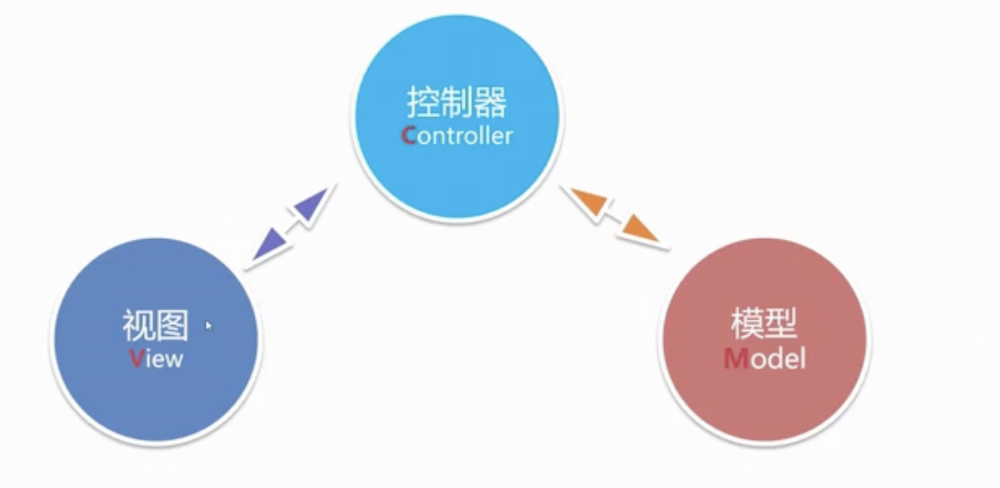

- MVC到底是什么
	- 
- 概述
	- 是Spring体系的轻量级Web MVC框架
	- 核心Controller控制器，用于处理请求，产生相应
	- 基于Spring IOC容器运行，所有对象被IoC管理
- 案例
  collapsed:: true
	- pom.xml
	- ```xml
	  <dependencies>
	          <dependency>
	              <groupId>org.springframework</groupId>
	              <artifactId>spring-webmvc</artifactId>
	              <version>5.3.23</version>
	          </dependency>
	      </dependencies>
	  ```
	- src/main/webapp/WEB-INF/web.xml
	- ```xml
	  <?xml version="1.0" encoding="UTF-8"?>
	  <web-app xmlns="http://xmlns.jcp.org/xml/ns/javaee"
	           xmlns:xsi="http://www.w3.org/2001/XMLSchema-instance"
	           xsi:schemaLocation="http://xmlns.jcp.org/xml/ns/javaee http://xmlns.jcp.org/xml/ns/javaee/web-app_3_1.xsd"
	           version="3.1">
	      
	      <servlet>
	          <servlet-name>springmvc</servlet-name>
	          <!--
	              DispatcherServlet是Spring MVC最核心的对象
	              DispatcherServlet用于拦截HTTP请求
	              并根据请求的URL调用与之对应的Controller方法，来完成HTTP请求的处理
	          -->
	          <servlet-class>org.springframework.web.servlet.DispatcherServlet</servlet-class>
	          <!-- applicationContext.xml -->
	          <init-param>
	              <param-name>contextConfigLocation</param-name>
	              <param-value>classpath:applicationContext.xml</param-value>
	          </init-param>
	          <!--
	              在Web应用启动时自动创建Spring IOC容器
	              并初始化DispatcherServlet
	          -->
	          <load-on-startup>0</load-on-startup>
	      </servlet>
	      <servlet-mapping>
	          <servlet-name>springmvc</servlet-name>
	          <url-pattern>/</url-pattern>
	      </servlet-mapping>
	  </web-app>
	  ```
	- src/main/resource/applicationContext.xml
	- ```xml
	  <?xml version="1.0" encoding="UTF-8"?>
	  <beans xmlns="http://www.springframework.org/schema/beans"
	         xmlns:mvc="http://www.springframework.org/schema/mvc"
	         xmlns:xsi="http://www.w3.org/2001/XMLSchema-instance"
	         xmlns:context="http://www.springframework.org/schema/context"
	         xsi:schemaLocation="http://www.springframework.org/schema/beans
	          https://www.springframework.org/schema/beans/spring-beans.xsd
	          http://www.springframework.org/schema/mvc
	          https://www.springframework.org/schema/mvc/spring-mvc.xsd http://www.springframework.org/schema/context https://www.springframework.org/schema/context/spring-context.xsd">
	  
	      <!-- 开启注解扫描 -->
	      <context:component-scan base-package="com.example.springmvc" />
	      <!-- 启用Spring MVC的注解开发模式 -->
	      <mvc:annotation-driven conversion-service="conversionService"/>
	      <!-- 将图片/JS/CSS等静态资源排除在外，可提高执行效率 -->
	      <mvc:default-servlet-handler />
	  </beans>
	  ```
	- 添加Controller
	- ```java
	  @Controller
	  public class TestController {
	      @GetMapping("/t") // localhost/t
	      @ResponseBody // 直接相应输出字符串数据，不跳转页面
	      public String test() {
	          return "<h1>SUCCESS11</h1>";
	      }
	  }
	  
	  ```
- URL Mapping
	- 概述
	  collapsed:: true
		- 指将URL与Controller方法绑定
		- 通过将URL与方法绑定，SpringMVC便可通过Tomcat对外暴露服务
	- URL Mapping注解
	  collapsed:: true
		- @RequestMapping - 通用绑定
		- @GetMapping - 绑定Get请求
		- @PostMapping - 绑定Post请求
	- 实例
	  collapsed:: true
		- ```java
		  
		  @Controller
		  @RequestMapping("/user") // 增加前缀
		  public class TestController {
		      @GetMapping("/t") // localhost/t
		      @ResponseBody // 直接相应输出字符串数据，不跳转页面
		      public String test() {
		          return "<h1>SUCCESS11</h1>";
		      }
		  
		      @PostMapping("/login")
		      @ResponseBody
		      public String postMapping() {
		          return "POST SUCCESS";
		      }
		    
		    @RequestMapping(value = "/g", method = RequestMethod.GET) // 只对/g的get请求有效
		    @ResponseBody
		    public String getMapping() {}
		  }
		  ```
- 接收请求参数
  collapsed:: true
	- 方法
	  collapsed:: true
		- 使用Controller方法参数接收
		- 使用Java Bean接收数据
	- 使用Controller
	  collapsed:: true
		- 获取post参数
		- ```html
		  <form action="/user/login" method="post">
		    <input name="name" type="text" />
		    <input name="pwd" type="password" />
		    <button type="submit">提交</button>
		  </form>
		  ```
		- ```java
		  @PostMapping("/login")
		  @ResponseBody
		  public String postMapping(String name, long pwd) {
		    return "POST SUCCESS; name:" + name + "password:" + pwd;
		  }
		  ```
		- 获取get参数
			- /user/t?managerName=123
			- ```java
			  @GetMapping("/t") // localhost/t
			  @ResponseBody // 直接相应输出字符串数据，不跳转页面
			  // 默认值 @RequestParam(value = "name", defaultValue = "ANON")
			  public String getMapping(@RequestParam("name") String managerName) {
			    System.out.println("params:" + managerName);
			    return "<h1>SUCCESS"+ managerName +"</h1>";
			  }
			  ```
	- 使用Java Bean
	  collapsed:: true
		- ```java
		  @PostMapping("/login")
		  @ResponseBody
		  public String postMapping(User user) { // 自动按user值填充
		    return "POST SUCCESS; name:" + user.getName() + "password1:" + user.getPassword();
		  }
		  ```
	- 使用Map - 无法接收复合数据
	  collapsed:: true
		- ```java
		  @PostMapping("/login")
		  @ResponseBody
		  public String postMapping(@RequestParam Map user) { // 自动按user值填充
		    return "POST SUCCESS";
		  }
		  ```
	- 关联对象复制
	  collapsed:: true
		- ```java
		  public class User {
		      private String name;
		      private Long password;
		      private IdCard idCard;
		  }
		  ```
		- ```html
		  <form action="/user/login" method="post">
		    <input name="name" type="text" />
		    <input name="password" type="password" />
		  
		    <input name="idCard.name" type="text" />
		    <input name="idCard.idno" type="text" />
		  
		    <button type="submit">提交</button>
		  </form>
		  ```
	- 接收日期对象
	  collapsed:: true
		- ```java
		  @PostMapping("/login")
		  @ResponseBody
		  public String postMapping(User user, @DateTimeFormat(pattern = "yyyy-MM-DD") Date createTime) {
		    return "POST SUCCESS; name:" + user.getName() + "password1:" + user.getPassword();
		  }
		  ```
		- ```java
		  public class User {
		    private String name;
		    private Long password;
		    private IdCard idCard;
		    @DateTimeFormat(pattern = "yyyy-MM-DD")
		    private Date time;
		  }
		  ```
		- 全局统一日期转换器
			- ```java
			  public class MyDateConverter implements Converter<String, Date> {
			    public Date convert(String s) {
			      SimpleDateFormat sdf = new SimpleDateFormat("yyyy-MM-dd");
			      try {
			        Date d = sdf.parse(s);
			        return d;
			      }catch(ParseException e) {
			        return null;
			      }
			    }
			  }
			  ```
			- springContext.xml
			- ```xml
			  <bean id="conversionService" class="org.springframework.format.support.FormattingConversionServiceFactoryBean">
			  	<property name="converters">
			        <set>
			          <bean class="com.example.springmvc.converter.MyDateConverter" />
			        </set>
			    </property>
			  </bean>
			  ```
	- 解决中文乱码
	  collapsed:: true
		- 中文乱码配置
			- Get请求乱码 - server.xml 增加URIEncoding属性. 8.0后默认utf-8
			- Post请求乱码 - web.xml配置CharacterEncodingFilter
				- ```xml
				  <filter>
				    <filter-name>characterFilter</filter-name>
				    <filter-class>org.springframework.web.filter.CharacterEncodingFilter</filter-class>
				    <init-param>
				      <param-name>encoding</param-name>
				      <param-value>UTF-8</param-value>
				    </init-param>
				  </filter>
				  <filter-mapping>
				    <filter-name>characterFilter</filter-name>
				    <url-pattern>/*</url-pattern>
				  </filter-mapping>
				  ```
			- Response相应乱码 - Spring配置StringHttpMessageConverter
				- applicationContext.xml
				- ```xml
				  <!-- 启用Spring MVC的注解开发模式 -->
				  <mvc:annotation-driven conversion-service="conversionService">
				    <mvc:message-converters>
				      <bean class="org.springframework.http.converter.StringHttpMessageConverter">
				        <property name="supportedMediaTypes">
				          <list>
				            <value>text/html;charset=utf-8</value>
				          </list>
				        </property>
				      </bean>
				    </mvc:message-converters>
				  </mvc:annotation-driven>
				  ```
	- 相应中产生结果
		- @ResponseBody - 产生相应文本
			- 直接产生相应体的数据，过程不涉及任何视图
			- 可以产生标准字符串/JSON/XML等格式数据
			- 被StringHttpMessageConverter所影响
		- ModelAndView - 利用模版引用渲染输出
			- ModelAndView指“模型（数据）与试图（界面）“对象
			- 通过ModelAndView可将包含数据对象与模版引擎进行绑定
			- SpringMVC中默认的Viee是JSP，也可以配置其他模版引擎
			- ```java
			  @GetMapping("/view")
			  public ModelAndView showView(Integer userId) {
			    ModelAndView mav = new ModelAndView("/view.jsp");
			    User user = new User();
			    if(userId == 1) {
			      user.setUsername("lily");
			    } else if(userId == 2) {
			      user.setUsername("smith");
			    }
			    mav.addObject("u", user);
			    return mav;
			  }
			  ```