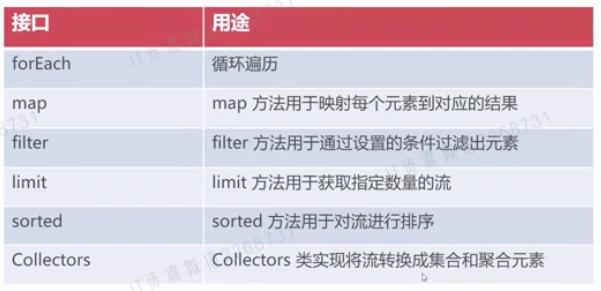

- 概述
	- Stream流式处理是建立在Lambda基础上的多数据处理技术
	- Stream对集合数据处理进行高密度抽象，极大讲话代码量
	- Stream可对集合进行迭代，去重，筛选，排序，聚合等一系列处理
- 示例
	- ```java
	  // 获取List集合中最大的偶数
	  Optional<Integer> op = Arrays.asList(1,2,3,4,5,6).stream()
	    .filter(x->x%2 == 0)
	    .sorted((a,b)->b-a)
	    .findFirst();
	  System.out.println(op.get());
	  ```
- 常用方法
	- 
	- Stream创建
		- 数组创建
		  collapsed:: true
			- ```java
			  String[] arr = {"Lily", "Andy", "Jackson", "Smith"};
			  Stream<String> stream = Stream.of(arr);
			  stream.forEach(s -> System.out.println(s));
			  ```
		- 集合创建
		  collapsed:: true
			- ```java
			  List<String> list = new ArrayList();
			  list.add("Lily");
			  list.add("Andy");
			  list.add("Jackson");
			  list.add("Smith");
			  Stream<String> stream = list.stream();
			  stream.forEach(s -> System.out.println(s));
			  ```
		- generate方法创建无限长度流
		  collapsed:: true
			- ```java
			  Stream<Integer> stream = Stream.generate(() -> new Random().nextInt(100000));
			  stream.limit(10).forEach(i -> System.out.println(i));
			  ```
		- 基于迭代器创建
		  collapsed:: true
			- ```java
			  Stream<Integer> stream = Stream.iterate(1, n -> n + 1);
			  stream.limit(10).forEach(i -> System.out.println(i));
			  ```
		- 基于字符序列创建流
		  collapsed:: true
			- ```java
			  String str = "abcdef";
			  IntStream stream = str.chars();
			  stream.forEach(c -> System.out.println((char)c));
			  ```
	- 案例
		- 提取集合中所有偶数并求和
			- ```java
			  List<String> list = Arrays.asList("1","2","3","4","5");
			  Integer sum = list.stream().mapToInt(n -> Integer.parseInt(n)).filter(n -> n % 2 == 0).sum();
			  System.out.println(sum);
			  ```
		- 所有名字首字母大写
			- ```java
			  List<String> list = Arrays.asList("lily","smith","jackson");
			  List newList = list.stream().map(s -> s.substring(0,1).toUpperCase() + s.substring(1)).collect(Collectors.toList());
			  System.out.println(newList);
			  ```
		- 将所有基数从大到小进行排序，且不允许出现重复
			- ```java
			  List<Integer> list = Arrays.asList(1, 61, 61, 2, 4);
			  List newList = list.stream().distinct()// 去除重复
			    .filter((n -> n % 2 == 1))
			    .sorted((a, b) -> b - a) // 流数据排序
			    .collect(Collectors.toList());
			  System.out.println(newList);
			  ```