- ### 传输层：TCP、UDP和SCTP
	- 总图：
	  collapsed:: true
		- 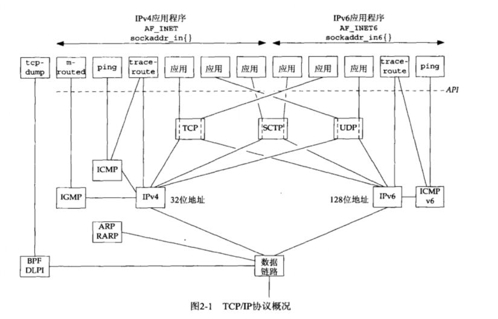
		- IPv4
		  collapsed:: true
			- 网际协议4，IPv4（通常称之为IP）自20世纪80年代早期以来一直是网际协议族的主力协议。它使用32位地址。IPv4给TCP、UDP、SCTP、ICMP和IGMP提供分组递送服务。
		- IPv6
		  collapsed:: true
			- 网际协议版本6。IPv6是在20世纪90年代中期作为IPv4的一个替代品设计的。其主要变化是使用128位风大地址以应对20世纪90年代因特网爆发性增长。IPv6给TCP、UDP、SCTP和ICMPv6提供分组递送服务
			- 当无需区别IPv4和IPv6时，我们经常把"IP"一词作为形容词使用，如IP层、IP地址等。
		- TCP
		  collapsed:: true
			- 传输控制协议。TCP时一个面向链接的协议，为用户进程提供可靠的全双工字节流。TCP套接字是一种流套接字。TCP关心确认、超时和重传之类的细节。大多数因特网应用程序使用TCP。注意，TCP既可以使用IPv4，也可以使用IPv6。
		- UDP
		  collapsed:: true
			- 用户数据包协议。UDP是一个无连接协议。UDP套接字是一种数据报套接字。UDP数据包不能保证最终到达他们的目的地。与TCP一样，UDP既可以使用IPv4，也可以使用IPv6。
		- SCTP
		  collapsed:: true
			- 流控制传输协议。SCTP是一种提供可靠全双工关联的面向链接的协议，我们使用“关联”一次来指称SCTP中的链接，因为SCTP是多宿的，从而每个关联的两端均涉及一组IP地址和一个端口号。SCTP提供消息服务，也就是维护来自应用层的记录边界。与TCP和UDP一样，SCTP即可以使用IPv4，也可以使用IPv6，而却能够在同一个关联中同时使用他们。
		- ICMP
		  collapsed:: true
			- 网际控制消息协议。ICMP处理在路由器和主机之间流通的错误和控制消息。这些消息通常由TCP/IP网络支持软件本身产生的处理，不过图中展示的ping和traceroute程序同样使用ICMP。有时我们称这个协议为ICMPv4，以便与ICMPv6相区别。
		- IGMP
		  collapsed:: true
			- 网际组管理协议。IGMP用于多播，它在IPv4中是可选的。
		- ARP
		  collapsed:: true
			- 地址解析协议。ARP把一个IPv4地址映射成一个硬件地址。ARP通常用于诸如以太网、令牌环网和FDDI等广播网络，在到点网络上并不需要。
		- RARP
		  collapsed:: true
			- 反向地址解析协议。RARP把一个硬件地址映射成一个IPv4地址。它有时用于无盘节点的引导。
		- ICMPv6
		  collapsed:: true
			- 网际控制消息协议版本6.ICMPv6综合了ICMPv4、IGMP和ARP的功能
		- BPF
		  collapsed:: true
			- BSD分组过滤器。该接口提供对于数据链路层的访问能力，通常可以在源自Berkeley的内核中找到。
		- DLPI
			- 数据链路提供者接口。该接口也提供对于数据链路层的访问能力，通常随SVR4内核提供。
		-
		-
	- 用户数据包协议（UDP）
	  collapsed:: true
		- UDP是一个简单的传输层协议，在RFC 768 [Postel 1980]中有详细说明。应用进程往一个UDP套接字写入一个消息，该消息随后被封装( encapsulating)到一个UDP数据报，该UDP数据报进而又被封装到一个IP数据报，然后发送到目的地。UDP不保证UDP数据报会到达其最终目的地，不保证各个数据报的先后顺序跨网络后保持不变，也不保证每个数据报只到达一次。
	- 传输控制协议（TCP）
	  collapsed:: true
		- 由TCP向应用进程提供的服务不同于由UDP提供的服务。首先，TCP提供客户与服务器之间的连接〈connection)。TCP客户先与某个给定服务器建立-一个连接，再跨该连接与那个服务器交换数据，然后终止这个连接。
		- 其次，TCP还提供了可靠性（reliability)。当TCP向另一端发送数据时，它要求对端返回一个确认。如果没有收到确认，TCP就自动重传数据并等待更长时间。在数次重传失败后，TCP才放弃，如此在尝试发送数据上所花的总时间-般为4～10分钟（依赖于具体实现)。
		- TCP含有用于动态估算客户和服务器之间的往返时间（round-trip time，RTT〉的算法，以便它知道等待一个确认需要多少时间。举例来说，RTT在一个局域网上大约是几毫秒，跨越一个广域网则可能是数秒钟。另外，因为RTT受网络流通各种变化因素影响，TCP还持续估算一个给定连接的RTT。
		- TCP通过给其中每个字节关联一个序列号对所发送的数据进行排序（sequencing)。举例来说，假设一个应用写2048字节到一个TCP套接字，导致TCP发送2个分节:第一个分节所含数据的序列号为1～1024，第二个分节所含数据的序列号为1025~2048。(分节是TCP传递给IP的数据单元。）如果这些分节非顺序到达，接收端TCP将先根据它们的序列号重新排序，再把结果数据传递给接收应用。如果接收端TCP接收到来自对端的重复数据（譬如说对端认为一个分节已丢失并因此重传，而这个分节并没有真正丢失，只是网络通信过于拥挤)，它可以(根据序列号)判定数据是重复的，从而丢弃重复数据。
		- 再次，TCP提供流量控制（flow control)。TCP总是告知对端在任何时刻它一次能够从对端接收多少字节的数据，这称为通告窗口( advertised window)。在任何时刻，该窗口指出接收缓冲区中当前可用的空间量，从而确保发送端发送的数据不会使接收缓冲区溢出。该窗口时刻动态变化:当接收到来自发送端的数据时，窗口大小就减小，但是当接收端应用从缓冲区中读取数据时，窗口大小就增大。通告窗口大小减小到0是有可能的:当TCP对应某个套接字的接收缓冲区已满，导致它必须等待应用从该缓冲区读取数据时，方能从对端再接收数据。
		- 最后，TCP连接是全双工的(full-duplex)。这意味着在一个给定的连接上应用可以在任何时刻在进出两个方向上既发送数据又接收数据。因此，TCP必须为每个数据流方向跟踪诸如序列号和通告窗口大小等状态信息。建立一个全双工连接后，需要的话可以把它转换成一个单工连接。
	- 流控制传输协议（SCTP）
	  collapsed:: true
		- SCTP提供的服务与UDP和TCP提供的类似。SCTP在客户和服务器之间提供关联(association)，并像TCP那样给应用提供可靠性、排序、流量控制以及全双工的数据传送。SCTP中使用“关联”一词取代“连接”是为了避免这样的内涵:一个连接只涉及两个IP地址之间的通信。一个关联指代两个系统之间的一次通信，它可能因为SCTP支持多宿而涉及不止两个地址。
		- 与TCP不同的是，SCTP是面向消息的(message-oriented)。它提供各个记录的按序递送服务。与UDP一样，由发送端写入的每条记录的长度随数据一道传递给接收端应用。
		- SCTP能够在所连接的端点之间提供多个流，每个流各自可靠地按序递送消息。--个流上某个消息的丢失不会阻塞同一关联其他流上消息的投递。这种做法与TCP正好相反，就TCP而言，在单一字节流中任何位置的字节丢失都将阻塞该连接上其后所有数据的递送，直到该丢失被修复为止。
		- SCTP还提供多宿特性，使得单个SCTP端点能够支持多个IP地址。该特性可以增强应对网络故障的健壮性。一个端点可能有多个冗余的网络连接，每个网络又可能有各自接入因特网基础设施的连接。当该端点与另一个端点建立一个关联后，如果它的某个网络或某个跨越因特网的通路发生故障，SCTP就可以通过切换到使用已与该关联相关的另一个地址来规避所发生的故障。
	- TCP链接的建立和终止
	  collapsed:: true
		- 三路握手
		  collapsed:: true
			- 建立一个TCP链接时会发生下述情景
			- 1. 服务器必须准备好接受外来的链接。这通常通过调用`socket`、`bind`和`listen`这三个函数来完成，我们称之为被动打开
			- 2. 客户通过调用`connect`发起主动打开。这导致客户`TCP`发送一个`SYN`(同步)分解，它告诉服务器客户将在(待建立的)链接中发送的数据的初始序列号。通常`SYN`分节不懈怠数据，其所在IP数据报只含有一个IP首部、一个TCP首部及可能有的TCP选项。
			  3. 服务器必须确认(ACK)客户的`SYN`，同时自己也得发送一个`SYN`分节，它含有服务器将在同一链接中发送的数据的初始序列号。服务器在单个分节中发送`SYN`和对客户`SYN`的`ACK`(确认)。
			  4. 客户必须确认服务器的`SYN`。
			  这种交换至少需要3个分组，因此称之为`TCP`的三路握手
			- 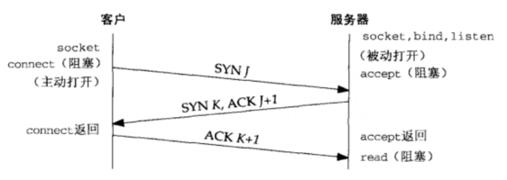
			- 客户的初始序列号为`J`，服务器的初始序列号为`K`。`ACK`中的确认是发送这个`ACK`的一端所期待的下一个序列号。因为`SYN`占据一个字节的序列号空间，所以每一个`SYN`的`ACK`中的确认号就是该`SYN`的初始序列号加1。类似地，每一个`FIN`（表示结束）的`ACK`中的确认号为该`FIN`的序列号加1.
		- TCP选项
		  collapsed:: true
			- 每一个SYN可以含有多个TCP选项。下面是常用的TCP选项。
				- MSS选项。发送SYN的TCP一端使用本选项通告对端它的最大分节大小，即MSS，也就是它在本连接的每个TCP分节中愿意接受的最大数据量。发送端TCP使用接收端的MSS值作为所发送分节的最大大小。
				- 窗口规模选项。TCP连接任何一端能够通告对端的最大窗口大小是65535，因为在TCP首部中相应的字段占16位。然而当今因特网上业已普及的高速网络连接(45 Mbit's或更快，或长延迟路径〈卫星链路)要求有更大的窗口以获得尽可能大的吞吐量。这个新选项指定TCP首部中的通告窗口必须扩大（即左移）的位数（0~14)，因此所提供的最大窗口接近1 GB (65535×21“)。在一个TCP连接上使用窗口规模的前提是它的两个端系统必须都支持这个选项。我们将在7.5节看到如何使用so_RCVBUF套接字选项影响这个TCP选项。
				- 时间戳选项。这个选项对于高速网络连接是必要的，它可以防止由失而复现的分组@可能造成的数据损坏。它是一个较新的选项，也以类似于窗口规模选项的方式协商处理。作为网络编程人员，我们无需考虑这个选项。
		- TCP链接终止
		  collapsed:: true
			- TCP建立一个连接需3个分节，终止一个连接则需4个分节。
			- (1) 某个应用进程首先调用close，我们称该端执行主动关闭( active close)。该端的TCP于是发送一个FIN分节，表示数据发送完毕。
			- (2) 接收到这个FIN的对端执行被动关闭(passive close)。这个FIN由TCP确认。它的接收也作为一个文件结束符（end-of-file）传递给接收端应用进程（放在已排队等候该应用进程接收的任何其他数据之后)，因为FIN的接收意味着接收端应用进程在相应连接上再无额外数据可接收。
			- (3) 一段时间后，接收到这个文件结束符的应用进程将调用close关闭它的套接字。这导致它的TCP也发送一个FIN。
			- (4) 接收这个最终FIN的原发送端TCP(即执行主动关闭的那一端）确认这个FIN。
			- 既然每个方向都需要一个FIN和一个ACK，因此通常需要4个分节。我们使用限定词“通常”是因为:某些情形下步骤1的FIN随数据一起发送;另外，步骤2和步骤3发送的分节都出自执行被动关闭那一端，有可能被合并成一个分节。
			- 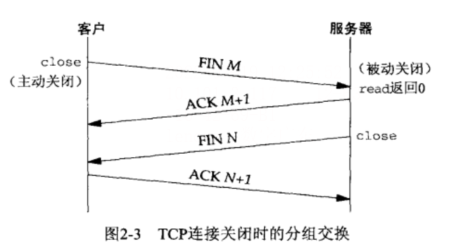
			- 类似SYN，一个FIN也占据1个字节的序列号空间。因此，每个FIN的ACK确认号就是这个FIN的序列号加1。
			- 在步骤2与步骤3之间，从执行被动关闭一端到执行主动关闭一端流动数据是可能的。这称为半关闭(half-close)，我们将在6.6节随shutdown函数再详细介绍。
			- 当套接字被关闭时，其所在端TCP各自发送了一个FIN。我们1在图中指出，这是由应用进程调用close而发生的，不过需认识到，当一个Unix进程无论自愿地（调用exit或从main函数返回）还是非自愿地（收到一个终止本进程的信号）终止时，所有打开的描述符都被关闭，这也导致仍然打开的任何TCP连接上也发出一个FIN。
			- 图2-3展示了客户执行主动关闭的情形，不过我们指出，无论是客户还是服务器，任何一端都可以执行主动关闭。通常情况是客户执行主动关闭,但是某些协议(譬如值得注意的HTTP/1.0)却由服务器执行主动关闭。
		- TCP状态转换图
		  collapsed:: true
			- TCP为-一个连接定义了11种状态，并且TCP规则规定如何基于当前状态及在该状态下所接收的分节从一个状态转换到另一个状态。举例来说，当某个应用进程在CLOSED状态下执行主动打开时，TCP将发送一个SYN，且新的状态是SYN_SENT。如果这个TCP接着接收到一个带ACK的SYN，它将发送一个ACK，且新的状态是ESTABLISHED。这个最终状态是绝大多数数据传送发生的状态。
			- 自ESTABLISHED状态引出的两个箭头处理连接的终止。如果某个应用进程在接收到一个FIN之前调用close (主动关闭)，那就转换到FIN_WAIT_1状态。但如果某个应用进程在ESTABLISHED状态期间接收到一个FIN（被动关闭)，那就转换到CLOSE_WAIT状态。
			- 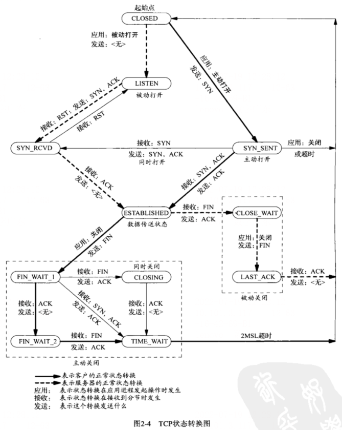
		- 观察分组
			- 完整的TCP链接所发生的实际分组交换情况，包括链接建立、数据传送和链接终止3个状态。
			- 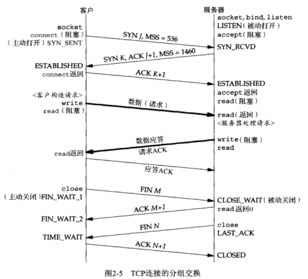
	- TIME_WAIT状态
	  collapsed:: true
		- 在图2-4中我们看到执行主动关闭的那端经历了这个状态。该端点停留在这个状态的持续时间是最长分节生命期( maximum segment lifetime，MSL)的两倍，有时候称之为2MSL。
		- 任何TCP实现都必须为MSL选择一个值。RFC 1122 [Braden 1989]的建议值是2分钟，不过源自Berkeley的实现传统上改用30秒这个值。这意味着TIME_WAIT状态的持续时间在1分钟到4分钟之间.MSL是任何P数据报能够在因特网中存活的最长时间。我们知道这个时间是有限的，因为每个数据报含有一个称为跳限〈（hop limit）的8位字段（见图A-1中IPv4的TTL字段和图A-2中IPv6的跳限字段)，它的最大值为255。尽管这是一个跳数限制而不是真正的时间限制，我们仍然假设:具有最大跳限（255）的分组在网络中存在的时间不可能超过MSL秒。
		- 分组在网络中“迷途”通常是路由异常的结果。某个路由器崩溃或某两个路由器之间的某个链路断开时，路由协议需花数秒钟到数分钟的时间才能稳定并找出另一条通路。在这段时间内有可能发生路由循环（路由器A把分组发送给路由器B，而B再把它们发送回A)，我们关心的分组可能就此陷入这样的循环。假设迷途的分组是一个TCP分节，在它迷途期间，发送端TCP超时并重传该分组，而重传的分组却通过某条候选路径到达最终目的地。然而不久后（自迷途的分组开始其旅程起最多MSL秒以内）路由循环修复，早先迷失在这个循环中的分组最终也被送到目的地。这个原来的分组称为迷途的重复分组(lost duplicate)或漫游的重复分组( wanderingduplicate)。TCP必须正确处理这些重复的分组。
		- TIME_WAIT状态有两个存在的理由：
			- 1. 可靠地实现TCP全双工链接的终止；
			  2. 允许老的重复分节在网络中消逝。
			- 第一个理由可以通过查看图2-5并假设最终的ACK丢失了来解释。服务器将重新发送它的最终那个FIN，因此客户必须维护状态信息，以允许它重新发送最终那个ACK。要是客户不维护状态信息，它将响应以一个RST(另外一种类型的TCP分节)，该分节将被服务器解释成--个错误。如果TCP打算执行所有必要的工作以彻底终止某个连接上两个方向的数据流（即全双工关闭)，那么它必须正确处理连接终止序列4个分节中任何一个分节丢失的情况。本例子也说明了为什么执行主动关闭的那一端是处于TIME_WAIT状态的那一端:因为可能不得不重传最终那个ACK的就是那一端。
			- 为理解存在TIME_WAIT状态的第二个理由，我们假设在12.106.32.254的1500端口和206.168.112.219的21端口之间有一个TCP连接。我们关闭这个连接，过一段时间后在相同的IP地址和端口之间建立另一个连接。后一个连接称为前一个连接的化身(incarnation)，因为它们的IP地址和端口号都相同。TCP必须防止来自某个连接的老的重复分组在该连接已终止后再现，从而被误解成属于同一连接的某个新的化身。为做到这一点，TCP将不给处于TIME_WAIT状态的连接发起新的化身。既然TIME_WAIT状态的持续时间是MSL的2倍，这就足以让某个方向上的分组最多存活MSL秒即被丢弃，另一个方向上的应答最多存活MSL秒也被丢弃。通过实施这个规则，我们就能保证每成功建立一个TCP连接时，来自该连接先前化身的老的重复分组都已在网络中消逝了。
	- SCTP关联的建立和终止
	  collapsed:: true
		- 与TCP一样，SCTP也是面向连接的，因而也有关联的建立与终止的握手过程。不过SCTP的握手过程不同于TCP，我们在此加以说明。
		-
		- 四路握手
		  collapsed:: true
			- 建立一个SCTP关联的时候会发生下述情形（类似于TCP)。
			- (1)服务器必须准备好接受外来的关联。这通常通过调用socket、bind和listen这3个函数来完成，称为被动打开。
			- (2)客户通过调用connect或者发送一个隐式打开该关联的消息进行主动打开。这使得客户SCTP发送一个INIT消息（初始化)，该消息告诉服务器客户的IP地址清单、初始序列号、用于标识本关联中所有分组的起始标记、客户请求的外出流的数目以及客户能够支持的外来流的数目。
			- (3)服务器以一个INIT ACK消息确认客户的INIT消息，其中含有服务器的IP地址清单、初始序列号、起始标记、服务器请求的外出流的数目、服务器能够支持的外来流的数目以及一个状态cookie。状态cookie包含服务器用于确信本关联有效所需的所有状态，它是数字化签名过的，以确保其有效性。
			- (4)客户以一-个COOKIE ECHO消息回射服务器的状态cookie。除COOKIE ECHO外，该消息可能在同一个分组中还捆绑了用户数据。
			- (5)服务器以一个COOKIEACK消息确认客户回射的cookie是正确的，本关联于是建立。该消息也可能在同一个分组中还捆绑了用户数据。
			- 以上交换过程至少需要4个分组，因此称之为SCTP的四路握手〈four-way handshake)。
			- 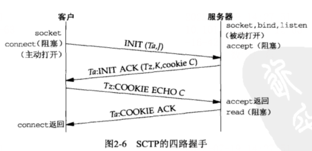
			- SCTP的四路握手在很多方面类似于TCP的三路握手，差别主要在于作为SCTP整体一部分的cookie的生成。INITT（随其众多参数一道）承载一个验证标记Ta和一个初始序列号J。在关联的有效期内，验证标记Ta必须在对端发送的每个分组中出现。初始序列号J用作承载用户数据的
			- DATA块的起始序列号。对端也在INIT ACK中承载一个验证标记Tz，在关联的有效期内，验证标记Tz也必须在其发送的每个分组中出现。除了验证标记Tz和初始序列号K外，INIT的接收端还在作为响应的INIT ACK中提供一个cookieC。该cookie包含设置本SCTP关联所需的所有状态，这样服务器的SCTP栈就不必保存所关联客户的有关信息。SCTP关联设置的细节参见[Stewartand Xie 2001]的第4章。
			- 四路握手过程结束时，两端各自选择一个主目的地址(primary destination address)。当不存在网络故障时，主目的地址将用作数据要发送到的默认目的地。
			- 在SCTP中使用四路握手是为了避免一种将在4.5节讨论的拒绝服务攻击。
		- 关联终止
		  collapsed:: true
			- SCTP不像TCP那样允许“半关闭”的关联。当一端关闭某个关联时，另--端必须停止发送新的数据。关联关闭请求的接收端发送完已经排队的数据（如果有的话）后，完成关联的关闭。图2-7展示了这一交换过程。
			- 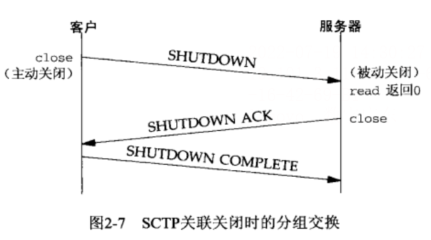
			- SCTP没有类似于TCP的TIME_WAIT状态，因为SCTP使用了验证标记。所有后续块都在捆绑它们的SCTP分组的公共首部标记了初始的INIT块和NIT ACK块中作为起始标记交换的验证标记;由来自旧连接的块通过所在SCTP分组的公共首部间接携带的验证标记对于新连接来说是不正确的。因此，SCTP通过放置验证标记值就避免了TCP在TIME_WAIT状态保持整个连接的做法。
		- SCTP状态转换图
		  collapsed:: true
			- 本状态机中从一个状态到另一个状态的转换由SCTP规则基于当前状态及在该状态下所接收的块规定。举例来说，当某个应用进程在CLOSED状态下执行主动打开时,SCTP将发送一个INIT，且新的状态是COOKIE-WAIT。如果这个SCTP接着接收到一个INTT ACK，它将发送一个COOKIE ECHO，且新的状态是COOKIE-ECHOED。如果该SCTP随后接收到一个COOKIE ACK，它将转换成ESTABLISHED状态。这个最终状态是绝大多数数据传送发生点的状态，尽管DATA块也可以由COOKIE ECHO块或COOKIE ACK块所在消息捆绑捎带。
			- 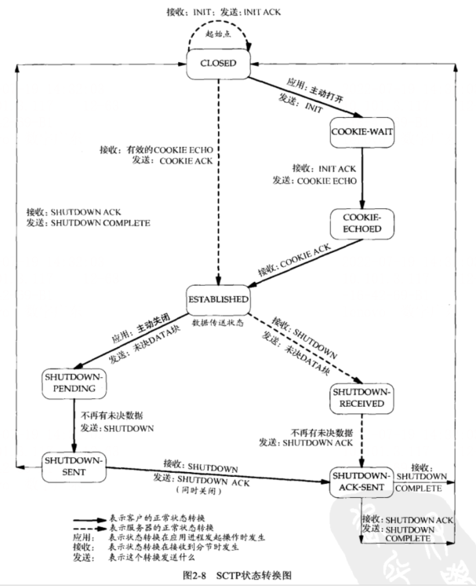
			- 从ESTABLISHED状态引出的两个箭头处理关联的终止。如果某个应用进程在接收到一个SHUTDOWN之前调用close (主动关闭)，那就转换到SHUTDOWN-PENDING状态。否则，如果某个应用进程在ESTABLISHED状态期间接收到一个SHUTDOWN（被动关闭)，那就转换到sHUTDOWN-RECEIVED状态。
			-
		- 观察分组
		  collapsed:: true
			- 图2-9展示一个作为样例的SCTP关联所发生的实际分组交换情况，包括关联建立、数据传送和关联终止3个阶段。图中还展示了每个端点所历经的SCTP状态。
			- 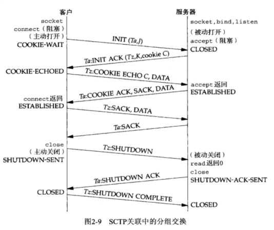
			- 本例中，客户在COOKIE ECHO块所在分组中捎带了它的第一个DATA块，服务器则在作为应答的COOKIE ACK块所在分组中捎带了数据。一般而言，当网络应用采用一到多接口式样时(我们将在9.2节中讨论一到一和一到多这两种接口式样)，COOKIE ECHO通常捎带一个或多个DATA块。
			- SCTP分组中信息的单位称为块(chunk)。块是自描述的，包含一个块类型、若于个块标记和一个块长度。这样做方便了多个块的绑缚，只要把它们简单地组合到一个SCTP外出消息中
			-
		- SCTP选项
			- SCTP使用参数和块方便增设可选特性。新的特性通过添加这两个条目之一加以定义，并允许通常的SCTP处理规则汇报未知的参数和未知的块。参数类型字段和块类型字段的高两位指明SCTP接收端该如何处置未知的参数或未知的块
			- 当前如下两个对SCTP的扩展正在开发中。
				- (1)动态地址扩展，允许协作的SCTP端点从已有的某个关联中动态增删P地址。
				- (2)不完全可靠性扩展，允许协作的SCTP端点在应用进程的指导下限制数据的重传。当一个消息变得过于陈旧而无须发送时(按照应用进程的指导),该消息将被跳过而不再发送到对端。这意味着不是所有数据都确保到达关联的另一端。
	- 端口号
	  collapsed:: true
		- 任何时候，多个进程可能同时使用TCP、UDP和SCTP这3种传输层协议中的任何一种。这3种协议都使用16位整数的端口号( port number）来区分这些进程。
		- 当一个客户想要跟一个服务器联系时，它必须标识想要与之通信的这个服务器。TCP、UDP和SCTP定义了一组众所周知的端口( well-known port)，用于标识众所周知的服务。举例来说，支持FTP的任何TCP/P实现都把21这个众所周知的端口分配给FTP服务器。分配给简化文件传送协议(Trivial File Trqnsfer Protocol，TFTP)的是UDP端口号69。
		- 另一方面，客户通常使用短期存活的临时端口( ephemeral port)。这些端口号通常由传输层协议自动赋予客户。客户通常不关心其临时端口的具体值，而只需确信该端口在所在主机中是唯一的就行。传输协议的代码确保这种唯一性。
		- IANA (the Internet Assigned Numbers Authority，因特网已分配数值权威机构）维护着一个端口号分配状况的清单。端口号被划分成以下3段。
			- (1)众所周知的端口为0~1023。这些端口由IANA分配和控制。可能的话，相同端口号就分配给TCP、UDP和SCTP的同一给定服务。例如，不论TCP还是UDP端口号80都被赋予Web服务器，尽管它目前的所有实现都单纯使用TCP。
			- (2)已登记的端口（registered port）为1024～~49151。这些端口不受IANA控制，不过由IANA登记并提供它们的使用情况清单，以方便整个群体。可能的话，相同端口号也分配给TCP和UDP的同一给定服务。例如，6000~6063分配给这两种协议的X Window服务器，尽管它的所有实现当前单纯使用TCP。49151这个上限的引入是为了给临时端口留出范围，而RFC1700 [Reynoldsand Postel 1994]所列的上限为65535。
			- (3) 49152~65535是动态的(dynamic）或私用的( private）端口。IANA不管这些端口。它们就是我们所称的临时端口。(49152这个魔数是65536的四分之三。)
			- 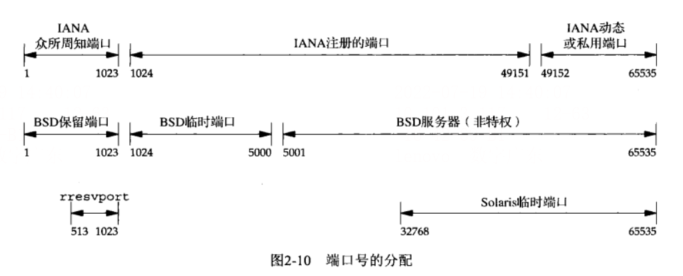
			-
		-
	- 缓冲区大小及限制
	  collapsed:: true
		- IPv4数据报的最大大小是65535字节，包括IPv4首部。这是因为如图A-1所示其总长度字段占据16位。
		- IPv6数据报的最大大小是6557S字节，包括40字节的IPv6首部。这是因为如图A-2所示其净荷长度字段占据16位。注意，IPv6的净荷长度字段不包括IPv6首部，而IPv4的总长度字段包括IPv4首部。
		  IPv6有一个特大净荷（jumbo payload)选项，它把净荷长度字段扩展到32位，不过这个选项需要MTU( maximum transmission unit，最大传输单元)超过65535的数据链路提供支持。(这是为主机到主机的内部连接而设计的，譬如HIPPI，它们通常没有内在的MTU。)
		- 许多网络有一个可由硬件规定的MTU。举例来说，以太网的MTU是1500字节。另有一些链路（例如使用PPP协议的点到点链路）其MTU可以人为配置。较老的SLIP链路通常使用1006字节或296字节的MTU。
		  IPv4要求的最小链路MTU是68字节。这允许最大的IPv4首部(包括20字节的固定长度部分和最多40字节的选项部分）拼接最小的片段（IPv4首部中片段偏移字段以8个字节为单位)。IPv6要求的最小链路MTU为1280字节。IPv6可以运行在MTU小于此最小值的链路上，不过需要特定于链路的分片和重组功能，以使得这些链路看起来具有至少为1280字节的MTU (RFC 2460 [ Deering and Hinden 1998])。
		- 在两个主机之间的路径中最小的MTU称为路径MTU(path MTU)。1500字节的以太网MTU是当今常见的路径MTU。两个主机之间相反的两个方向上路径MTU可以不一致，因为在因特网中路由选择往往是不对称的[Paxson 1196]，也就是说从A到B的路径与从B到A的路径可以不相同。
		- 当一个IP数据报将从某个接口送出时，如果它的大小超过相应链路的MTU，IPv4和IPv6都将执行分片( fragmentation)。这些片段在到达最终目的地之前通常不会被重组(reassembling)。IPv4主机对其产生的数据报执行分片，IPv4路由器则对其转发的数据报执行分片。然而IPv6只有主机对其产生的数据报执行分片，IPv6路由器不对其转发的数据报执行分片。
		- IPv4首部（图A-1)）的“不分片(don't fragment)”位（即DF位）若被设置，那么不管是发送这些数据报的主机还是转发它们的路由器，都不允许对它们分片。当路由器接收到一个超过其外出链路MTU大小且设置了DF位的IPv4数据报时，它将产生一个ICMPv4“destination unreachable, fragmentation needed but DF bit set”(目的地不可达，需分片但DF位已设置）出错消息(图A-15>。
		  既然IPv6路由器不执行分片，每个IPv6数据报于是隐含一个DF位。当IPv6路由器接收到-一-个超过其外出链路MTU大小的IPv6数据报时，它将产生一个ICMPv6“packet too big”(分组太大）出错消息（图A-16)。
		  IPv4的DF位和IPv6的隐含DF位可用于路径MTU发现（IPv4的情形见RFC 1191 [Moguland Deering 1990]，IPv6的情形见RFC 1981[McCann, Deering, and Mogul 1996])。举例来说，如果基于IPv4的TCP使用该技术，那么它将在所发送的所有数据报中设置DF位。如果某个中间路由器返回一个ICMP“destination unreachable,fragmentation needed but DFbit set”错误，TCP就减小每个数据报的数据量并重传。路径MTU发现对于IPv4是可选的,然而IPv6的所有实现要么必须支持它，要么必须总是使用最小的MTU发送IPv6数据报。
		- IPv4和IPv6都定义了最小重组缓冲区大小(minimum reassembly buffer size)，它是IPv4或IPv6的任何实现都必须保证支持的最小数据报大小。其值对于IPv4为576字节，对于IPv6为1500字节。例如，就IPv4而言，我们不能判定某个给定目的地能否接受577字节的数据报。为此有许多使用UDP的IPv4网络应用(如DNS、RIP、TFTP、BOOTP、SNMP)避免产生大于这个大小的数据报。
		- TCP有一个MSS (maximum segment size，最大分节大小)，用于向对端TCP通告对端在每个分节中能发送的最大TCP数据量。在图2-5中我们看到过SYN分节上的MSS选项。MSS的目的是告诉对端其重组缓冲区大小的实际值，从而试图避免分片。MSS经常设置成MTU减去P和TCP首部的固定长度。在以太网中使用IPv4的MSS值为1460，使用IPv6的MSS值为1440(两者的TCP首部都是20个字节，但IPv4首部是20字节，IPv6首部却是40字节)。在TCP的MSS选项中，MSS值是一个16位的字段，限定其最大值为65 535。这对于IPv4是适合的，因为IPv4数据报中的最大TCP数据量为65495(65 535减去IPv4首部的20字节和TCP首部的20字节)。然而对于具有特大净荷选项的IPv6，却需要使用另外一种技巧(RFC 2675[Borman, Deering, and Hinden 1999])。首先，没有特大净荷选项的IPv6数据报中的最大TCP数据量为65 515(65 535减去TCP首部的20字节)。65 535这个MSS值于是被视为表示“无限”的一个特殊值。该值只在用到特大净荷选项时才使用，不过这种情况却要求实际的MTU超过65535。其次，如果TCP使用特大净荷选项，并且接收到的对端通告的MSS为65535，那么它所发送数据报的大小限制就是接口MTU。如果这个值太大（也就是说所在路径中某个链路的MTU比较小)，那么路径MTU发现功能将确定这个较小值。
		- sCTP基于到对端所有地址发现的最小路径MTU保持一个分片点。这个最小MTU大小用于把较大的用户消息分割成较小的能够以单个IP数据报发送的若干片段。sCTP_MAXSEG套接字选项可以影响该值，使得用户能够请求一个更小的分片点。
- 套接字编程简介
  collapsed:: true
	- IPv4套接字地址结构
	  collapsed:: true
		- IPv4套接字地址结构通常也称为“网际套接字地址结构”，它以sockaddr_in命名，定义在<netinet/in.h>头文件中。图3-1给出了它的POSLX定义。
		- 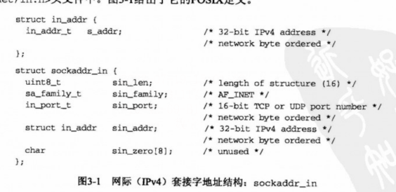
		- 结构说明：
			- 长度字段sin_len是为增加对OSI协议的支持而随4.3BSD-Reno添加的(见图1-15)。在此之前，第一个成员是sin_family，它是一个无符号短整数（unsigned short)。并不是所有的厂家都支持套接字地址结构的长度字段，而且POSIX规范也不要求有这个成员。该成员的数据类型uint8_t是典型的，符合POSIX的系统都提供这种形式的数据类型(见图3-2)。
			  正是因为有了长度字段，才简化了长度可变套接字地址结构的处理。
			- POSIX规范只需要这个结构中的3个字段: sin_family、sin_addr和sin_port。对于符合POSIX的实现来说，定义额外的结构字段是可以接受的，这对于网际套接字地址结构来说也是正常的。几乎所有的实现都增加了sin_zero字段，所以所有的套接字地址结构大小都至少是16字节。
			- 我们给出了字段s_addr、sin_family和sin_port的POSIX数据类型。in_addr_t数据类型必须是一个至少32位的无符号整数类型，in_port_t必须是一个至少16位的无符号整数类型，而sa_family_t可以是任何无符号整数类型。在支持长度字段的实现中，sa_family_t通常是一个8位的无符号整数，而在不支持长度字段的实现中，它则是一个16位的无符号整数。
			- IPv4地址和TCP或UDP端口号在套接字地址结构中总是以网络字节序来存储。在使用这些字段时，我们必须牢记这-一-点。我们将在3.4节中详细说明主机字节序与网络字节序的区别。
			- 32位IPv4地址存在两种不同的访问方法。举例来说，如果serv定义为某个网际套接字地址结构，那么serv.sin_addr将按in_addr结构引用其中的32位IPv4地址，而serv.sin_addr.s_addr将按in_addr_t（通常是一个无符号的32位整数）引用同-一个32位IPv4地址。因此，我们必须正确地使用Pv4地址，尤其是在将它作为函数的参数时，因为编译器对传递结构和传递整数的处理是完全不同的。
			- sin_zero字段未曾使用，不过在填写这种套接字地址结构时，我们总是把该字段置为0。按照惯例，我们总是在填写前把整个结构置为0，而不是单单把sin_zero字段置为0。
			- 套接字地址结构仅在给定主机上使用:虽然结构中的某些字段（例如IP地址和端口号)用在不同主机之间的通信中，但是结构本身并不在主机之间传递。
	- 通用套接字地址结构
	  collapsed:: true
		- 当作为一个参数传递进任何套接字函数时，套接字地址结构总是以引用形式（也就是以指向该结构的指针）来传递。然而以这样的指针作为参数之--的任何套接字函数必须处理来自所支持的任何协议族的套接字地址结构。
		- 在如何声明所传递指针的数据类型上存在一个问题。有了ANSI C后解决办法很简单:void*是通用的指针类型。然而套接字函数是在ANSI C之前定义的，在1982年采取的办法是在<sys/socket .h>头文件中定义一个通用的套接字地址结构，如图3-3所示。
		- 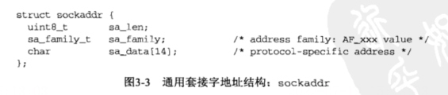
		- 套接字函数被定义为以某个通用套接字地址结构的一个制帧作为其参数之一：
		- 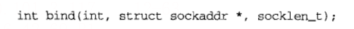
		- 这就要求对这些函数的任何调用都必须要将指向特定于协议的套接字地址结构的制帧进行类型强制转换，编程指向某个通用套接字地址结构的指针，例如：
		- 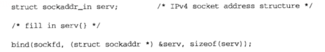
		- 如果我们省略了其中的类型强制转换部分“(struct sockaddr *)”，并假设系统的头文件中有bind函数的一个ANSIC原型，那么C编译器就会产生这样的警告信息:“warning: passingarg 2 of "bind' from incompatible pointer type.”(警告:把不兼容的指针类型传递给‘bind’函数的第二个参数。)
		- 从应用程序开发人员的观点看，这些通用套接字地址结构的唯一用途就是对指向特定于协议的套接字地址结构的指针执行类型强制转换。
	- IPv6套接字地址结构
	  collapsed:: true
		- IPv6套接字地址结构在<netinet/in.h>头文件中定义：
		- 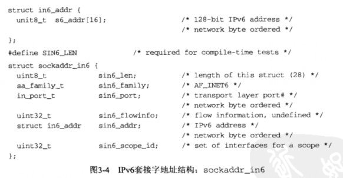
		- 注意点：
			- 如果系统支持套接字地址结构中的长度字段，那么SIN6_LEN常值必须定义。IPv6的地址族是AF_INET6，而IPv4的地址族是AF_INET。
			- 结构中字段的先后顺序做过编排，使得如果sockaddr_in6结构本身是64位对齐的，那么128位的sin6_addr字段也是64位对齐的。在一些64位处理机上，如果64位数据存储在某个64位边界位置，那么对它的访问将得到优化处理。
			- sin6_flowinfo字段分成两个字段:
				- 低序20位是流标( flow label>;高序12位保留。
				- 流标字段随图A-2讲解。它的使用仍然是一个研究课题。
			- 对于具备范围的地址(scoped address)，sin6_scope_id字段标识其范围(scope)，最常见的是链路局部地址（link-local address）的接口索引。
		-
	- 新的通用套接字地址结构
	  collapsed:: true
		- 作为IPv6套接字API的一部分而定义的新的通用套接字地址结构克服了现有structsockaddr的一些缺点。不像struct sockaddr，新的struct sockaddr_storage足以容纳系统所支持的任何套接字地址结构。sockaddr_storage结构在<netinet/in.h>头文件中定义，如图3-5所示。
		- 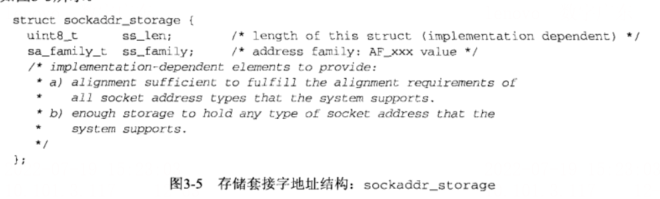
		- sockaddr_storage类型提供的通用套接字地址结构相比sockaddr存在以下两点差别。
			- (1)如果系统支持的任何套接字地址结构有对齐需要，那么sockaddr_storage能够满足最苛刻的对齐要求。
			- (2) sockaddr_storage足够大，能够容纳系统支持的任何套接字地址结构。
			- 注意，除了ss_family和ss_len外（如果有的话)，sockaddr_storage结构中的其他字段对用户来说是透明的。sockaddr_storage结构必须类型强制转换成或复制到适合于ss_family字段所给出地址类型的套接字地址结构中，才能访问其他字段。
	- 字节排序函数
	  collapsed:: true
		- 考虑一个16位整数，它由2个字节组成。内存中存储这两个字节有两种方法:一种是将低序字节存储在起始地址，这称为小端(littlce-endian）字节序;另一种方法是将高序字节存储在起始地址，这称为大端(big-endian）字节序。
		- 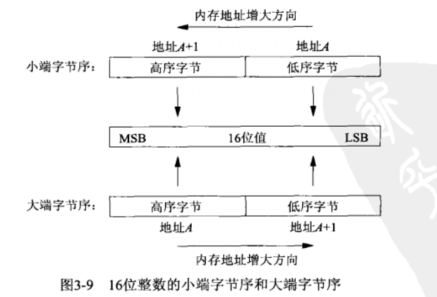
		- 网络字节序转换函数：
			- 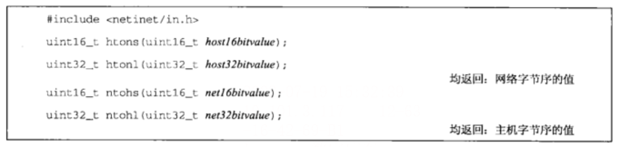
			- 在这些函数的名字中，h代表host，n代表network，s代表short，l代表long。short和long这两个称谓是出自4.2BSD的Digital VAX实现的历史产物。如今我们应该把s视为一个16位的值(例如TCP或UDP端口号)，把1视为一个32位的值（例如IPv4地址)。事实上即使在64位的DigitalAlpha中，尽管长整数占8用64位，htonl和ntohl函数操作的仍然是32位的值。
	- 字节操纵函数
	  collapsed:: true
		- 操纵多字节字段的函数有两组，它们既不对数据作解释，也不假设数据是以空字符结束的C字符串。当处理套接字地址结构时，我们需要这些类型的函数，因为我们需要操纵诸如IP地址这样的字段，这些字段可能包含值为0的字节，却并不是C字符串。以空字符结尾的C字符串是由在<string.h>头文件中定义、名字以str（表示字符串）开头的函数处理的。
		- 名字以b(表示字节）开头的第一组函数起源于4.2BSD，几乎所有现今支持套接字函数的系统仍然提供它们。名字以mem（表示内存）开头的第二组函数起源于ANSIC标准，支持ANSIC函数库的所有系统都提供它们。
		- 我们首先给出源自Berkeley的函数，本书中我们只使用其中一个——bzero。(我们使用它是因为它只有2个参数，比起3个参数的memset函数来要容易记些，这在前边已解释过。）其他两个函数bcopy和bcmp你也许会在现有的应用程序中见到。
		- 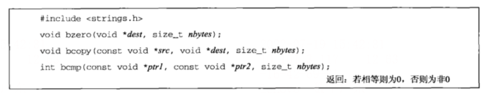
		- bzero把目标字节串中指定数目的字节置为0。我们经常使用该函数来把一个套接字地址结构初始化为0。bcopy将指定数目的字节从源字节串移到目标字节串。bcmp比较两个任意的字节串，若相同则返回值为0，否则返回值为非0。
		- ANSIC C函数：
		- 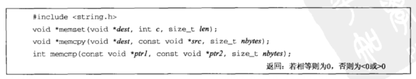
		- memset把目标字节串指定数目的字节置为值c。memcpy类似bcopy，不过两个指针参数的顺序是相反的。当源字节串与目标字节串重叠时，bcopy能够正确处理，但是memcpy的操作结果却不可知。这种情形下必须改用ANSI C的memmove函数。
		- memcmp比较两个任意的字节串，若相同则返回o，否则返回一个非0值，是大于0还是小于0则取决于第一个不等的字节:如果ptrl所指字节串中的这个字节大于ptr2所指字节中的对应字节，那么大于0，否则小于0。我们的比较操作是在假设两个不等的字节均为无符号字符(unsigned char）的前提下完成的。
		-
	- `inet_aton`、`inet_addr` 和 `inet_ntoa` 函数
	  collapsed:: true
		- 两组地址转换函数。它们在ASCII字符串（这是人们偏爱使用的格式）与网络字节序的二进制值（这是存放在套接字地址结构中的值）之间转换网际地址。
		  collapsed:: true
			- (1) inet_aton、inet_addr和inet_ntoa在点分十进制数串（例如“206.168.112.96”)与它长度为32位的网络字节序二进制值间转换IPv4地址。你可能会在许多现有代码中见到这些函数。
			- (2)两个较新的函数inet_pton和inet_ntop对于IPv4地址和IPv6地址都适用。我们将在下一节中讲解它们并在全书中使用它们。
			- 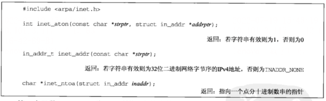
			- 第一个函数inet_aton将strptr所指C字符串转换成一个32位的网络字节序二进制值，并通过指针addrptr来存储。若成功则返回1，否则返回0。
			- inet_addr进行相同的转换，返回值为32位的网络字节序二进制值。该函数存在一个问题:所有23个可能的二进制值都是有效的IP地址（从0.0.0.0到255.255.255.255)，但是当出错时该函数返回INADDR_NONE常值（通常是一个32位均为1的值)。这意味着点分十进制数串255.255.255.255(这是IPv4的有限广播地址，见20.2节）不能由该函数处理，因为它的二进制值被用来指示该函数失败。
			- 如今inet_addr已被废弃，新的代码应该改用inet_aton函数。更好的办法是使用下一节中介绍的新函数，它们对于IPv4地址和IPv6地址都适用。
			- inet_ntoa函数将一个32位的网络字节序二进制IPv4地址转换成相应的点分十进制数串。由该函数的返回值所指向的字符串驻留在静态内存中。这意味着该函数是不可重入的，这个概念我们将在11.18节中讨论。最后需要留意，该函数以一个结构而不是以指向该结构的一个指针作为其参数。
			-
	- `inet_pton` 和 `inet_ntop` 函数
	  collapsed:: true
		- 这两个函数是随IPv6出现的新函数，对于IPv4地址和IPv6地址都适用。函数名中p和n分别代表表达( presentation）和数值〈numeric)。地址的表达格式通常是ASCII字符串，数值格式则是存放到套接字地址结构中的二进制值。
		- 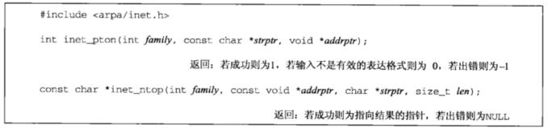
		- 这两个函数的family参数既可以是AF_INET，也可以是AF_INET6。如果以不被支持的地址族作为family参数，这两个函数就都返回一个错误，并将errno置为EAFNOSUPPORT。
		- 第一个函数尝试转换由strptr指针所指的字符串，并通过addrptr指针存放二进制结果。若成功则返回值为1，否则如果对所指定的family而言输入的字符串不是有效的表达格式，那么返回值为0。
		- inet_ntop进行相反的转换，从数值格式(addrptr）转换到表达格式(strptr)。len参数是目标存储单元的大小，以免该函数溢出其调用者的缓冲区。为有助于指定这个大小，在<netinet/in.h>头文件中有如下定义:
		- 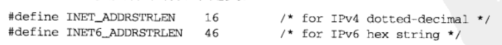
		- 如果len太小，不足以容纳表达格式结果（包括结尾的空字符)，那么返回-一个空指针，并置errno为ENOSPC。
		- inet_ntop函数的strptr参数不可以是一个空指针。调用者必须为目标存储单元分配内存并指定其大小。调用成功时，这个指针就是该函数的返回值。
		-
	- 总结函数：
	  collapsed:: true
		- 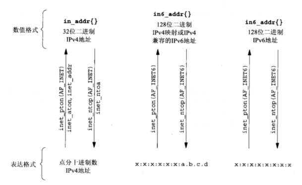
		-
	- `sock_ntop` 和相关函数
	  collapsed:: true
		- inet_ntop的一个基本问题是:它要求调用者传递一个指向某个二进制地址的指针，而该地址通常包含在一个套接字地址结构中，这就要求调用者必须知道这个结构的格式和地址族。这就是说，为了使用这个函数，我们必须为IPv4编写如下代码:
		- 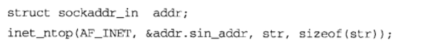
		- 或为IPv6编写如下代码
		- 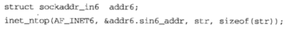
		- 为了解决这个问题，我们将自行编写一个名为sock_ntop的函数，它以指向某个套接字地址结构的指针为参数，查看该结构的内部，然后调用适当的函数返回该地址的表达格式。
		- 
		- sockaddr指向一个长度为addrlen的套接字地址结构。本函数用它自己的静态缓冲区来保存结果，而指向该缓冲区的一个指针就是它的返回值。
		- 表达格式就是在一个IPv4地址的点分十进制数串格式之后，或者在-一个括以方括号的IPv6地址的十六进制数串格式之后，跟一个终止符（我们使用一个分号，类似于URL语法)，再跟一个十进制的端口号，最后跟一个空字符。因此，缓冲区大小对于IPv4至少为INET_ADDRSTRLEN加上6个字节(16+6=22)，对于IPv6至少为INET6_ADDRSTRLEN加上8个字节(46+8=54)。
		- 我们还为操作套接字地址结构定义了其他几个函数，它们将简化我们的代码在IPv4与IPv6之间的移植。
		- 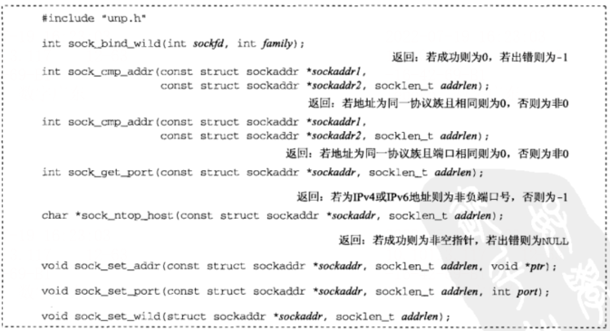
		- sock_bind_wild将通配地址和一个临时端口捆绑到一个套接字。sock_amp_addr比较两个套接字地址结构的地址部分; sock_cmp_port则比较两个套接字地址结构的端口号部分。
		  sock_get_port只返回端口号。sock_ntop_host把一个套接字地址结构中的主机部分转换成表达格式（不包括端口号)。sock_set_addr把一个套接字地址结构中的地址部分置为ptr指针所指的值; sock_set_port则只设置一个套接字地址结构的端口号部分。sock_set_wila把一个套接字地址结构中的地址部分置为通配地址。
	- `readn` 、`writen` 和 `readline` 函数
	  collapsed:: true
		- 字节流套接字（例如TCP套接字）上的read和write函数所表现的行为不同于通常的文件IO。字节流套接字上调用read或write输入或输出的字节数可能比请求的数量少，然而这不是出错的状态。这个现象的原因在于内核中用于套接字的缓冲区可能已达到了极限。此时所需的是调用者再次调用read或write函数，以输入或输出剩余的字节。有些版本的Unix在往一个管道中写多于4096字节的数据时也会表现出这样的行为。这个现象在read--个字节流套接字时很常见，但是在write一个字节流套接字时只能在该套接字为非阻塞的前提下才出现。尽管如此，为预防万一，不让实现返回一个不足的字节计数值，我们总是改为调用writen函数来取代write函数。
		- 我们提供的以下3个函数是每当我们读或写一个字节流套接字时总要使用的函数。
		- 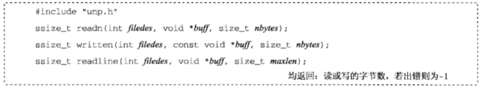
		- #### readn:
		- 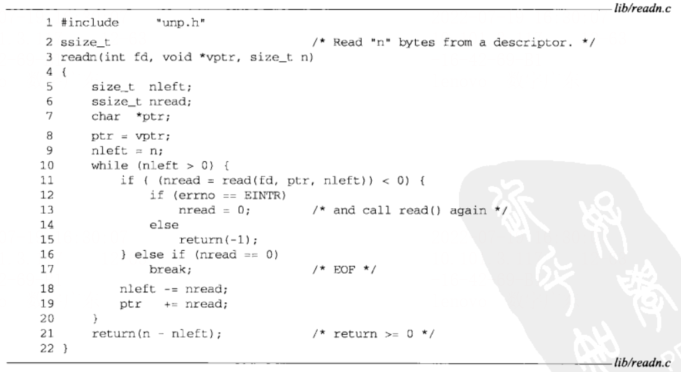{:height 380, :width 681}
		- #### writen:
		- 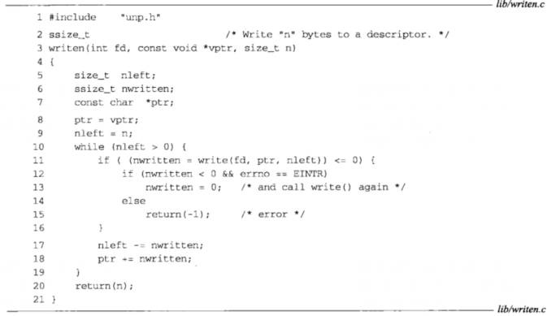'
		- #### readline:
		- 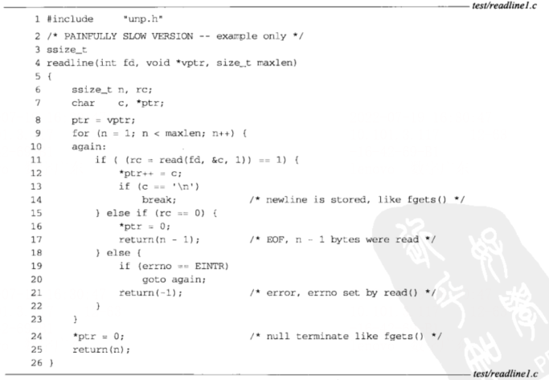
		- #### 较快版本readline：
		- 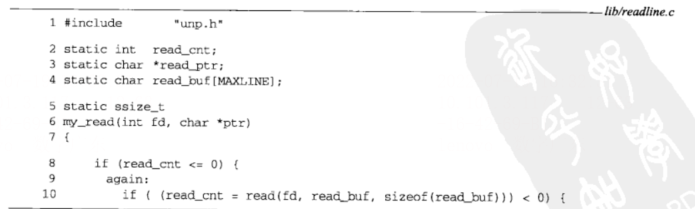
		  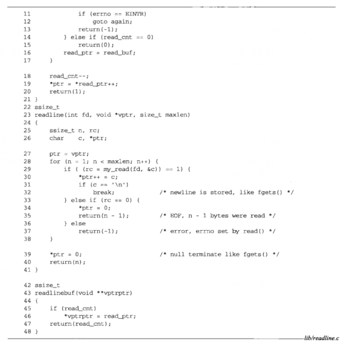
		- 2~21    内部函数my_read每次最多读MAXLINE个字符，然后每次返回一个字符。29readline函数本身的唯一变化是用my_read调用取代read。
		- 42~48   readlinebuf 这个新函数能够展露内部缓冲区的状态，便于调用者查看在当前文本行之后是否收到了新的数据。
- 基本TCP套接字编程
  collapsed:: true
	- `socket` 函数
	  collapsed:: true
		- 为了执行网络`I/O`，一个进程必须做的第一件事情就是调用`socket`函数，指定期望的通信协议类型（使用IPv4的TCP、使用IPv6的UDP、Unix域字节流协议等）
		- ```c
		  #include <sys/socket.h>
		  int socket(int family, int type, int protocol);
		  // 返回：若成功则为非负描述符，若出错则为 -1
		  ```
		- 其中family参数指明协议族，它是图4-2中所示的某个常值。该参数也往往被称为协议域。type参数指明套接字类型，它是图4-3中所示的某个常值。protocol参数应设为图4-4所示的某个协议类型常值，或者设为0，以选择所给定family和type组合的系统默认值。
		- 并非所有套接字family与type的组合都是有效的,图4-5给出了一些有效的组合和对应的真正协议。其中标为“是”的项也是有效的，但还没有找到便捷的缩略词。而空白项则是无效组合。
		- 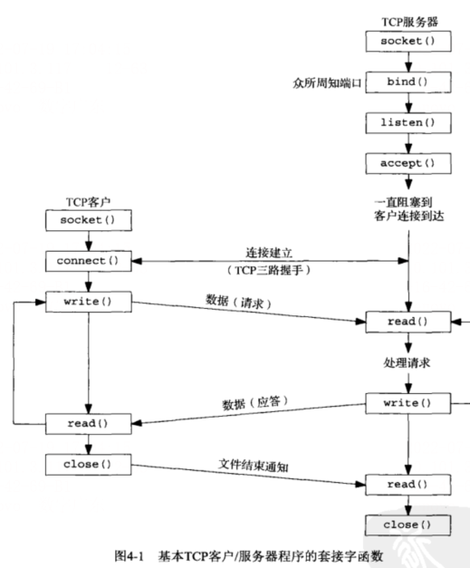
		- 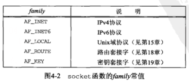
		- 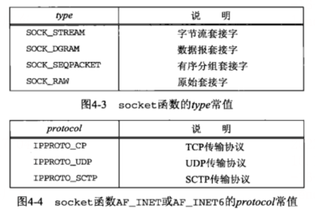
		- 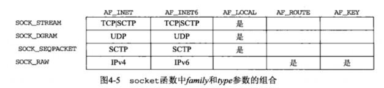
		- socket函数在成功时返回一个小的非负整数值，它与文件描述符类似，我们把它称为套接字描述符（socket descriptor)，简称sockfd。为了得到这个套接字描述符，我们只是指定了协议族（IPv4、IPv6或Unix）和套接字类型（字节流、数据报或原始套接字)。我们并没有指定本地协议地址或远程协议地址。
	- `connect` 函数
	  collapsed:: true
		- TCP客户用`connect`函数来建立与TCP服务器的链接。
		- ```c
		  #include <sys/socket.h>
		  int connect(int sockfd, const struct sockaddr *servaddr, socklen_t addrlen);
		  // 返回：若成功则为0， 若出错则为 -1 
		  ```
		- sockfd是由socket函数返回的套接字描述符，第二个、第三个参数分别是一个指向套接字地址结构的指针和该结构的大小，如3.3节所述。套接字地址结构必须含有服务器的IP地址和端口号。
		- 客户在调用函数connect前不必非得调用bind函数，因为如果需要的话，内核会确定源IP地址，并选择一个临时端口作为源端口。
		- 如果是TCP套接字，调用connect函数将激发TCP的三路握手过程，而且仅在连接建立成功或出错时才返回，其中出错返回可能有以下几种情况。
			- (1)若TCP客户没有收到SYN分节的响应，则返回ETIMEDOUT错误。举例来说，调用connect函数时，4.4BSD内核发送一个SYN，若无响应则等待6s后再发送一个，若仍无响应则等待24s后再发送一个。若总共等了75s后仍未收到响应则返回本错误。
			- (2)若对客户的SYN的响应是RST（表示复位)，则表明该服务器主机在我们指定的端口上没有进程在等待与之连接（例如服务器进程也许没在运行)。这是一种硬错误（hard error)，客户一接收到RST就马上返回ECONNREFUSED错误。
			- RST是TCP在发生错误时发送的一种TCP分节。产生RST的三个条件是:目的地为某端口的SYN到达，然而该端口上没有正在监听的服务器（如前所述);TCP想取消一个已有连接:TCP接收到一个根本不存在的连接上的分节。
			- (3)若客户发出的SYN在中间的某个路由器上引发了一个“destination unreachable”(目的地不可达〉ICMP错误，则认为是一种软错误( soft error)。客户主机内核保存该消息，并按第一种情况中所述的时间间隔继续发送SYN。若在某个规定的时间(4.4BSD规定75s)后仍未收到响应，则把保存的消息（即ICMP错误）作为EHOSTUNREACH或ENETUNREACH错误返回给进程。以下两种情形也是有可能的:一是按照本地系统的转发表，根本没有到达远程系统的路径:二是connect调用根本不等待就返回。
	- `bind` 函数
	  collapsed:: true
		- bind函数把一个本地协议地址赋予一个套接字。对于网际网协议，协议地址是32位的IPv4地址或128位的IPv6地址与16位的TCP或UDP端口号的组合。
		- ```c
		  #include <sys/socket.h>
		  int bind(int sockfd, const struct sockaddr *myaddr, socklen_t addrlen);
		  // 返回：若成功则为 0，若出错则为 -1
		  ```
		- 第二个参数是一个指向特定于协议的地址结构的指针，第三个参数是该地址结构的长度。对于TCP，调用bind函数可以指定一个端口号，或指定一个IP地址，也可以两者都指定，还可以都不指定。
		- 调用bind可以指定IP地址或端口，可以两者都指定，也可以都不指定。图4-6汇总了如何根据预期的结果，设置sin_addr和sin_port或者sin6_addr和sin6_port的值。
		- 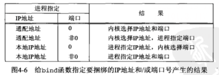
		- 如果指定端口号为0，那么内核就在bind被调用时选择一个临时端口。然而如果指定IP地址为通配地址，那么内核将等到套接字已连接（TCP）或已在套接字上发出数据报（UDP）时才选择一个本地IP地址。
		- 对于IPv4来说，通配地址由常值INADDR_ANY来指定，其值一般为0。它告知内核去选择IP地址。
		- ```c
		  struct sockaddr_in servaddr;
		  servaddr.sin_addr.s_addr = htol(INADDR_ANY); 
		  ```
		- 如此赋值对IPv4是可行的，因为其IP地址是一个32位的值，可以用一个简单的数字常值表示（本例中为0)，对于IPv6，我们就不能这么做了，因为128位的IPv6地址是存放在一个结构中的。(在C语言中，赋值语句的右边无法表示常值结构。）为了解决这个问题，我们改写为:
		- ```c
		  struct sockaddr_in6 serv;
		  serv.sin6_addr = in6addr_any; 
		  ```
		- 系统预先分配in6addr_any变量并将其初始化为常值IN6ADDR_ANY_INIT。头文件<netinet/in.h>中含有in6addr_any的extern声明。
	- `listen` 函数
	  collapsed:: true
		- `listner` 函数仅由TCP服务器调用，它做两件事情。
		- (1)当socket函数创建一个套接字时，它被假设为一个主动套接字，也就是说，它是一个将调用connect发起连接的客户套接字。listen函数把一个未连接的套接字转换成一个被动套接字，指示内核应接受指向该套接字的连接请求。根据TCP状态转换图（图2-4)，调用listen导致套接字从CLOSED状态转换到LISTEN状态。
		- (2)本函数的第二个参数规定了内核应该为相应套接字排队的最大连接个数。
		- ```c
		  #include <sys/socket.h>
		  int listen(int sockfd, int backlog);
		  // 返回：若成功则为 0，若出错则为 -1
		  ```
		- 本函数通常应该在调用socket和bind这两个函数之后，并在调用accept函数之前调用。为了理解其中的backlog参数，我们必须认识到内核为任何一个给定的监听套接字维护两个队列:
			- (1)未完成连接队列( incomplete connection queue)，每个这样的SYN分节对应其中一项:已由某个客户发出并到达服务器，而服务器正在等待完成相应的TCP三路握手过程。这些套接字处于SYN_RCVD状态（图2-4)。
			- (2)已完成连接队列(completed connection queue)，每个已完成TCP三路握手过程的客户对应其中一项。这些套接字处于ESTABLISHED状态（图2-4)。
			- 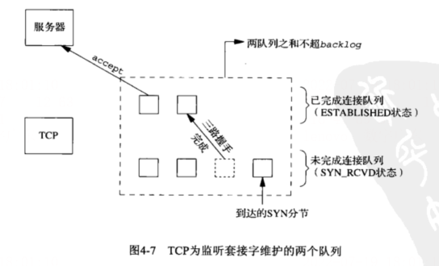
			- 每当在未完成连接队列中创建一项时,来自监听套接字的参数就复制到即将建立的连接中。连接的创建机制是完全自动的，无需服务器进程插手。图4-8展示了用这两个队列建立连接时所交换的分组。
			- 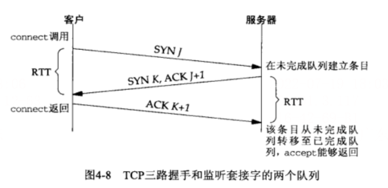
			- 当来自客户的SYN到达时，TCP在未完成连接队列中创建一个新项，然后响应以三路握手的第二个分节:服务器的SYN响应，其中捎带对客户SYN的ACK。这一项一直保留在未完成连接队列中，直到三路握手的第三个分节（客户对服务器SYN的ACK）到达或者该项超时为止。(源自Berkeley的实现为这些未完成连接的项设置的超时值为75 s。)如果三路握手正常完成，该项就从未完成连接队列移到已完成连接队列的队尾。当进程调用accept时，已完成连接队列中的队头项将返回给进程，或者如果该队列为空，那么进程将被投入睡眠，直到TCP在该队列中放入一项才唤醒它。
	- `accept` 函数
	  collapsed:: true
		- accept函数由TCP服务器调用，用于从已完成连接队列队头返回下一个已完成连接。如果已完成连接队列为空，那么进程被投入睡眠（假定套接字为默认的阻塞方式)。
		- ```c
		  #include <sys/socket.h>
		  int accept(int sockfd, struct sockaddr *cliaddr, socklen_t *addrlen);
		  // 返回：若成功则为非负描述符，若出错则为 -1
		  ```
		- 参数cliaddr和addrlen用来返回已连接的对端进程（客户）的协议地址。addrlen是值-结果参数:调用前，我们将由*addrlen所引用的整数值置为由cliaddr所指的套接字地址结构的长度，返回时，该整数值即为由内核存放在该套接字地址结构内的确切字节数。
		- 如果accept成功，那么其返回值是由内核自动生成的一个全新描述符，代表与所返回客户的TCP连接。在讨论accept函数时，我们称它的第一个参数为监听套接字(listening socket）描述符（由socket创建，随后用作bind和listen的第一个参数的描述符)，称它的返回值为已连接套接字(connected socket）描述符。区分这两个套接字非常重要。一个服务器通常仅仅创建一个监听套接字，它在该服务器的生命期内一直存在。内核为每个由服务器进程接受的客户连接创建一个已连接套接字（也就是说对于它的TCP三路握手过程已经完成)。当服务器完成对某个给定客户的服务时，相应的已连接套接字就被关闭。
		- 本函数最多返回三个值:一个既可能是新套接字描述符也可能是出错指示的整数、客户进程的协议地址〈由cliaddr指针所指〉以及该地址的大小(由addrlen指针所指)。如果我们对返回客户协议地址不感兴趣，那么可以把cliaddr和addrlen均置为空指针。
		- 已连接套接字每次都在循环中关闭，但监听套接字在服务器的整个有效期内都保持开放。我们还看到accept的第二和第三个参数都是空指针，因为我们对客户的身份不感兴趣。
	- `fork` 和 `exec` 函数
	  collapsed:: true
		- Unix中派生新进程的唯一方法
		- ```c
		  #include <unistd.h>
		  pid_t fork(void);
		  // 返回：在子进程中为0，在父进程中为子进程ID，若出错则为 -1 
		  ```
		- 它在调用进程（称为父进程）中返回一次，返回值是新派生进程（称为子进程）的进程ID号；在子进程又返回一次，返回值为0。因此，返回值本身告知当前进程是子进程还是父进程。
		- fork在子进程返回0而不是父进程的进程ID的原因在于:任何子进程只有一一个父进程，而且子进程总是可以通过调用getppid取得父进程的进程ID。相反，父进程可以有许多子进程，而且无法获取各个子进程的进程ID。如果父进程想要跟踪所有子进程的进程ID，那么它必须记录每次调用fork的返回值。
		- 父进程中调用fork之前打开的所有描述符在fork返回之后由子进程分享。我们将看到网络服务器利用了这个特性:父进程调用accept之后调用fork。所接受的已连接套接字随后就在父进程与子进程之间共享。通常情况下，子进程接着读写这个已连接套接字，父进程则关闭这个已连接套接字。
		-
		- fork有两个典型用法。
		  (1)一个进程创建-一个自身的副本,这样每个副本都可以在另-一个副本执行其他任务的同时处理各自的某个操作。这是网络服务器的典型用法。我们将在本书后面看到许多这样的例子。
		  (2)一个进程想要执行另一个程序。既然创建新进程的唯一办法是调用 fork，该进程于是首先调用fork创建一个自身的副本，然后其中一个副本(通常为子进程)调用exec把自身替换成新的程序。这是诸如shell之类程序的典型用法。
		- 存放在硬盘上的可执行程序文件能够被Unix执行的唯一方法是:由-一个现有进程调用六个exec函数中的某-一个。(当这6个函数中是哪一个 被调用并不重要时，我们往往把它们统称为exec函数。) exec把当前进程映像替换成新的程序文件，而且该新程序通常从main函数开始执行。进程ID并不改变。我们称调用exec的进程为调用进程(calling process)，称新执行的程序为新程序(new program)。
		-
		- 这6个exec函数之间的区别在于: (a) 待执行的程序文件是由文件名(filename) 还是由路
		  径名(pathname) 指定; (b) 新程序的参数是- -列出还是由一个指针数组来引用; (c)把调用进程的环境传递给新程序还是给新程序指定新的环境。
		- ```c
		  #include <unistd.h>
		  int execl(const char *pathname, const char *arg0, .../* (char *) 0 */ );
		  int execv(const char *pathname, char *const *argv[]);
		  int execle(const char *pathname, const char *arg0, .../* (char *) 0, char *const envp[] */);
		  int execve(const char *pathname, char *const argv[], char *const envp[]);
		  int execlp(const char *filename, const char *arg0, .../* (char *) 0 */ );
		  int execvp(const char *filename, char *const argv[]);
		  // 均返回：弱成功则不返回，若出错则为 -1
		  ```
		- 这些函数只在出错时才返回到调用者。否则，控制将被传递给新程序的起始点，通常就是main函数。
		- 这6个函数间的关系如图4-12所示。- -般来说，只有execve是内 核中的系统调用，其他5个都是调用execve的库函数。
		- 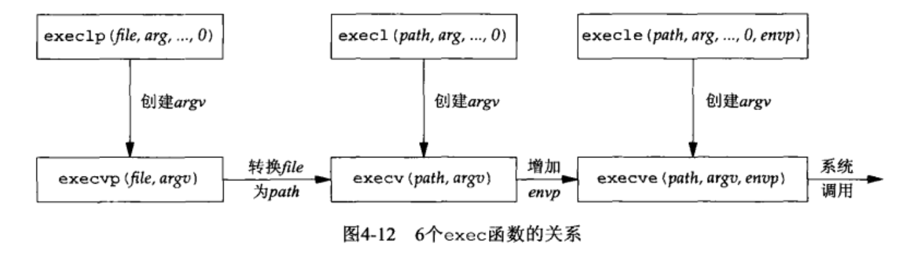
		- 注意这6个函数的下列区别。
		  (1) 上面那行的3个函数把新程序的每个参数字符串指定成exec的一一个独立参数，并以一个空指针结束可变数量的这些参数。下面那行的3个函数都有一个作为exec参 数的argv数组，其中含有指向新程序各个参数字符串的所有指针。既然没有指定参数字符串的数目，这个argv数组必须含有一个用于指定其末尾的空指针。
		  (2)左列2个函数指定一个filename参数。exec将使用当前的PATH环境变量把该文件名参数转换为一个路径名。然而一-旦这2个函数的filename参数中含有-一个斜杠(/)，就不再使用PATH环境变量。右两列4个函数指定一个全限定的pathname参数。
		  (3)左两列4个函数不显式指定-一个环境指针。相反，它们使用外部变量envi ron的当前值来构造一个传递给新程序的环境列表。右列2个函数显式指定-一个环境列表，其envp指针数组必须以一一个空指针结束。
		  进程在调用exec之前打开着的描述符通常跨exec继续保持打开。我们使用限定词"通常”是因为本默认行为可以使用fcnt1设置FD_ CLOEXEC描述符标志禁止掉。ineta服务 器就利用了这个特性。
	- `close` 函数
	  collapsed:: true
		- 通常的Unix `close` 函数也用来关闭套接字，并终止TCP连接。
		- ```c
		  #include <unistd.h.
		  int close(int sockfd);
		  // 返回：若成功返回 0，若出错则为 -1
		  ```
		- close一个TCP套接字的默认行为是把该套接字标记成已关闭，然后立即返回到调用进程。该套接字描述符不能再由调用进程使用，也就是说它不能再作为read或write的第一个 参数。然而TCP将尝试发送已排队等待发送到对端的任何数据，发送完毕后发生的是正常的TCP连接终止序列。
	- `getsockname` 和 `getpeername` 函数
	  collapsed:: true
		- 这两个函数或者返回与某个套接字关联的本地协议地址(getsockname)，或者返回与某个套接字关联的外地协议地址(getpeername)。
		- ```c
		  #include <sys/socket.h>
		  int getsockname(int sockfd, struct sockaddr *localaddr, socklen_t *addrlen);
		  int getpeername(int sockfd, struct sockaddr *peeraddr, socklen_t *addrlen);
		  // 均返回：若成功则为 0，若出错则为 -1
		  ```
		- 注意，这两个函数的最后-一个参数都是值结果参数。这就是说，这两个函数都得装填由localaddr或peeraddr指针所指的套接字地址结构。
		- 需要这两个函数的理由如下所述。
			- ●在一个没有调用bina的TCP客户上，connect成功返回后，getsockname用于返回由内核赋予该连接的本地IP地址和本地端口号。
			- ●在以端口号0调用bind (告知内核去选择本地端口号)后，getsockname用于返回由内核赋予的本地端口号。
			- ●getsockname可用于获取某个套接字的地址族，如图4-19所示。
			- ●在一个以通配IP地址调用bind的TCP服务器上(图1-9)， 与某个客户的连接一旦建立(accept成功返回)，getsockname就可以用于返回由内核赋予该连接的本地IP地址。在这样的调用中，套接字描述符参数必须是已连接套接字的描述符，而不是监听套接字的描述符。
			- ●当一个服务器是由调用过accept的某个进程通过调用exec执行程序时，它能够获取客户身份的唯一途 径便是调用getpeername。inetd (13.5节) fork并exec某 个TCP服务器程序时就是如此情形，如图4-18所示。ineta调用accept (左上方方框)返回两个值: 已连接套接字描述符connfd,这是函数的返回值;客户的IP地址及端口号，如图中标有“对端地址”的小方框所示(代表- 一个网际网套接字地址结构)。ineta随后 调用fork,派生出inetd的-一个子进程。既然子进程起始于父进程的内存映像的-一个副本，父进程中的那个套接字地址结构在子进程中也可用，那个已连接套接字描述符也是如此(因为描述符在父子进程之间是共享的)。然而当子进程调用exec执行真正的服务器程序(譬如说Telnet服务器程序)时，子进程的内存映像被替换成新的Telnet服务器的程序文件(也就是说包含对端地址的那个套接字地址结构就此丢失)，不过那个已连接套接字描述符跨exec继续保持开放。Telnet服 务器首先调用的函数之一便是getpeername，用于获取客户的IP地址和端口号。
			- 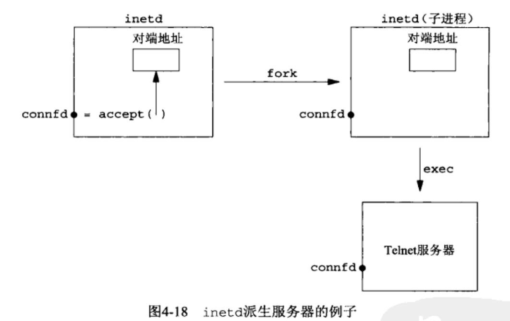
			- 显然，最后一个例子中的Telnet服务器必须在启动之后获取connfa的值。获取该值有两个常用方法。第- -种方法是，调用exec的进程可以把这个描述符号格式化成一个字符串，再把它作为一个命令行参数传递给新程序。第二种方法是，约定在调用exec之前，总是把某个特定描述符置为所接受的已连接套接字的描述符。ineta采用的是第二种方法，它总是把描述符0、1和2置为所接受的已连接套接字的描述符。
- TCP客户/服务器程序
  collapsed:: true
	- 正常终止
	  collapsed:: true
		- (1)当我们键入EOF字符时，fgets返回一个空指针，于是str_cli函数（图5-5）返回。(2)当str_cli返回到客户的main函数（图5-4）时，main通过调用exit终止。
		- (1)当我们键入EOF字符时，fgets返回一个空指针，于是str_cli函数（图5-5）返回。(2)当str_cli返回到客户的main函数（图5-4）时，main通过调用exit终止。
		- (3)进程终止处理的部分工作是关闭所有打开的描述符，因此客户打开的套接字由内核关闭。这导致客户TCP发送一个FIN给服务器，服务器TCP则以ACK响应，这就是TCP连接终止序列的前半部分。至此，照务器套接字处于CLOSE_WAIT状态，客户套接字则处于FIN_WAIT_2状态（图2-4和图2-5)。
		- (4)当服务器TCP接收FIN时，服务器子进程阻塞于readline调用(图5-3)，于是readline返回0。这导致str_echo函数返回服务器子进程的main函数。
		- (5)服务器子进程通过调用exit来终止(图5-2)。
		- (6)服务器子进程中打开的所有描述符随之关闭。由子进程来关闭已连接套接字会引发TCP连接终止序列的最后两个分节:一个从服务器到客户的FIN和一个从客户到服务器的ACK（图2-5)。至此，连接完全终止，客户套接字进入TIME_WAIT状态。
		- (7)进程终止处理的另一部分内容是:在服务器子进程终止时，给父进程发送一个SIGCHLD信号。这一点在本例中发生了，但是我们没有在代码中捕获该信号，而该信号的默认行为是被忽略。既然父进程未加处理，子进程于是进入僵死状态。我们可以使用ps命令验证这一点。
		- 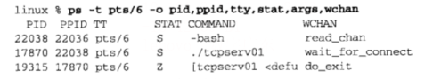
		- 子进程的状态现在是z（表示僵死)。
		- 我们必须清理僵死进程，这就涉及Unix信号的处理。
	- `POSIX` 信号处理
	  collapsed:: true
		- 信号(signal）就是告知某个进程发生了某个事件的通知，有时也称为软件中断（softwareinterrupt)。信号通常是异步发生的，也就是说进程预先不知道信号的准确发生时刻。
		- 信号可以:
			- 由一个进程发给另一个进程（或自身);
			- 由内核发给某个进程。
		- 每个信号都有一个与之关联的处置（(disposition)，也称为行为(action)。我们通过调用sigaction函数来设定一个信号的处置，并有三种选择。
			- (1)我们可以提供一个函数，只要有特定信号发生它就被调用。这样的函数称为信号处理函数( signal handler),这种行为称为捕获(catching)信号。有两个信号不能被捕获,它们是sIGKILL和sTGsTOP。信号处理函数由信号值这个单一的整数参数来调用，且没有返回值，其函数原型因此如下:
			- ```c
			  void handler(int signo);
			  ```
			- 对于大多数信号来说，调用sigaction函数并指定信号发生时所调用的函数就是捕获信号所需做的全部工作。不过我们稍后将看到，SIGIo、SIGPoLL和sIGURG这些个别信号还要求捕获它们的进程做些额外工作。
			- (2)我们可以把某个信号的处置设定为SIG_IGN来忽略（ignore）它。SIGKILL和SIGSTOP这两个信号不能被忽略。
			- (3)我们可以把某个信号的处置设定为sIG_DFL来启用它的默认(default）处置。默认处置通常是在收到信号后终止进程,其中某些信号还在当前工作目录产生一个进程的核心映像(coreimage，也称为内存影像)。另有个别信号的默认处置是忽略，STGCHLD和SIGURG（带外数据到达时发送，见第24章）就是本书中出现的默认处置为忽略的两个信号。
		-
	- `signal` 函数
	  collapsed:: true
		- 建立信号处置的POSIX方法就是调用sigaction函数。不过这有点复杂，因为该函数的参数之一是我们必须分配并填写的结构。简单些的方法就是调用signal函数，其第一个参数是信号名，第二个参数或为指向函数的指针，或为常值srG_IGN或sIG_DFL。然而signal是早于POSIX出现的历史悠久的函数。调用它时，不同的实现提供不同的信号语义以达成后向兼容，而POSIX则明确规定了调用sigaction时的信号语义。我们的解决办法是定义自己的signal函数，它只是调用POSIX的sigaction函数。这就以所期望的POSLX语义提供了一个简单的接口。我们把该函数以及早先讲过的err_XXX函数和包裹函数等一道包含在自己的函数库中，而这个函数库在我们构造本书中的程序时指定。该函数如图5-6所示。(我们没有给出它的包裹函数signal，因为不论它调用本函数还是厂家提供的signal函数，效果都是一样的。)
		- 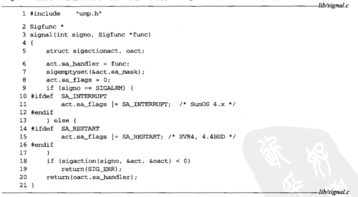
		-
	- `wait` 和 `waitpid` 函数
	  collapsed:: true
		- ```c
		  #include <sys/wait.h>
		  pid_t wait(int *statloc);
		  pid_t waitpid(pid_t pid, int *statloc, int options);
		  // 均返回：若成功则为进程ID，若出错则为 0 或者 -1
		  ```
		- 函数wait和waitpid均返回两个值:已终止子进程的进程ID号，以及通过statloc指针返回的子进程终止状态（一个整数)。我们可以调用三个宏来检查终止状态，并辨别子进程是正常终止、由某个信号杀死还是仅仅由作业控制停止而已。另有些宏用于接着获取子进程的退出状态、杀死子进程的信号值或停止子进程的作业控制信号值。
		- 如果调用wait的进程没有已终止的子进程，不过有一个或多个子进程仍在执行，那么wait将阻塞到现有子进程第一个终止为止。
		- waitpid函数就等待哪个进程以及是否阻塞给了我们更多的控制。首先，pid参数允许我们指定想等待的进程ID，值-1表示等待第一个终止的子进程。(另有一些处理进程组ID的可选值，不过本书中用不上。)其次，options参数允许我们指定附加选项。最常用的选项是wNOHANG，它告知内核在没有已终止子进程时不要阻塞。
		-
		- 函数 `wait` 和 `waitpid` 的区别
			- (1)当fork子进程时,必须捕获sIGCHLD信号;
			- (2)当捕获信号时，必须处理被中断的系统调用;
			- (3) SIGCHLD的信号处理函数必须正确编写，应使用waitpid函数以免留下僵死进程。
		-
- I/O复用：`select` 和 `poll` 函数
  collapsed:: true
	- 概述
	  collapsed:: true
		- TCP客户同时处理两个输入:标准输入和TCP套接字。我们遇到的问题是就在客户阻塞于(标准输入上的)fgets调用期间，服务器进程会被杀死。服务器TCP虽然正确地给客户TCP发送了一个FIN，但是既然客户进程正阻塞于从标准输入读入的过程，它将看不到这个EOF，直到从套接字读时为止(可能已过了很长时间)。这样的进程需要--种预先告知内核的能力，使得内核一旦发现进程指定的一个或多个IO条件就绪（也就是说输入已准备好被读取，或者描述符已能承接更多的输出)，它就通知进程。这个能力称为IO复用（IOmultiplexing)，是由select和pol1这两个函数支持的。我们还介绍前者较新的称为pselect的POSIX变种。
		- IO复用典型使用在下列网络应用场合。
			- 当客户处理多个描述符（通常是交互式输入和网络套接字）时，必须使用IO复用。这是我们早先讲述过的场合。
			- 一个客户同时处理多个套接字是可能的，不过比较少见。我们将在16.5节中结合一个Web客户的上下文给出这种场合使用select的例子。
			- 如果一个TCP服务器既要处理监听套接字，又要处理已连接套接字，一般就要使用IO复用，如6.8节所述。
			- 如果一个服务器即要处理TCP，又要处理UDP，一般就要使用IO复用。我们将在8.15节给出这种场合的一个例子。
			- 如果一个服务器要处理多个服务或者多个协议(例如我们将在13.5节讲述的inetd守护进程)，一般就要使用IO复用。
		- IO复用并非只限于网络编程，许多重要的应用程序也需要使用这项技术。
	- I/O模型
	  collapsed:: true
		- Unix下可用的5种I/O模型的基本区别：
		  collapsed:: true
			- 阻塞式I/O:
			- 非阻塞式I/O:
			- I/O符用(select和poll):
			- 信号驱动式I/O(SIGIO):
			- 异步I/O(POSIX的aio_系列函数):
		- 一个输入操作通常包括两个不同的阶段：
			- 1. 等待数据准备好
			  2. 从内核向进程复制数据
		- 对于一个套接字上的输入操作，第一步通常涉及等待数据从网络种到达。当所等待分组到达时，它被复制到内核种的某个缓冲区。第二步就是把数据从内核缓冲区复制到应用进程缓冲区。
		- ##### 阻塞式I/O模型
			- 最流行的I/O模型是阻塞式IO (blocking IO）模型，本书到目前为止的所有例子都使用该模型。默认情形下，所有套接字都是阻塞的。以数据报套接字作为例子，我们有如图6-1所示的情形。
			- 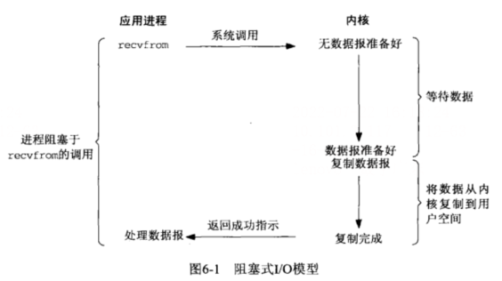
			- 我们使用UDP而不是TCP作为例子的原因在于就UDP而言，数据准备好读取的概念比较简单:要么整个数据报已经收到，要么还没有。然而对于TCP来说，诸如套接字低水位标记( low-water mark）等额外变量开始起作用，导致这个概念变得复杂。
			- ##### 非阻塞式I/O模型
			  collapsed:: true
				- 进程把一个套接字设置成非阻塞是在通知内核:当所请求的I/O操作非得把本进程投入睡眠才能完成时，不要把本进程投入睡眠，而是返回一个错误。
				- 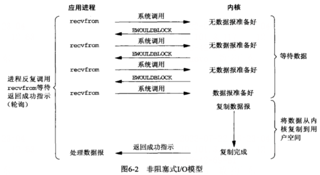
				- 前三次调用recvfrom时没有数据可返回，因此内核转而立即返回--个EwOULDBLOCK错误。第四次调用recvfrom时已有一个数据报准备好，它被复制到应用进程缓冲区，于是recvfrom成功返回。我们接着处理数据。
				- 当一个应用进程像这样对一个非阻塞描述符循环调用recvfrom时，我们称之为轮询(polling)。应用进程持续轮询内核，以查看某个操作是否就绪。这么做往往耗费大量CPU时间,不过这种模型偶尔也会遇到，通常是在专门提供某一种功能的系统中才有。
			- ##### I/O复用模型
			  collapsed:: true
				- 有了IO复用(IO multiplexing)，我们就可以调用select或poll，阻塞在这两个系统调用中的某一个之上，而不是阻塞在真正的IO系统调用上。图6-3概括展示了IO复用模型。
				- 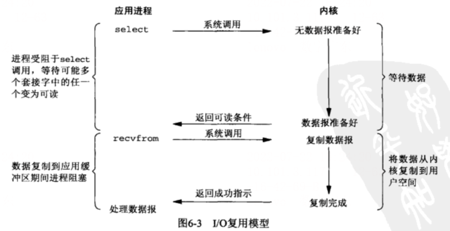
				- 我们阻塞于select调用，等待数据报套接字变为可读。当select返回套接字可读这一条件时，我们调用recvfrom把所读数据报复制到应用进程缓冲区。
			- ##### 信号驱动式I/O模型
			  collapsed:: true
				- 我们也可以用信号，让内核在描述符就绪时发送sIGIo信号通知我们。我们称这种模型为信号驱动式IO (signal-driven vO)
				- 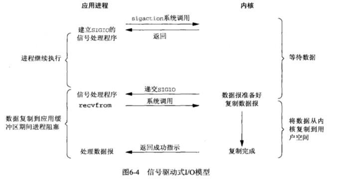
				- 我们首先开启套接字的信号驱动式I/O功能，并通过sigactior系统调用安装一个信号处理函数。该系统调用将立即返回，我们的进程继续工作，也就是说它没有被阻塞。当数据报准备好读取时，内核就为该进程产生一个sIGro信号。我们随后既可以在信号处理函数中调用recvfrom读取数据报，并通知主循环数据已准备好待处理，也可以立即通知主循环，让它读取数据报。
				- 无论如何处理sIGIo信号，这种模型的优势在于等待数据报到达期间进程不被阻塞。主循环可以继续执行，只要等待来自信号处理函数的通知:既可以是数据已准备好被处理，也可以是数据报已准备好被读取。
			-
	- 异步I/O模型
	  collapsed:: true
		- 异步IO ( asynchronous I/O)由POSIX规范定义。演变成当前POSIX规范的各种早期标准所定义的实时函数中存在的差异已经取得一致。一般地说，这些函数的工作机制是:告知内核启动某个操作，并让内核在整个操作（包括将数据从内核复制到我们自己的缓冲区）完成后通知我们。这种模型与前一节介绍的信号驱动模型的主要区别在于:信号驱动式IO是由内核通知我们何时可以启动一个IO操作，而异步IO模型是由内核通知我们IO操作何时完成。
		- 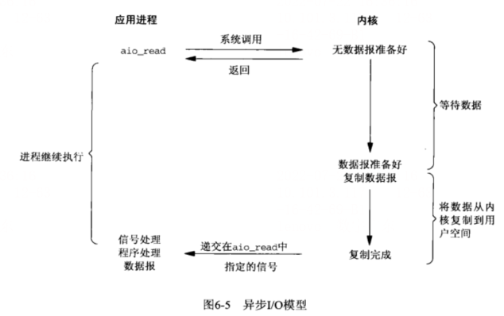
		- 我们调用aio_read函数(POSIX异步IO函数以aio_或lio_开头)，给内核传递描述符、缓冲区指针、缓冲区大小(与read相同的三个参数）和文件偏移（与lseek类似)，并告诉内核当整个操作完成时如何通知我们。该系统调用立即返回，而且在等待I/O完成期间，我们的进程不被阻塞。本例子中我们假设要求内核在操作完成时产生某个信号。该信号直到数据已复制到应用进程缓冲区才产生，这一点不同于信号驱动式IO模型。
		-
		-
	- `select` 函数
	  collapsed:: true
		- 该函数允许进程指示内核等待多个事件中的任何一个发生，并只在有-一个或多个事件发生或经历- -段指定的时间后才唤醒它。
		  作为一一个例子，我们可以调用select,告知内核仅在下列情况发生时才返回: .
			- ●集合{1，4，5}中的任何描述符准备好读;
			- ●集合{2，7}中的任何描述符准备好写;
			- ●集合{1，4}中的任何描述符有异常条件待处理;
			- ●已经历了10.2秒。
		- 也就是说，我们调用select告知内核对哪些描述符(就读、写或异常条件)感兴趣以及等待多长时间。我们感兴趣的描述符不局限于套接字，任何描述符都可以使用select来测试。
		- ```c
		  #include <sys/socket.h>
		  #include <sys/time.h>
		  int select(int maxfdp1, fd_set *readset, fd_set *writeset, fd_set *exceptset, 
		            const struct timeval *timeout);
		  // 返回：若有就绪描述符则为其数目，若超时则为0，若出错则为-1
		  ```
		- #### timeout
		  collapsed:: true
			- 告知内核等待所指定描述符中的任何一个就绪可花多长时间。其timeval结构用于指定这段时间的秒数和微妙数。
			- ```c
			  struct timeval {
			    long tv_sec: 	// seconds
			    long tv_usec; // microseconds
			  }
			  ```
			- 这个参数有以下三种可能：
				- (1)永远等待下去:仅在有一个描述符准备好I/O时才返回。为此，我们把该参数设置为空指针。
				- (2)等待一段固定时间:在有一个描述符准备好I/O时返回，但是不超过由该参数所指向的timeval结构中指定的秒数和微秒数。
				- (3)根本不等待:检查描述符后立即返回，这称为轮询(polling)。 为此，该参数必须指向一个timeval结构， 而且其中的定时器值(由该结构指定的秒数和微秒数)必须为0。
				- 前两种情形的等待通常会被进程在等待期间捕获的信号中断，并从信号处理函数返回。
		- ##### `readset`、`writeset` 和 `exceptset`:
		  collapsed:: true
			- 让内核测试读、写和异常条件的秒数符。目前支持的异常条件只有两个：
			- (1)某个套接字的带外数据的到达，我们将在第24章中详细讲述这个异常条件;
			- (2)某个已置为分组模式的伪终端存在可从其主端读取的控制状态信息，本书不讨论伪终端。
			- 如何给这3个参数中的每-一个参数指定一个或多个描述符值是-一个设计上的问题。select使用描述符集，通常是一个整数数组，其中每个整数中的每一位对应一个描述符。举例来说，假设使用32位整数，那么该数组的第-一个元素对应于描述符0~31，第二个元素对应于描述符32~63，依此类推。所有这些实现细节都与应用程序无关，它们隐藏在名为fd_ set 的数据类型和以下四个宏中:
			- ```c
			  void FD_ZERO(fd_set *fdset); // clear all bits in fdset
			  void FD_SET(int fd, fd_set *fdset); // turn on the bit for fd in fdset
			  void FD_CLR(int fd, fd_set *fdset); // trun off the bit for fd in fdset
			  int FD_ISSET(int fd, fd_set *fdset); // is the bit for fd on in fdset ?
			  ```
			- 我们分配-一个fa_ set数 据类型的描述符集，并用这些宏设置或测试该集合中的每一位，也可以用C语言中的赋值语句把它赋值成另外一个描述符集。
			- 举个例子，以下代码用于定义一个fd _set类型的变量,然后打开描述符1、4和5的对应位:
			- ```c
			  fd_set rset;
			  
			  FD_SET(&rset); // initialize the set: all bits off
			  FD_SET(1, &rset); // turn on bit for fd 1
			  FD_SET(4, &rset); // turn on bit for fd 4
			  FD_SET(5, &rset); // turn on bit for fd 5
			  ```
			- 描述符集的初始化非常重要，因为作为自动变量分配的一一个 描述符集如果没有初始化，那么可能发生不可预期的后果。
			  select函数的中间三个参数readset、writeset和exceptset中， 如果我们对某-一个 的条件不感兴趣，就可以把它设为空指针。事实上,如果这三个指针均为空,我们就有了-一个比Unix的sleep函数更为精确的定时器( sleep睡眠以秒为最小单位)。poll 函数提供类似的功能。
		- `maxfdp1`:
		  collapsed:: true
			- 指定待测试的秒数符个数，它的值时待测试的最大描述符加1（因此我们把该参数命名为maxfdp1），描述符0，1，2···一直到maxfdp1-1均将被测试。
			- 头文件<sys/select . h>中定义的FD_ SETSIZE常 值是数据类型fd_ set中的描述符总数，其值通常是1024,不过很少有程序用到那么多的描述符。maxfdp1参数迫使我们计算出所关心的最大描述符并告知内核该值。以前面给出的打开描述符1、4和5的代码为例，其maxfdpl值就是6。是6而不是5的原因在于:我们指定的是描述符的个数而非最大值，而描述符是从0开始的。
		-
		- `select`函数修改由指针`readset`、`writeset`和`exceptset`所 指向的的描述符集，因而这三个参数都是值一结果参数。调用该函数时，我们指定所关心的描述符的值，该函数返回时，结果将指示哪些描述符已就绪。该函数返回后，我们使用`FD_ ISSET`宏来测试`fa_ set` 数据类型中的描述符。描述符集内任何与未就绪描述符对应的位返回时均清成0。为此，每次重新调用`select`函数时，我们都得再次把所有描述符集内所关心的位均置为1。
		- 该函数的返回值表示跨所有描述符集的已就绪的总位数。如果在任何描述符就绪之前定时器到时，那么返回0。返回-1表示出错(这是可能发生的,譬如本函数被一个所捕获的信号中断)。
		-
		- #### 描述符就绪条件
		  collapsed:: true
			- (1)满足下列四个条件中的任何一一个时，一一个套接字准备好读。
				- a)该套接字接收缓冲区中的数据字节数大于等于套接字接收缓冲区低水位标记的当前大小。对这样的套接字执行读操作不会阻塞并将返回一个大于0的值(也就是返回准备好读入的数据)。我们可以使用`SO_RCVLOWAT`套 接字选项设置该套接字的低水位标记。对于`TCP`和`UDP`套接
				  字而言，其默认值为1。
				- b)该连接的读半部关闭(也就是接收了`FIN`的`TCP`连接)。对这样的套接字的读操作将不阻塞并返回0 (也就是返回`EOF`)。
				- c)该套接字是一个监听套接字且已完成的连接数不为0。对这样的套接字的accept通常不会阻塞，不过我们将在15.6节讲解accept可能阻塞的一种时序条件 。
				- d)其上有一个套接字错误待处理。对这样的套接字的读操作将不阻塞并返回-1 ( 也就是返回一-个错误)，同时把`errno`设置成确切的错误条件。这些待处理错误( pending error) 也可以通过指定`SO_ERROR`套接字选项调用`getsockopt`获取并清除。
			- (2)下列四个条件中的任何一个满足时， 一个套接字准备好写。
				- a)该套接字发送缓冲区中的可用空间字节数大于等于套接字发送缓冲区低水位标记的当前大小，并且或者该套接字已连接，或者该套接字不需要连接(如UDP套接字)。这意味着如果我们把这样的套接字设置成非阻塞,写操作将不阻塞并返回一个正值(例如由传输层接受的字节数)。我们可以使用SO_SNDLOWAT套 接字选项来设置该套接字的低水位标记。对于TCP
				  和UDP套接字而言，其默认值通常为2048。
				- b)该连接的写半部关闭。对这样的套接字的写操作将产生SIGPIPE信号。
				- c)使用非阻塞式`connect`的套接字已建立连接，或者`connect`已经以失败告终。
				- d)其上有一一个 套接字错误待处理。对这样的套接字的写操作将不阻塞并返回-1 (也就是返回一个错误)，同时把`errno`设置成确切的错误条件。这些待处理的错误也可以通过指定`SO_ERROR`套接字选项调用`getsockopt`获取并清除。
			- (3)如果一个套接字存在带外数据或者仍处于带外标记，那么它有异常条件待处理。
			- 注意:当某个套接字上发生错误时，它将由select标记为既可读又可写。
			  接收低水位标记和发送低水位标记的目的在于:允许应用进程控制在select返回可读或可写条件之前有多少数据可读或有多大空间可用于写。举例来说，如果我们知道除非至少存在64个字节的数据，否则我们的应用进程没有任何有效工作可做，那么可以把接收低水位标记设置为64，以防少于64个字节的数据准备好读时select唤醒我们。
			  任何UDP套接字只要其发送低水位标记小于等于发送缓冲区大小(默认应该总是这种关系)就总是可写的，这是因为UDP套接字不需要连接。
			- 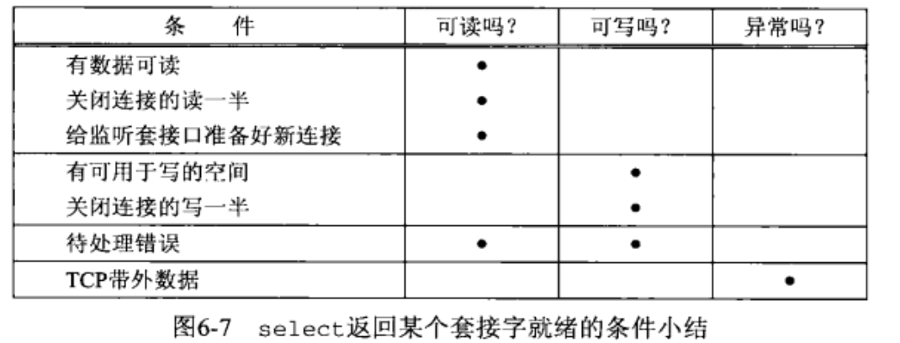
			-
	- `shutdown` 函数
	  collapsed:: true
		- 终止网络连接的通常方法是调用close函数。不过close有两个限制，却可以使用shutdown来避免。
		- (1)close把描述符的引用计数减1，仅在该计数变为0时才关闭套接字。使用shutdown可以不管引用计数就激发TCP的正常连接终止序列。
		- (2) close终止读和写两个方向的数据传送。既然TCP连接是全双工的，有时候我们需要告知对端我们已经完成了数据发送，即使对端仍有数据要发送给我们。这就是我们在前一节中遇到的str_cli函数在批量输入时的情况。图6-12展示了这样的情况下典型的函数调用。
		- 
		- ```c
		  #include <sys/socket.h>
		  int shutdown(int sockfd, int howto);
		  // 返回：若成功则为0，若出错则为-1
		  ```
		- 该函数的行为依赖于`howto`参数的值。
		- `SHUT_RD`
			- 关闭连接的读这一半——套接字中不再有数据可接收，而且套接字接收缓冲区中的现有数据都被丢弃。进程不能再对这样的套接字调用任何读函数。对一个TCP套接字这样调用`shutdown`函数后，由该套接字接收的来自对端的任何数据都被确认，然后悄然丢弃。
		- `SHUT_WR`
			- 关闭连接的写这一半-—对于TCP套接字，这称为半关闭(half-close)。当前留在套接字发送缓冲区中的数据将被发送掉，后跟TCP的正常连接终止序列。不管套接字描述符的引用计数是否等于0，这样的写半部关闭照样执行。进程不能再对这样的套接字调用任何写函数。
		- `SHUT_RDWR`
			- 连接的读半部和写半部都关闭----这与调用`shutdown`两次等效: 第一次调用
			  指定SHUT_RD，第二次调用指定SHUT_WR。
		-
	- `pselect` 函数
	  collapsed:: true
		- `pselect` 函数是由POSIX发明
		- ```c
		  #include <sys/select.h>
		  #include <signal.h>
		  #include <time.h>
		  int pselect(int maxfdp1, fd_set *readset, fd_set *writeset, fd_set *exceptset,
		             const struct timespec *timeout, const sigset_t *sigmask);
		  // 返回：若有就绪描述符则为其数目，若超时则为0，若出错则为-1
		  ```
		- pselect相对于通常的select有两个变化。
			- (1) pselect使用timespec结构，而不使用timeval结构。timespec结构是POSIX的又一个发明。
			- ```c
			  struct timespec {
			  	time_t tv_sec; 	/* seconds */
			  	long tv_nsec; 	/*nanoseconds */
			  };
			  ```
			- 这两个结构的区别在于第二个成员:新结构的该成员`tv_nsec`指定纳秒数，而旧结构的该成员`tv_usec`指定微秒数。
			- (2)`pselect`函数增加了第六个参数:一个指向信号掩码的指针。该参数允许程序先禁止递交某些信号，再测试由这些当前被禁止信号的信号处理函数设置的全局变量，然后调用`pselect`，告诉它重新设置信号掩码。
			- 关于第二点，考虑下面的例子(在APUE第308~309页讨论)。这个程序的S工GINT信号处理函数仅仅设置全局变量intr_flag并返回。如果我们的进程阻塞于select调用，那么从信号处理函数的返回将导致select返回EINTR错误。然而调用select时，代码看起来大体如下:
			- ```c
			  if(intr_flag) 
			    	handler_intr();
			  if( (nready = select(...)) < 0){
			    if(errno == EINTR) {
			      if(intr_flag)
			        handler_intr();
			    }
			    ...
			  }
			  ```
			- 问题是，在测试intr_flag和调用select之间如果有信号发生，那么若select永远阻塞，该信号将丢失。有了pselect后，我们可以按以下方式可靠地编写这个例子的代码:
			- ```c
			  sigset_t newmask, oldmask,zeromask;
			  
			  sigemptyset(&zeromask) ;
			  sigernptyset (&newnask) ;
			  sigaddset (&newmask,SIGINT);
			  
			  sigprocmask(SIG_BLOCK，&newmmask，&oldmask);/* block STGINT * /
			  if (intr_flag)
			  	handle_intr( );/ *handle the signal */
			  if ( (nready = pselect ( ... , &zeromask)) < 0){
			  	if (errno == EINTR) {
			  		if (intr_flag)
			  			handle_intr();
			      }
			    	...	
			  }
			  ```
			- 在测试intr_flag变量之前，我们阻塞SIGINT。当pselect被调用时，它先以空集（即zeromask）替代进程的信号掩码，再检查描述符，并可能进入睡眠。然而当pselect函数返回时，进程的信号掩码又被重置为调用pselect之前的值（即SIGINT被阻塞)。
	- `poll` 函数
	  collapsed:: true
		- poll函数起源于SVR3，最初局限于流设备（第31章)。SVR4取消了这种限制，允许poll工作在任何描述符上。poll提供的功能与select类似，不过在处理流设备时，它能够提供额外的信息。
		- ```c
		  #include <poll.h>
		  int poll(struct pollfd *fdarray, unsigned long nfds, int timeout);
		  // 返回：若有就绪描述符则为其数目，若超时则为0，若出错则为-1
		  ```
		- 第一个参数是指向--个结构数组第一个元素的指针。每个数组元素都是一个pollfd结构,用于指定测试某个给定描述符fa的条件。
		  ```c
		  struct pollfd {
		    int fd; 			// descriptor to check
		    short events; 	// events of interest on fd
		    short revents; 	// events that occurred on fd
		  }
		  ```
		- 要测试的条件由events成员指定，函数在相应的revents成员中返回该描述符的状态。(每个描述符都有两个变量，一个为调用值，另一个为返回结果，从而避免使用值--结果参数。回想select函数的中间三个参数都是值-结果参数。)这两个成员中的每一个都由指定某个特定条件的一位或多位构成。图6-23列出了用于指定events标志以及测试revents标志的一些常值。
		  
		- 我们将该图分为三个部分:第一部分是处理输入的四个常值，第二部分是处理输出的三个常值，第三部分是处理错误的三个常值。其中第三部分的三个常值不能在events中设置，但是当相应条件存在时就在revents中返回。
		  poll识别三类数据:普通(normal)、优先级带( priority band）和高优先级(high priority)。这些术语均出自基于流的实现。
		- 就TCP和UDP套接字而言,以下条件引起pol1返回特定的revent。不幸的是,POSIX在其poll的定义中留了许多空洞（也就是说有多种方法可返回相同的条件)。
			- 所有正规TCP数据和所有UDP数据都被认为是普通数据。TCP的带外数据（第24章）被认为是优先级带数据。
			- 当TCP连接的读半部关闭时（譬如收到了一个来自对端的FIN)，也被认为是普通数据，随后的读操作将返回0。
			- TCP连接存在错误既可认为是普通数据，也可认为是错误（POLLERR)。无论哪种情况，随后的读操作将返回-1，并把errno设置成合适的值。这可用于处理诸如接收到RST或发生超时等条件。
			- 在监听套接字上有新的连接可用既可认为是普通数据，也可认为是优先级数据。大多数实现视之为普通数据。
			- 非阻塞式connect的完成被认为是使相应套接字可写。结构数组中元素的个数是由nfds参数指定。
			- timeout参数指定poll函数返回前等待多长时间。它是一个指定应等待毫秒数的正值。图6-24给出了它的可能取值。
			  
			- INFTIM常值被定义为一个负值。如果系统不能提供毫秒级精度的定时器，该值就向上舍入到最接近的支持值。
			- 当发生错误时，poll函数的返回值为-1，若定时器到时之前没有任何描述符就绪，则返回0，否则返回就绪描述符的个数，即revents成员值非0的描述符个数。
			- 如果我们不再关心某个特定描述符，那么可以把与它对应的pollfd结构的fd成员设置成-个负值。poll函数将忽略这样的pollfd结构的events成员，返回时将它的revents成员的值置为0。
			-
- 套接字选项
  collapsed:: true
	- `getsockopt` 和 `setsockopt` 函数
	  collapsed:: true
		- 这两个函数用于套接字
		- ```c
		  #include <sys/socket.h>
		  
		  int getsockopt(int sockfd, int level, int optname, void *optval, socklen_t *optlen);
		  
		  int setsockopt(int sockfd, int level, int optname, const void *optval, socklen_t optlen);
		  
		  // 均返回：若成功则为0，若出错则为-1
		  ```
		- 其中sockfd必须指向一个打开的套接字描述符，level(级别)指定系统中解释选项的代码或为通用套接字代码，或为某个特定于协议的代码（例如IPv4、IPv6、TCP或SCTP)。
		- optval是一个指向某个变量(*optval)的指针，setsockopt从*optval中取得选项待设置的新值, getsockopt则把已获取的选项当前值存放到*optval中。*optval的大小由最后一个参数指定，它对于setsockopt是一个值参数，对于getsockopt是一个值-结果参数。
		- 套接字选项粗分为两大基本类型:一是启用或禁止某个特性的二元选项（称为标志选项)，二是取得并返回我们可以设置或检查的特定值的选项（称为值选项)。标有“标志”的列指出一个选项是否为标志选项。当给这些标志选项调用getsockopt函数时，*optval是一个整数。*optval中返回的值为0表示相应选项被禁止，不为0表示相应选项被启用。类似地，setsockopt函数需要一个不为0的*optval值来启用选项，一个为0的*optval值来禁止选项。如果“标志”列不含有“. ”，那么相应选项用于在用户进程与系统之间传递所指定数据类型的值。
		  
		  
		- 
		-
		-
	- 套接字状态
	  collapsed:: true
		- 下面的套接字选项是由TCP已连接套接字从监听套接字继承来的（TCPv2第462~463页):so_DEBUG、SO_DONTROUTE、SO_KEEPALIVE、SO_LINGER、SO_O0BINLINE、SO_RCVBUF 、SO_RCVLOWAT、SO_SNDBUF、SO_SNDLOWAT、TCP_MAXSEc和TCP_NODELAY。这对TCP是很重要的，因为accept一直要到TCP层完成三路握手后才会给服务器返回已连接套接字。如果想在三路握手完成时确保这些套接字选项中的某一个是给已连接套接字设置的，那么我们必须先给监听套接字设置该选项。
	- 通用套接字选项
	  collapsed:: true
		- `SO_BROADCAST`
			- 本选项开启或禁止进程发送广播消息的能力。只有数据报套接字支持广播，并且还必须是在支持广播消息的网络上（例如以太网、令牌环网等)。我们不可能在点对点链路上进行广播，也不可能在基于连接的传输协议（例如TCP和SCTP）之上进行广播。我们将在第20章中更为详细地讨论广播。
			- 由于应用进程在发送广播数据报之前必须设置本套接字选项，因此它能够有效地防止一个进程在其应用程序根本没有设计成可广播时就发送广播数据报。举例来说，一个UDP应用程序可能以命令行参数的形式取得目的IP地址，不过它并不期望用户键入一个广播地址。处理方法并非让应用进程来确定-个给定地址是否为广播地址，而是在内核中进行测试:如果该目的地址是一个广播地址且本套接字选项没有设置，那么返回EACCES错误。
		- `SO_DEBUG`
			- 本选项仅由TCP支持。当给一个TCP套接字开启本选项时，内核将为TCP在该套接字发送和接收的所有分组保留详细跟踪信息。这些信息保存在内核的某个环形缓冲区中，并可使用trpt程序进行检查。
		- `SO_DONTROUTE`
			- 本选项规定外出的分组将绕过底层协议的正常路由机制。举例来说，在IPv4情况下外出分组将被定向到适当的本地接口，也就是由其目的地址的网络和子网部分确定的本地接口。如果这样的本地接口无法由目的地址确定（譬如说目的地主机不在一个点对点链路的另一端，也不在一个共享的网络上)，那么返回ENETUNREACH错误。
			- 给函数`send`、`sendto`或`sendmsg`使用`MSG_DONTROUTE`标志也能在个别的数据报上取得与本选项相同的效果。
			- 路由守护进程(routed和gated)经常使用本选项来绕过路由表(路由表不正确的情况下)，以强制将分组从特定接口送出。
		- `SO_ERROR`
		  collapsed:: true
			- 当一个套接字上发生错误时，源自Berkeley的内核中的协议模块将该套接字的名为so_error的变量设为标准的Unix Exxx值中的一个，我们称它为该套接字的待处理错误(pendingerror)。内核能够以下面两种方式之一立即通知进程这个错误。
				- (1)如果进程阻塞在对该套接字的select调用上，那么无论是检查可读条件还是可写条件，select均返回并设置其中一个或所有两个条件。
				- (2)如果进程使用信号驱动式IO模型(第25章)，那就给进程或进程组产生一个SIGIO信号。进程然后可以通过访问SO_ERROR套接字选项获取so_error的值。由`getsockopt`返回的整数值就是该套接字的待处理错误。so_error随后由内核复位为0 。
			- 当进程调用read且没有数据返回时，如果so_error为非0值，那么read返回-1且errno被置为so_error的值。so_error随后被复位为0。如果该套接字上有数据在排队等待读取，那么read返回那些数据而不是返回错误条件。如果在进程调用write时so_error为非0值，那么write返回-1且errno被设为so_error的值。so_error随后被复位为0。
		- `SO_KEEPALIVE`
			- 给一个TCP套接字设置保持存活(keep-alive)选项后，如果2小时内在该套接字的任一方向上都没有数据交换，TCP就自动给对端发送一个保持存活探测分节(keep-alive probe)。这是一个对端必须响应的TCP分节，它会导致以下三种情况之一。
			- (1)对端以期望的ACK响应。应用进程得不到通知（因为一切正常)。在又经过仍无动静的2小时后，TCP将发出另一个探测分节。
			- (2)对端以RST响应，它告知本端TCP:对端已崩溃且已重新启动。该套接字的待处理错误被置为ECONNRESET，套接字本身则被关闭。
			- (3)对端对保持存活探测分节没有任何响应。源自Berkeley的TCP将另外发送8个探测分节，两两相隔75秒，试图得到一个响应。TCP在发出第一个探测分节后11分15秒内若没有得到任何响应则放弃。
			- 如果根本没有对TCP的探测分节的响应，该套接字的待处理错误就被置为ETIMEOUT，套接字本身则被关闭。然而如果该套接字收到一个ICMP错误作为某个探测分节的响应，那就返回相应的错误（图A-15和图A-16)，套接字本身也被关闭。这种情形下一个常见的ICMP错误是“hostunreachable”(主机不可达)，说明对端主机可能并没有崩溃，只是不可达，这种情况下待处理错误被置为EHOSTUNREACH。发生这种情况的原因或者是发生网络故障，或者是对端主机已经崩溃，而最后一跳的路由器也已经检测到它的崩溃。
			- 对于本选项的一个最常见的问题无疑是时间参数是否可改(通常是想把2小时的无活动周期改为短些的值)。TCPvl的附录E讨论了如何给各种内核修改这些定时参数，不过必须注意大多数内核是基于整个内核维护这些时间参数的，而不是基于每个套接字维护的，因此如果把无活动周期从2小时改为（譬如说）15分钟，那将影响到该主机上所有开启了本选项的套接字。然而这些问题通常是由对本选项功用的误解导致的。
			  本选项的功用是检测对端主机是否崩溃或变得不可达（譬如拨号调制解调器连接掉线，电源发生故障，等等)。如果对端进程崩溃，它的TCP将跨连接发送一个FIN，这可以通过调用select很容易地检测到。(这就是我们在6.4节中使用select的原因。）同时也要认识到，即使对任何保持存活探测分节均无响应（第三种情况)，我们也不能肯定对端主机已经崩溃，因而TCP可能会终止一个有效连接。某个中间路由器崩溃15分钟是有可能的，而这段时间正好与主机的11分15秒的保持存活探测周期完全重迭。事实上本功能称为“切断”( make-dead)而不是“保持存活”也许更合适些，因为它可能终止存活的连接。
			  本选项一般由服务器使用，不过客户也可以使用。服务器使用本选项是因为它们花大部分时间阻塞在等待穿越TCP连接的输入上，也就是说在等待客户的请求。然而如果客户主机连接掉线、电源掉电或系统崩溃，服务器进程将永远不会知道，并将继续等待永远不会到达的输入。我们称这种情况为半开连接(half-open connection)。保持存活选项将检测出这些半开连接并终止它们。
			  有些服务器（特别是FTP服务器）提供一个分钟量级的应用层超时。这是由应用进程本身完成的，一般在读下一个客户命令的read调用附近。这个超时与本套接字选项无关。这通常是清理通向不可达客户的半开连接的较好办法，因为如果应用系统自己实现超时，应用进程就具备完全的控制能力。
		- `SO_LINGER`
		  collapsed:: true
			- 本选项指定close函数对面向连接的协议（例如TCP和SCTP，但不是UDP）如何操作。默认操作是close立即返回，但是如果有数据残留在套接字发送缓冲区中，系统将试着把这些数据发送给对端。
			  
			- SO_LINGER套接字选项使得我们可以改变这个默认设置。本选项要求在用户进程与内核间传递如下结构，它在头文件`<sys/ socket.h>`中定义:
			  ```c
			  struct linger {
			    int l_onoff; 		// 0=off, nonzero=on
			    int l_linger; 	// linger time, POSIX specifies units as seconds
			  };
			  ```
			- 对setsockopt的调用将根据其中两个结构成员的值形成下列3种情形之一。
				- (1)如果l_onoff为0，那么关闭本选项。l_linger的值被忽略，先前讨论的TCP默认设置生效，即close立即返回。
				- (2)如果l_onoff为非0值且1_linger为0，那么当close某个连接时TCP将中止该连接(TCPv2第1019~1020页)。这就是说TCP将丢弃保留在套接字发送缓冲区中的任何数据，并发送一个RST给对端，而没有通常的四分组连接终止序列。我们将在图16-21中给出这样的一个例子。这么一来避免了TCP的TIME_WAIT状态，然而存在以下可能性:在2MSL秒内创建该连接的另一个化身，导致来自刚被终止的连接上的旧的重复分节被不正确地递送到新的化身上。
				  这种情形下SCTP也通过发送--个ABORT块给对端而中止性地关闭关联([Stewart and Xie2001] 。
				- (3)如果1_onoff为非0值且l_linger也为非0值，那么当套接字关闭时内核将拖廷一段时间。这就是说如果在套接字发送缓冲区中仍残留有数据，那么进程将被投入睡眠，直到（a）所有数据都已发送完且均被对方确认或（b）延滞时间到。如果套接字被设置为非阻塞型（第16章)，那么它将不等待close完成，即使延滞时间为非0也是如此。当使用so_LINGER选项的这个特性时，应用进程检查close的返回值是非常重要的，因为如果在数据发送完并被确认前延滞时间到的话,close将返回EWOULDBLOCK错误，且套接字发送缓冲区中的任何残留数据都被丢弃。
				  现在我们需要看看，对于已讨论的各种情况，套接字上的close确切来说是什么时候返回的。我们假设客户将数据写到套接字上，然后调用close。图7-7给出了默认情况。
				  
			- 我们假设在客户数据到达时，服务器暂时处于忙状态。那么这些数据由TCP加入到服务器的套接字接收缓冲区中。类似地，下一个分节即客户的FIN也加入该套接字接收缓冲区中（不论实现以何种方法记录该连接上已收到一个FIN这一事件)。默认情况下客户的close立即返回。如图所示，客户的close可能在服务器读套接字接收缓区中的剩余数据之前就返回。对于服务器主机来说，在服务器应用进程读这些剩余数据之前就崩溃是完全可能的，而且客户应用进程永远不会知道。
			  客户可以设置so_LINGER套接字选项，指定一个正的延滞时间。这种情况下客户的close要到它的数据和FIN已被服务器主机的TCP确认后才返回，如图7-8所示。
				- 
			- 然而我们仍然有与图7-7一样的问题:在服务器应用进程读剩余数据之前，服务器主机可能崩溃，并且客户应用进程永远不会知道。更糟糕的是，图7-9展示了当给so_LINGER选项设置偏低的延滞时间值时可能发生的现象。
				- 
			- 这里有一个基本原则:设置so_LINGER套接字选项后，close的成功返回只是告诉我们先前发送的数据（和FN)已由对端TCP确认，而不能告诉我们对端应用进程是否已读取数据。如果不设置该套接字选项，那么我们连对端TCP是否确认了数据都不知道。
			  让客户知道服务器已读取其数据的一个方法是改为调用shutdown(并设置它的第二个参数为SHUT_WR）而不是调用close，并等待对端close连接的当地端（服务器端)，如图7-10所示。
				- 
			- 比较本图与图7-7及图7-8我们看到，当关闭连接的本地端（客户端）时，根据所调用的函数(close或shutdown)以及是否设置了so_LINGER套接字选项，可在以下3个不同的时机返回。
			  (1) close立即返回，根本不等待（默认状况，图7-7)。
			  (2) close一直拖延到接收了对于客户端FIN的ACK才返回（图7-8)。
			  (3)后跟一个read调用的shutdown一直等到接收了对端的FIN才返回(图7-10)。
			  获知对端应用进程已读取我们的数据的另外一个方法是使用应用级确认(application-levelacknowledge，简称应用ACK ( application ACK))。在下面的例子中，客户在向服务器发送数据后调用read来读取1个字节的数据:
			  
			- 服务器读取来自客户的数据后发回1个字节的应用级ACK:
			  
			- 当客户的read返回时，我们可以保证服务器进程已读完了我们所发送的所有数据。(假设服务器知道客户要发送多少数据，或者由应用程序定义了某个记录结束标志，不过这儿没有给出。)本例子的应用级ACK是值为0的1个字节，不过该字节的内容可以用来从服务器向客户指示其他的条件。图7-11展示了可能的分组交换过程。
			  
			- 图7-12汇总了对shutdown的两种可能调用和对close的三种可能调用，以及它们对TCP套接字的影响。
			  
			-
		- `SO_OOBINLINE`
			- 当本选项开启时，带外数据将被留在正常的输入队列中（即在线留存)。这种情况下接收函数的MsG_ooB标志不能用来读带外数据。
		- `SO_RCVBUF` 和 `SO_SNDBUF`
		  collapsed:: true
			- 每个套接字都有一个发送缓冲区和一个接收缓冲区。
			- 接收缓冲区被TCP、UDP和SCTP用来保存接收到的数据，直到由应用进程来读取。对于TCP来说，套接字接收缓冲区中可用空间的大小限定了TCP通告对端的窗口大小。TCP套接字接收缓冲区不可能溢出，因为不允许对端发出超过本端所通告窗口大小的数据。这就是TCP的流量控制，如果对端无视窗口大小而发出了超过该窗口大小的数据，本端TCP将丢弃它们。然而对于UDP来说，当接收到的数据报装不进套接字接收缓冲区时，该数据报就被丢弃。回顾一下，UDP是没有流量控制的:较快的发送端可以很容易地淹没较慢的接收端，导致接收端的UDP丢弃数据报。事实上较快的发送端甚至可以淹没本机的网络接口，导致数据报被本机丢弃。
			- 这两个套接字选项允许我们改变这两个缓冲区的默认大小。对于不同的实现，默认值的大小可以有很大的差别。较早期的源自Berkeley的实现将TCP发送和接收缓冲区的大小均默认为4096字节，而较新的系统使用较大的值，可以是8 192~61 440字节间的任何值。如果主机支持NFS，那么UDP发送缓冲区的大小经常默认为9 000字节左右的一个值，而UDP接收缓冲区的大小则经常默认为40 000字节左右的一个值。
			- 当设置TCP套接字接收缓冲区的大小时，函数调用的顺序很重要。这是因为TCP的窗口规模选项是在建立连接时用SYN分节与对端互换得到的。对于客户，这意味着so_RCVBUF选项必须在调用connect之前设置;对于服务器，这意味着该选项必须在调用listen之前给监听套接字设置。给已连接套接字设置该选项对于可能存在的窗口规模选项没有任何影响，因为accept直到TCP的三路握手完成才会创建并返回已连接套接字。这就是必须给监听套接字设置本选项的原因。(套接字缓冲区的大小总是由新创建的已连接套接字从监听套接字继承而来）
			- TCP套接字缓冲区的大小至少应该是相应连接的MSS值的四倍。对于单向数据传输（譬如单个方向的文件传送)，当我们说“套接字缓冲区大小”时，我们指的是发送端主机上的套接字发送缓冲区大小和接收端主机上的套接字接收缓冲区大小。对于双向数据传输，我们在发送端指的是收发两个套接字缓冲区的大小，在接收端也是指收发两个套接字缓冲区的大小。典型的缓冲区大小默认值是8192字节或更大，典型的MSS值为512或1460，这些要求一般总能被满足。
			- 为避免潜在的缓冲区空间浪费，TCP套接字缓冲区大小还必须是相应连接的MSS值的偶数倍。有些实现替应用进程处理这个细节问题，在连接建立后向上舍入套接字缓冲区大小(TCPv2第902页)。这是在建立连接之前设置这两个套接字选项的另外一个原因。使用默认的4.4BSD大小8 192举例来说，假设以太网的MSS为1460，在连接建立时收发两个套接字缓冲区的大小将被向上舍入成8760(6×1460)。这个要求并非必需;只不过套接字缓冲区中MSS整数倍大小以外的空间不会被使用。
			  在设置套接字缓冲区大小时另一个需考虑的问题涉及性能。图7-13展示了两个端点之间容量为8个分节的一个TCP连接（我们称其为管道)。
			  
			-
		- `SP_RCVLOWAT` 和 `SO_SNDLOWAT`
			- 每个套接字还有一-个接收低水位标记和一个发送低水位标记。它们由select函数使用，如6.3节所述。这两个套接字选项允许我们修改这两个低水位标记。
			  接收低水位标记是让select返回“可读”时套接字接收缓冲区中所需的数据量。对于TCP、UDP和SCTP套接字，其默认值为1。发送低水位标记是让select返回“可写”时套接字发送缓冲区中所需的可用空间。对于TCP套接字，其默认值通常为2048。如6.3节所述，UDP也使用发送低水位标记，然而由于UDP套接字的发送缓冲区中可用空间的字节数从不改变（因为UDP并不为由应用进程传递给它的数据报保留副本)，只要一个UDP套接字的发送缓冲区大小大于该套接字的低水位标记，该UDP套接字就总是可写。回顾图2-16，我们记得UDP并没有发送缓冲区，而只有发送缓冲区大小这个属性。
		- `SO_RCVTIMEO` 和 `SO_SNDTIMEO`
			- 这两个选项允许我们给套接字的接收和发送设置一个超时值。注意，访问它们的getsockopt和setsockopt函数的参数是指向timeval结构的指针,与select所用参数相同(6.3节)。这可让我们用秒数和微秒数来规定超时。我们通过设置其值为0s和0us来禁止超时。默认情况下这两个超时都是禁止的。
			  接收超时影响5个输入函数: read、readv、recv、recvfrom和recvmsg。发送超时影响5个输出函数: write、writev、send、sendto和sendmsg。
		- `SO_REUSEADDR` 和 `SO_REUSEPORT`
		  collapsed:: true
			- SO_REUSEADDR套接字选项能起到以下4个不同的功用。
			  (1) SO_REUSEADDR允许启动一个监听服务器并捆绑其众所周知端口，即使以前建立的将该端口用作它们的本地端口的连接仍存在。这个条件通常是这样碰到的:
				- a)启动一个监听服务器;
				- b)连接请求到达，派生一个子进程来处理这个客户;
				- c)监听服务器终止，但子进程继续为现有连接上的客户提供服务;
				- d)重启监听服务器。
				- 默认情况下，当监听服务器在步骤d通过调用socket、bind和listen重新启动时，由于它试图捆绑一个现有连接（即正由早先派生的那个子进程处理着的连接）上的端口，从而bind调用会失败。但是如果该服务器在socket和bind两个调用之间设置了SO_REUSEADDR套接字选项,那么bind将成功。所有TCP服务器都应该指定本套接字选项，以允许服务器在这种情形下被重新启动。
			- (2) SO_REUSEADDR允许在同一端口上启动同一服务器的多个实例，只要每个实例捆绑一个不同的本地IP地址即可。这对于使用IP别名技术托管多个HTTP服务器的网点(site)来说是很常见的。举例来说，假设本地主机的主P地址为198.69.10.2，不过它有两个别名:198.69.10.128和198.69.10.129。在其上启动三个HTTP服务器。第一个HTTP服务器以本地通配IP地址INADDR_ANY和本地端口号80(HTTP的众所周知端口）调用bind。第二个HTTP服务器以本地IP地址198.69.10.128和本地端口号80调用bind。这次调用bind将失败，除非在调用前设置了SO_REUSEADDR套接字选项。第三个HTTP服务器以本地IP地址198.69.10.129和本地端口号80调用bind。这次调用bind成功的先决条件同样是预先设置SO_REUSEADDR。假设SO_REUSEADDR均已设置，从而三个服务器都启动了，目的IP地址为198.69.10.128、目的端口号为80的外来TCP连接请求将被递送给第二个服务器，目的IP地址为198.69.10.129、目的端口号为80的外来请求将被递送给第三个服务器，目的端口号为80的所有其他TCP连接请求将都递送给第一-个服务器。这个“默认”服务器处理目的地址为198.69.10.2或该主机已配置的任何其他P别名的请求。这里通配地址的意思就是“没有更好的（即更为明确的〉匹配的任何地址”。注意，允许某个给定服务存在多个服务器的情形在服务器总是设置SO_REUSEADDR套接字选项时是自动处理的(我们建议设置这个选项)。
			  对于TCP，我们绝不可能启动捆绑相同IP地址和相同端口号的多个服务器:这是完全重复的捆绑(completely duplicate binding)。也就是说，我们不可能在启动绑定198.69.10.2和端口80的服务器后，再启动同样捆绑198.69.10.2和端口80的另一个服务器，即使我们给第二个服务器设置了SO_REUSEADDR套接字选项也不管用。
			- 为了安全起见，有些操作系统不允许对已经绑定了通配地址的端口再捆绑任何“更为明确的”地址，也就是说不论是否预先设置SO_REUSEADDR，上述例子中的系列bind调用都会失败。在这样的系统上，执行通配地址捆绑的服务器进程必须最后一个启动。这么做是为了防止把恶意的服务器捆绑到某个系统服务正在使用的IP地址和端口上，造成合法请求被截取。这一点对于NFS更成问题，因为NFS通常不使用特权端口。
			- (3) so_REUSEADDR允许单个进程捆绑同一端口到多个套接字上，只要每次捆绑指定不同的本地IP地址即可。在不支持IP_RECVDSTADDR套接字选项的系统上，这对于要求知道客户请求的目的IP地址的UDP服务器来说是非常普遍的。TCP服务器通常不使用这种方法，因为TCP服务器在建立连接后总是能够通过调用getsockname来确定客户请求的目的IP地址。然而对于希望在一个多目的主机的若干个（而非全部）本地地址.上服务连接的TCP服务器进程来说，仍需采用这种方法。
			- (4) so_REUSEADDR允许完全重复的捆绑:当一个IP地址和端口已绑定到某个套接字上时，如果传输协议支持，同样的IP地址和端口还可以捆绑到另一个套接字上。一般来说本特性仅支持UDP套接字。
			- 本特性用于多播时,允许在同一个主机上同时运行同一个应用程序的多个副本。当一个UDP数据报需由这些重复捆绑套接字中的一个接收时，所用规则为:如果该数据报的目的地址是一个广播地址或多播地址，那就给每个匹配的套接字递送一个该数据报的副本;但是如果该数据报的目的地址是一个单播地址，那么它只递送给单个套接字。在单播数据报情况下，如果有多个套接字匹配该数据报，那么该选择由哪个套接字接收它取决于实现。TCPv2第777~779页详细讨论了本特性。我们将在第20章和第21章中详细讨论广播和多播。
		- `SO_TYPE`
			- 本选项返回套接字的类型，返回的整数值是一个诸如socK_STREAM或sOCK_DGRAM之类的值。本选项通常由启动时继承了套接字的进程使用。
		- `SO_USELOOPBACK`
			- 本选项仅用于路由域(AF_ROUTE)的套接字。对于这些套接字，它的默认设置为打开（这是唯一一个默认值为打开而不是关闭的`so_xxx`二元套接字选项)。当本选项开启时，相应套接字将接收在其上发送的任何数据报的一个副本。
			-
	- IPv4套接字选项
	  collapsed:: true
		- 这些套接字选项由IPv4处理，它们的级别（即getsockopt和setsockopt函数的第二个参数）为IPPROTO_IP。
		- `IP_HDRINCL`
			- 如果本选项是给一个原始IP套接字〈第28章）设置的，那么我们必须为所有在该原始套接字上发送的数据报构造自己的IP首部。一般情况下，在原始套接字上发送的数据报其IP首部是由内核构造的，不过有些应用程序（特别是路由跟踪程序traceroute）需要构造自己的IP首部以取代IP置于该首部中的某些字段。
			- 当本选项开启时，我们构造完整的IP首部，不过下列情况例外。
				- IP总是计算并存储P首部校验和。
				- 如果我们将IP标识字段置为0，内核将设置该字段。
				- 如果源IP地址是INADDR_ANY，IP将把它设置为外出接口的主IP地址。
				- 如何设置IP选项取决于实现。有些实现取出我们预先使用IP_OPTIONs套接字选项设置的任何IP选项，把它们添加到我们构造的首部中，而其他实现则要求我们亲自在首部指定任何期望的IP选项。
				- IP首部中有些字段必须以主机字节序填写，有些字段必须以网络字节序填写，具体取决于实现。这使得利用本套接字选项编排原始分组的代码不像期待的那样便于移植。
		- `IP_OPTIONS`
			- 本选项的设置允许我们在IPv4首部中设置IP选项。这要求我们熟悉IP首部中IP选项的格式。我们将在27.3节讲述IPv4源路径时讨论这个选项。
		- `IP_RECVDSTADDR`
			- 本套接字选项导致所收到UDP数据报的目的IP地址由recvmsg函数作为辅助数据返回。我们将在22.2节给出本选项的一个例子。
		- `IP_RECVIF`
			- 本套接字选项导致所收到UDP数据报的接收接口索引由recvmsg函数作为辅助数据返回。我们将在22.2节给出本选项的一个例子。
		- `IP_TOS`
			- 本套接字选项允许我们为TCP、UDP或SCTP套接字设置IP首部中的服务类型字段(图A-1，该字段包含DSCP和ECN子字段)。如果我们给本选项调用getsockopt，那么用于放入外出IP数据报首部的DSCP和ECN字段中的TOS当前值（默认为0）将返回。我们没有办法从接收到的IP数据报中取得该值。
			  应用进程可以把DSCP设置成用户和网络业务供应商预先协商好的某个值,以便接受预定的服务，例如对IP电话的低延迟服务，对海量数据传送的高吞吐量服务。由RFC2474 [Nichols etal.1998]定义的区分服务（diffserv)体系结构只是有限向后兼容历史性的TOS字段定义(RFC1349 [ Almquist 1992 ])。把IP_TOs设置成<netinet/ip.h>中定义的某个常值（例如IPTOS_LOWDELAY和IPTOS_THROUGHPUT)的应用程序应该改为使用由用户指定的某个DSCP值。区分服务存留的TOS值只有优先权级别6 (“internetwork control"，网间控制）和7(“networkcontrol”，网内控制)，这意味着把IP_Tos设置成IPTOS_PREC_NETCONTROL或IPTOS_PREC_INTERNETCONTROt的应用程序在区分服务网络中可以继续工作。
			  RFC 3168 [Ramakrishnan, Floyd, and Black 2001]中有ECN字段的定义。应用进程通常应该把ECN字段的设置留给内核，也就是把由IP_Tos设置的值中的低两位指定为0。
		- `IP_TTL`
			- 我们可以使用本选项设置或获取系统用在从某个给定套接字发送的单播分组上的默认TTL值（图A-1)。(多播TTL值使用IP_MULTICAST_TrL套接字选项设置，见21.6节。）例如4.4BSD对TCP和UDP套接字使用的默认值都是64（这由IANA的“IP Option Numbers”注册处规定)，对原始套接字使用的默认值则是255。跟TOS字段一样，调用getsockopt返回的是系统将用于外出数据报的字段的默认值。我们没有办法从接收到的IP数据报中取得该值。我们将在图28-19所示的traceroute程序中设置本套接字选项。
			-
		-
	- ICMPv6套接字选项
	  collapsed:: true
		- 这个唯一的套接字选项由ICMPv6处理，它的级别（即getsockopt和setsockopt函数的第二个参数）为IPPROTO_ICMPV6。
		- `ICMP6_FILTER`
			- 本选项允许我们获取或设置一个icmp6_filter结构,该结构指出256个可能的ICMPv6消息类型中哪些将经由某个原始套接字传递给所在进程。我们将在28.4节再讨论本选项。
	- IPv6套接字选项
	  collapsed:: true
		- 这些套接字选项由IPv6处理，它们的级别（即getsockopt和setsockopt函数的第二个参数）为IPPROTo_IPV6。我们把多播套接字选项推迟到21.6节再讨论。这些选项中有许多用上了recvmsg函数的辅助数据（ ancillary data）参数，我们将在14.6节讨论它。所有IPv6套接字选项都定义在RFC 3493[Gilligan et al. 2003〕和RFC 3542 [Stevens et al.2003]中。
		- `IPV6_CHECKSUM`
			- 本选项指定用户数据中校验和所处位置的字节偏移。如果该值为非负，那么内核将:(i)给所有外出分组计算并存储校验和;(ii）验证外来分组的校验和，丢弃所有校验和无效的分组。本选项影响除ICMPv6原始套接字以外的所有IPv6原始套接字。(内核总是给ICMPv6原始套接字计算并存储校验和。）如果指定本选项的值为-1（默认值)，那么内核不会在相应的原始套接字上计算并存储外出分组的校验和，也不会验证外来分组的校验和。
		- `IPV6_DONTFRAG`
			- 开启本选项将禁止为UDP套接字或原始套接字自动插入分片首部，外出分组中大小超过发送接口MTU的那些分组将被丢弃。发送分组的系统调用不会为此返回错误，因为已发送出去仍在途中的分组也可能因为超过路径MTU而被丢弃。应用进程应该开启IPV6_RECVPATHMTu选项以获悉路径MTU的变动。
		- `IPV6_NEXTHOP`
			- 本选项将外出数据报的下一跳地址指定为一个套接字地址结构。这是一个特权操作。我们将在22.8节详细讨论这个特性。
		- `IPV6_PATHMTU`
			- 本选项不能设置，只能获取。获取本选项时，返回值为由路径MTU发现功能确定的当前MTU（见22.9节)。
		- `IPV6_RECVDSTOPTS`
			- 开启本选项表明，任何接收到的IPv6目的地选项都将由recvmsg作为辅助数据返回。本选项默认为关闭。我们将在27.5节讲述用来创建和处理这些目的地选项的函数。
		- `IPV6_RECVHOPLIMIT`
			- 开启本选项表明，任何接收到的跳限字段都将由recvmsg作为辅助数据返回。本选项默认为关闭。我们将在22.8节讲述本选项。
		- `IPV6_RECVHOPOPTS`
			- 开启本选项表明，任何接收到的IPv6步跳选项都将由recvmsg作为辅助数据返回。本选项默认为关闭。我们将在27.5节讲述用于创建和处理这些步跳选项的函数。
		- `IPV6_RECVPATHMTU`
			- 开启本选项表明，某条路径的路径MTU在发生变化时将由recvmsg作为辅助数据返回(不伴随任何数据)。我们将在22.9节讲述本选项。
		- `IPV6_RECVPTINFO`
			- 开启本选项表明，接收到的IPv6数据报的以下两条信息将由recvmsg作为辅助数据返回:目的IPv6地址和到达接口索引。我们将在22.8节讲述本选项。
		- `IPV6_RECVRTHDR`
			- 开启本选项表明，接收到的IPv6路由首部将由recvmsg作为辅助数据返回。本选项默认为关闭。我们将在27.6节讲述用于创建和处理IPv6路由首部的函数。
		- `IPV6_RECVTCLASS`
			- 开启本选项表明，接收到的流通类别（包含DSCP和ECN字段)将由recvmsg作为辅助数据返回。本选项默认为关闭。我们将在22.8节讲述本选项。
		- `IPV6_UNICAST_HOPS`
			- 本IPv6选项类似于IPv4的IP_TTr套接字选项。设置本选项会给在相应套接字上发送的外出数据报指定默认跳限，获取本选项会返回内核用于相应套接字的跳限值。来自接收到的IPv6数据报中跳限字段的实际值通过使用IPv6_RECVHOPLIMIT套接字选项取得。我们将在图28-19所示的traceroute程序中设置本套接字选项。
		- `IPV6_USE_MIN_MTU`
			- 把本选项设置为1表明，路径MTU发现功能不必执行，为避免分片，分组就使用IPv6的最小MTU发送。把本选项设置为0表明，路径MTU发现功能对于所有目的地都得执行。把本选项设置为-1表明，路径MTU发现功能仅对单播目的地执行，对于多播目的地就使用最小MTU。本选项默认值为-1。我们将在22.9节讲述本选项。
		- `IPV6_V6ONLY`
			- 在-一-个AF_INET6套接字上开启本选项将限制它只执行IPv6通信。本选项默认为关闭，不过有些系统存在默认开启本选项的手段。我们将在12.2节和12.3节讲述使用AF_INET6套接字的IPv4和IPv6通信。
		- `IPV6_XXX`
			- 大多数用于修改协议首部的IPv6选项假设:就UDP套接字而言，信息由recvmsg和sendmsg作为辅助数据在内核和应用进程之间传递:就TCP套接字而言，同样的信息改用getsockopt和setsockopt获取和设置。套接字选项和辅助数据的类型一致，并且访问套接字选项的缓冲区所含的信息和辅助数据中存放的信息也一致。我们将在27.7节讲述这一点。
		-
			-
		-
	- TCP套接字选项
		- TCP有两个套接字选项，它们的级别（即getsockopt和setsockopt函数的第二个参数)为IPPROTO__TCP。
- UDP套接字编程
	- 概述
	  collapsed:: true
		- 在使用TCP编写的应用程序和使用UDP编写的应用程序之间存在一些本质差异，其原因在于这两个传输层之间的差别:UDP是无连接不可靠的数据报协议，非常不同于TCP提供的面向连接的可靠字节流。然而相比TCP，有些场合确实更适合使用UDP，我们将在22.4节探讨这个设计选择。使用UDP编写的一些常见的应用程序有:DNS(域名系统)、NFS（网络文件系统〉和SNMP(简单网络管理协议)。
		  图8-1给出了典型的UDP客户/服务器程序的函数调用。客户不与服务器建立连接，而是只管使用sendto函数(将在下一节介绍)给服务器发送数据报，其中必须指定目的地（即服务器)的地址作为参数。类似地，服务器不接受来自客户的连接，而是只管调用recvfrom函数，等待来自某个客户的数据到达。recvfrom将与所接收的数据报一道返回客户的协议地址，因此服务器可以把响应发送给正确的客户。
		- 
		-
		-
		-
		-
	- `recvfrom` 和 `sendto` 函数
	  collapsed:: true
		- 这两个函数类似于标准的read和write函数，不过需要三个额外的参数。
		- ```c
		  #include <sys/socket.h>
		  
		  ssize_t recvfrom(int sockfd, void *buff, size_t nbytes, int flags, 
		                   struct sockaddr *from, socklen_t *addrlen);
		  
		  ssize_t sendto(int sockfd, const void *buff, size_t nbytes, int flags,
		                const struct sockaddr *to, socklen_t *addrlen);
		  
		  // 均返回：若成功则为读或写的字节数，若出错则为-1
		  ```
		- 前三个参数sockfd、buff和nbytes等同于read和write函数的三个参数:描述符、指向读入或写出缓冲区的指针和读写字节数。
		- sendto的to参数指向一个含有数据报接收者的协议地址（例如P地址及端口号）的套接字地址结构，其大小由addrlen参数指定。recvfrom的from参数指向一个将由该函数在返回时填写数据报发送者的协议地址的套接字地址结构，而在该套接字地址结构中填写的字节数则放在addrlen参数所指的整数中返回给调用者。注意，sendto的最后一个参数是一个整数值，而recvfrom的最后一个参数是一个指向整数值的指针（即值-结果参数)。
		- recvfrom的最后两个参数类似于accept的最后两个参数:返回时其中套接字地址结构的内容告诉我们是谁发送了数据报（UDP情况下）或是谁发起了连接（TCP情况下)。sendto的最后两个参数类似于connect的最后两个参数:调用时其中套接字地址结构被我们填入数据报将发往（UDP情况下）或与之建立连接（TCP情况下）的协议地址。
		- 这两个函数都把所读写数据的长度作为函数返回值。在recvfrom使用数据报协议的典型用途中，返回值就是所接收数据报中的用户数据量。
		- 写一个长度为0的数据报是可行的。在UDP情况下，这会形成一个只包含一个P首部（对于IPv4通常为20个字节，对于IPv6通常为40个字节）和一个8字节UDP首部而没有数据的IP数据报。这也意味着对于数据报协议，recvfrom返回0值是可接受的:它并不像TCP套接字上read返回o值那样表示对端已关闭连接。既然UDP是无连接的，因此也就没有诸如关闭一个UDP连接之类事情。
		- 如果recvfrom的from参数是一个空指针，那么相应的长度参数(addrlen)也必须是一个空指针，表示我们并不关心数据发送者的协议地址。
		  recvfrom和sendto都可以用于TCP，尽管通常没有理由这样做。
		-