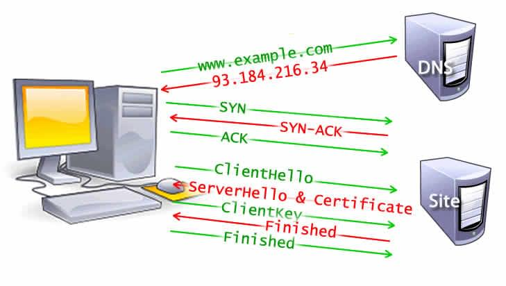

- 简单路径线：
	- 1. 键盘或触屏输入URL并回撤确认
	  2. URL解析/DNS解析查找域名IP地址
	  3. 网络连接发起HTTP请求
	  4. HTTP报文传输过程
	  5. 服务器接收数据
	  6. 服务器响应请求/MVC
	  7. 服务器返回数据
	  8. 客户端接受数据
	  9. 浏览器加载/渲染页面
	  10. 打印绘制输出
- ## 导航
	- 导航是加载 web 页面的第一步。它发生在以下情形：用户通过在地址栏输入一个 URL、点击一个链接、提交表单或者是其他的行为。
	- Web 性能优化的目标之一就是缩短导航完成所花费的时间，在理想情况下，它通常不会花费太多的时间，但是等待时间和带宽会导致它的延时。
	- > 上面一步操作系统 GUI 会将输入事件传递到浏览器中，在这过程中，浏览器可能会做一些预处理，甚至已经在智能匹配所有可能的URL了，他会从历史记录，书签等地方，找到已经输入的字符串可能对应的URL，来预估所输入字符对应的网站，然后给出智能提示，比如输入了「ba」，根据之前的历史发现 90% 的概率会访问「[www.baidu.com](https://link.jianshu.com?t=http://www.baidu.com) 」，因此就会在输入回车前就马上开始建立 TCP 链接了。对于 Chrome这种变态的浏览器，他甚至会直接从缓存中把网页渲染出来，就是说，你还没有按下「回车」键，页面就已经出来了，再比如Chrome会在浏览器启动时预先查询10个你有可能访问的域名等等
- ## [[DNS查询]]
	- 对于一个 web 页面来说导航的第一步是要去寻找页面资源的位置。如果导航到 `https://example.com` ，HTML 页面被定位到 IP 地址为 `93.184.216.34` 的服务器。如果以前没有访问过这个网站，就需要进行 DNS 查询。
	- 浏览器向**名称服务器**发起 DNS 查询请求，最终得到一个 IP 地址。第一次请求之后，这个 IP 地址可能会被缓存一段时间，这样可以通过从缓存里面检索 IP 地址而不是再通过名称服务器进行查询来加速后续的请求。
	- 通过主机名加载一个页面通常仅需要一次 DNS 查询。但是，对于页面指向的不同的主机名，则需要多次 DNS 查询。如果字体（fonts）、图像（images）、脚本（scripts）、广告（ads）和网站统计（metrics）都有不同的主机名，则需要对每一个主机名进行 DNS 查询。
	- #### DNS 在解析域名的时候有两种
	  collapsed:: true
		- 递归查询：
		  collapsed:: true
			- 一般来说，浏览器会首先查询**浏览器缓存**（DNS 在各个层级都有缓存的，相应的，缓存当然有过期时间，Time to live），如果没有找到，就会检查**系统缓存**，检查本地硬盘的hosts文件，这个文件保存了一些以前访问过的网站的域名和IP对应的数据。它就像是一个本地的数据库。如果找到就可以直接获取目标主机的IP地址了（注意这个地方存在安全隐患，如果有病毒把一些常用的域名，修改 hosts 文件，指向一些恶意的IP，那么浏览器也会不加判断的去连接，是的，这正是很多病毒的惯用手法）。如果本地hosts也没有找到的话，则需要再向上层找**路由器缓存**，路由器有自己的DNS缓存，可能就包括了查询的内容；如果还是没有，需要接着往上找，查询**ISP DNS 缓存**（本地名称服务器缓存，就是客户端电脑TCP/IP参数中设置的首选DNS服务器，此解析具有权威性。一般情况下你在不同的地区或者不同的网络，如电信、联通、移动的情况下，转换后的IP地址很可能是不一样的，这涉及到负载均衡，通过DNS解析域名时会将你的访问分配到不同的入口，先找附近的本地 DNS 服务器去请求解析域名，尽可能保证你所访问的入口是所有入口中较快的一个，这和[CDN](https://link.jianshu.com?t=http://baike.baidu.com/item/CDN)还不一样，比如我们经常使用的114.114.114.114或Google的8.8.8.8就是本地名称服务器）。如果附近的本地DNS服务器还是没有缓存我们请求的域名记录的话，这时候会根据本地DNS服务器的设置（是否设置转发器）进行查询，如果未用转发模式，则本地名称服务器再以DNS客户端的角色发送与前面一样的DNS域名查询请求转发给上一层。这里可能经过一次或者多次转发，从**本地名称服务器**到**权威名称服务器**再到**顶级名称服务器**最后到**根名称服务器**。（顺便一提，根服务器是互联网域名解析系统DNS中最高级别的域名服务器，全球一共13组，每组都只有一个主根名称服务器采用同一个IP。注意不是13个，前期是个现在已经是集群了，据说已经有上千台了，好多台用于负载均衡，备份等，全球有386台根物理服务器，被编号为A到M共13个标号。中国包括台港也持有其中5组14台辅根服务器或叫镜像也可以，386台根服务器总共只使用了13个IP，因此可以抵抗针对其所进行的分布式拒绝服务攻击DDoS。具体情况可以参看维基百科的 [根域名服务器](https://link.jianshu.com?t=http://zh.wikipedia.org/wiki/%E6%A0%B9%E5%9F%9F%E5%90%8D%E6%9C%8D%E5%8B%99%E5%99%A8) 条目）所以，最终请求到了根服务器后，根服务器查询发现我们这个被请求的域名是由类似A或者B这样的服务器解析的，但是，根服务器并不会送佛送到西地找A或B之类的直接去解析，因为它没有保存全部互联网域名记录，并不直接用于名称解析，它只是负责顶级名称服务器（如.com/.cn/.net等）的相关内容。所以它会把所查询得到的被请求的DNS域名中顶级域名所对应的顶级名称服务器IP地址返回给本地名称服务器。本地名称服务器拿到地址后再向对应的顶级名称服务器发送与前面一样的DNS域名查询请求。对应的顶级名称服务器在收到DNS查询请求后，也是先查询自己的缓存，如果有则直接把对应的记录项返回给本地名称服务器，然后再由本地名称服务器返回给DNS客户端，如果没有则向本地名称服务器返回所请求的DNS域名中的二级域名所对应的二级名称服务器（如[baidu.com/qq.com/net.cn](https://link.jianshu.com?t=http://baidu.com/qq.com/net.cn)等）地址。然后本地名称服务器继续按照前面介绍的方法一次次地向三级（如[www.baidu.com/www.qq.com/bbs.taobao.com](https://link.jianshu.com?t=http://www.baidu.com/www.qq.com/bbs.taobao.com)等）、四级名称服务器查询，直到最终的对应域名所在区域的权威名称服务器返回最终记录给本地名称服务器。同时本地名称服务器会缓存本次查询得到的记录项（每层都应该会缓存）。再层层下传，最后到了我们的DNS客户端机子，一次 DNS 解析请求就此完成。如果最终权威名称服务器都说找不到对应的域名记录，则会向本地名称服务器返回一条查询失败的DNS应答报文，这条报文最终也会由本地名称服务器返回给DNS客户端。当然，如果这个权威名称服务器上配置了指向其它名称服务器的转发器，则权威名称服务器还会在转发器指向的名称服务器上进一步查询。另外，如果DNS客户端上配置了多个DNS服务器，则还会继续向其它DNS服务器查询的。
			- 
			- 所以，我们看到DNS的域名解析是递归的，递归的DNS首先会查看自己的DNS缓存，如果缓存能够命中，那么就从缓存中把IP地址返回给浏览器，如果找不到对应的域名的IP地址，那么就依此层层向上转发请求，从根域名服务器到顶级域名服务器再到极限域名服务器依次搜索对应目标域名的IP，最高达到根节点，找到或者全部找不到为止。然后把找到的这个域名对应的 nameserver 的地址拿到，再向这个 namserver 去请求域名对应的IP，最后把这个IP地址返回给浏览器，在这个**递归查询**的过程中，对于浏览器来说是透明的，如果DNS客户端的本地名称服务器不能解析的话，则后面的查询都会以本地名称服务器为中心，全交由本地名称服务器代替DNS客户端进行查询，DNS客户端只是发出原始的域名查询请求报文，然后就一直处于坐等状态，直到本地名称服务器最终从权威名称服务器得到了正确的IP地址查询结果并返回给它。虽然递归查询是默认的DNS查询方式，但是如果有以下情况发生的话，则会使用迭代的查询方式进行。
			  情况一：DNS客户端的请求报文中没有申请使用递归查询，即在DNS请求报头部的RD字段没有置1。
			  情况二：DNS客户端的请求报文中申请使用的是递归查询（也就是RD字段置1了），但在所配置的本地名称服务器上是禁用递归查询了（即在应答DNS报文头部的RA字段置0）。
		- 迭代查询
		  collapsed:: true
			- 开始也是从浏览器缓存到系统缓存到路由缓存，如果还是没找到则客户端向本机配置的本地名称服务器（在此仅以首先DNS服务器为例进行介绍，其它备用DNS服务器的解析流程完全一样）发出DNS域名查询请求。本地名称服务器收到请求后，先查询本地的缓存，如果有该域名的记录项，则本地名称服务器就直接把查询的结果返回给客户端；如果本地缓存中没有该域名的记录，则向DNS客户端返回一条DNS应答报文，报文中会给出一些参考信息，如本地名称服务器上的根名称服务器地址等。DNS客户端在收到本地名称服务器的应答报文后，会根据其中的根名称服务器地址信息，向对应的根名称服务器再次发出与前面一样的DNS查询请求报文。根名称服务器在收到DNS查询请求报文后，通过查询自己的DNS数据库得到请求DNS域名中顶级域名所对应的顶级名称服务器信息，然后以一条DNS应答报文返回给DNS客户端。DNS客户端根据来自根名称服务器应答报文中的对应顶级名称服务器地址信息，向该顶级名称服务器发出与前面一样的DNS查询请求报文。顶级名称服务器在收到DNS查询请求后，先查询自己的缓存，如果有请求的DNS域名的记录项，则直接把对应的记录项返回给DNS客户端，否则通过查询后把对应域名中二级域名所对应的二级名称服务器地址信息以一条DNS应答报文返回给DNS客户端。然后DNS客户端继续按照前面介绍的方法一次次地向三级、四级名称服务器查询，直到最终的权威名称服务器返回到最终的记录。如果权威名称服务器也找不到对应的域名记录，则会向DNS客户端返回一条查询失败的DNS应答报文。当然，如果这个权威名称服务器上配置了指向其它名称服务器的转发器，则权威名称服务器还会在转发器指向的名称服务器上进一步查询。另外，如果DNS客户端上配置了多个DNS服务器，则还会继续向其它DNS服务器查询。
			- 
			- 所以，我们发现在递归查询中后面的查询工作是由本地名称服务器替代DNS客户端进行的（以“本地名称服务器”为中心），只需要本地名称服务器向DNS客户端返回最终的查询结果即可。而DNS迭代查询的所有查询工作则全部是DNS客户端自己进行（以“DNS客户端”自己为中心）。
		- DNS递归查询和迭代查询的区别？
			- 递归查询是以本地名称服务器为中心的，是DNS客户端和服务器之间的查询活动，递归查询的过程中“查询的递交者” 一直在更替，其结果是直接告诉DNS客户端需要查询的网站目标IP地址。
			- 迭代查询则是DNS客户端自己为中心的，是各个服务器和服务器之间的查询活动，迭代查询的过程中“查询的递交者”一直没变化，其结果是间接告诉DNS客户端另一个DNS服务器的地址。
			- 
			-
- ## [[TCP三次握手]]
	- 一旦获取到服务器 IP 地址，浏览器就会通过TCP “三次握手”与服务器建立连接。这个机制的是用来让两端尝试进行通信——在浏览器和服务器通过上层协议HTTPS发送数据之前，可以协商网络 TCP 套接字连接的一些参数。
	- TCP 的“三次握手”技术经常被称为“SYN-SYN-ACK”——更确切的说是 SYN、SYN-ACK、ACK——因为通过 TCP 首先发送了三个消息进行协商，然后在两台电脑之间开始一个 TCP 会话。是的，这意味着终端与每台服务器之间还要来回发送三条消息，而请求尚未发出。
	- 
	- ### [[TLS]] 协商
		- 为了在 HTTPS 上建立安全连接，另一种握手是必须的。更确切的说是TLS协商，它决定了什么密码将会被用来加密通信，验证服务器，在进行真实的数据传输之前建立安全连接。在发送真正的请求内容之前还需要三次往返服务器。
		- 
		- 虽然建立安全连接对增加了加载页面的等待时间，对于建立一个安全的连接来说，以增加等待时间为代价是值得的，因为在浏览器和 web 服务器之间传输的数据不可以被第三方解密。
		- 经过 8 次往返，浏览器终于可以发出请求。
- ## 响应
	- 一旦我们建立了到 web 服务器的连接，浏览器就代表用户发送一个初始的HTTP `GET` 请求，对于网站来说，这个请求通常是一个 HTML 文件。一旦服务器收到请求，它将使用相关的响应头和 HTML 的内容进行回复。
	- 初始请求的响应包含所接收数据的第一个字节。[Time to First Byte](https://developer.mozilla.org/zh-CN/docs/Glossary/time_to_first_byte)（TTFB）是用户通过点击链接进行请求与收到第一个 HTML 数据包之间的时间。第一个内容分块通常是 14KB 的数据。
	- 上面的例子中，这个请求肯定是小于 14KB 的，但是直到浏览器在解析阶段遇到链接时才会去请求链接的资源，下面有进行描述。
	- ### TCP 慢启动 / 14KB 规则
		- 第一个响应数据包是 14KB 大小的。这是慢启动的一部分，慢启动是一种均衡网络连接速度的算法。慢启动逐渐增加发送数据的数量直到达到网络的最大带宽。
		- 在[TCP 慢启动](https://developer.mozilla.org/zh-CN/docs/Glossary/TCP_slow_start)中，在收到初始包之后，服务器会将下一个数据包的大小加倍到大约 28KB。后续的数据包依次是前一个包大小的二倍直到达到预定的阈值，或者遇到拥塞。
		- 
		- 如果您听说过初始页面加载的 14KB 规则，TCP 慢启动就是初始响应为 14KB 的原因，也是为什么 web 性能优化需要将此初始 14KB 响应作为优化重点的原因。TCP 慢启动逐渐建立适合网络能力的传输速度，以避免拥塞。
		- ### 拥塞控制
			- 当服务器用 TCP 数据包来发送数据时，客户端通过返回确认帧来确认传输。由于硬件和网络条件，连接的容量是有限的。如果服务器太快地发送太多的包，它们可能会被丢弃。这意味着，将不会有确认帧的返回。服务器把它们当做确认帧丢失。拥塞控制算法使用这个发送包和确认帧流来确定发送速率。
- ## 解析
	- 总图
		- 
	- 一旦浏览器收到数据的第一块，它就可以开始解析收到的信息。[“解析”](https://developer.mozilla.org/zh-CN/docs/Glossary/Parse)是浏览器将通过网络接收的数据转换为[DOM](https://developer.mozilla.org/zh-CN/docs/Glossary/DOM)和[CSSOM](https://developer.mozilla.org/zh-CN/docs/Glossary/CSSOM)的步骤，通过渲染器把 DOM 和 CSSOM 在屏幕上绘制成页面。
	- DOM 是浏览器标记的内部表示。DOM 也是被暴露的，可以通过 JavaScript 中的各种 API 进行 DOM 操作。
	- 即使请求页面的 HTML 大于初始的 14KB 数据包，浏览器也将开始解析并尝试根据其拥有的数据进行渲染。这就是为什么在前 14KB 中包含浏览器开始渲染页面所需的所有内容，或者至少包含页面模板（第一次渲染所需的 CSS 和 HTML ）对于 web 性能优化来说是重要的。但是在渲染到屏幕上面之前，HTML、CSS、JavaScript 必须被解析完成。
	- ### 构建DOM树
		- 第一步是处理 HTML 标记并构造 DOM 树。HTML 解析涉及到[tokenization](https://developer.mozilla.org/zh-CN/docs/Web/API/DOMTokenList)和树的构造。HTML 标记包括开始和结束标记，以及属性名和值。 如果文档格式良好，则解析它会简单而快速。解析器将标记化的输入解析到文档中，构建文档树。
		- DOM 树描述了文档的内容。[ `<html>` ](https://developer.mozilla.org/zh-CN/docs/Web/HTML/Element/html)元素是第一个标签也是文档树的根节点。树反映了不同标记之间的关系和层次结构。嵌套在其他标记中的标记是子节点。DOM 节点的数量越多，构建 DOM 树所需的时间就越长。
		- 
		- 当解析器发现非阻塞资源，例如一张图片，浏览器会请求这些资源并且继续解析。当遇到一个 CSS 文件时，解析也可以继续进行，但是对于 `<script>` 标签（特别是没有[ `async` ](https://developer.mozilla.org/zh-CN/docs/Web/JavaScript/Reference/Statements/async_function)或者 `defer` 属性的）会阻塞渲染并停止 HTML 的解析。尽管浏览器的预加载扫描器加速了这个过程，但过多的脚本仍然是一个重要的瓶颈。
	- ### 预加载扫描器
		- 浏览器构建 DOM 树时，这个过程占用了主线程。当这种情况发生时，预加载扫描仪将解析可用的内容并请求高优先级资源，如 CSS、JavaScript 和 web 字体。多亏了预加载扫描器，我们不必等到解析器找到对外部资源的引用来请求它。它将在后台检索资源，以便在主 HTML 解析器到达请求的资源时，它们可能已经在运行，或者已经被下载。预加载扫描仪提供的优化减少了阻塞。
		- ```html
		  <link rel="stylesheet" src="styles.css"/>
		  <script src="myscript.js" async></script>
		  
		  <script src="anotherscript.js" async></script>
		  ```
		- 在这个例子中，当主线程在解析 HTML 和 CSS 时，预加载扫描器将找到脚本和图像，并开始下载它们。为了确保脚本不会阻塞进程，当 JavaScript 解析和执行顺序不重要时，可以添加 `async` 属性或 `defer` 属性。
		- 等待获取 CSS 不会阻塞 HTML 的解析或者下载，但是它确实会阻塞 JavaScript，因为 JavaScript 经常用于查询元素的 CSS 属性。
	- ### 构建CSSOM树
		- 第二步是处理 CSS 并构建 CSSOM 树。CSS 对象模型和 DOM 是相似的。DOM 和 CSSOM 是两棵树。它们是独立的数据结构。浏览器将 CSS 规则转换为可以理解和使用的样式映射。浏览器遍历 CSS 中的每个规则集，根据 CSS 选择器创建具有父、子和兄弟关系的节点树。
		- 与 HTML 一样，浏览器需要将接收到的 CSS 规则转换为可以使用的内容。因此，它重复了 HTML 到对象的过程，但对于 CSS。
		- CSSOM 树包括来自用户代理样式表的样式。浏览器从适用于节点的最通用规则开始，并通过应用更具体的规则递归地优化计算的样式。换句话说，它级联属性值。
		- 构建 CSSOM 非常非常快，并且在当前的开发工具中没有以独特的颜色显示。相反，开发人员工具中的“重新计算样式”显示解析 CSS、构建 CSSOM 树和递归计算计算样式所需的总时间。在 web 性能优化方面，它是可轻易实现的，因为创建 CSSOM 的总时间通常小于一次 DNS 查询所需的时间。
	- ### 其他过程
		- #### JavaScript 编译
			- 当 CSS 被解析并创建 CSSOM 时，其他资源，包括 JavaScript 文件正在下载（借助预加载扫描器）。JavaScript 被解释、编译、解析和执行。脚本被解析为抽象语法树。一些浏览器引擎使用[抽象语法树](https://zh.wikipedia.org/wiki/%E6%8A%BD%E8%B1%A1%E8%AF%AD%E6%B3%95%E6%A0%91)并将其传递到解释器中，输出在主线程上执行的字节码。这就是所谓的 JavaScript 编译。
		- #### 构建辅助功能树
			- 浏览器还构建辅助设备用于分析和解释内容的辅助功能（[accessibility](https://developer.mozilla.org/zh-CN/docs/learn/Accessibility)）树。无障碍对象模型（AOM）类似于 DOM 的语义版本。当 DOM 更新时，浏览器会更新辅助功能树。辅助技术本身无法修改无障碍树。
			- 在构建 AOM 之前，屏幕阅读器（[screen readers (en-US)](https://developer.mozilla.org/en-US/docs/Web/Accessibility/ARIA/ARIA_Screen_Reader_Implementors_Guide)）无法访问内容。
- ## 渲染
	- 渲染步骤包括样式、布局、绘制，在某些情况下还包括合成。在解析步骤中创建的 CSSOM 树和 DOM 树组合成一个 Render 树，然后用于计算每个可见元素的布局，然后将其绘制到屏幕上。在某些情况下，可以将内容提升到它们自己的层并进行合成，通过在 GPU 而不是 CPU 上绘制屏幕的一部分来提高性能，从而释放主线程
	- ### Style
		- 第三步是将 DOM 和 CSSOM 组合成一个 Render 树，计算样式树或渲染树从 DOM 树的根开始构建，遍历每个可见节点。
		- 像[ `<head>` ](https://developer.mozilla.org/zh-CN/docs/Web/HTML/Element/head)和它的子节点以及任何具有 `display: none` 样式的结点，例如 `script { display: none; }` （在 user agent stylesheets 可以看到这个样式）这些标签将不会显示，也就是它们不会出现在 Render 树上。具有 `visibility: hidden` 的节点会出现在 Render 树上，因为它们会占用空间。由于我们没有给出任何指令来覆盖用户代理的默认值，因此上面代码示例中的 `script` 节点将不会包含在 Render 树中。
		- 每个可见节点都应用了其 CSSOM 规则。Render 树保存所有具有内容和计算样式的可见节点——将所有相关样式匹配到 DOM 树中的每个可见节点，并根据[CSS 级联](https://developer.mozilla.org/en-US/docs/Web/CSS/Cascade)确定每个节点的计算样式。
	- ### Layout
		- 第四步是在渲染树上运行布局以计算每个节点的几何体。布局是确定呈现树中所有节点的宽度、高度和位置，以及确定页面上每个对象的大小和位置的过程。回流是对页面的任何部分或整个文档的任何后续大小和位置的确定。
		- 构建渲染树后，开始布局。渲染树标识显示哪些节点（即使不可见）及其计算样式，但不标识每个节点的尺寸或位置。为了确定每个对象的确切大小和位置，浏览器从渲染树的根开始遍历它。
		- 在网页上，大多数东西都是一个盒子。不同的设备和不同的桌面意味着无限数量的不同的视区大小。在此阶段，考虑到视区大小，浏览器将确定屏幕上所有不同框的尺寸。以视区的大小为基础，布局通常从 body 开始，用每个元素的框模型属性排列所有 body 的子孙元素的尺寸，为不知道其尺寸的替换元素（例如图像）提供占位符空间。
		- 第一次确定节点的大小和位置称为布局。随后对节点大小和位置的重新计算称为回流。在我们的示例中，假设初始布局发生在返回图像之前。由于我们没有声明图像的大小，因此一旦知道图像大小，就会有回流。
	- ### 绘制
		- 最后一步是将各个节点绘制到屏幕上，第一次出现的节点称为[first meaningful paint (en-US)](https://developer.mozilla.org/en-US/docs/Glossary/first_meaningful_paint)。在绘制或光栅化阶段，浏览器将在布局阶段计算的每个框转换为屏幕上的实际像素。绘画包括将元素的每个可视部分绘制到屏幕上，包括文本、颜色、边框、阴影和替换的元素（如按钮和图像）。浏览器需要非常快地完成这项工作。
		- 为了确保平滑滚动和动画，占据主线程的所有内容，包括计算样式，以及回流和绘制，必须让浏览器在 16.67 毫秒内完成。在 2048x1536 分辨率的 iPad 上，有超过 314.5 万像素将被绘制到屏幕上。那是很多像素需要快速绘制。为了确保重绘的速度比初始绘制的速度更快，屏幕上的绘图通常被分解成数层。如果发生这种情况，则需要进行合成。
		- 绘制可以将布局树中的元素分解为多个层。将内容提升到 GPU 上的层（而不是 CPU 上的主线程）可以提高绘制和重新绘制性能。有一些特定的属性和元素可以实例化一个层，包括[ `<video>` ](https://developer.mozilla.org/zh-CN/docs/Web/HTML/Element/video)和[ `<canvas>` ](https://developer.mozilla.org/zh-CN/docs/Web/HTML/Element/canvas)，任何 CSS 属性为[ `opacity` ](https://developer.mozilla.org/zh-CN/docs/Web/CSS/opacity)、3D[ `transform` ](https://developer.mozilla.org/zh-CN/docs/Web/CSS/transform)、[ `will-change` ](https://developer.mozilla.org/zh-CN/docs/Web/CSS/will-change)的元素，还有一些其他元素。这些节点将与子节点一起绘制到它们自己的层上，除非子节点由于上述一个（或多个）原因需要自己的层。
		- 分层确实可以提高性能，但是它以内存管理为代价，因此不应作为 web 性能优化策略的一部分过度使用。
	- ### Compositing
		- 当文档的各个部分以不同的层绘制，相互重叠时，必须进行合成，以确保它们以正确的顺序绘制到屏幕上，并正确显示内容。
		- 当页面继续加载资产时，可能会发生回流（回想一下我们迟到的示例图像），回流会触发重新绘制和重新组合。如果我们定义了图像的大小，就不需要重新绘制，只需要重新绘制需要重新绘制的层，并在必要时进行合成。但我们没有包括图像大小！从服务器获取图像后，渲染过程将返回到布局步骤并从那里重新开始。
- ## 交互
	- 一旦主线程绘制页面完成，你会认为我们已经“准备好了”，但事实并非如此。如果加载包含 JavaScript（并且延迟到[ `onload` ](https://developer.mozilla.org/zh-CN/docs/Web/API/Window/load_event)事件激发后执行），则主线程可能很忙，无法用于滚动、触摸和其他交互。
	- [Time to Interactive(en-US)](https://developer.mozilla.org/en-US/docs/Glossary/Time_to_interactive)（TTI）是测量从第一个请求导致 DNS 查询和 SSL 连接到页面可交互时所用的时间——可交互是[First Contentful Paint(en-US)](https://developer.mozilla.org/en-US/docs/Glossary/First_contentful_paint)之后的时间点，页面在 50ms 内响应用户的交互。如果主线程正在解析、编译和执行 JavaScript，则它不可用，因此无法及时（小于 50ms）响应用户交互。
	- 在我们的示例中，可能图像加载很快，但 `anotherscript.js` 文件可能是 2MB，而且用户的网络连接很慢。在这种情况下，用户可以非常快地看到页面，但是在下载、解析和执行脚本之前，就无法滚动。这不是一个好的用户体验。避免占用主线程，如下面的网页测试示例所示：
	- 
	- 在本例中，DOM 内容加载过程花费了超过 1.5 秒的时间，主线程在这段时间内完全被占用，对单击事件或屏幕点击没有响应。