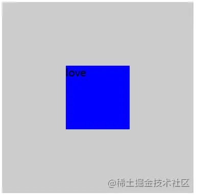
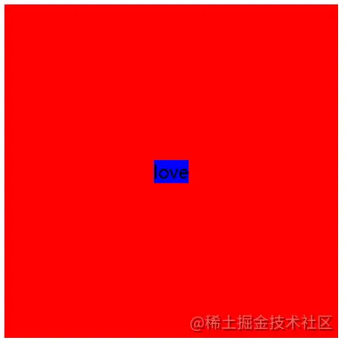
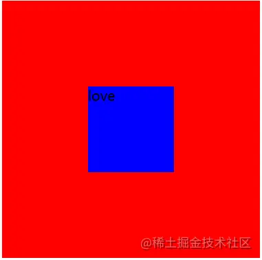
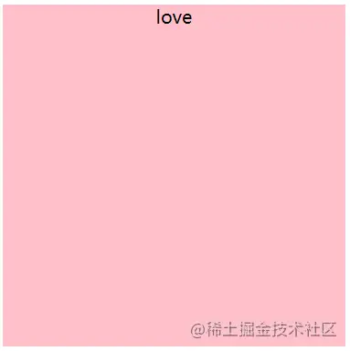

- ## 1. flex 布局实现 （元素已知宽度）
	- 效果图：
	- 
	- 内部 div 要有宽度
	- ```html
	  CSS 代码:
	  <style>        
	      .box{            
	          width: 300px;            
	          height: 300px;           
	          background-color: #ccc;            
	          display: flex;            
	          display: -webkit-flex;            
	          justify-content: center;            
	          align-items: center;        
	      }        
	      .box .a{            
	          width: 100px;            
	          height: 100px;            
	          background-color: blue;        
	      }    
	  </style>
	  HTML 代码：
	  <div class="box">        
	      <div class="a"></div>    
	  </div>
	  ```
- ## 2. position （元素已知宽度）
	- 父元素设置为：position: relative;
	- 子元素设置为：position: absolute;
	- 距上50%，据左50%，然后减去元素自身宽度的一半距离就可以实现
	- 效果图：
	- 
	- ```html
	  CSS代码：
	  <style>        
	      .box{            
	          width: 300px;            
	          height: 300px;            
	          background-color: red;            
	          position: relative;        
	      }        
	      .box .a{            
	          width: 100px;            
	          height: 100px;            
	          background-color: blue;            
	          position: absolute;            
	          left: 50%;            
	          top: 50%;            
	          margin: -50px 0 0 -50px;        
	      }    
	      </style>
	  
	  HTML 代码：
	  <div class="box">        
	      <div class="a">love</div>    
	  </div>
	  ```
- ## 3. position transform （元素未知宽度）
	- 如果元素未知宽度，只需将上面例子中的 `margin: -50px 0 0 -50px;` 替换为：`transform: translate(-50%,-50%);`
	- 效果图：
	- 
	- ```html
	  CSS 代码：
	  <style>        
	      .box{            
	          width: 300px;            
	          height: 300px;            
	          background-color: red;            
	          position: relative;        
	      }        
	      .box .a{            
	          background-color: blue;            
	          position: absolute;            
	          top: 50%;            
	          left: 50%;            
	          transform: translate(-50%, -50%);        
	      }    
	  </style>
	  ```
- ## 4. position（元素已知宽度）（left，right，top，bottom为0，maigin：auto ）
	- 效果图：
	- 
	- ```html
	  CSS 代码：
	  <style>        
	      .box{            
	          width: 300px;            
	          height: 300px;           
	          background-color: red;            
	          position: relative;        
	      }        
	      .box .a{            
	          width: 100px;            
	          height: 100px;            
	          background-color: blue;            
	          position: absolute;            
	          top: 0;            
	          bottom: 0;            
	          left: 0;            
	          right: 0;            
	          margin: auto;        
	      }    
	  </style>
	  HTML 代码：
	   <div class="box">        
	      <div class="a">love</div>    
	  </div>
	  ```
	- ### 如果子元素不设置宽度和高度，将会铺满整个父级（应用：模态框）
	  collapsed:: true
		- 效果图：
		- 
		- ```html
		  CSS 代码：
		  <style>        
		      .box{            
		          width: 300px;            
		          height: 300px;            
		          background-color: red;            
		          position: relative;        
		      }        
		      .box .a{            
		          /* 如果不设置宽高，将铺满整个父级*/            
		          background-color: pink;            
		          position: absolute;            
		          left: 0;            
		          right: 0;            
		          top: 0;            
		          bottom: 0;            
		          margin: auto;            
		          text-align: center;                    
		      }    
		  </style>
		  HTML:
		  <div class="box">
		      <div class="a">love</div>
		  </div>
		  ```
- ## 5. table-cell 布局实现
	- table 实现垂直居中，子集元素可以是块元素，也可以不是块元素
	- ```html
	  CSS：
	  <style>        
	      .box{            
	          width: 300px;            
	          height: 300px;            
	          background-color: red;            
	          display: table-cell;            
	          vertical-align: middle;                    
	      }        
	      .box .a{            
	          margin-left: 100px;            
	          width: 100px;            
	          height: 100px;            
	          background-color: blue;        
	      }    
	  </style>
	  
	  <div class="box">         
	      <div class="a">love</div>    
	  </div>
	  ```
	- ### 使内容（文字，图片）水平垂直居中（table-cell 布局）
		- 行元素 :  text-align ：center；
		- 块元素 ：margin ：0 auto；
		- ```html
		  text-align : center  给元素的父级加，可以使文本或者行级元素(例如：图片)水平居中
		  line-height : 值为元素的高度，可以使元素的文本内容垂直居中
		  margin: 0 auto 使用条件：父级元素宽度可有可无，子级元素必须使块元素，而且要有宽度（否则继承父级）
		  ```
		- `display：table-cell ` 会使元素表现的类似一个表格中的单元格td，利用这个特性可以实现文字的垂直居中效果。同时它也会破坏一些 CSS 属性，使用 table-cell 时最好不要与 float 以及 position: absolute 一起使用，设置了 table-cell 的元素对高度和宽度高度敏感，对margin值无反应，可以响 padding 的设置，表现几乎类似一个 td 元素。
		- 小结：
			- 1. 不要与 float：left， position : absolute， 一起使用
			- 2. 可以实现大小不固定元素的垂直居中
			- 3. margin 设置无效，响应 padding 设置
			- 4. 对高度和宽度高度敏感
			- 5. 不要对 display：table-cell 使用百分比设置宽度和高度
-