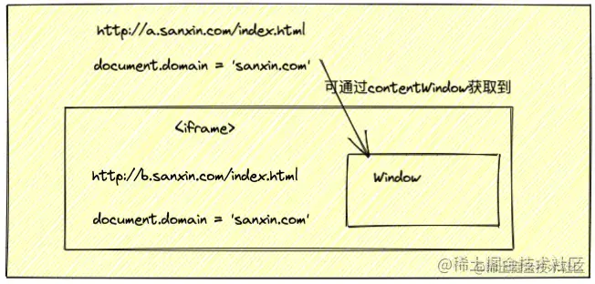

title:: document.domain + iframe

- 概述
	- 场景： `a.sanxin.com/index.html` 与 `b.sanxin.com/index.html` 之间的通信
	  其实上面这两个正常情况下是无法通信的，因为他们的 `域名` 不相同，属于跨域通信
	  那怎么办呢？其实他们有一个共同点，那就是他们的二级域名都是 `sanxin.com` ，这使得他们可以通过 `document.domain && iframe` 的方式来通信
	- 
	-