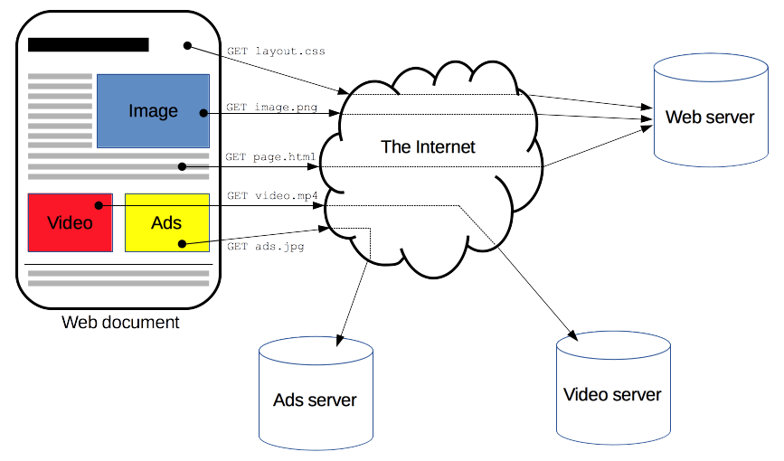
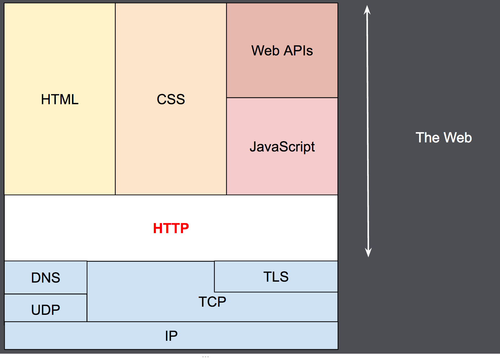
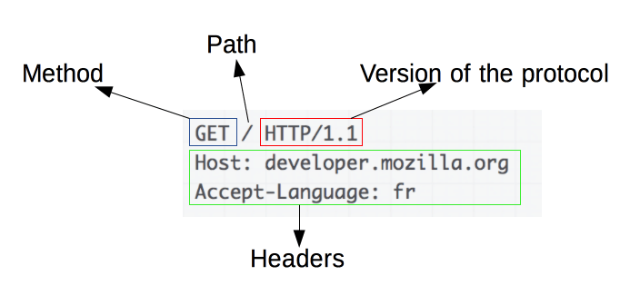
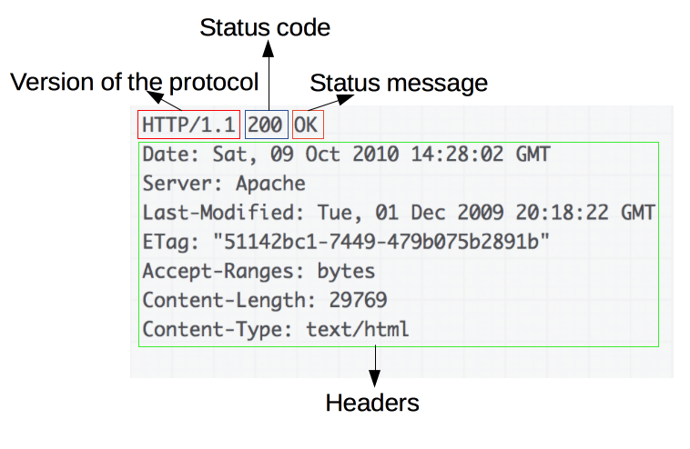

- 传送门：[http-mdn](https://developer.mozilla.org/zh-CN/docs/Web/HTTP/Overview)
  title:: HTTP
- ## 概述：
  collapsed:: true
	- HTTP是一种能够获取如HTML这样的网络资源的protocol(通信协议)。他是在Web上进行数据交互的基础，是一种client-server协议，也就是说，请求通常是由像浏览器这样的接收方发起的。一个完整的Web文档通常是由不同的子文档拼接而成的，像是文本、布局描述、图片、视频、脚本等等。
	- 
	- 客户端和服务端通过交换各自的消息（与数据流正好相反）进行交互。由像浏览器这样的客户端发出的消息叫做_request_，被服务端响应的消息叫做_response_。
	- 
	- HTTP 被设计于 20 世纪 90 年代初期，是一种可扩展的协议。它是应用层的协议，通过[TCP](https://developer.mozilla.org/zh-CN/docs/Glossary/TCP)，或者是[TLS](https://developer.mozilla.org/zh-CN/docs/Glossary/TLS)－加密的 TCP 连接来发送，理论上任何可靠的传输协议都可以使用。因为其良好的扩展性，时至今日，它不仅被用来传输超文本文档，还用来传输图片、视频或者向服务器发送如 HTML 表单这样的信息。HTTP 还可以根据网页需求，仅获取部分 Web 文档内容更新网页。
	-
- ## 基本性质
  collapsed:: true
	- 简单
		- 虽然下一代 HTTP/2 协议将 HTTP 消息封装到了帧（frames）中，HTTP 大体上还是被设计得简单易读。HTTP 报文能够被人读懂，还允许简单测试，降低了门槛，对新人很友好。
	- 可扩展
		- 在 HTTP/1.0 中出现的[HTTP headers](https://developer.mozilla.org/zh-CN/docs/Web/HTTP/Headers)让协议扩展变得非常容易。只要服务端和客户端就新 headers 达成语义一致，新功能就可以被轻松加入进来。
	- 无状态，有会话的
		- HTTP是无状态的：在同一个连接中，两个执行成功的请求之间是没有关系的。这就带来了一个问题，用户没有办法在同一个网站中进行连续的交互，比如在一个电商网站里，用户把某个商品加入到购物车，切换一个页面后再次添加了商品，这两次添加商品的请求之间没有关联，浏览器无法知道用户最终选择了哪些商品。而使用HTTP的头部扩展，HTTP Cookies就可以解决这个问题。把[[Cookies]]添加到头部中，创建一个会话让每次请求都能共享相同的上下文信息，达成相同的状态。
	- HTTP和连接
		- 一个连接是由传输层来控制的，这从根本上不属于HTTP的范围。HTTP并不需要其底层的传输层协议是面向连接的，只需要它是可靠的，或不丢失消息的（至少返回错误）。在互联网中，有两个常用的传输层协议： [[TCP]]是可靠的，而 [[UDP]]不是。因此，HTTP依赖于面向连接的[[TCP]]进行消息传递，但连接并不是必须的。
		- 为了减轻这些缺陷，[[HTTP\/1.1]]引入了流水线（被证明难以实现）和持久连接的概念：底层的TCP连接可以通过`Connection`头部来被部分控制。[[HTTP\/2]]则发展得更远，通过在一个连接复用消息得方式来让这个连接始终保持为暖连接。
		- 为了更好的适合 HTTP，设计一种更好传输协议的进程一直在进行。Google 就研发了一种以 UDP 为基础，能提供更可靠更高效的传输协议[QUIC](https://en.wikipedia.org/wiki/QUIC)。
	-
- ## HTTP能控制什么
	- 缓存：
		- 缓存文档如何缓存能通过HTTP来控制。服务端能告诉代理和客户端哪些文档需要被缓存，缓存多久，而客户端也能够命令中间的缓存代理来忽略存储的文档。
	- 同源策略：
		- 开放同源限制为了防止网络窃听和其他隐私泄露，浏览器强制对Web网站做了分割限制。只有来自于**相同来源**的网站才能够获取网站的全部信息。这样的限制有时反而成了负担，HTTP可以通过修改头部来开放这样的限制，因此Web文档可以是由不同域下的信息拼接成的（某些情况下，这样做还有安全隐私考虑）。
	- 认证：
		- 认证一些页面能够被保护起来，仅让特定的用户进行访问。基本的认证功能可以直接通过HTTP提供，使用Authenticate相似的头部即可，或用HTTP Cookies来设置指定的会话。
	- 代理和隧道
		- 代理和隧道通常情况下，服务器和/或客户端是处于内网的，对外网隐藏真实IP地址。因此HTTP请求就要通过代理越过这个网络屏障。但并非所有的代理都是HTTP代理。例如，SOCKS协议的代理就运作在更底层，一些像FTP这样的协议也能够被他们处理。
	- 会话
		- 会话使用HTTP Cookies允许你用一个服务端的状态发起请求，这就创建了会话。虽然基本的HTTP是无状态协议。这很有用，不仅是因为这能应用到像购物车这样的电商业务上，更是因为这使得任何网站都能轻松为用户指定展示内容了。
- ## [[HTTP流]]
	- 当客户端想要和服务端进行信息交互时（服务端时指最终服务器，或者时一个中间代理），过程表现为下面几步：
		- 1. 打开一个[[TCP]]连接：TCP连接被用来发送一条或多条请求，以及接受响应消息。客户端可能打开一条新的连接，或重用一个已经存在的连接，或者也可能开几个新的TCP连接连向服务端。
		- 2. 发送一个HTTP报文：[[HTTP报文]]（在[[HTTP\/2]]之前）是语义可读的。在HTTP/2中，这些简单的消息被封装在帧中，这使得报文不能被直接读取，但是原理仍是相同的。
		  ```xml
		  GET / HTTP/1.1
		  Host: developer.mozilla.org
		  Accept-Language: fr
		  ```
		- 3. 读取服务端返回的报文信息
		  ```xml
		  HTTP/1.1 200 OK
		  Date: Sat, 09 Oct 2010 14:28:02 GMT
		  Server: Apache
		  Last-Modified: Tue, 01 Dec 2009 20:18:22 GMT
		  ETag: "51142bc1-7449-479b075b2891b"
		  Accept-Ranges: bytes
		  Content-Length: 29769
		  Content-Type: text/html
		  
		  <!DOCTYPE html... (here comes the 29769 bytes of the requested web page)
		  ```
		- 4. 关闭连接或者为后续请求重用连接
	- 当 HTTP 流水线启动时，后续请求都可以不用等待第一个请求的成功响应就被发送。然而 HTTP 流水线已被证明很难在现有的网络中实现，因为现有网络中有很多老旧的软件与现代版本的软件共存。因此，HTTP 流水线已被在有多请求下表现得更稳健的 HTTP/2 的帧所取代。
- ## [[HTTP报文]]
	- [[HTTP\/1.1]]以及更早的HTTP协议报文都是语义可读的。在[[HTTP\/2]]中，这些报文被嵌入到了一个新的二进制结构，帧。帧玉奴徐实现很多优化，比如报文头部的压缩和复用。即使只有原始HTTP报文的一部分以HTTP/2发送出来，每条报文的语义依旧不变，客户端会重组原始HTTP/1.1请求。因此用HTTP/1.1格式来理解HTTP/2报文仍旧有效。
	- 有两种HTTP报文的类型，请求与响应，每种都有其特定的格式。
	- #### 请求
		- 
		- 请求由以下元素组成：
			- 一个HTTP的method，经常是由一个动词像[[GET]]，[[POST]]或者一个名词像[[OPTIONS]], [[HEAD]]来定义客户端的动作行为。通常客户端的操作都是获取资源(GET方法)或者发送HTML form表单(POST方法)，虽然在一些情况下也会有其他操作。
			- 要获取的资源的路径，通常是上下文中的很明显的元素资源的URL，他没有protocol(http://)，[[domain]](developer.mozilla.org)，或是TCP的[[port]](HTTP一般在80端口)。
			- HTTP协议版本号。
			- 为服务端表达其他信息的可选头部headers
			- 对于一些像[[POST]]这样的方法，报文的body就包含了发送的资源，这与响应报文的body类似。
	- #### 响应
		- 
		- 响应报文包含了下面的元素：
			- HTTP协议版本号；
			- 一个状态码(status code)，来告诉对应请求执行成功或失败，以及失败的原因；
			- 一个状态信息，这个信息是非权威的状态码描述信息，可以用服务端自行设定；
			- HTTP headers，与请求头部类似；
			- 可选项，比起请求报文，响应报文中更常见地包含获取的资源body；