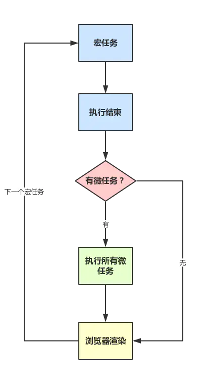

- ## 用法
	- 在下次DOM更新循环结束之后执行延迟回调。在修改数据之后立即使用这个方法，获取更新后的DOM。
	- ```js
	  // 修改数据
	  vm.msg = 'hello'
	  // Dom还没更新
	  Vue.nextTick(function() {
	    // DOM更新了
	  })
	  
	  // 作为一个Promise使用（2.1.0起新增，详见接下来的提示）
	  Vue.nextTick()
	  	.then(function() {
	    		// DOM更新了
	  	})
	  ```
- ## 源码实现
	- ```js
	  // The nextTick behavior leverages the microtask queue, which can be accessed
	  // via either native Promise.then or MutationObserver.
	  // MutationObserver has wider support, however it is seriously bugged in
	  // UIWebView in iOS >= 9.3.3 when triggered in touch event handlers. It
	  // completely stops working after triggering a few times... so, if native
	  // Promise is available, we will use it:
	  /* istanbul ignore next, $flow-disable-line */
	  if (typeof Promise !== 'undefined' && isNative(Promise)) {
	    const p = Promise.resolve()
	    timerFunc = () => {
	      p.then(flushCallbacks)
	      // In problematic UIWebViews, Promise.then doesn't completely break, but
	      // it can get stuck in a weird state where callbacks are pushed into the
	      // microtask queue but the queue isn't being flushed, until the browser
	      // needs to do some other work, e.g. handle a timer. Therefore we can
	      // "force" the microtask queue to be flushed by adding an empty timer.
	      if (isIOS) setTimeout(noop)
	    }
	    isUsingMicroTask = true
	  } else if (!isIE && typeof MutationObserver !== 'undefined' && (
	    isNative(MutationObserver) ||
	    // PhantomJS and iOS 7.x
	    MutationObserver.toString() === '[object MutationObserverConstructor]'
	  )) {
	    // Use MutationObserver where native Promise is not available,
	    // e.g. PhantomJS, iOS7, Android 4.4
	    // (#6466 MutationObserver is unreliable in IE11)
	    let counter = 1
	    const observer = new MutationObserver(flushCallbacks)
	    const textNode = document.createTextNode(String(counter))
	    observer.observe(textNode, {
	      characterData: true
	    })
	    timerFunc = () => {
	      counter = (counter + 1) % 2
	      textNode.data = String(counter)
	    }
	    isUsingMicroTask = true
	  } else if (typeof setImmediate !== 'undefined' && isNative(setImmediate)) {
	    // Fallback to setImmediate.
	    // Technically it leverages the (macro) task queue,
	    // but it is still a better choice than setTimeout.
	    timerFunc = () => {
	      setImmediate(flushCallbacks)
	    }
	  } else {
	    // Fallback to setTimeout.
	    timerFunc = () => {
	      setTimeout(flushCallbacks, 0)
	    }
	  }
	  ```
	- 可以看到上面有几个条件判断
		- 如果支持 Promise 就用 `Promise`
		- 如果不支持就用 MutationObserver[MDN-MutationObserver](https://developer.mozilla.org/zh-CN/docs/Web/API/MutationObserver)，MutationObserver 它会在指定的DOM发生变化时被调用
		- 如果不支持 MutationObserver 的话就用 setImmediate[MDN-setImmediate](https://developer.mozilla.org/zh-CN/docs/Web/API/Window/setImmediate)但是这个特性只有最新版IE和node支持
		- 然后是最后一个条件 如果这些都不支持的话就用setTimeout。看完这一段其实也很懵，为什么要这样设计呢？为什么要这样一个顺序来判断呢？说到这里就不得不讨论JavaScript 运行机制（Event Loop）&微任务宏任务了。
- [[事件循环]]
	- ### 单线程
		- JS是单线程，同一个时间只能做一件事。至于JS为什么是单线程？
		- > JavaScript的单线程，与它的用途有关。作为浏览器脚本语言，JavaScript的主要用途是与用户互动，以及操作DOM。这决定了它只能是单线程，否则会带来很复杂的同步问题。比如，假定JavaScript同时有两个线程，一个线程在某个DOM节点上添加内容，另一个线程删除了这个节点，这时浏览器应该以哪个线程为准？所以，为了避免复杂性，从一诞生，JavaScript就是单线程，这已经成了这门语言的核心特征，将来也不会改变。
	- ### 同步和异步
		- js里的任务分为两种：同步任务（synchronous）和异步任务（asynchronous）。同步阻塞异步非阻塞。同步任务指的是，在主线程上排队执行的任务，只有前一个任务执行完毕，才能执行后一个任务，例如alert，会阻塞后续任务的执行，只有在点击确定之后，才会执行下一个任务。异步任务指的是，不进入主线程、而进入"任务队列"（task queue）的任务，只有"任务队列"通知主线程，某个异步任务可以执行了，该任务才会进入主线程执行。单线程就意味着，所有任务需要排队，前一个任务结束，才会执行后一个任务。所以会有任务队列的概念。正因为是单线程，所以所有任务都是主线程执行的，异步请求这些也不会开辟新的线程，而是放到任务队列，当这些异步操作被触发时才进入主线程执行。
	- ### 宏任务和微任务
		- JS任务又分为宏任务和微任务。宏任务（macrotask）：setTimeout、setInterval、setImmediate、I/O、UI rendering微任务（microtask）：promise.then、process.nextTick、MutationObserver、queneMicrotask(开启一个微任务)
		- 宏任务按顺序执行，且浏览器在每个宏任务之间渲染页面浏览器为了能够使得JS内部task与DOM任务能够有序的执行，会在一个task执行结束后，在下一个 task 执行开始前，对页面进行重新渲染 （task->渲染->task->...）
		- 微任务通常来说就是需要在当前 task 执行结束后立即执行的任务，比如对一系列动作做出反馈，或或者是需要异步的执行任务而又不需要分配一个新的 task，这样便可以减小一点性能的开销。只要执行栈中没有其他的js代码正在执行且当前宏任务执行完，微任务队列会立即执行。如果在微任务执行期间微任务队列加入了新的微任务，会将新的微任务加入队列尾部，之后也会被执行。
		- 何时使用微任务
		- > 微任务的执行时机，晚于当前本轮事件循环的 Call Stack(调用栈)中的代码（宏任务），早于事件处理函数和定时器的回调函数
		- 使用微任务的原因
		- > 减少操作中用户可感知到的延迟确保任务顺序的一致性，即便当结果或数据是同步可用的批量操作的优化
		- 了解了宏任务和微任务的执行顺序，就可以了解到为何nextTick 要优先使用 `Promise` 和 `MutationObserver` 因为他俩属于微任务，会在执行栈空闲的时候立即执行，它的响应速度相比setTimeout会更快，因为无需等渲染。
		- 而setImmediate和setTimeout属于宏任务，执行开始之前要等渲染，即task->渲染->task。
		- 
		-