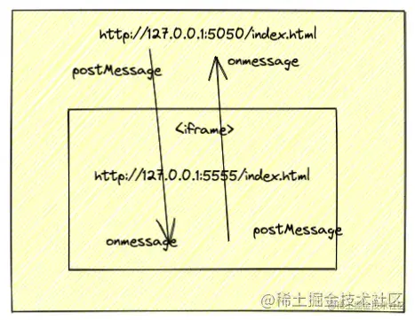

- 概述
	- 场景： `http://127.0.0.1:5500/index.html` 页面中使用了 `iframe标签` 内嵌了 `http://127.0.0.1:5555/index.html` 的页面
	  虽然这两个页面存在于一个页面中，但是需要 `iframe标签` 来嵌套才行，这两个页面之间是无法进行通信的，因为他们 `端口号` 不同，根据 `同源策略` ，他们之间存在 `跨域问题` 
	  那应该怎么办呢？使用 `postMessage` 可以使这两个页面进行通信
	- 
	-