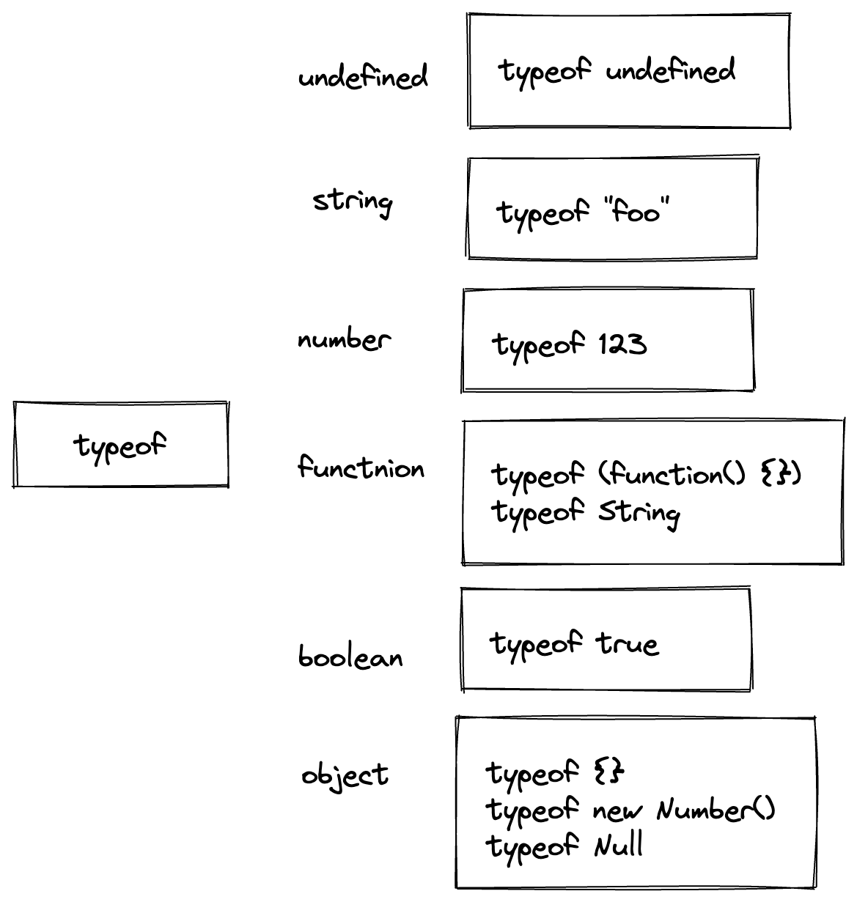

- 文档：[MDN](https://developer.mozilla.org/zh-CN/docs/Web/JavaScript/Reference/Operators/typeof)
- ```js
  console.log(typeof('yy')) // string
  console.log(typeof 'yy')  // string
  ```
- 在 ES6 前，JavaScript 共六种数据类型，分别是：
- [[undefined]]、[[Null]]、[[Boolean]]、[[Number]]、[[String]]、[[Object]]
- 然而当我们使用 typeof 对这些数据类型的值进行操作的时候，返回的结果却不是一一对应，分别是： #.ol
	- undefined
	- object
	- boolean
	- number
	- string
- Null 和 Object 类型都返回了 object 字符串。
- typeof 能检测出函数类型：
- ```js
  function a() { }
  console.log(typeof a); // function
  ```
- 所以 typeof 能检测出六种类型的值，但是，除此之外 Object 下还有很多细分的类型呐，如 Array、Function、Date、RegExp、Error 等。
- 用 typeof 去检测这些类型，返回的都是 object;：
- ```js
  var date = new Date();
  var error = new Error();
  console.log(typeof date); // object
  console.log(typeof error); // object
  ```
- {:height 462, :width 431}