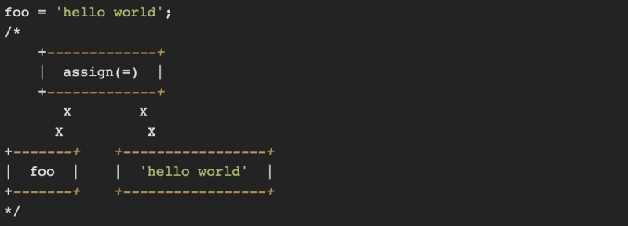
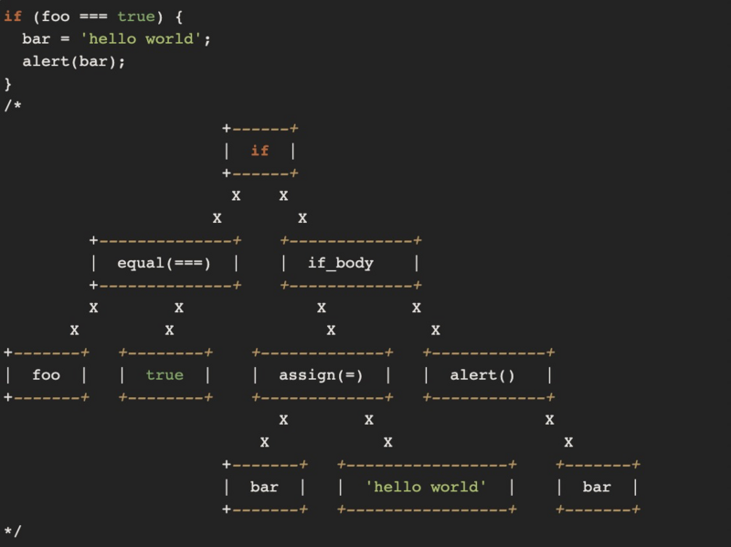
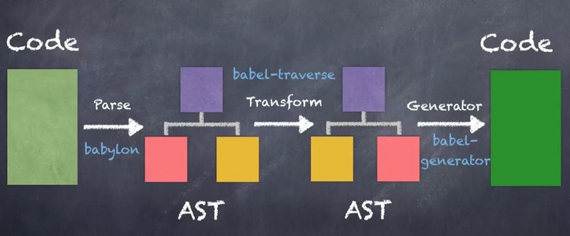
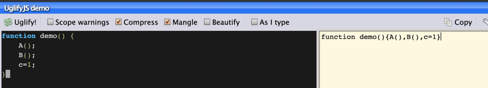

# JS代码是如何被压缩的
- ## 1. AST（抽象语法树）
	- > 抽象语法树：AST（Abstract Syntax Tree)，是[源代码](https://www.h5w3.com/tag/%E6%BA%90%E4%BB%A3%E7%A0%81)的抽象语法结构的树状表现形式，这里特指编程语言的源代码。树上的每个节点都表示源代码中的一种结构。之所以说语法是「抽象」的，是因为这里的语法并不会表示出真实语法中出现的每个细节。
	- 例如：
	- 
	- 
	- 从上面两个例子中，可以看出AST是源代码根据其语法结构，省略一些细节（比如：括号没有生成节点），抽象成树形表达。抽象语法树在计算机科学中有很多应用，比如编译器、IDE、压缩代码、格式化代码等。
- ## 2. 代码压缩原理
	- 了解了AST之后，我们再分析一下JS的代码压缩原理。简单的说，就是
		- 1. 将code转换成AST
		  2. 将AST进行优化，生成一个更小的AST
		  3. 将新生成的AST再转化成code
	- babel，eslint，v8的逻辑均与此类似，下图是我们引用了babel的转化示意图：
	- 
	- 以我们之前被质疑的代码为例，看看它在uglify中是怎么样一步一步被压缩的：
	- ```js
	  // uglify-js的版本需要为2.x, 3.0之后uglifyjs不再暴露Compressor api
	  // 2.x的uglify不能自动解析es6，所以这里先切换成es5
	  
	  // npm install uglify-js@2.x
	  
	  var UglifyJS = require('uglify-js');
	  
	  // 原始代码
	  
	  var code = `var a;
	  
	  var x = { b: 123 };
	  
	  a = 123,
	  
	  delete x`;
	  
	  // 通过 UglifyJS 把代码解析为 AST
	  
	  var ast = UglifyJS.parse(code);
	  
	  ast.figure_out_scope();
	  
	  // 转化为一颗更小的 AST 树
	  
	  compressor = UglifyJS.Compressor();
	  
	  ast = ast.transform(compressor);
	  
	  // 再把 AST 转化为代码
	  
	  code = ast.print_to_string();
	  
	  // var a,x={b:123};a=123,delete x;
	  
	  console.log("code", code);
	  ```
	- 到这里，我们已经了解了uglifyjs的代码压缩原理，但是还没有解决一个问题——为什么某些语句间的分号会被转换为逗号，某些不会转换。这就涉及到了uglifyjs的压缩规则。
- ## 3. 代码压缩规则
	- 由于uglifyjs的代码压缩规则很多，我们这里只分析与本文中相关的部分:
	- 
	- 这其中需要注意的是只有“表达式语句”才能被合并，那么什么是表达式语句呢？
	- 表达式 VS 语句 VS 表达式语句
	- 例如：
	- ```js
	  a; //返回a的值
	  b + 3; // 返回b+3的结果
	  ```
	- 例如：
	- ```js
	  if(x > 0) {
	  ...
	  }
	  
	  for(var i = 0;i < arr.length; i ++) {
	  ...
	  }
	  
	  const a = 123;
	  ```
	- 例如：
	- ```js
	  A();
	  function() {}();
	  
	  delete x.b;
	  
	  b = b + 3;
	  ```
	- 综上所述，因为a = 123 和 delete x都是表达式语句，所以分号被转换为逗号。而var x = {b:123}则因为是声明语句，所以和a=123不会合并，分号不会被转换。但var x = {b:123}和第一行var a又触发了另外一条规则，
	- 所以第一行和第二行会被合并为var a,x={b:123}