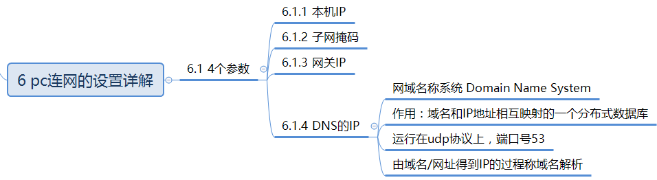

- > OSI: open system interconnection 开放式系统互联参考模型
- ## OSI 和TCP/IP 的对应关系和协议
	- 
- ### OSI模型各层的基本作用
	- 
	- 物理层
		- 
	- 数据链路层
		- 
	- 网络层
		- 
	- 传输层
		- 
	- 应用层
		- 
	- 以下为补充内容，可以帮助理解
		- pc连网的设置详解
			- 
		- 数据链路层数据包（以太网数据包）格式，除了应用层没有头部，其他都有
			- 
		- 由于以太网数据包的数据部分，最大长度为1500字节，当IP包过大时，会分割下来，但是每个分割包的头部都一样
			- 
		- 数据包在传送时的封装和解封装如下所示
			- 
			-
-