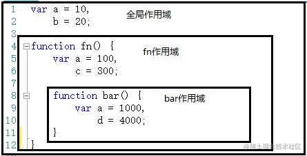

- 概述
	- 作用域是当前的执行上下文，值和表达式在其中“可见”或可被访问。如果一个变量或表达式不在当前的作用域中，那么它是不可用的。作用于也可以堆叠成层次结构，子作用于可以访问父作用域，反过来则不行。
- 分类
	- JavaScript的作用域可分为以下三种
		- `全局作用域`：脚本模式运行所有代码的默认作用域
		- `模块作用域`：模块模式中运行代码的作用域
		- `函数作用域`：由函数创建的作用域
	- 此外，用[[let]]或 [[const]]声明的变量属于额外的作用域：
		- `块级作用域`：用一对花括号（一个代码块）创建出来的作用域
- 示例
	- 函数作用域
		- 由于函数会创建作用域，因此在函数中定义的变量无法从该函数外部访问，也无法从其他函数内部访问，例如，下面的代码是无效的
		- ```js
		  function exampleFunction() {
		    var x = "declared inside function" // x 只能在exampleFunction函数中使用
		    console.log("Inside function")
		    console.log(x)
		  }
		  console.log(x) // 报错
		  ```
		- 但是，下面的代码是有效的，因为变量在函数外被声明，为全局变量
		- ```js
		  var x = "declared inside function"
		  
		  exampleFunction() 
		  
		  function exampleFunction() {
		    console.log("Inside function")
		    console.log(x)
		  }
		  console.log('Outside function')
		  console.log(x)
		  ```
	- 块级作用域
		- 只对`let`和`const`声明有效，对`var`声明无效
		- ```js
		  {
		    var x = 1
		  }
		  console.log(x) // 1
		  ```
		- ```js
		  {
		    const x = 1;
		  }
		  console.log(x); // ReferenceError: x is not defined
		  ```
- 概述
	- 在JavaScript中，作用域可分为`全局作用域`和`函数作用域`
		- 全局作用域
			- 代码在程序任何地方都能访问，window对象的内置属性都属于全局作用域
		- 函数作用域
			- 在固定的代码片段才能被访问
			- 
	- 作用域有上下级关系，上下级关系的确定就看函数是在哪个作用域下创建的。如上，fn作用域下创建bar函数，那么“fn作用域“就是”bar作用域”的上级。
	- 作用域最大的用于就是隔离变量，不同作用域下同名变量不会有冲突
-