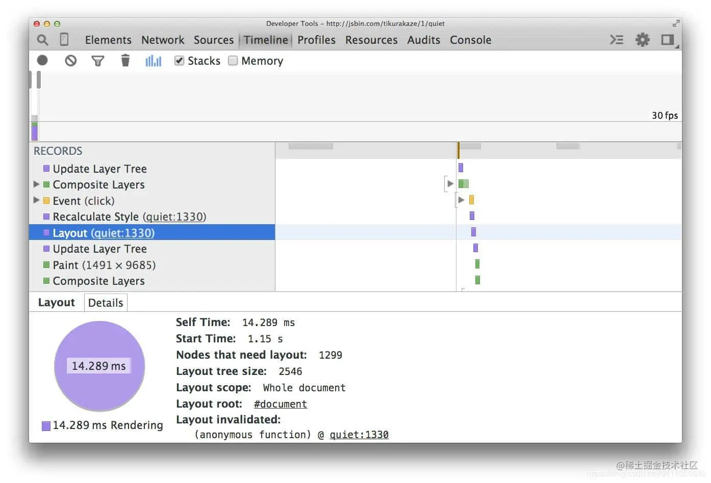
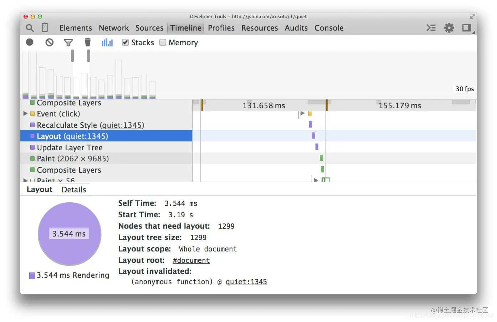

- 在早期的 CSS 布局方式中我们能对元素实行绝对定位、相对定位或浮动定位。而现在，我们有了新的布局方式[flexbox](https://link.juejin.cn/?target=https%3A%2F%2Fdeveloper.mozilla.org%2Fzh-CN%2Fdocs%2FWeb%2FCSS%2FCSS_Flexible_Box_Layout%2FBasic_Concepts_of_Flexbox)，它比起早期的布局方式来说有个优势，那就是性能比较好。
- 下面的截图显示了在 1300 个框上使用浮动的布局开销：
- 
- 然后我们用 flexbox 来重现这个例子：
	- 
- 现在，对于相同数量的元素和相同的视觉外观，布局的时间要少得多（本例中为分别 3.5 毫秒和 14 毫秒）。
- 不过 flexbox 兼容性还是有点问题，不是所有浏览器都支持它，所以要谨慎使用。
- 各浏览器兼容性：
	- Chrome 29+
	- Firefox 28+
	- Internet Explorer 11
	- Opera 17+
	- Safari 6.1+ (prefixed with -webkit-)
	- Android 4.4+
	- iOS 7.1+ (prefixed with -webkit-)
- ### 参考资料：
	- [使用 flexbox 而不是较早的布局模型](https://link.juejin.cn?target=https%3A%2F%2Fdevelopers.google.com%2Fweb%2Ffundamentals%2Fperformance%2Frendering%2Favoid-large-complex-layouts-and-layout-thrashing%3Fhl%3Dzh-cn)