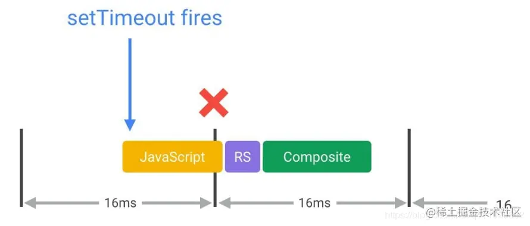

- 大多数设备屏幕刷新率为 60 次/秒，也就是说每一帧的平均时间为 16.66 毫秒。在使用 JavaScript 实现动画效果的时候，最好的情况就是每次代码都是在帧的开头开始执行。而保证 JavaScript 在帧开始时运行的唯一方式是使用  `requestAnimationFrame` 。
- ```
  /**
   * If run as a requestAnimationFrame callback, this
   * will be run at the start of the frame.
   */
  function updateScreen(time) {
    // Make visual updates here.
  }
  
  requestAnimationFrame(updateScreen);
  ```
- 如果采取 `setTimeout` 或 `setInterval` 来实现动画的话，回调函数将在帧中的某个时点运行，可能刚好在末尾，而这可能经常会使我们丢失帧，导致卡顿。
- 
- 参考资料：
	- [优化 JavaScript 执行](https://link.juejin.cn/?target=https%3A%2F%2Fdevelopers.google.com%2Fweb%2Ffundamentals%2Fperformance%2Frendering%2Foptimize-javascript-execution%3Fhl%3Dzh-cn)