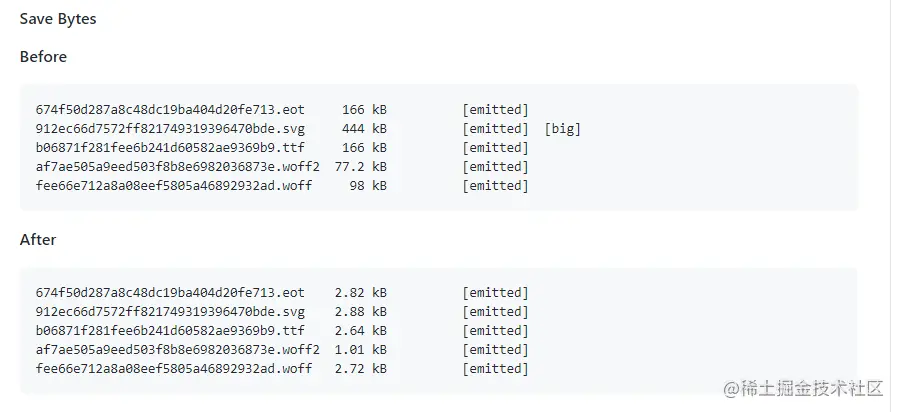

- 字体图标就是将图标制作成一个字体，使用时就跟字体一样，可以设置属性，例如 font-size、color 等等，非常方便。并且字体图标是矢量图，不会失真。还有一个优点是生成的文件特别小。
- ### 压缩字体文件
	- 使用[fontmin-webpack](https://link.juejin.cn/?target=https%3A%2F%2Fgithub.com%2Fpatrickhulce%2Ffontmin-webpack)插件对字体文件进行压缩
	- 
	- 参考资料：
	- [fontmin-webpack](https://link.juejin.cn/?target=https%3A%2F%2Fgithub.com%2Fpatrickhulce%2Ffontmin-webpack)
	- [Iconfont-阿里巴巴矢量图标库](https://link.juejin.cn/?target=https%3A%2F%2Fwww.iconfont.cn%2F)