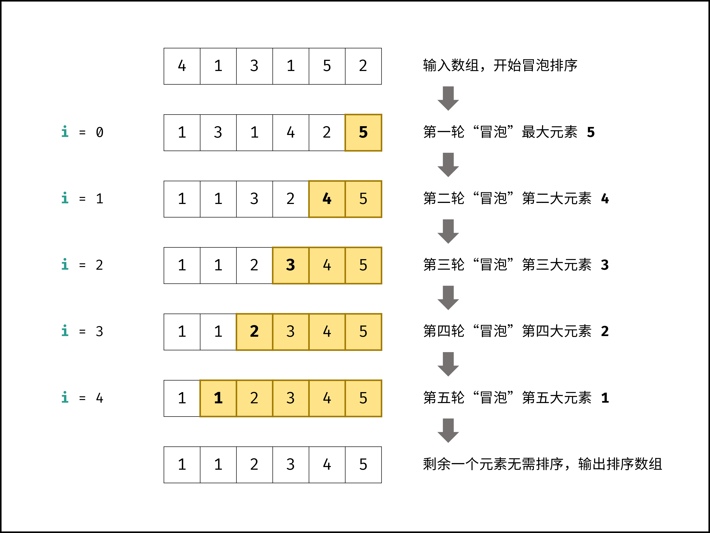

- # 算法解析
	- 冒泡排序是最基础的排序算法，由于其直观性，经常作为首个介绍的排序算法。其原理为：
	- **内循环：**使用相邻双指针 `j` , `j + 1` 从左至右遍历，依次比较相邻元素大小，若左元素大于右元素则将它们交换；遍历完成时，**最大元素会被交换至数组最右边**。
	- **外循环：**不断重复「内循环」，每轮将当前最大元素交换至**剩余未排序数组最右边**，直至所有元素都被交换至正确位置时结束。
	- 如下图所示，冒泡排序的「外循环」共N−1轮，每轮「内循环」都将当前最大元素交换至数组最右边，从而完成对整个数组的排序。
	- 
	- #### 复杂度分析：
		- **时间复杂度O(N2)：**其中N为输入数组的元素数量；「外循环」共N−1轮，使用O(N)时间；每轮「内循环」分别遍历N−1,N−2,⋯,2,1次，平均2N​次，使用O(2N​)=O(N)时间；因此，总体时间复杂度为O(N2)。
		- **空间复杂度O(1)：**只需原地交换元素，使用常数大小的额外空间。
	- #### [](https://leetcode.cn/leetbook/read/illustration-of-algorithm/phn3m1/#%E7%AE%97%E6%B3%95%E7%89%B9%E6%80%A7%EF%BC%9A) 算法特性：
		- 时间复杂度为O(N2)，因为其是通过不断**交换元素**实现排序（交换 2 个元素需要 3 次赋值操作），因此速度较慢；
		- **原地：**指针变量仅使用常数大小额外空间，空间复杂度为O(1)；
		- **稳定：**元素值相同时不交换，因此不会改变相同元素的相对位置；
		- **自适应：**通过增加一个标志位 `flag` ，若某轮内循环未执行任何交换操作时，说明已经完成排序，因此直接返回。此优化使冒泡排序的最优时间复杂度达到O(N)（当输入数组已排序时）；
- # 实现
	- ```js
	  function bubble_sort(nums) {
	    for (var i = 0; i < nums.length - 1; i++) {
	      for (var j = 0; j < nums.length - i - 1; j++) {
	        if (nums[j] > nums[j + 1]) {
	          var tmp = nums[j];
	          nums[j] = nums[j + 1];
	          nums[j + 1] = tmp;
	        }
	      }
	    }
	  }
	  ```
	- ### 效率优化
	- > 以上普通冒泡排序的时间复杂度恒为O(N2)​ ，与输入数组的元素分布无关。
	- 通过增加一个标志位 `flag` ，若在某轮「内循环」中未执行任何交换操作，则说明数组已经完成排序，直接返回结果即可。
	- 优化后的冒泡排序的最差和平均时间复杂度仍为O(N2)；在输入数组**已排序**时，达到**最佳时间复杂度**Ω(N)。
	- ```c++
	  void bubbleSort(vector<int> &nums) {
	  	int N = nums.size();
	  	for (int i = 0; i < N - 1; i++) {
	  		bool flag = false;   // 初始化标志位
	  		for (int j = 0; j < N - i - 1; j++) {
	  			if (nums[j] > nums[j + 1]) {
	  				swap(nums[j], nums[j + 1]);
	  				flag = true; // 记录交换元素
	  			}
	  		}
	  		if (!flag) break;    // 内循环未交换任何元素，则跳出
	  	}
	  }
	  ```