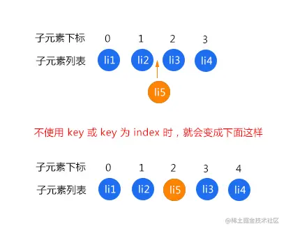
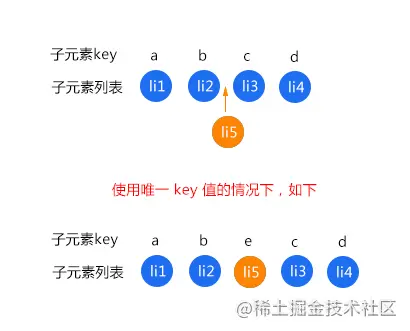

- 比如有一个列表，我们需要在中间插入一个元素，在不使用 key 或者使用 index 作为 key 会发生什么变化呢？先看个图
- 
- 如图的  `li1`  和  `li2`  不会重新渲染，这个没有争议的。而  `li3、li4、li5`  都会重新渲染
- 因为在不使用  `key`  或者列表的  `index`  作为  `key`  的时候，每个元素对应的位置关系都是 index，上图中的结果直接导致我们插入的元素到后面的全部元素，对应的位置关系都发生了变更，所以在 patch 过程中会将它们全都执行更新操作，再重新渲染。这可不是我们想要的，我们希望的是渲染添加的那一个元素，其他四个元素不做任何变更，也就不要重新渲染
- 而在使用唯一  `key`   的情况下，每个元素对应的位置关系就是  `key` ，来看一下使用唯一  `key`  值的情况下
- 
- 这样如图中的 `li3` 和 `li4` 就不会重新渲染，因为元素内容没发生改变，对应的位置关系也没有发生改变。
- 这也是为什么 v-for 必须要写 key，而且不建议开发中使用数组的 index 作为 key 的原因