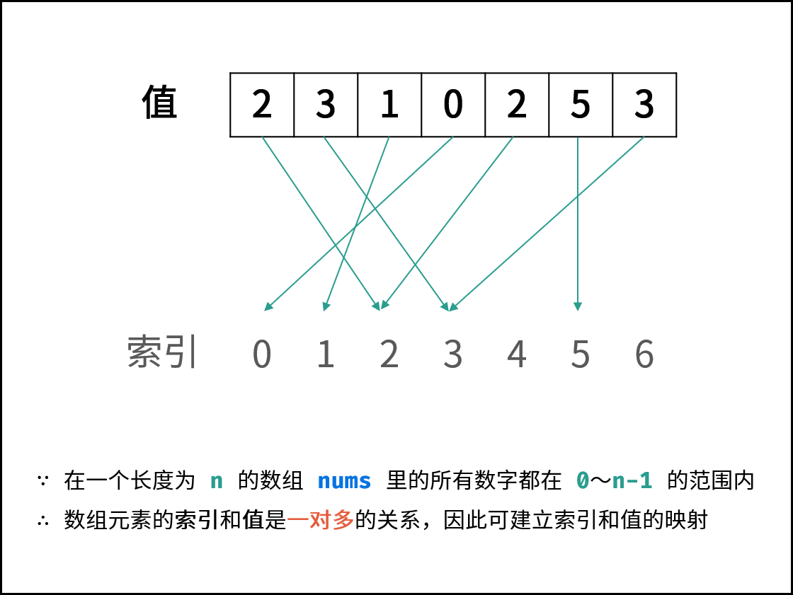

- # 题目描述
	- 找出数组中重复的数字。
	- 在一个长度为 n 的数组 nums 里的所有数字都在 0～n-1 的范围内。数组中某些数字是重复的，但不知道有几个数字重复了，也不知道每个数字重复了几次。请找出数组中任意一个重复的数字。
	- 示例 1：
		- ```
		  输入：
		  [2, 3, 1, 0, 2, 5, 3]
		  输出：2 或 3
		  ```
- # 题目解析
	- ## 方法一：哈希表 / Set
	- 利用数据结构特点，容易想到使用哈希表（Set）记录数组的各个数字，当查找到重复数字则直接返回。
	- 算法流程：
		- 1. 初始化： 新建 HashSet ，记为 dicdic ；
		- 2. 遍历数组 numsnums 中的每个数字 numnum ：
			- 1. 当 numnum 在 dicdic 中，说明重复，直接返回 numnum ；
			- 2. 将 numnum 添加至 dicdic 中；
		- 3. 返回 -1−1 。本题中一定有重复数字，因此这里返回多少都可以。
	- 实现
		- ```js
		  /**
		   * @param {number[]} nums
		   * @return {number}
		   */
		  var findRepeatNumber = function(nums) {
		      var map = {} 
		      for(var item of nums) {
		          if(!map[item]) {
		              map[item] = 1
		          } else {
		              return item
		          }
		      }
		      return -1
		  };
		  ```
	-
- # 方法二：原地交换
	- 题目说明尚未被充分使用，即 在一个长度为 n 的数组 nums 里的所有数字都在 0 ~ n-1 的范围内 。 此说明含义：数组元素的 索引 和 值 是 一对多 的关系。
	  因此，可遍历数组并通过交换操作，使元素的 索引 与 值 一一对应（即 nums[i] = inums[i]=i ）。因而，就能通过索引映射对应的值，起到与字典等价的作用。
	- 
	- 遍历中，第一次遇到数字 xx 时，将其交换至索引 xx 处；而当第二次遇到数字 xx 时，一定有 nums[x] = xnums[x]=x ，此时即可得到一组重复数字。
	- 算法流程：
		- 1. 遍历数组 numsnums ，设索引初始值为 i = 0i=0 :
			- 1. 若 nums[i] = inums[i]=i ： 说明此数字已在对应索引位置，无需交换，因此跳过；
			- 2. 若 nums[nums[i]] = nums[i]nums[nums[i]]=nums[i] ： 代表索引 nums[i]nums[i] 处和索引 ii 处的元素值都为 nums[i]nums[i] ，即找到一组重复值，返回此值 nums[i]nums[i] ；
			- 3. 否则： 交换索引为 ii 和 nums[i]nums[i] 的元素值，将此数字交换至对应索引位置。
		- 2. 若遍历完毕尚未返回，则返回−1。
	- 实现：
		- ```js
		  /**
		   * @param {number[]} nums
		   * @return {number}
		   */
		  var findRepeatNumber = function(nums) {
		      var i = 0
		      while(i < nums.length) {
		          if(nums[i] == i) {
		              i++
		              continue
		          }
		          if(nums[nums[i]] == nums[i])
		              return nums[i]
		          var tmp = nums[nums[i]]
		          nums[nums[i]] = nums[i] 
		          nums[i] = tmp 
		      }
		      return -1
		  };
		  ```