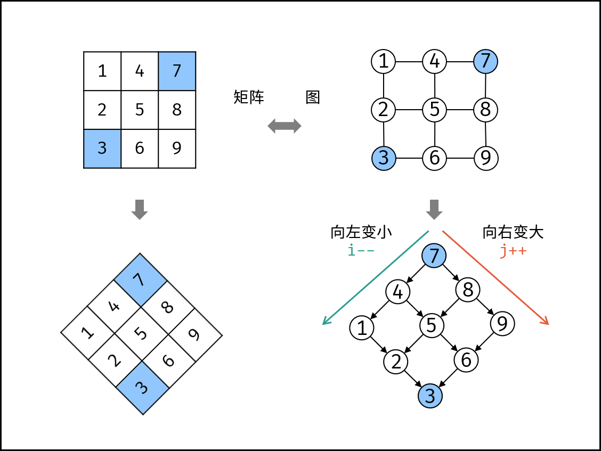

- # 题目描述
	- 在一个 n * m 的二维数组中，每一行都按照从左到右递增的顺序排序，每一列都按照从上到下递增的顺序排序。请完成一个高效的函数，输入这样的一个二维数组和一个整数，判断数组中是否含有该整数。
	-
	- 示例:
	- 现有矩阵 matrix 如下：
	- ```
	  [
	    [1,   4,  7, 11, 15],
	    [2,   5,  8, 12, 19],
	    [3,   6,  9, 16, 22],
	    [10, 13, 14, 17, 24],
	    [18, 21, 23, 26, 30]
	  ]
	  
	  ```
	- 给定 target =  `5` ，返回  `true` 。
	- 给定 target =  `20` ，返回  `false` 。
- # 题目解析
	- #### 解题思路：
		- > 若使用暴力法遍历矩阵 `matrix` ，则时间复杂度为O(NM)。暴力法未利用矩阵**“从上到下递增、从左到右递增”**的特点，显然不是最优解法。
		- 如下图所示，我们将矩阵逆时针旋转 45° ，并将其转化为图形式，发现其类似于 二叉搜索树 ，即对于每个元素，其左分支元素更小、右分支元素更大。因此，通过从 “根节点” 开始搜索，遇到比 target 大的元素就向左，反之向右，即可找到目标值 target 。
		- 
		- “根节点” 对应的是矩阵的 “左下角” 和 “右上角” 元素，本文称之为 标志数 ，以 matrix 中的 左下角元素 为标志数 flag ，则有:
			- 1. 若 flag > target ，则 target 一定在 flag 所在 行的上方 ，即 flag 所在行可被消去。
			- 2. 若 flag < target ，则 target 一定在 flag 所在 列的右方 ，即 flag 所在列可被消去。
	- #### 算法流程：
		- 1. 从矩阵 matrix 左下角元素（索引设为 (i, j) ）开始遍历，并与目标值对比：
			- 当 matrix[i][j] > target 时，执行 i-- ，即消去第 i 行元素；
			- 当 matrix[i][j] < target 时，执行 j++ ，即消去第 j 列元素；
			- 当 matrix[i][j] = target 时，返回 truetrue ，代表找到目标值。
		- 2. 若行索引或列索引越界，则代表矩阵中无目标值，返回 false 。
		- > 每轮 i 或 j 移动后，相当于生成了“消去一行（列）的新矩阵”， 索引(i,j) 指向新矩阵的左下角元素（标志数），因此可重复使用以上性质消去行（列）。
- # 实现
	- ```js
	  /**
	   * @param {number[][]} matrix
	   * @param {number} target
	   * @return {boolean}
	   */
	  var findNumberIn2DArray = function(matrix, target) {
	      var i = matrix.length - 1, j = 0;
	      while(i >= 0 && j < matrix[0].length) {
	          if( matrix[i][j] > target ) i-- 
	          else if( matrix[i][j] < target ) j++
	          else return true 
	      }
	      return false
	  };
	  ```