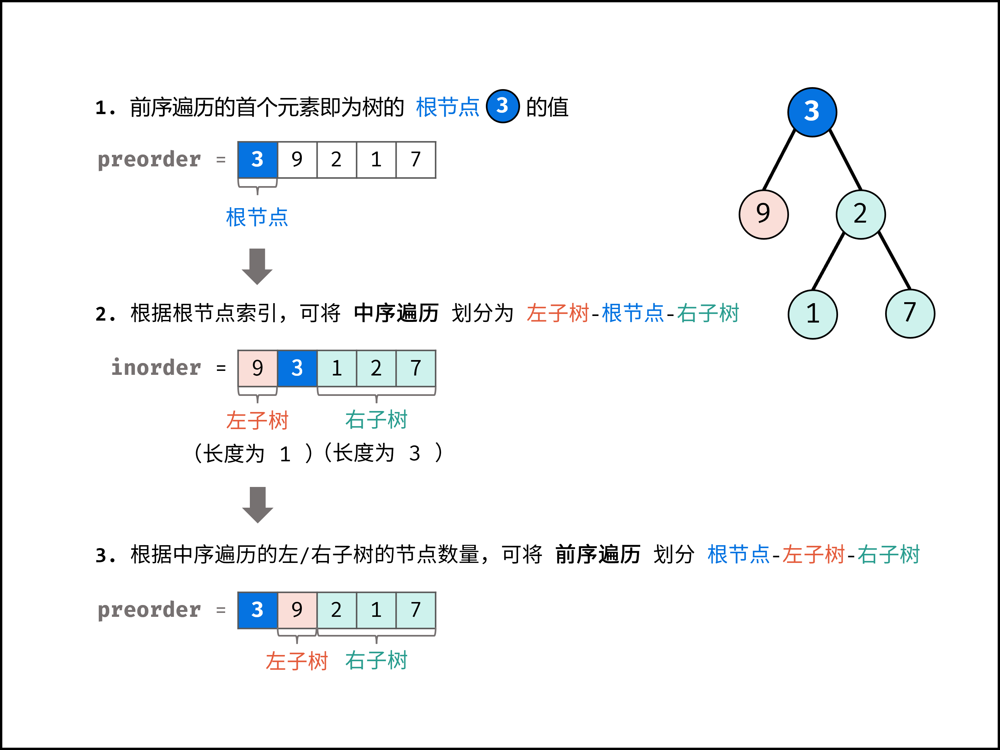

title:: 剑指 Offer 07 重建二叉树

- # 题目描述
  collapsed:: true
	- 输入某二叉树的前序遍历和中序遍历的结果，请构建该二叉树并返回其根节点。
	- 假设输入的前序遍历和中序遍历的结果中都不含重复的数字。
	- 示例1:
		- 
		- ```
		  Input: preorder = [3,9,20,15,7], inorder = [9,3,15,20,7]
		  Output: [3,9,20,null,null,15,7]
		  ```
	- 示例2:
		- ```
		  Input: preorder = [-1], inorder = [-1]
		  Output: [-1]
		  ```
-
- # 题目解析
	- 解题思路：
		- 前序遍历性质： 节点按照 [ 根节点 | 左子树 | 右子树 ] 排序。
		- 中序遍历性质： 节点按照 [ 左子树 | 根节点 | 右子树 ] 排序。
		- 以题目示例为例：
			- 前序遍历划分 [ 3 | 9 | 20 15 7 ]
			- 中序遍历划分 [ 9 | 3 | 15 20 7 ]
		- 根据以上性质，可得出以下推论：
			- 1. 前序遍历的首元素 为 树的根节点 node 的值。
			- 2. 在中序遍历中搜索根节点 node 的索引 ，可将 中序遍历 划分为 [ 左子树 | 根节点 | 右子树 ] 。
			- 3. 根据中序遍历中的左（右）子树的节点数量，可将 前序遍历 划分为 [ 根节点 | 左子树 | 右子树 ]
			- 
			- 通过以上三步，可确定 三个节点 ：1.树的根节点、2.左子树根节点、3.右子树根节点。
			- 根据「分治算法」思想，对于树的左、右子树，仍可复用以上方法划分子树的左右子树。
			- 分治算法解析：
				- 递推参数： 根节点在前序遍历的索引 root 、子树在中序遍历的左边界 left 、子树在中序遍历的右边界 right ；
				- 终止条件： 当 left > right ，代表已经越过叶节点，此时返回 nullnull ；
				- 递推工作：
					- 1. 建立根节点 node ： 节点值为 preorder[root] ；
					- 2. 划分左右子树： 查找根节点在中序遍历 inorder 中的索引 i ；
					- > 为了提升效率，本文使用哈希表 dic 存储中序遍历的值与索引的映射，查找操作的时间复杂度为 O(1) ；
					- 3. 构建左右子树： 开启左右子树递归；
					- ||根节点索引|终须遍历左边界|中序遍历右边界|
					  |左子树|root + 1| left| i-1|
					  |右子树| i - left + root + 1| i + 1|right|
					- > **TIPS：** `i - left + root + 1` 含义为 `根节点索引 + 左子树长度 + 1`
				- 返回值：回溯返回 `node` ，作为上一层递归中根节点的左 / 右子节点；
					-
					-
- # 实现
	- ```js
	  /**
	   * Definition for a binary tree node.
	   * function TreeNode(val) {
	   *     this.val = val;
	   *     this.left = this.right = null;
	   * }
	   */
	  /**
	   * @param {number[]} preorder
	   * @param {number[]} inorder
	   * @return {TreeNode}
	   */
	  var buildTree = function(preorder, inorder) {
	      var inorderMap = {}
	      for(var i=0; i<inorder.length; i++) {
	          inorderMap[inorder[i]] = i
	      } 
	  
	     
	  
	      var recur = function(root, left, right) {
	          if(left > right) return null
	  
	          var node = new TreeNode(preorder[root])
	          var i = inorderMap[preorder[root]]
	          node.left = recur(root + 1, left, i - 1)
	          node.right = recur(root + i - left + 1, i + 1, right)
	          return node
	      }
	  
	  
	      return recur(0, 0, inorder.length - 1)
	  };
	  ```