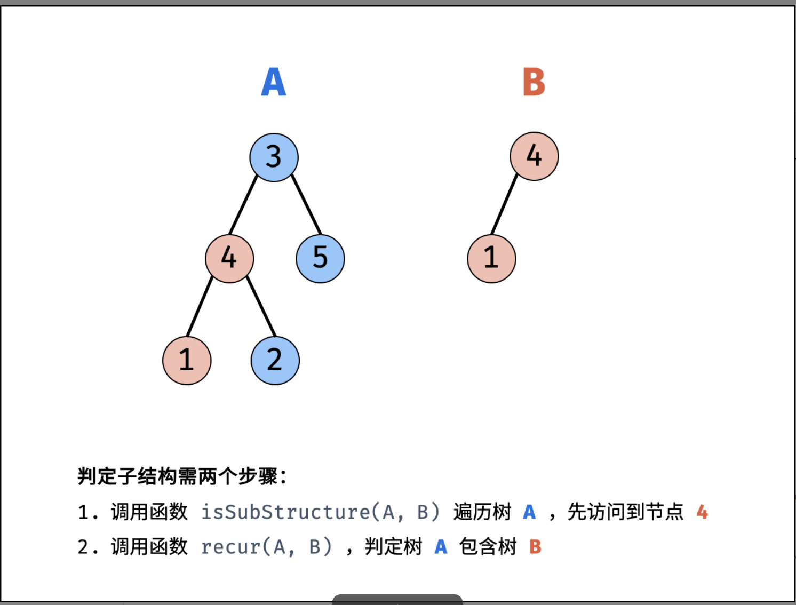

- # 题目描述
  collapsed:: true
	- 输入两棵二叉树A和B，判断B是不是A的子结构。(约定空树不是任意一个树的子结构)
	- B是A的子结构， 即 A中有出现和B相同的结构和节点值。
	- 例如:
	  给定的树 A:
	- -   3
	      / \
	     4   5
	    / \
	   1   2
	  给定的树 B：
	- -   4 
	     /
	   1
	  返回 true，因为 B 与 A 的一个子树拥有相同的结构和节点值。
	- 示例 1：
	- ```
	  输入：A = [1,2,3], B = [3,1]
	  输出：false
	  ```
	- 示例 2：
	- ```
	  **输入：**A = [3,4,5,1,2], B = [4,1]
	  **输出：**true
	  ```
- # 题目解析
  collapsed:: true
	- 若树 `B` 是树 `A` 的子结构，则子结构的根节点可能为树 `A` 的任意一个节点。因此，判断树 `B` 是否是树 `A` 的子结构，需完成以下两步工作：
	  collapsed:: true
		- 1. 先序遍历树 `A` 中的每个节点 nA ；（对应函数 `isSubStructure(A, B)` ）
		  ​
		- 2. 判断树 `A` 中 以 `nA` 为根节点的子树 是否包含树 `B` 。（对应函数 recur(A, B)）
	- 
- # 算法流程
  collapsed:: true
	- `recur(A, B)` 函数：
	- 1. 终止条件：
		- 1. 当节点 `B` 为空：说明树 `B` 已匹配完成（越过叶子节点），因此返回 `true`；
		- 2. 当节点 `A` 为空：说明已经越过树 `A` 的叶节点，即匹配失败，返回 `false`；
		- 3. 当节点 `A` 和 `B` 的值不同：说明匹配失败，返回 `false` ；
	- 2. 返回值：
		- 1. 判断 `A` 和 `B` 的 **左子节点** 是否相等，即 `recur(A.left, B.left)` ；
		- 2. 判断 `A` 和 `B` 的 **右子节点** 是否相等，即 `recur(A.right, B.right)` ；
	- `isSubStructure(A, B)` 函数：
		- 1. 特例处理： 当 树 `A` 为空 或 树 `B` 为空 时，直接返回 `false` ；
		- 2. 返回值： 若树 `B` 是树 `A` 的子结构，则必满足以下三种情况之一，因此用或 `||` 连接；
			- 1. 以 节点 `A` 为根节点的子树 包含树 `B`，对应 `recur(A, B)`；
			- 2. 树 `B` 是 树 `A` 左子树 的子结构，对应`isSubStructure(A.left, B)` ；
			- 3. 树 `B` 是 树 `A` 右子树 的子结构，对应 `isSubStructure(A.right, B)`；
			- > 以上 2. 3. 实质上是在对树 A 做 先序遍历 。
- # 复杂度分析
  collapsed:: true
	- 时间复杂度 O(MN)O(MN) ： 其中 M, N 分别为树 A 和 树 B 的节点数量；先序遍历树 A 占用 O(M)，每次调用 recur(A, B) 判断占用 O(N) 。
	- 空间复杂度 O(M) ： 当树 A 和树 B 都退化为链表时，递归调用深度最大。当 M≤N 时，遍历树 A 与递归判断的总递归深度为 M ；当 M>N 时，最差情况为遍历至树 A 的叶节点，此时总递归深度为 M。
- # 实现
  collapsed:: true
	- ```js
	  /**
	   * Definition for a binary tree node.
	   * function TreeNode(val) {
	   *     this.val = val;
	   *     this.left = this.right = null;
	   * }
	   */
	  /**
	   * @param {TreeNode} A
	   * @param {TreeNode} B
	   * @return {boolean}
	   */
	  var isSubStructure = function(A, B) {
	      // 前序遍历
	      return (A !== null && B !== null) && (recur(A, B) || isSubStructure(A.left, B) || isSubStructure(A.right, B))
	  };
	  
	  var recur = function(A,B) {
	      // 满足条件
	      if(B === null) return true;
	      // 结束条件
	      if(!A || A.val !== B.val) return false;
	      return recur(A.left, B.left) && recur(A.right, B.right)
	  
	  }
	  ```