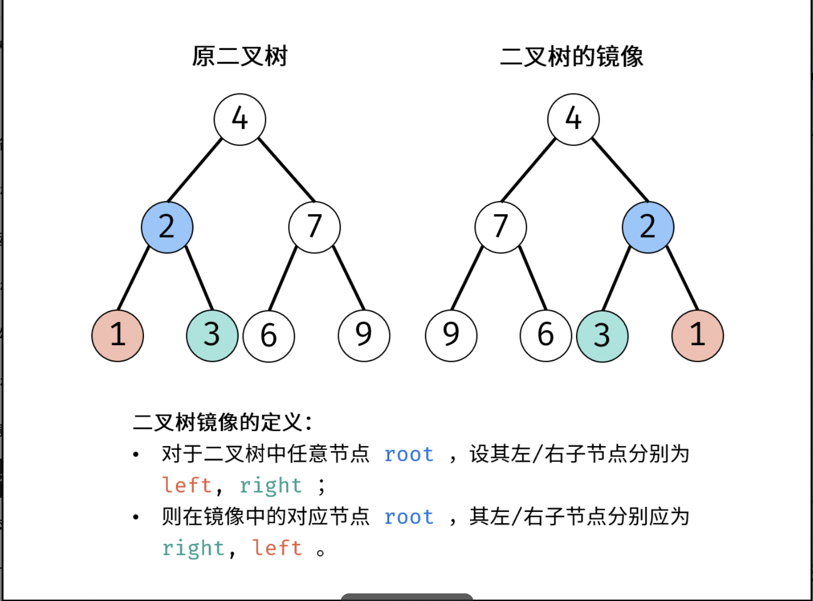
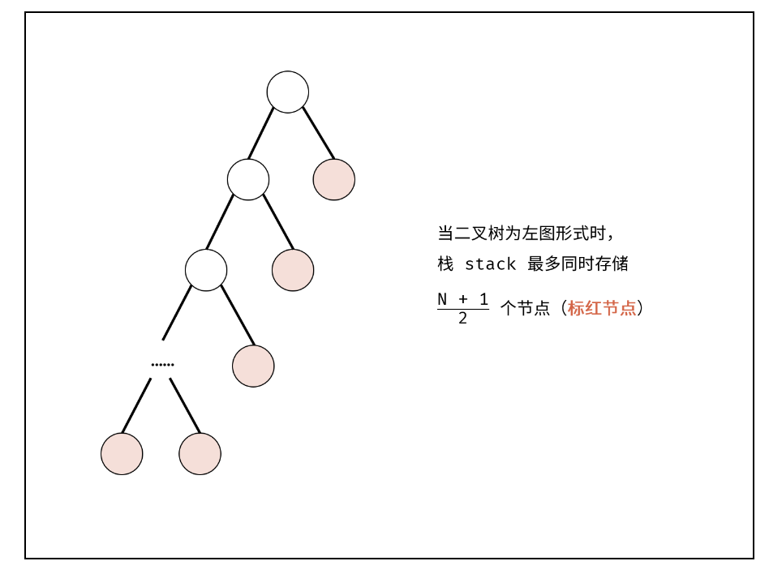

title:: 剑指 Offer 27 二叉树的镜像

- # 题目描述
- 请完成一个函数，输入一个二叉树，该函数输出它的镜像。
- 例如输入：
- -      4
        /   \
      2     7
     / \   / \
   1   3 6   9
  镜像输出：
- 4
        /   \
      7     2
    / \   / \
  9   6 3   1
- 示例 1：
- ```
  输入：root = [4,2,7,1,3,6,9]
  输出：[4,7,2,9,6,3,1]
  ```
- # 题目解析
- 二叉树镜像定义： 对于二叉树中任意节点 root ，设其左 / 右子节点分别为 left, right；则在二叉树的镜像中的对应 root 节点，其左 / 右子节点分别为 right, left。
- 
- # 方法一：递归法
- 根据二叉树镜像的定义，考虑递归遍历（dfs）二叉树，交换每个节点的左 / 右子节点，即可生成二叉树的镜像。
- 递归解析：
	- 1. 终止条件： 当节点 root 为空时（即越过叶节点），则返回 null ；
	- 2. 递推工作：
		- 1. 初始化节点 tmp ，用于暂存 rootroot 的左子节点；
		- 2. 开启递归 右子节点 mirrorTree(root.right)，并将返回值作为 root 的 左子节点 。
		  3. 开启递归 左子节点 mirrorTree(tmp) ，并将返回值作为 root 的 右子节点 。
- 返回值： 返回当前节点 root ；
- ## 复杂度分析：
- 时间复杂度 O(N) ： 其中 NN 为二叉树的节点数量，建立二叉树镜像需要遍历树的所有节点，占用 O(N)时间。
- 空间复杂度 O(N) ： 最差情况下（当二叉树退化为链表），递归时系统需使用 O(N)大小的栈空间。
- ## 实现
- ```js
  /**
   * Definition for a binary tree node.
   * function TreeNode(val) {
   *     this.val = val;
   *     this.left = this.right = null;
   * }
   */
  /**
   * @param {TreeNode} root
   * @return {TreeNode}
   */
  var mirrorTree = function(root) {
      if(!root) return root
      var tmp = root.left 
      root.left = mirrorTree(root.right) 
      root.right = mirrorTree(tmp) 
      return root 
  };
  ```
- # 方法二：辅助栈（队列）
- 利用栈（或队列）遍历树的所有节点node，并交换每个node的左 / 右子节点。
- #### 算法流程：
- 1. 特例处理： 当 root 为空时，直接返回 null；
- 2. 初始化： 栈（或队列），本文用栈，并加入根节点 root。
- 3. 循环交换： 当栈 stack为空时跳出；
	- 1. 出栈： 记为 node；
	- 2. 添加子节点： 将 node 左和右子节点入栈；
	- 3. 交换： 交换 node 的左 / 右子节点。
- 4. 返回值： 返回根节点 root。
- ## 复杂度分析：
- 时间复杂度 O(N)： 其中 NN 为二叉树的节点数量，建立二叉树镜像需要遍历树的所有节点，占用 O(N) 时间。
  空间复杂度 O(N) ： 如下图所示，最差情况下，栈 stack最多同时存储 N + 1/2} 个节点，占用 O(N)额外空间。
- 
- ## 实现
- ```js
  /**
   * Definition for a binary tree node.
   * function TreeNode(val) {
   *     this.val = val;
   *     this.left = this.right = null;
   * }
   */
  /**
   * @param {TreeNode} root
   * @return {TreeNode}
   */
  var mirrorTree = function(root) {
      if(root === null) return root
      var stack = []
      stack.unshift(root)
      while(stack.length) {
          var node = stack.shift()
          if(node.left !== null) stack.unshift(node.left)
          if(node.right !== null) stack.unshift(node.right)
          var tmp = node.left
          node.left = node.right
          node.right = tmp 
      }
      return root
  };
  ```
-
-
-