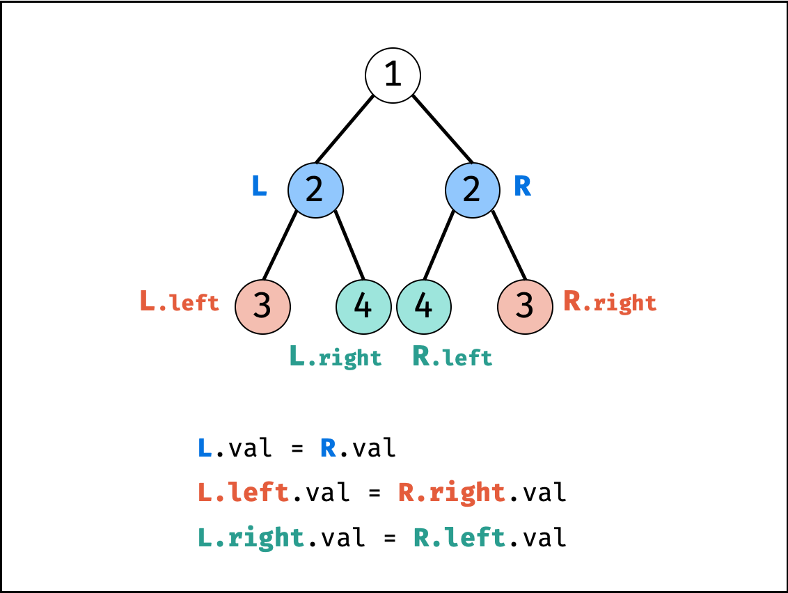
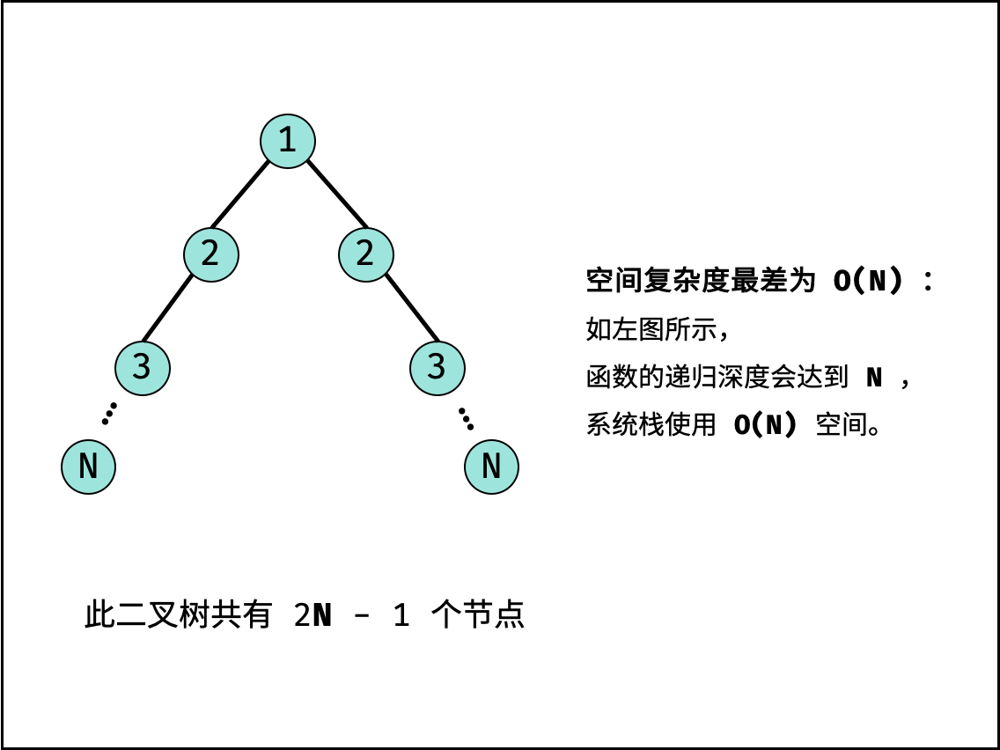

- # 题目描述
  collapsed:: true
	- 请实现一个函数，用来判断一棵二叉树是不是对称的。如果一棵二叉树和它的镜像一样，那么它是对称的。
	- 例如，二叉树 [1,2,2,3,4,4,3] 是对称的。
	         1
	        / \
	     2   2
	    / \ / \
	  3  4 4  3
	  但是下面这个 [1,2,2,null,3,null,3] 则不是镜像对称的
	       1
	      / \
	    2   2
	     \   \
	      3    3
	- 示例1:
		- ```
		  输入：root = [1,2,2,3,4,4,3]
		  输出：true
		  ```
	- 示例2:
		- ```
		  输入：root = [1,2,2,null,3,null,3]
		  输出：false
		  ```
- # 题目解析
  collapsed:: true
	- 解题思路：
		- 对称二叉树定义： 对于树中 任意两个对称节点 L 和 R ，一定有：
		- L.val = R.val ：即此两对称节点值相等。
		- L.left.val = R.right.val ：即 LL 的 左子节点 和 RR 的 右子节点 对称；
		- L.right.val = R.left.val ：即 LL 的 右子节点 和 RR 的 左子节点 对称。
		- 根据以上规律，考虑从顶至底递归，判断每对左右节点是否对称，从而判断树是否为对称二叉树。
		- 
	- 算法流程：
		- isSymmetric(root) ：
			- 特例处理：
				- 若根节点 root 为空，则直接返回 true 。
			- 返回值：
				- 即 recur(root.left, root.right) ;
		- recur(L, R) ：
			- 终止条件：
				- 当 L 和 R 同时越过叶节点： 此树从顶至底的节点都对称，因此返回 true ；
				- 当 L 或 R 中只有一个越过叶节点： 此树不对称，因此返回 false ；
				- 当节点 L 值  不等于 节点 R 值： 此树不对称，因此返回 false ；
			- 递推工作：
				- 判断两节点 L.left 和 R.right 是否对称，即 recur(L.left, R.right) ；
				- 判断两节点 L.right 和 R.left 是否对称，即 recur(L.right, R.left) ；
			- 返回值：
				- 两对节点都对称时，才是对称树，因此用与逻辑符 && 连接。
	-
- # 复杂度分析：
	- 时间复杂度 O(N)：
		- 其中 NN 为二叉树的节点数量，每次执行 recur() 可以判断一对节点是否对称，因此最多调用 N/2次 recur() 方法。
	- 空间复杂度 O(N) ： 如下图所示，最差情况下（二叉树退化为链表），系统使用 O(N) 大小的空间。
	- 
- # 实现
	- ```js
	  /**
	   * Definition for a binary tree node.
	   * function TreeNode(val) {
	   *     this.val = val;
	   *     this.left = this.right = null;
	   * }
	   */
	  /**
	   * @param {TreeNode} root
	   * @return {boolean}
	   */
	  var isSymmetric = function(root) {
	      if(root === null) return null
	  
	      return recur(root.left, root.right)
	  };
	  
	  var recur = function(L, R) {
	      if(L === null && R === null) return true 
	      if(L === null || R === null || L.val !== R.val) return false 
	      return recur(L.left, R.right) && recur(L.right, R.left)
	  }
	  ```