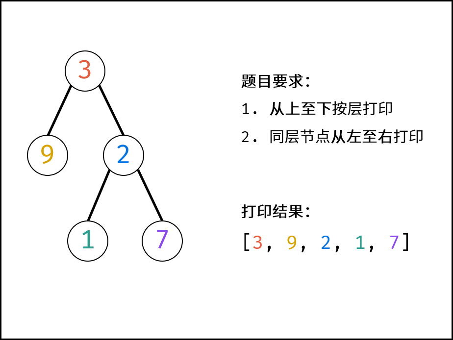

- # 题目描述
	- 从上到下打印出二叉树的每个节点，同一层的节点按照从左到右的顺序打印。
	- 例如:
		- 给定二叉树: [3,9,20,null,null,15,7],
		- ```
		      3
		     / \
		    9  20
		    /  \
		   15   7
		  ```
	- 返回：
	- ```
	  [3,9,20,15,7]
	  ```
- # 题目解析
	- #### 解题思路：
		- 题目要求的二叉树的**从上至下**打印（即按层打印），又称为二叉树的**广度优先搜索**（BFS）。BFS 通常借助**队列**的先入先出特性来实现。
		- 
	- #### 算法流程：
		- 1. 特例处理： 当树的根节点为空，则直接返回空列表 [] ；
		- 2. 初始化： 打印结果列表 res = [] ，包含根节点的队列 queue = [root] ；
		- 3. BFS 循环： 当队列 queue 为空时跳出；
			- 1. 出队： 队首元素出队，记为 node；
			- 2. 打印： 将 node.val 添加至列表 tmp 尾部；
			- 3. 添加子节点： 若 node 的左（右）子节点不为空，则将左（右）子节点加入队列 queue ；
		- 4. 返回值： 返回打印结果列表 res 即可。
- # 复杂度分析：
	- 时间复杂度 O(N) ： N 为二叉树的节点数量，即 BFS 需循环 N 次。
	- 空间复杂度 O(N) ： 最差情况下，即当树为平衡二叉树时，最多有 N/2 个树节点同时在 queue 中，使用 O(N) 大小的额外空间。
- # 实现
	- ```js
	  /**
	   * Definition for a binary tree node.
	   * function TreeNode(val) {
	   *     this.val = val;
	   *     this.left = this.right = null;
	   * }
	   */
	  /**
	   * @param {TreeNode} root
	   * @return {number[]}
	   */
	  var levelOrder = function(root) {
	      if(!root) return [] 
	      var queue = [root]
	      var nums = []
	      while(queue.length) {
	          var node = queue.shift()
	          nums.push(node.val)
	          if(node.left) queue.push(node.left)
	          if(node.right) queue.push(node.right)
	      }
	      return nums
	  };
	  ```