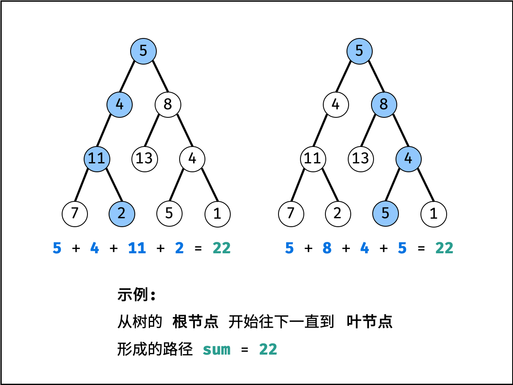

- # 题目描述
	- 给你二叉树的根节点 root 和一个整数目标和 targetSum ，找出所有 从根节点到叶子节点 路径总和等于给定目标和的路径。
	- 叶子节点 是指没有子节点的节点。
	-
	- 示例 1：
		- 
		- ```
		  输入：root = [5,4,8,11,null,13,4,7,2,null,null,5,1], targetSum = 22
		  输出：[[5,4,11,2],[5,8,4,5]]
		  ```
	- 示例 2：
		- 
		- ```
		  输入：root = [1,2,3], targetSum = 5
		  输出：[]
		  ```
	- 示例 3：
		- ```
		  输入：root = [1,2], targetSum = 0
		  输出：[]
		  ```
- # 题目解析
	- 解题思路：
		- 本题是典型的二叉树方案搜索问题，使用回溯法解决，其包含 先序遍历 + 路径记录 两部分。
		- 先序遍历： 按照 “根、左、右” 的顺序，遍历树的所有节点。
		- 路径记录： 在先序遍历中，记录从根节点到当前节点的路径。当路径满足 ① 根节点到叶节点形成的路径 且 ② 各节点值的和等于目标值 sum 时，将此路径加入结果列表。
		- 
	- 算法流程：
	- pathSum(root, sum) 函数：
		- 初始化： 结果列表 res ，路径列表 path 。
		- 返回值： 返回 res 即可。
	- recur(root, tar) 函数：
	- 递推参数： 当前节点 root ，当前目标值 tar 。
	- 终止条件： 若节点 root 为空，则直接返回。
	- 递推工作：
		- 1. 路径更新： 将当前节点值 root.val 加入路径 path 。
		- 2. 目标值更新： tar = tar - root.val（即目标值 tar 从 sum 减至 00 ）。
		- 3. 路径记录： 当 ① root 为叶节点 且 ② 路径和等于目标值 ，则将此路径 path 加入 res 。
		- 4. 先序遍历： 递归左 / 右子节点。
		- 5. 路径恢复： 向上回溯前，需要将当前节点从路径 path 中删除，即执行 path.pop() 。
- # 复杂度分析：
	- 时间复杂度 O(N) ： N 为二叉树的节点数，先序遍历需要遍历所有节点。
	- 空间复杂度 O(N) ： 最差情况下，即树退化为链表时，path 存储所有树节点，使用 O(N) 额外空间。
- # 实现
	- ```js
	  /**
	   * Definition for a binary tree node.
	   * function TreeNode(val, left, right) {
	   *     this.val = (val===undefined ? 0 : val)
	   *     this.left = (left===undefined ? null : left)
	   *     this.right = (right===undefined ? null : right)
	   * }
	   */
	  /**
	   * @param {TreeNode} root
	   * @param {number} target
	   * @return {number[][]}
	   */
	  
	  var path = [], res = []
	  var pathSum = function(root, target) {
	  
	      recur(root, target)
	  
	      return res
	  
	  
	  };
	  
	  var recur = function(root, target) {
	      if(!root) return 
	      path.push(root.val) 
	      target -= root.val 
	      if(target == 0 && !root.left && !root.right) {
	          res.push([...path])
	      }
	      recur(root.left, target)
	      recur(root.right, target)
	      path.pop()
	  }
	  ```