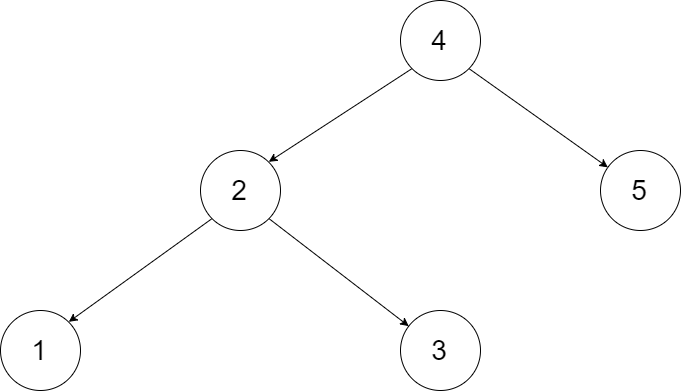
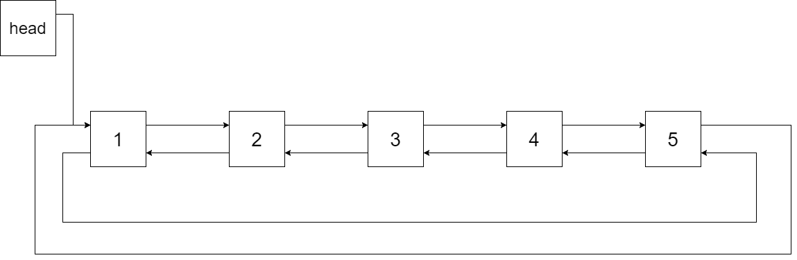
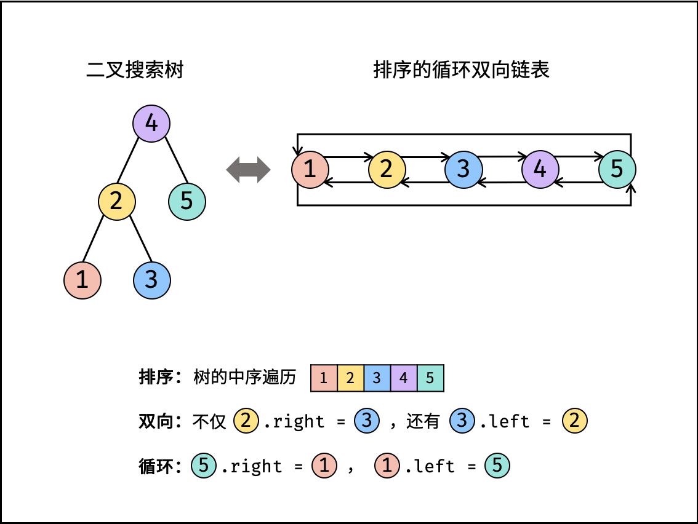

- # 题目描述
  collapsed:: true
	- 输入一棵二叉搜索树，将该二叉搜索树转换成一个排序的循环双向链表。要求不能创建任何新的节点，只能调整树中节点指针的指向。
	- 为了让您更好地理解问题，以下面的二叉搜索树为例：
	- 
	- 我们希望将这个二叉搜索树转化为双向循环链表。链表中的每个节点都有一个前驱和后继指针。对于双向循环链表，第一个节点的前驱是最后一个节点，最后一个节点的后继是第一个节点。
	- 下图展示了上面的二叉搜索树转化成的链表。“head” 表示指向链表中有最小元素的节点。
	- 
	- 特别地，我们希望可以就地完成转换操作。当转化完成以后，树中节点的左指针需要指向前驱，树中节点的右指针需要指向后继。还需要返回链表中的第一个节点的指针。
- # 题目分析
	- 解题思路：
		- 本文解法基于性质：二叉搜索树的中序遍历为 递增序列 。
		  将 二叉搜索树 转换成一个 “排序的循环双向链表” ，其中包含三个要素：
		- 1. 排序链表： 节点应从小到大排序，因此应使用 中序遍历 “从小到大”访问树的节点。
		- 2. 双向链表： 在构建相邻节点的引用关系时，设前驱节点 pre 和当前节点 cur ，不仅应构建 pre.right = cur ，也应构建 cur.left = pre 。
		- 3. 循环链表： 设链表头节点 head 和尾节点 tail ，则应构建 head.left = tail 和 tail.right = head 。
		- 
		- **中序遍历**为对二叉树作 “左、根、右” 顺序遍历，递归实现如下：
		- ```c++
		  // 打印中序遍历
		  void dfs(Node* root) {
		      if(root == nullptr) return;
		      dfs(root->left); // 左
		      cout << root->val << endl; // 根
		      dfs(root->right); // 右
		  }
		  ```
		- 根据以上分析，考虑使用中序遍历访问树的各节点 cur ；并在访问每个节点时构建 cur 和前驱节点 pre 的引用指向；中序遍历完成后，最后构建头节点和尾节点的引用指向即可。
	- 算法流程：
		- dfs(cur): 递归法中序遍历；
			- 1. 终止条件： 当节点 cur 为空，代表越过叶节点，直接返回；
			- 2. 递归左子树，即 dfs(cur.left) ；
			- 3. 构建链表：
				- 1. 当 pre 为空时： 代表正在访问链表头节点，记为 head ；
				- 2. 当 pre 不为空时： 修改双向节点引用，即 pre.right = cur ， cur.left = pre ；
				- 3. 保存 cur ： 更新 pre = cur ，即节点 cur 是后继节点的 pre ；
			- 4. 递归右子树，即 dfs(cur.right) ；
		- treeToDoublyList(root)：
			- 1. 特例处理： 若节点 root 为空，则直接返回；
			- 2. 初始化： 空节点 pre ；
			- 3. 转化为双向链表： 调用 dfs(root) ；
			- 4. 构建循环链表： 中序遍历完成后，head 指向头节点， pre 指向尾节点，因此修改 head 和 pre 的双向节点引用即可；
			- 5. 返回值： 返回链表的头节点 head 即可；
		-
- # 复杂度分析：
  collapsed:: true
	- 时间复杂度 O(N) ： N 为二叉树的节点数，中序遍历需要访问所有节点。
	- 空间复杂度 O(N) ： 最差情况下，即树退化为链表时，递归深度达到 N，系统使用 O(N) 栈空间。
- # 实现
	- ```js
	  /**
	   * // Definition for a Node.
	   * function Node(val,left,right) {
	   *    this.val = val;
	   *    this.left = left;
	   *    this.right = right;
	   * };
	   */
	  /**
	   * @param {Node} root
	   * @return {Node}
	   */
	  
	  var treeToDoublyList = function(root) {
	      var pre, head ;
	      var dfs = function(cur) {
	          if(!cur) return;
	          dfs(cur.left);
	          if(pre) pre.right = cur;
	          else head = cur;
	          cur.left = pre ;
	          pre = cur;
	          dfs(cur.right);
	      }
	  
	      dfs(root);
	      head && (head.left = pre);
	      pre && (pre.right = head);
	      return head ;
	  };
	  ```
-