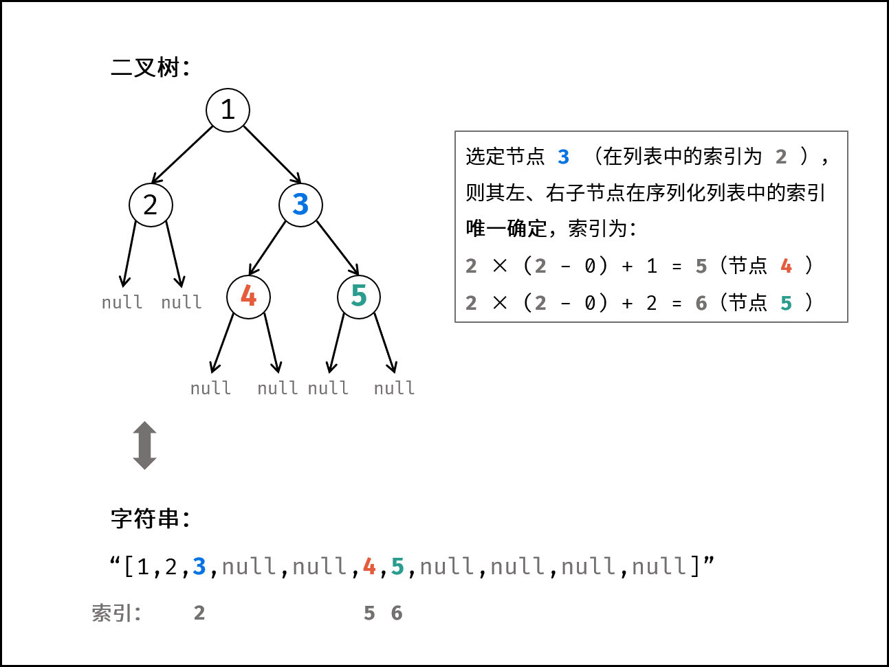

- # 题目描述
  collapsed:: true
	- 请实现两个函数，分别用来序列化和反序列化二叉树。
	- 你需要设计一个算法来实现二叉树的序列化与反序列化。这里不限定你的序列 / 反序列化算法执行逻辑，你只需要保证一个二叉树可以被序列化为一个字符串并且将这个字符串反序列化为原始的树结构。
	- 提示：输入输出格式与 LeetCode 目前使用的方式一致，详情请参阅 LeetCode 序列化二叉树的格式。你并非必须采取这种方式，你也可以采用其他的方法解决这个问题。
	- 示例：
		- 
		- ```
		  输入：root = [1,2,3,null,null,4,5]
		  输出：[1,2,3,null,null,4,5]
		  ```
- # 题目解析
	- 通常使用的前序、中序、后序、层序遍历记录的二叉树的信息不完整，即唯一的输出序列可能对应着多种二叉树可能性。题目要求的 序列化 和 反序列化 是 可逆操作 。因此，序列化的字符串应携带 完整的二叉树信息 。
	- 观察题目示例，序列化的字符串实际上是二叉树的 “层序遍历”（BFS）结果，本文也采用层序遍历。
	- 为完整表示二叉树，考虑将叶节点下的 null 也记录。在此基础上，对于列表中任意某节点 node ，其左子节点 node.left 和右子节点 node.right 在序列中的位置都是 唯一确定 的。如下图所示：
	- 
	- [原文连接](https://leetcode.cn/leetbook/read/illustration-of-algorithm/997ebc/)
	- 序列化 使用层序遍历实现。反序列化 通过以上递推公式反推各节点在序列中的索引，进而实现。
	- 序列化 Serialize ：
	- 借助队列，对二叉树做层序遍历，并将越过叶节点的 null 也打印出来。
	- #### 算法流程：
		- 1. 特例处理： 若 root 为空，则直接返回空列表 "[]" ；
		- 2. 初始化： 队列 queue （包含根节点 root ）；序列化列表 res ；
		- 3. 层序遍历： 当 queue 为空时跳出；
			- 1. 节点出队，记为 node ；
			- 2. 若 node 不为空：① 打印字符串 node.val ，② 将左、右子节点加入 queue ；
			- 3. 否则（若 node 为空）：打印字符串 "null" ；
		- 4. 返回值： 拼接列表，用 ',' 隔开，首尾添加中括号；
- # 实现
	- ```js
	  /**
	   * Definition for a binary tree node.
	   * function TreeNode(val) {
	   *     this.val = val;
	   *     this.left = this.right = null;
	   * }
	   */
	  
	  /**
	   * Encodes a tree to a single string.
	   *
	   * @param {TreeNode} root
	   * @return {string}
	   */
	  var serialize = function(root) {
	      if(!root) return '[]'
	      var queue = [root], res = "["
	      while(queue.length) {
	          var node = queue.shift()
	          if(node) {
	              res += node.val + ','
	              queue.push(node.left)
	              queue.push(node.right)
	          } else {
	              res += 'null,'
	          }
	      }
	      return res.slice(0, res.length - 1) + ']'
	  };
	  
	  /**
	   * Decodes your encoded data to tree.
	   *
	   * @param {string} data
	   * @return {TreeNode}
	   */
	  var deserialize = function(data) {
	      if(data == '[]') return null
	      var list = data.slice(1, data.length - 1).split(',') 
	      var root = new TreeNode(parseInt(list[0]))
	      var queue = [root]
	      var i = 1
	      while(queue.length) {
	          var node = queue.shift()
	          if(list[i] && list[i] != 'null') {
	              node.left = new TreeNode(parseInt(list[i]))
	              queue.push(node.left)
	          }
	          i++;
	          if(list[i] && list[i] != 'null') {
	              node.right = new TreeNode(parseInt(list[i]))
	              queue.push(node.right)
	          }
	          i++;
	      }
	      return root
	  };
	  
	  /**
	   * Your functions will be called as such:
	   * deserialize(serialize(root));
	   */
	  ```