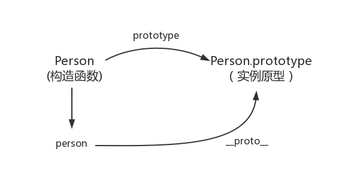
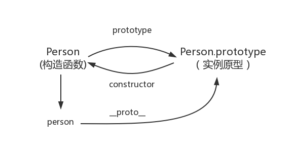
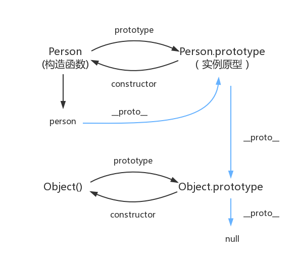

- ## 构造函数创建对象
  collapsed:: true
	- 使用构造函数创建一个对象
	- ```js
	  fnction Person() {}
	  var person = new Person()
	  person.name = "Jack"
	  console.log(person.name) // Jack
	  ```
	- 在这个例子中，`Person` 就是一个构造函数，使用new创建了一个实例对象`person`。
- ## prototype
  collapsed:: true
	- 每个函数都有一个`prototype`属性，就是我们经常在各种例子中看到的那个`prototype`，比如：
	- ```js
	  function Person() {}
	  // prototype是函数才会有的属性
	  Person.ptototype.name = "Jack"
	  var person1 = new Person() 
	  var person2 = new Person()
	  console.log(person1.name) // Jack
	  console.log(person2.name) // Jack
	  ```
	- 函数的`prototype`属性指向了一个对象，这个对象正是调用该构造函数而创建的**实例**的原型，也就是这个例子中的`person1`和`person2`的原型。
	-
	- 用一张图标识构造函数和实例原型之间的关系：
	- 
	- 在这张图中用`Object.prototype`标识实例原型。
- ## __proto__
  collapsed:: true
	- 这是每一个`JavaScript`对象（除了null）都具有的一个属性，叫`__proto__`，这个属性会指向该对象的原型。
	- 为了证明这一点,我们可以在火狐或者谷歌中输入：
	- ```js
	  function Person() {}
	  var person = new Person()
	  console.log(person.__proto__ === Person.prototype) // true
	  ```
	- 于是就有下面的关系图：
	- 
	- 既然实例对象和构造函数都可以指向原型，那么原型是否有属性指向构造函数或者实例呢？
- ## constructor
  collapsed:: true
	- 指向实例倒没有，因为一个构造函数可以生成多个实例，但是原型指向构造函数倒是有的，这就要讲到第三个属性：`constructor`，每个原型都有一个`constructor`属性指向关联的构造函数。
	- ```js
	  function Person() {}
	  console.log(Person === Person.prototype.constructor) // true
	  ```
	- 于是有下面关系图：
	- 
	- 综上已经得出：
	- ```js
	  function Person() {}
	  var person = new Person()
	  
	  console.log(person.__proto__ === Person.prototype) // true
	  console.log(Person.prototype.constructor === Person) // true
	  // 顺便学习一个ES5方法，可以获得对象的原型
	  console.log(Object.getPrototypeOf(person) === Person.prototype) // true
	  ```
- ## 实例和原型
  collapsed:: true
	- 当读取实例的属性时，如果找不到，就会查找与对象关联的原型中的属性，如果还查不到，就去找原型的原型，一直找到最顶层为止。
	- 例子：
	- ```js
	  function Person() {}
	  Person.prototype.name = "jack"
	  var Person = new Person()
	  person.name = "Daisy"
	  console.log(person.name) // Daisy
	  
	  delete person.name
	  console.log(person.name) // Jack
	  ```
	- 在这个例子中，我们给实例对象`person`添加了`name`属性，当我们打印`person.name`的时候，结果自然为`Daysy`。
	- 但是如果删除了`person`的`name`属性时，读取`person.name`，从`person`对象中找不到`name`属性就会从`person`的原型也就是`person.__proto__`，也就是`Person.prototype`中查找，幸运的时我们找到了`name`属性，结果为`Jack`。
- ## 原型的原型
	- 在前面，我们已经讲了原型也是一个都西昂，既然时对象，我们就可以用最原始的方式创建它，那就是：
	- ```js
	  var obj = new Object()
	  obj.name = "Jack"
	  console.log(obj.name) // Jack
	  ```
	- 其实原型对象就是通过`Object`构造函数生成的，结合之前所讲，实例的`__proto__`指向构造函数的`prototype`，所以我们再更新下关系图：
	- 
- ## 原型链
	- `Object.prototype`的原型为`null`
	- ```js
	  console.log(Object.prototype.__proto__ === null) // true
	  ```
	- > `null`表示”没有对象“，即该处不应该有值
	- 那么`Object.prototype.__proto__`的值为`null`跟`Object.prototype`没有原型，其实表达了一个意思。
	- 所以查找属性的时候查到`Object.prototype`就可以停止查找了。
	- 关系图更新为：
	- 
	- 图中由相互关联的原型组成的链状结构就是原型链，也就是蓝色的这条线
- ## 补充
	- #### constructor
		- ```js
		  function Person() {}
		  var person = new Person() 
		  console.log(person.constructor === Person) // true
		  ```
		- 当获取`person.constructor`时，其实`person`中并没有`constructor`属性，当不能读取到`constructor`属性时，会从`person`的原型也就是`Person.prototype`中读取，正好原型中有该属性，所以：
		- person.constructor === Person.prototype.constructor
	- #### \_\_proto\_\_
		- 绝大部分浏览器都支持这个非标准的方法访问原型，然后它并不存在与`Person.prototype`中，实际上，它是来自于`Object.prototype`，与其说是一个属性，不如说是一个`getter/setter`，当使用`obj.__proto__`时，可以理解成返回了`Object.getPrototypeOf(obj)`。
	-
-