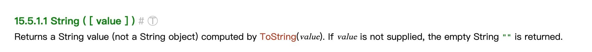

- 我们使用 [[String]] 函数将类型转换成字符串类型，依然先看[规范15.5.1.1](http://es5.github.io/#x15.5.1.1)中有关 [[String]] 函数的介绍：
- 
- 如果 `String` 函数不传参数，返回空字符串，如果有参数，调用 `ToString(value)` ，而 `ToString` 也给了一个对应的结果表。表如下：
- | 参数类型 | 结果 |
  | Undefined | "undefined" |
  | Null | "null" |
  | Boolean | 如果参数是 true，返回 "true"。参数为 false，返回 "false" |
  | Number | 又是比较复杂，可以看例子 |
  | String | 返回与之相等的值 |
- 让我们写几个例子验证一下：
- ```js
  console.log(String()) // 空字符串
  
  console.log(String(undefined)) // undefined
  console.log(String(null)) // null
  
  console.log(String(false)) // false
  console.log(String(true)) // true
  
  console.log(String(0)) // 0
  console.log(String(-0)) // 0
  console.log(String(NaN)) // NaN
  console.log(String(Infinity)) // Infinity
  console.log(String(-Infinity)) // -Infinity
  console.log(String(1)) // 1
  ```
- > `ToString` 和上一节的 `ToNumber` 都是底层规范实现的方法，并没有直接暴露出来。
-