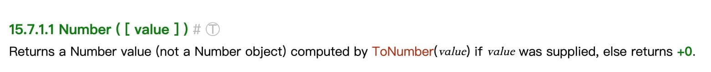

- 可以使用 Number 函数将类型转换成数字类型，如果参数无法被转换为数字，则返回 NaN。
- 在看例子之前，我们先看[ES5 规范 15.7.1.1](http://es5.github.io/#x15.7.1.1)中关于 Number 的介绍：
- 
- 根据规范，如果 Number 函数不传参数，返回 +0，如果有参数，调用 `ToNumber(value)` 。
- > `ToNumber` 表示的是一个底层规范实现上的方法，并没有直接暴露出来。
- 而 `ToNumber` 则直接给了一个[对应的结果表](http://es5.github.io/#x9.3)。表如下：
- | 参数类型 | 结果 |
  | Undefined | NaN |
  | Null | +0 |
  | Boolean | 如果参数是 true，返回 1。参数为 false，返回 +0 |
  | Number | 返回与之相等的值 |
  | String | 这段比较复杂，看例子 |
- 例子：
- ```js
  console.log(Number()) // +0
  
  console.log(Number(undefined)) // NaN
  console.log(Number(null)) // +0
  
  console.log(Number(false)) // +0
  console.log(Number(true)) // 1
  
  console.log(Number("123")) // 123
  console.log(Number("-123")) // -123
  console.log(Number("1.2")) // 1.2
  console.log(Number("000123")) // 123
  console.log(Number("-000123")) // -123
  
  console.log(Number("0x11")) // 17
  
  console.log(Number("")) // 0
  console.log(Number(" ")) // 0
  
  console.log(Number("123 123")) // NaN
  console.log(Number("foo")) 	// NaN
  console.log(Number("100a")) // NaN
  ```
- 如果通过 Number 转换函数传入一个字符串，它会试图将其转换成一个整数或浮点数，而且会忽略所有前导的 0，如果有一个字符不是数字，结果都会返回 NaN
- ### `parseInt` 和 `parseFloat`
- parseInt 只解析整数，parseFloat 则可以解析整数和浮点数，如果字符串前缀是 "0x" 或者"0X"，parseInt 将其解释为十六进制数，`parseInt` 和 `parseFloat` 都会**跳过任意数量的前导空格，尽可能解析更多数值字符，并忽略后面的内容**。如果**第一个非空格字符是非法的数字直接量**，将最终返回 [[NaN]] ：
- ```js
  console.log(parseInt("3 abc")) // 3
  console.log(parseFloat("3.14 abc")) // 3.14
  console.log(parseInt("-12.34")) // -12
  console.log(parseInt("0xFF")) // 255
  console.log(parseFloat(".1")) // 0.1
  console.log(parseInt("0.1")) // 0
  ```
-