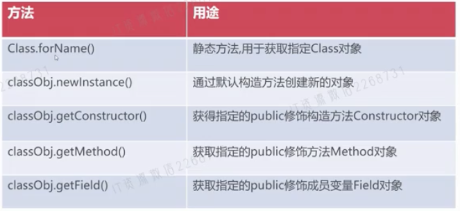
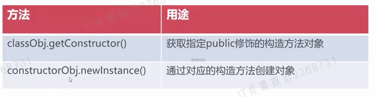
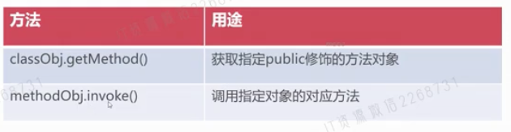
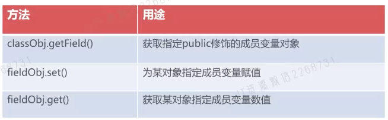

- 核心类
	- Class类
	  collapsed:: true
		- 概述
			- Class是JVM中代表“类和接口”的类
			- Class对象具体包含了某个特定类的结构信息
			- 通过Class对象可获取对应类的构造方法/方法/成员变量
		- 方法
			- 
		- 示例
			- ```java
			  Class userDTO = Class.forName("com.example.spring.ioc.dto.UserDTO");
			  System.out.println(userDTO);
			  ```
	- Constructor构造方法类
	  collapsed:: true
		- 概述
			- Constructor类是对Java类中的构造方法的抽象
			- Constructor对象包含了具体类的某个具体构造方法的声明
			- 通过Constructor对象调用带参构造方法创建对象
		- 方法
			- 
		- 示例
			- ```java
			  Class userClass = Class.forName("com.example.spring.ioc.dto.UserDTO");
			  Constructor constructor = userClass.getConstructor(new Class[]{String.class});
			  UserDTO userDTO = (UserDTO) constructor.newInstance(new Object[]{"sss"});
			  System.out.println("userDTO," + userDTO);
			  ```
	- Method方法类
	  collapsed:: true
		- 概述
			- Method对象指代类中的方法的描述
			- Method对象使用classObj.getMethod()方法获取
			- 通过Method对象调用指定对象的对应方法
		- 方法
			- 
		- 示例
			- ```java
			  Class userClass = Class.forName("com.example.spring.ioc.dto.UserDTO");
			  Constructor constructor = userClass.getConstructor(String.class);
			  UserDTO userDTO = (UserDTO) constructor.newInstance("zhangsan");
			  
			  Method getDname = userClass.getMethod("getDname");
			  String dName = (String) getDname.invoke(userDTO);
			  System.out.println("userDTO," + dName);
			  ```
	- Field成员变量类
	  collapsed:: true
		- 概述
			- Field对应某个具体类中的成员变量的声明
			- Field对象使用classObj.getField()方法获取
			- 通过Field对象可为某对象成员变量赋值/取值
		- 方法
			- 
		- 示例
			- ```java
			  Class userClass = Class.forName("com.example.spring.ioc.dto.UserDTO");
			  Constructor constructor = userClass.getConstructor(String.class);
			  UserDTO userDTO = (UserDTO) constructor.newInstance("zhangsan");
			  
			  Field empno = userClass.getField("empno");
			  System.out.println(empno.get(userDTO));
			  ```
	- getDeclared系列方法
		- 概述
			- `getDeclaredConstructor(s)|Method(s)|Field(s)` 获取对应对象
			- get`Constructor(s)|Method(s)|Field(s)`只能获取public对象
			- 访问非作用域内构造方法、方法、成员变量，会抛出异常
		- 示例
			- ```java
			  Class userClass = Class.forName("com.example.spring.ioc.dto.UserDTO");
			  Constructor constructor = userClass.getConstructor(String.class);
			  UserDTO userDTO = (UserDTO) constructor.newInstance("zhangsan");
			  
			  Field[] fields = userClass.getDeclaredFields();
			  for (Field field : fields) {
			    if (field.getModifiers() == 1) { // public修饰
			      Object val = field.get(userDTO);
			      System.out.println(field.getName() + ":" + val);
			    } else if (field.getModifiers() == 2) { // private修饰
			      String methodName = "get" + field.getName().substring(0, 1).toUpperCase() + field.getName().substring(1);
			      Method getMethod = userClass.getMethod(methodName);
			      Object ret = getMethod.invoke(userDTO);
			      System.out.println(field.getName() + ":" + ret);
			    }
			  }
			  ```