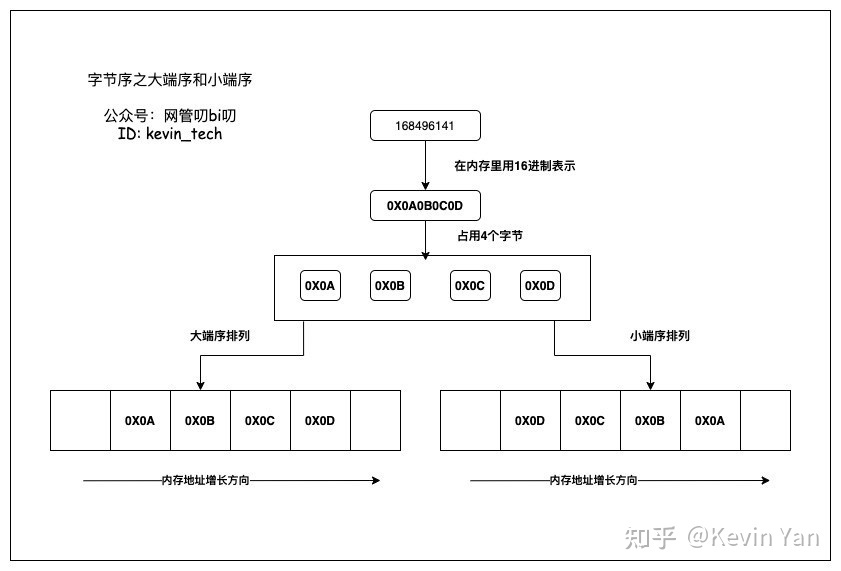

- 通用规则
	- 大端序(Big-Endian)
		- 将数据的低位字节放在内存的高位地址，高位字节放在地位地址。这种排序方式与数据用字节表示时的书写顺序一致，符合人类的阅读习惯。
	- 小端序(Little-Endian)
		- 将一个多位数的低位放在较小的地址处，高位放在较大的地址处，则称小端序。小端序与人类的阅读习惯相反，但更符合计算机读取内存的方式，因为CPU读取内存中的数据时，是从低地址向高地址方向进行读取的。
- 例如
	- 在内存中存放整型数值 `168496141`  需要4个字节，这个数值的对应的16进制表示是 `0X0A0B0C0D` ，这个数值在用大端序和小端序排列时的在内存中的示意图如下：
	- 
	-