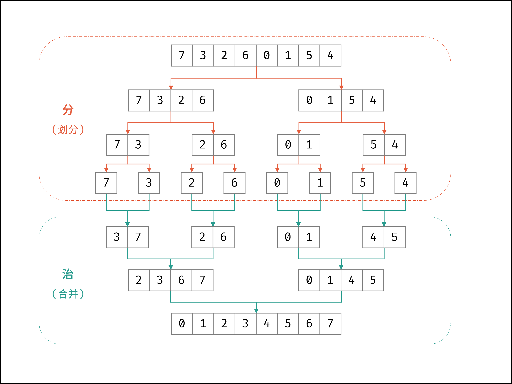

- # 算法解析
	- 归并排序体现了 “分而治之” 的算法思想，具体为：
	- 「分」： 不断将数组从 中点位置 划分开，将原数组的排序问题转化为子数组的排序问题；
	  「治」： 划分到子数组长度为 1 时，开始向上合并，不断将 左右两个较短排序数组 合并为 一个较长排序数组，直至合并至原数组时完成排序；
	- > 如下图所示，为数组 `[7,3,2,6,0,1,5,4]` 的归并排序过程。
	- 
- ## 算法流程：
	- **1. 递归划分：**
		- 1. 计算数组中点m，递归划分左子数组 `merge_sort(l, m)` 和右子数组 `merge_sort(m + 1, r)` ；
		- 2. 当l≥r时，代表子数组长度为 1 或 0 ，此时**终止划分**，开始合并；
	- **2. 合并子数组：**
		- 1. 暂存数组nums闭区间[l,r]内的元素至辅助数组tmp；
		- **2. 循环合并：**设置双指针i,j分别指向tmp的左 / 右子数组的首元素；
		- > **注意：**nums子数组的左边界、中点、右边界分别为l,m,r，而辅助数组tmp中的对应索引为0,m−l,r−l；
		- **当i==m−l+1时：**代表左子数组已合并完，因此添加右子数组元素tmp[j]，并执行j=j+1；
		- **否则，当j==r−l+1时：**代表右子数组已合并完，因此添加左子数组元素tmp[i]，并执行i=i+1；
		- **否则，当tmp[i]≤tmp[j]时：**添加左子数组元素tmp[i]，并执行i=i+1；
		- **否则（即当tmp[i]>tmp[j]时）：**添加右子数组元素tmp[j]，并执行j=j+1；
- # 实现
	- ```c++
	  void mergeSort(vector<int>& nums, int l, int r) {
	      // 终止条件
	      if (l >= r) return;
	      // 递归划分
	      int m = (l + r) / 2;
	      mergeSort(nums, l, m);
	      mergeSort(nums, m + 1, r);
	      // 合并阶段
	      int tmp[r - l + 1];             // 暂存需合并区间元素
	      for (int k = l; k <= r; k++)
	          tmp[k - l] = nums[k];
	      int i = 0, j = m - l + 1;       // 两指针分别指向左/右子数组的首个元素
	      for (int k = l; k <= r; k++) {  // 遍历合并左/右子数组
	          if (i == m - l + 1)
	              nums[k] = tmp[j++];
	          else if (j == r - l + 1 || tmp[i] <= tmp[j])
	              nums[k] = tmp[i++];
	          else {
	              nums[k] = tmp[j++];
	          }
	      }
	  }
	  
	  // 调用
	  vector<int> nums = { 4, 1, 3, 2, 5, 1 };
	  mergeSort(nums, 0, nums.size() - 1);
	  ```
-